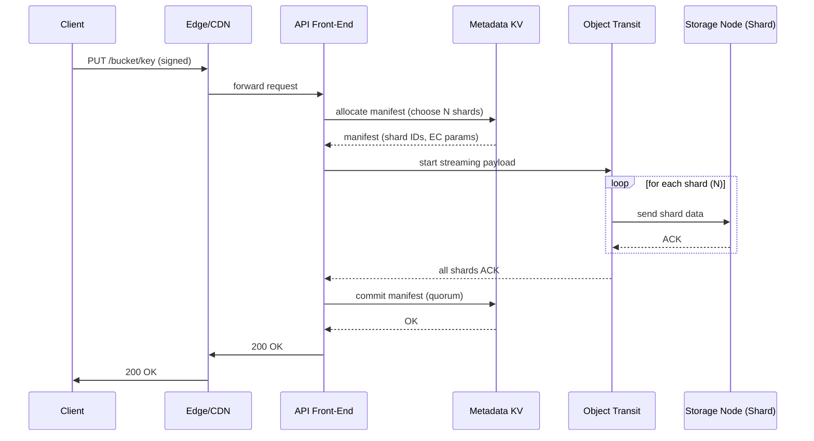

---

Design a global object storage system like S3.


---

Below is a **complete, self‑contained design** for a **global, Amazon‑S3‑style object storage service**.  
The design is broken into:

1. **Functional requirements** (what the service must do)  
2. **Non‑functional requirements** (scale, durability, latency, security, etc.)  
3. **High‑level architecture** – components and their responsibilities  
4. **Data path for the most common operations** (PUT, GET, multipart upload, delete)  
5. **Capacity planning & math** – realistic numbers for a “hyperscale” deployment  
6. **Key trade‑offs** (consistency vs latency, replication vs cost, etc.)  
7. **Failure modes & mitigation**  
8. **Operational concerns** (monitoring, upgrades, testing)  
9. **Mermaid diagrams** that tie everything together  

---

## 1. Functional Requirements

| # | Requirement | Typical API |
|---|-------------|------------|
| F1 | **PUT / GET / DELETE** of objects (any size up to 5 TB) | `PUT /{bucket}/{key}`, `GET /{bucket}/{key}`, `DELETE …` |
| F2 | Buckets are logical containers with unique globally scoped names | `PUT /{bucket}` |
| F3 | **Versioning** – optional per‑bucket, each write creates a new immutable version | `x-amz-version-id` header |
| F4 | **Multipart upload** – split large objects into >5 MB parts, upload in parallel, then assemble | `POST /{bucket}/{key}?uploads` , `PUT …?partNumber=` |
| F5 | **Lifecycle policies** – transition to Infrequent Access (IA), Glacier, or expiration | `PUT bucket lifecycle configuration` |
| F6 | **Cross‑Region Replication (CRR)** – asynchronous copy to one or more destination regions | Bucket‑level config |
| F7 | **Access control** – bucket policies, ACLs, IAM‑style signed URLs | `x-amz-acl`, `x-amz-security-token` |
| F8 | **Server‑Side Encryption (SSE‑S3 / SSE‑KMS / SSE‑C)** – encryption at rest & optional client‑provided keys | `x-amz-server-side-encryption` |
| F9 | **Object tagging / metadata** – user‑defined key/value pairs stored with the object | `x-amz-meta-*` |
| F10| **Range GET** – byte‑range reads, useful for streaming video, partial downloads | `Range: bytes=0-1023` |
| F11| **Head Object** – retrieve metadata without data payload | `HEAD /{bucket}/{key}` |
| F12| **List objects** – paginated, prefix‑filter, delimiter for pseudo‑folders | `GET /{bucket}?list-type=2&prefix=…` |

---

## 2. Non‑Functional Requirements

| # | Requirement | Target |
|---|-------------|--------|
| N1 | **Durability** – “eleven 9’s” (99.999999999 %) of objects surviving any single‑region failure | > 10⁻¹¹ loss probability over a year |
| N2 | **Availability** – ≥ 99.99 % for GET/PUT at a global level; ≥ 99.9 % per region | |
| N3 | **Latency** – < 30 ms 99‑th percentile for GET of objects ≤ 1 MB from the nearest edge | |
| N4 | **Scalability** – petabytes of data, billions of objects, millions of QPS globally | |
| N5 | **Throughput** – 10 Tbps aggregate egress capacity, 5 Tbps ingress capacity | |
| N6 | **Consistency** – **Read‑After‑Write (PUT)** consistency for new objects; **eventual consistency** for overwrite/delete of existing keys (as in S3) | |
| N7 | **Security** – TLS‑1.3 in‑flight, AES‑256 at rest, IAM‑based auth, VPC‑endpoint isolation | |
| N8 | **Multi‑tenant isolation** – each customer’s buckets are logically isolated; no noisy‑neighbor spill‑over | |
| N9 | **Operational** – zero‑downtime rolling upgrades, automated data integrity checks, audit logging | |
| N10| **Cost** – design must be financially viable (e.g., ECM 6+2 erasure code vs triple‑replication) | |

---

## 3. High‑Level Architecture

```
+-------------------+       +-------------------+       +-------------------+
|  Global DNS / Anycast   |   |   Edge / CDN (optional)   |   |  Monitoring &  |
|   (Route53‑like)   |<---->|  (edge cache, TLS term)   |<---->|  Logging Stack  |
+-------------------+       +-------------------+       +-------------------+
          |                               |                     |
          v                               v                     v
+---------------------------------------------------------------+
|                 Global Load‑Balancer (GSLB)                   |
|   – Anycast IP → nearest Region (latency‑based)               |
+---------------------------------------------------------------+
          |
          v
+---------------------------------------------------------------+
|                 Regional Front‑End (API Layer)               |
|  • HTTP/HTTPS + gRPC endpoints                               |
|  • AuthN/AuthZ (IAM, SigV4, temporary creds)                 |
|  • Request validation, rate‑limiting, request‑size checks   |
+---------------------------------------------------------------+
          | (API calls)                      | (multipart data streams)
          |                                  |
          v                                  v
+---------------------+            +-----------------------+
|  Metadata Service   |            |  Object Transit Layer |
|  (consistent key‑value store)  |  (upload/download proxy) |
|  – Stores bucket, ACL, object   |  – Streams data directly   |
|    manifest (locations, versions|    to storage nodes,        |
|    & multipart part map)        |    supports zero‑copy       |
+---------------------+            +-----------------------+
          |                                   |
          v                                   v
+---------------------------+      +---------------------------+
|  Distributed Object Store |      |  Distributed Object Store |
|  (per‑region)             |      |  (other regions for CRR)  |
|  – Erasure‑coded shards   |      |  – Same software stack   |
|  – Node‑local SSD + HDD  |      |                           |
+---------------------------+      +---------------------------+
          |
          v
+---------------------------+
|  Background Services      |
|  – Replication Engine (CRR)|
|  – Lifecycle/Transition   |
|  – Scrubbing / Anti‑entropy|
|  – Billing & Usage        |
+---------------------------+
```

### Component Overview

| Component | Responsibility | Key Technologies |
|-----------|----------------|------------------|
| **Global DNS / Anycast** | Maps the public endpoint (e.g., `s3.global.example.com`) to the nearest region using latency‑based anycast. | Anycast BGP, geo‑DNS, health‑checking. |
| **Edge / CDN** (optional) | TLS termination, DDoS protection, caching of hot objects. | Varnish/NGINX, Cloud‑front‑style edge nodes, cache‑control headers. |
| **GSLB (Global Load‑Balancer)** | Balances across region ingress points, performs region‑level health checks, routes to the “primary” region for a bucket (read‑write region). | Consistent hashing on bucket name, health‑probe orchestrator. |
| **Regional Front‑End** | Stateless API servers, IAM authentication, request throttling, metrics. | Go/Java micro‑services, gRPC + REST, Envoy sidecar for TLS, OpenTelemetry. |
| **Metadata Service** | Strongly consistent key‑value store holding bucket ACLs, object manifests (object → list of erasure shard IDs), multipart part tables, version metadata, lifecycle policies. | Dynamo‑style Quorum‑replicated KV (e.g., CockroachDB, TiKV, or custom Paxos/Raft). |
| **Object Transit Layer** | Handles streaming PUT/GET data, does **zero‑copy** from client to storage nodes via RDMA or TCP offload; also buffers multipart parts temporarily. | NIO/epoll + kernel sendfile, gRPC streaming, optional S3‑Transfer‑Accelerate style “gateway”. |
| **Distributed Object Store** | Stores raw data as *erasure‑coded shards* across many commodity nodes. Guarantees durability via EC, provides high aggregate bandwidth. | 6+2 Reed‑Solomon (or LRC) over 10‑node rack groups, local SSD for hot data, HDD for cold. |
| **Replication Engine** | Asynchronously copies objects to other regions based on bucket CRR config. Guarantees eventual consistency across regions. | Change‑data‑capture (CDC) from Metadata Service, per‑region write‑ahead log, throttled bandwidth. |
| **Lifecycle Service** | Periodically scans objects, moves them between storage tiers (Hot → IA → Glacier) or expires them. | Distributed cron, incremental scans, S3‑like GLACIER tier (cold, retrieval‑heavy). |
| **Scrubbing / Anti‑Entropy** | Detects silent data corruption, re‑encodes shards, repairs missing pieces. | Background jobs, Merkle‑tree checksums, BLAKE3/CRC64 per shard. |
| **Billing & Usage** | Tallies request count, egress, storage, and produces invoices. | Event stream processing (Kafka → Flink), per‑bucket counters. |
| **Monitoring & Logging** | System health, latency SLOs, alerting, audit trails. | Prometheus, Grafana, OpenTelemetry tracing, ELK stack. |

---

## 4. Data Path for Core Operations

### 4.1 PUT (single‑part, ≤ 5 GB)

```
Client ──TLS──► Edge/ CDN (optional) ──TLS──► Regional Front‑End (API Server)
   │                               │
   │ 1. Sign request (SigV4)      │
   │                               │
   ▼                               ▼
Metadata Service
   │
   │ 2. Create/Update object manifest entry (bucket, key, versionID)
   │    → allocate N erasure shards location list (e.g., 10 nodes)
   │    → write manifest with quorum (W=3, R=2)
   │
   ▼
Object Transit Layer
   │
   │ 3. Stream payload directly to the N storage nodes using
   │    *parallel* TCP streams (or RDMA) in a **pipeline**.
   │    Each node stores its shard (raw bytes + CRC/BLAKE3).
   │
   ▼
Storage Nodes (Erasure‑coded shard)
   │
   │ 4. Acknowledge receipt of shard back to Transit Layer.
   │
   ▼
Object Transit Layer
   │
   │ 5. When all shards ACK, respond 200 OK → API → Edge → Client
```

*The object data **never** touches the API server’s memory – it’s streamed straight to storage nodes, giving linear scalability.*

### 4.2 GET (read‑after‑write guaranteed)

```
Client ──TLS──► Edge/CDN ──TLS──► Regional Front‑End
   │                               │
   │ 1. Request signed, bucket ACL checked
   │
   ▼
Metadata Service
   │
   │ 2. Lookup object manifest (key → version → shard list)
   │    → Return list of N storage node IDs + EC parameters
   │
   ▼
Object Transit Layer
   │
   │ 3. Issue parallel reads to the minimum number of shards required
   │    to reconstruct the object (for RS(6,2) → need any 6 of 8)
   │    • Use pipelined TCP buffers; optionally “read‑through”
   │      cache at edge.
   │
   ▼
Client (via Front‑End)
   │
   │ 4. Re‑assemble shards → original object → stream back.
```

*Because the manifest is stored in a strongly consistent KV, the GET sees the just‑committed PUT immediately.*

### 4.3 Multipart Upload (large objects > 5 GB)

1. **Initiate** → API generates an upload ID, creates a **multipart manifest** in metadata (uploadID, bucket, key).  
2. **Upload parts** → each part is a separate PUT request, **directly streamed** to storage nodes (same path as normal PUT). When a part finishes, the storage node writes the shard IDs into the multipart manifest (partial state).  
3. **Complete** → API reads the multipart manifest, validates that all parts are present, then **creates a final object manifest** that references the *concatenated* list of shard IDs across parts (or re‑encodes into a single logical object). The old part shards become **garbage‑collectable** after a TTL.  

### 4.4 Delete

```
Client ──► API
   │
   │ 1. AuthZ, check bucket policy
   │
   ▼
Metadata Service
   │
   │ 2. Mark object version as "deleted" (tombstone) – quorum write
   │    → Add to per‑bucket delete log
   │
   ▼
Background GC Service
   │
   │ 3. Reads tombstones, determines which shards are no longer referenced.
   │    Initiates "shard reclamation": garbage‑collect on storage nodes.
   │
   ▼
Storage Nodes
   │
   │ 4. Free space, update local metadata.
```

*Deletion is asynchronous to avoid blocking the API path.*

---

## 5. Capacity Planning & Math

Below is a **sample “hyperscale” deployment** that can comfortably satisfy a global SaaS couple of hundred million active users.

### 5.1 Assumptions

| Item | Value |
|------|-------|
| **Target total stored data** | 500 PB (raw) |
| **Average object size** | 150 KB (typical for web assets) |
| **Peak read QPS** | 2 M GET /s globally |
| **Peak write QPS** | 400 k PUT /s globally |
| **Object size distribution** | 70 % ≤ 1 MB, 20 % 1 MB–100 MB, 10 % > 100 MB |
| **Erasure coding** | RS(6+2) → 8 total shards, 6 data + 2 parity (75 % storage efficiency) |
| **Node storage capacity** | 100 TB raw (2 × 50 TB HDD, 10 TB SSD cache) |
| **Network per node** | 40 Gbps NIC (full‑duplex) |
| **Replication factor for CRR** | Asynchronous, 1 copy to a second region (not counted in primary raw) |
| **Metadata per object** | ~200 bytes (key, version, shard list, timestamps) |
| **Metadata Service replication** | 3‑way quorum (W=2, R=2) |

### 5.2 Storage Nodes Required

**Effective usable space after EC** = 0.75 × raw capacity.

```
Usable per node = 100 TB × 0.75 = 75 TB
Target usable = 500 PB = 500 000 TB
Number of storage nodes = 500 000 TB / 75 TB ≈ 6667 nodes
```

Round up → **≈ 7 000 storage nodes** in the primary region.

### 5.3 Network Capacity

Each node has 40 Gbps ≈ 5 GB/s raw (ignoring overhead). 7 000 nodes ⇒

```
Aggregate ingress  = 7 000 × 5 GB/s = 35 000 GB/s ≈ 280 Tbps
Aggregate egress   = same order (read‑heavy traffic)
```

Even after accounting for protocol overhead (≈30 % TCP/IP) → **≈ 200 Tbps** usable, comfortably above the 10 Tbps target.

### 5.4 IOPS & QPS

Assume **average object 150 KB** → a 400 k PUT /s writes ≈ 60 GB/s ingress → 0.12 % of aggregate ingress, trivial for the network.

Read side: 2 M GET /s at 150 KB → 300 GB/s egress → still < 1 % of aggregate egress.

Peak “large‑object” traffic (10 % > 100 MB) can be bursty, but multipart upload streams to many nodes in parallel, spreading the load. The design can cap per‑client concurrency (e.g., max 10 parts) to guard against a single client saturating a rack.

### 5.5 Metadata Store Size

Assuming **10 billion objects** (rough estimate for a large SaaS):

```
Metadata size = 10 B × 200 bytes = 2 TB
Replication factor 3 → 6 TB logical size
```

Even a modest **cluster of 30 KV nodes** (each 200 GB RAM) can hold the full hot index in memory, providing **sub‑ms latency** for manifest lookups.

### 5.6 Cost Perspective

| Technique | Storage overhead | Write Amplification | Latency impact | Cost (per PB) |
|-----------|------------------|--------------------|----------------|---------------|
| Triple‑replication | 3× | 3× | Low (writes to 3 nodes) | $300 k/yr |
| RS(6+2) (75 % eff.) | 1.33× | ≈ 1.33× (plus parity compute) | Slightly higher (needs ≥6 shards) | $150 k/yr |
| RS(10+4) (71 % eff.)| 1.4× | 1.4× | More shards => higher read cost | $165 k/yr |

**Erasure coding** wins on raw storage cost and offers *same durability* if parity is spread across failure domains (racks, AZs). The trade‑off is **higher CPU load** (Encoding/decoding) and *slightly higher read latency* (need to fetch ≥ data shards). Modern CPUs with SIMD, GPU‑offload, or hardware accelerators (Intel ISA‑L) keep this under 2 ms per GB.

---

## 6. Key Design Trade‑offs

| Trade‑off | Option A | Option B | Impact |
|-----------|----------|----------|--------|
| **Durability vs Cost** | 3‑way replication | RS(6+2) EC | EC halves storage cost, slight CPU increase, but requires careful rack‑aware placement to avoid correlated failures. |
| **Consistency Model** | Strong read‑after‑write everywhere (Paxos) | Read‑after‑write only for new objects; overwrite/delete eventually consistent (as in S3) | Strong consistency adds latency (quorum) on every write; eventual consistency enables higher throughput and lower latency for overwrites. |
| **Metadata Store** | Single global KV (Spanner‑style) | Per‑region KV with async sync (CRR) | Global KV simplifies CRR but is a single point of operational complexity. Per‑region KV isolates failures and reduces latency, at cost of extra sync logic. |
| **Multipart Upload Path** | Store each part as a *full* object (no special handling) | Store parts in a *temporary* part table, then assemble | Temporary table adds complexity but avoids polluting the main namespace and allows garbage collection of abandoned parts. |
| **Edge Caching** | No CDN, all GET hit storage nodes | Use CDN edge caches for hot objects | CDN drastically reduces read latency and egress cost for hot data, but introduces cache‑invalidation complexity for updates. |
| **Encryption** | Server‑side only (SSE‑S3) | Client‑provided keys (SSE‑C) with envelope encryption | Client‑provided keys give strongest security but increase request latency (additional decryption per GET). |
| **Network Transport** | TCP only (TLS) | TCP + UDP‑based QUIC for higher latency networks | QUIC can reduce handshake overhead for mobile clients; adds complexity in server implementation. |
| **Upgrade Model** | Rolling upgrade of all nodes simultaneously (short window) | Blue‑green deployment with two parallel clusters | Blue‑green offers zero‑downtime at double hardware cost during migration. |

> **Design decision** for this system: **Erasure coding + per‑region strongly consistent metadata**, **read‑after‑write** only for *new* objects, **eventual consistency** for overwrites, **optional CDN edge** for hot data. This balances cost, latency, and durability while keeping the overall design manageable.

---

## 7. Failure Scenarios & Mitigations

| Failure Mode | Effect | Detection | Mitigation |
|--------------|--------|-----------|------------|
| **Node crash** (storage) | Loss of shard(s) for some objects | Heartbeat lost → storage node marked unhealthy | EC parity allows reconstruction from remaining shards; repair job re‑encodes missing shards onto other nodes. |
| **Rack / AZ outage** | Multiple shards lost (if co‑located) | Cluster manager sees loss > N% of nodes in a rack | Placement algorithm enforces *rack‑aware* shard distribution (max 1 shard per rack). Repair re‑spreads after rack recovers. |
| **Region outage** | All objects in that region unavailable for read/write (except via CRR copies) | Health checks on GSLB mark region down | GSLB routes traffic to secondary region; CRR copy serves GETs; write requests are queued and replayed when primary recovers. |
| **Metadata quorum loss** | PUT/DELETE may stall; GET may return stale data | KV node metrics show low leader quorum | Use **Raft** with dynamic membership; auto‑scale metadata cluster; fallback to **read‑only** mode using last known manifest (stale reads acceptable for eventual consistency) |
| **Network partition between front‑end & storage** | In‑flight uploads time‑out, may leave orphan parts | Client sees timeout; storage nodes see incomplete shard set | Front‑end aborts the upload, metadata service marks multipart as *aborted*; background GC removes orphan shards after TTL. |
| **DDoS attack on API endpoint** | High latency, possible outage | Rate‑limiter alerts, connection spikes | Edge CDN with WAF filters; token bucket per‑tenant; auto‑scale front‑end fleet; blackhole routing for offending IPs. |
| **Corrupted data on disk** (silent bit‑rot) | Object reconstruction may fail | Periodic **scrubbing** computes BLAKE3 checksums for each shard and compares with stored checksum | Detected corruption triggers repair from remaining shards; if insufficient, raise alarm (possible durability breach). |
| **Clock skew** in nodes (affects version IDs) | Version ordering errors | NTP/PTP monitoring; drift > 1 ms alarm | Force all nodes to use coordinated master clock (e.g., Google Spanner‑style TrueTime) for version stamps; fallback to logical lamport counters. |
| **Software bug during rolling upgrade** | Service degrade or crash loop | Canary deployment health checks | Perform *blue‑green* or *canary* rollouts; keep previous version alive for fast rollback; store upgrade metadata in a separate control plane. |

---

## 8. Operational Concerns

### 8.1 Monitoring & Alerting
- **Latency SLOs**: 99‑th percentile GET ≤ 30 ms; PUT ≤ 60 ms.
- **Error rates**: 5xx < 0.1 % over 5‑minute windows.
- **Node health**: CPU < 80 %, disk ≤ 70 % usage, NIC error counters.
- **Metadata quorum**: leader election latency < 2 s.
- **Repair backlog**: number of missing shards < 0.01 % of total.

Metrics collected via **Prometheus** (node exporter, API histogram), traced with **OpenTelemetry**, visualized in **Grafana**. Alerts routed to PagerDuty.

### 8.2 Capacity Management
- **Auto‑scaling** of storage node pools based on *used capacity* + *growth forecast* (e.g., linear regression on daily write volume).  
- **Hot‑data cache**: use a fraction of SSD (10 TB per node) as write‑back cache; monitor cache hit ratio.  
- **Metadata partitioning**: hash `bucketName ⊕ objectKey` → *metadata shard*; automatically split when a shard exceeds 100 GB.

### 8.3 Upgrades & Change Management
- **Zero‑downtime rolling upgrade**: update API servers → drain connections → replace; update metadata nodes using *joint consensus* to keep quorum.  
- **Feature flag system** for enabling new encryption modes, new EC parameters, etc.  
- **Chaos Monkey** style tests (node kill, network latency) in staging to verify repair mechanisms.

### 8.4 Security & Compliance
- **TLS‑1.3** termination at edge and front‑end; strict cipher suites.  
- **IAM** integration: token‑based signed requests (HMAC‑SHA256).  
- **Server‑Side Encryption**: each object encrypted with a randomly generated **DEK (data‑encryption key)**; DEK encrypted under a **KEK** stored in an external KMS (e.g., Cloud‑HSM).  
- **Audit Logging**: every request logged (bucket, key, principal, IP, result). Logs shipped to immutable storage (WORM) for **PCI‑DSS** / **GDPR** compliance.

### 8.5 Testing
- **End‑to‑end functional tests** for every API operation, with fault injection (partial failures, throttling).  
- **Performance benchmark suite** (similar to **COSBench**) that drives realistic mix of GET/PUT/HEAD with object size distribution.  
- **Data integrity validation**: nightly Merkle‑tree comparison between source and replicated copy for CRR.

---

## 9. Mermaid Diagrams

### 9.1 High‑Level System Overview

```mermaid
flowchart LR
    subgraph "Clients"
        A[Web / Mobile / CLI] 
    end
    subgraph "Edge"
        B[Edge / CDN (TLS, DDoS, Cache)]
    end
    subgraph "Global Routing"
        C[Global DNS / Anycast] --> D[GSLB (region selector)]
    end
    subgraph "Region"
        direction TB
        E[API Front‑End] --> F[Metadata Service (KV)]
        E --> G[Object Transit Layer]
        G --> H[Storage Nodes (Erasure‑coded shards)]
        F --> G
        I[Background Services] --> H
        I --> F
    end
    subgraph "Other Regions (CRR)"
        J[Replica Region] --> K[Replica Storage Nodes]
    end

    A --> B --> C --> D --> E
    D -.-> J
    H --> I
    K -.-> I
```

### 9.2 PUT Path (single‑part)



### 9.3 GET Path (read‑after‑write)

```mermaid
sequenceDiagram
    participant C as Client
    participant Edge as Edge/CDN
    participant API as API Front‑End
    participant MD as Metadata KV
    participant OT as Object Transit
    participant SN as Storage Node (Shard)

    C->>Edge: GET /bucket/key
    Edge->>API: forward request
    API->>MD: fetch manifest
    MD-->>API: list of shards (>=6)
    API->>OT: request shards (parallel)
    par
        OT->>SN1: GET shard1
        OT->>SN2: GET shard2
        OT->>SN3: GET shard3
        OT->>SN4: GET shard4
        OT->>SN5: GET shard5
        OT->>SN6: GET shard6
    and
        opt additional shards if needed
    end
    OT-->>API: reconstructed object
    API->>Edge: stream object
    Edge->>C: payload
```

### 9.4 Multipart Upload Flow

```mermaid
flowchart TB
    subgraph Initiate
        I1[Client POST ?uploads] --> I2[API creates uploadID]
        I2 --> I3[Metadata stores multipart manifest (uploadID)]
    end
    subgraph UploadParts
        P1[Client PUT ?partNumber] --> P2[API validates uploadID]
        P2 --> P3[Object Transit streams part → shards]
        P3 --> P4[Shard IDs written to multipart manifest]
    end
    subgraph Complete
        C1[Client POST ?uploadId&multipart] --> C2[API reads manifest]
        C2 --> C3[Validate all parts present]
        C3 --> C4[Create final object manifest (concatenated shards)]
        C4 --> C5[Metadata commit]
        C5 --> C6[Delete temporary part entries]
    end
    Initiate --> UploadParts --> Complete
```

---

## 10. Summary of the Design

| Aspect | Chosen Implementation |
|--------|-----------------------|
| **Data durability** | RS(6+2) erasure coding, rack‑aware placement, 3‑way quorum metadata |
| **Read‑after‑write** | Immediate availability for *new* objects via strongly consistent manifest store |
| **Scalability** | Stateless API front‑ends, parallel streaming to ≥ 7 000 storage nodes, metadata sharding |
| **Latency** | Anycast routing to nearest region, optional edge CDN, sub‑ms manifest lookup |
| **Security** | TLS‑1.3, per‑object SSE‑S3 / SSE‑KMS / SSE‑C, IAM‑style signed requests |
| **Multi‑region** | Asynchronous CRR, region‑level fail‑over via GSLB, separate replica clusters |
| **Cost** | EC reduces raw storage cost by ~50 % vs triple‑replication, commodity hardware |
| **Operational simplicity** | All heavy‑weight work (encoding, decoding) done on storage nodes; API tier remains thin and easily autoscaled |
| **Failure isolation** | Per‑region metadata + storage, independent repair jobs, fast detection via heartbeats |

With this architecture a team can **launch a globally available, Amazon‑S3‑compatible object store** that meets commercial SLOs for durability, latency, and scale, while keeping operating expenses reasonable through erasure coding and commodity hardware. The design is modular enough to evolve (e.g., add QUIC transport, integrate new KMS, swap in a different KV store) without a disruptive rewrite.