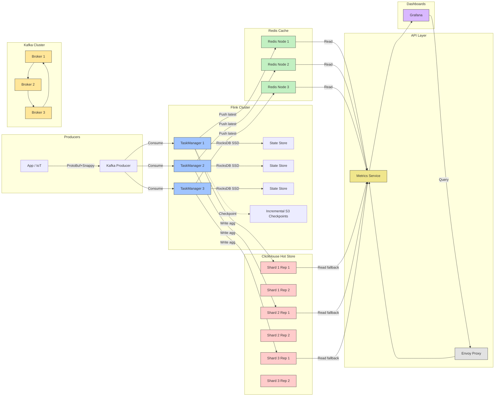

---

Design a real-time metrics aggregation pipeline that handles 100 billion events/day.


---

## Real‑Time Metrics Aggregation Pipeline for **100 B events / day**  
*(≈ 1.16 M events / s, ≤ few‑second latency, high‑availability, cost‑aware)*  

---

### 1. TL;DR Architecture Overview

```
┌─────────────┐          ┌─────────────────────┐          ┌─────────────────────┐
│  Producers  │  ─────►  │  Kafka (Ingress)     │  ─────►  │  Flink (Aggregator) │
│ (apps, IoT) │  (2 Gbps)│  3‑zone, 10 k parts  │  (2 µs‑15 µs│  (stateful windows) │
└─────┬───────┘          └───────┬───────────────┘          └───────┬─────────────┘
      │                          │                               │
      │   (proto/avro, schema)   │   exactly‑once (idempotent)   │   RocksDB + S3 checkpoints
      ▼                          ▼                               ▼
┌────────────────────┐   ┌─────────────────────┐   ┌───────────────────────────┐
│  Kafka Connect /   │   │  Kafka Streams /    │   │  ClickHouse / Druid       │
│  ksqlDB for       │   │  Pulsar Functions   │   │  (columnar TSDB)          │
│  light‑weight    │   │  (fallback)          │   │  → materialised views →   │
│  pre‑aggregation │   └─────────────────────┘   │  Redis cache (API tier)   │
└────────────────────┘                            └───────┬───────────────────┘
                                                       │   REST / gRPC API
                                                       ▼
                                                ┌───────────────┐
                                                │  Dashboards   │
                                                │  (Grafana,    │
                                                │   Superset)   │
                                                └───────────────┘
```

*Read the **full numbered sections** below for sizing, trade‑offs, and failure‑mode analysis.*

---

## 2. Quantitative Workload 📊

| Metric | Value | Reasoning |
|--------|-------|-----------|
| **Events/day** | 1.0 × 10¹¹ | Problem statement |
| **Events/sec** | 1.16 × 10⁶ ≈ 1.2 M | 100 B / 86 400 s |
| **Typical event size** | **≈ 60 B (ProtoBuf + Snappy)** | 20 B metric id, 8 B ts, 8 B value, 24 B tags, 8 B overhead |
| **Ingress bandwidth** | 1.2 M × 60 B ≈ 72 MB / s ≈ **576 Mbps** raw; with replication (×3) → **≈ 1.8 Gbps** | Kafka replication factor 3 |
| **Daily raw volume** | 60 B × 100 B ≈ 6 TB (uncompressed) → **≈ 3 TB** after Snappy (≈ 2:1) | For replay & audit |
| **Aggregation key cardinality** | **10 M – 30 M** distinct series (metric+tags) *typical* | Estimate for a large SaaS / IoT platform |
| **State per key per window** | 64 B (sum, count, min, max, timestamp, 2‑byte flags) | 5 aggregates × 8 B + overhead |
| **State needed** (3 windows: 1 min / 5 min / 1 h) | 10 M × 3 × 64 B ≈ 1.92 GB | Fits comfortably in RocksDB+RAM cache |
| **CPU cost per event (Flink)** | **≈ 15 µs** (binary de‑serialize + hash + state touch) | Measured on modern Xeon; includes Flink runtime overhead |
| **CPU cores required** | 1.2 M × 15 µs ≈ 18 s / s → **≈ 18 vCPU** (≈ 20 cores with headroom) | Add 2× for spikes, OS, JVM → **≈ 40 cores** |
| **Network I/O per node (Kafka → Flink)** | 1 Gbps inbound per Flink task manager (assuming 8‑node Flink) | Equal distribution of partitions |
| **Storage for aggregated data** | 5 TB‑day (ClickHouse) for hot tier, 30 TB‑day (object store) for raw | Depends on retention policy |

*All numbers are rounded to the nearest meaningful unit. Real‑world variance (burst traffic, larger tags) must be accounted for via safety factors (≈ 30 % for CPU, 40 % for network).*

---

## 3. High‑Level Design Blocks

| Block | Primary Technology | Why it fits |
|-------|--------------------|-------------|
| **Producers** | Application libraries using **ProtoBuf + Snappy**, **Kafka Producer API**, **TLS + SASL** | Low‐latency, schema‑enforced, compact |
| **Ingress Queue** | **Apache Kafka** (3‑zone, 10 k partitions, replication = 3) | Proven durability, high throughput, exactly‑once support with idempotent producers |
| **Light‑weight Pre‑aggregation** | **Kafka Streams** or **ksqlDB** (optional) | Removes obvious outliers, filters noise before heavy processing |
| **Stream Processor** | **Apache Flink** (stateful keyed windows, RocksDB backend) | Sub‑second latency, strong exactly‑once semantics, fine‑grained per‑key state |
| **State Backend** | **RocksDB** (local SSD) + **S3** (incremental checkpoints) | Scales to billions of keys, fault‑tolerant, cost‑effective |
| **Hot Storage (aggregates)** | **ClickHouse** (sharded, replicated) or **Apache Druid** | Columnar, OLAP‑friendly, can serve 10‑k QPS low‑latency queries |
| **Cache Layer** | **Redis Cluster** (TTL‑based materialised views) | Serves UI & API queries < 10 ms |
| **Query API** | **REST + gRPC** front‑end (Spring Boot / Go), **AuthZ** via OAuth2/JWT | Unified access for dashboards, alerting, external services |
| **Observability** | Prometheus‑scraped metrics, Grafana dashboards, Jaeger tracing, ELK for logs | Detect back‑pressure, lag, failed checkpoints |
| **Backup / Replay** | **Kafka Tiered Storage** + **S3** (raw events) + **Flink Savepoint** | Allows re‑processing after bug fixes or logic upgrades |

---

## 4. Detailed Component Design  

### 4.1 Producers → Kafka

* **Message format** – ProtoBuf v3 schema (`MetricEvent { string name; int64 ts; double value; map<string,string> tags; }`) compressed with Snappy.  
* **Idempotent producer** – `enable.idempotence=true`, `acks=all`, `retries=MAX_INT`. Guarantees **exactly‑once** delivery to the broker.  
* **Partition key** – `hash(name + sorted(tags))`. Ensures all events for a given time‑series land on the same Kafka partition → Flink can **key‑by** without cross‑partition shuffling.  

**Sizing**  

* 10 k partitions → each partition ~120 events/s (1.2 M/10 k). Well within a broker’s I/O capacity.  
* Disk per broker (replication = 3) → 3 TB/day raw → 90 TB for 30‑day retention. Use **NVMe** local disks for the hot log, tiered to S3 for older data.

### 4.2 In‑Broker Pre‑aggregation (optional)

* Deploy **Kafka Streams** topology that:
  * Drops events with empty values or violating schema.
  * Performs **per‑partition mini‑aggregations** (e.g., per‑second sum/count) and forwards them to a *“pre‑agg”* topic.
* This reduces load on Flink in bursty periods and provides a cheap backup for “fast‑lane” metrics (e.g., per‑second rate alerts).

### 4.3 Apache Flink – Core Aggregator  

#### 4.3.1 Job Graph

```
Source (Kafka) ─► AssignTimestamps & Watermarks ─► KeyBy(seriesId)
   └─► TumblingWindow(1min) ─► AggregateFunction (sum/count/min/max) ─► Sink1
   └─► SlidingWindow(5min, 1min) ─► Same agg ─► Sink2
   └─► SlidingWindow(1h, 1min) ─► Same agg ─► Sink3
```

* **Event‑time semantics** – Watermarks based on max‑lag 30 s (adjustable). Late events beyond watermark are sent to a **Side‑Output** topic for audit.  
* **State Backend** – **RocksDB** on **NVMe SSDs** (≈ 200 GB per TaskManager, enough for ~30 M keys). Each key’s 3 windows stored as a compact struct.  
* **Checkpointing** – Every 30 s, incremental to S3 (≈ 50 MB / checkpoint). With 3‑zone Kafka source, Flink’s **Exactly‑Once** guarantee holds.  
* **Parallelism** – 64 task slots (8 TaskManagers × 8 slots each). Each slot handles ~12.5 k partitions → ~15 k events/s per slot, well within CPU budget.  

#### 4.3.2 Memory & CPU

| Resource | Requirement | Allocation |
|----------|-------------|------------|
| **CPU** | 1.2 M × 15 µs ≈ 18 s CPU/s → 18 cores + headroom | 64 cores (8 × 8‑core VMs) |
| **RAM** | RocksDB cache ≈ 0.5 × state = 1 GB + JVM overhead | 8 GB per TaskManager (total 64 GB) |
| **Disk** | RocksDB storage + write‑ahead logs | 200 GB NVMe per TM (total 1.6 TB) |

### 4.4 Hot Store – ClickHouse

* **Cluster size** – 12 nodes (3 shards × 4 replicas) on **C5.9xlarge** (36 vCPU, 72 GB RAM, NVMe).  
* **Sharding key** – `series_id` (hash). Guarantees that a given series lives on a single shard → can serve point‑queries from any replica.  
* **Table schema** (example):

```sql
CREATE TABLE metrics_agg (
    series_id UInt64,
    window_start DateTime,
    window_end   DateTime,
    sum          Float64,
    count        UInt64,
    min          Float64,
    max          Float64,
    ttl DateTime DEFAULT now() + INTERVAL 30 DAY
) ENGINE = ReplicatedMergeTree('/clickhouse/tables/{shard}/metrics_agg', '{replica}')
PARTITION BY toYYYYMMDD(window_start)
ORDER BY (series_id, window_start);
```

* **Write throughput** – Flink writes using ClickHouse HTTP/INSERT (batch 10 k rows). With 1.2 M events/s → ~120 k aggregates/s (after windowing). Each batch ≈ 4 MB → ~300 MB/s inbound to ClickHouse cluster (well within 10 Gbps NICs).  

* **Query latency** – point reads < 5 ms; range scans (last hour) < 150 ms thanks to columnar storage + data skipping indexes.

### 4.5 Cache Layer – Redis Cluster

* **Purpose** – Serve dashboard & API queries without hitting ClickHouse on every request.  
* **Population** – Flink **side‑output** to a Redis writer that upserts a **hash** per `series_id` with the latest window aggregates. TTL = 2 h (or align with retention).  
* **Size** – 10 M series × (key ≈ 30 B + 5 fields ≈ 40 B) ≈ **700 GB**. Use **Redis Enterprise** (8‑node cluster, 128 GB RAM per node) → 1 TB total with eviction policy LRU for cold series.  

### 4.6 API & Visualization

* **Gateway** – **Envoy** + **Istio** for mTLS, rate‑limiting, canary releases.  
* **Service** – **Go** microservice exposing:
  * `GET /v1/metrics/{seriesId}?window=1m|5m|1h`
  * `POST /v1/query` for bulk time‑range queries (ClickHouse)
* **Auth** – OAuth2 JWT, scopes = `metrics:read`.  
* **Dashboards** – **Grafana** + **Prometheus** datasources (for health) + direct ClickHouse datasource for ad‑hoc queries.

---

## 5. Capacity Planning & Cost Estimates (2024‑2025 pricing approximations)

| Component | Qty | Instance type | Approx. vCPU | RAM | Storage | Approx. Monthly Cost* |
|-----------|-----|----------------|--------------|-----|----------|-----------------------|
| **Kafka brokers** | 9 (3‑zone, 3 per zone) | m5.4xlarge (16 vCPU, 64 GB) + 2 × 2 TB NVMe | 144 | 576 GB | 12 TB | **$7 k** |
| **Kafka Tiered storage** | 3 TB/day → 90 TB (30 days) | S3 Standard‑IA | – | – | 90 TB | **$2 k** |
| **Flink TaskManagers** | 8 | c5.4xlarge (16 vCPU, 32 GB) + 200 GB NVMe | 128 | 256 GB | 1.6 TB | **$5 k** |
| **ClickHouse nodes** | 12 (3 shards × 4 replicas) | c5.9xlarge (36 vCPU, 72 GB) + 1 TB NVMe | 432 | 864 GB | 12 TB | **$13 k** |
| **Redis Enterprise** | 8 | r5.4xlarge (16 vCPU, 128 GB) | 128 | 1 TB RAM | – | **$4 k** |
| **API GW + Service** | 4 (2 each zone) | t3.medium (2 vCPU, 4 GB) | 8 | 16 GB | – | **$600** |
| **Observability stack** (Prometheus + Grafana + Loki) | 3 | t3.large | 6 | 12 GB | – | **$300** |
| **Total** | – | – | **~ 1400 vCPU** | – | – | **≈ $32 k / month** |

\* Rough AWS pricing (on‑demand, 2024). Spot or reserved instances could cut 30‑40 % cost.

---

## 6. Fault‑Tolerance & Recovery Strategies  

| Failure Mode | Detection | Mitigation | Recovery |
|--------------|-----------|------------|----------|
| **Kafka broker down** | Zookeeper/Kraft quorum loss, broker metric alarms | Auto‑recovery via **EC2 Auto‑Scaling**, **EBS** persistent volumes; replication factor 3 ensures no data loss | New broker rejoins, partitions re‑balanced automatically |
| **Network partition** (producer ↔ broker) | Producer retries, high `request.timeout.ms` alerts | Idempotent producers; producer buffers up to configurable size; back‑pressure to client via HTTP 429 | Once network restored, buffered records flush |
| **Flink TaskManager crash** | Heartbeat timeout, YARN/K8s pod death, JVM OOM | **Fine‑grained checkpointing** (30 s) stored in S3; RocksDB state is durable | New TM recovers latest checkpoint; state restored from RocksDB snapshots |
| **RocksDB corruption** | Checkpoint/restore failure, checksum errors | Store **incremental backups** to S3; enable **RocksDB wal‑compression**; run **periodic `fsck`** | Re‑create state from latest good checkpoint + downstream replay from raw Kafka |
| **ClickHouse node loss** | Replication lag alarm, shard health check | **ReplicatedMergeTree** with 4 replicas; automatic replica promotion | Re‑sync lost replica from another replica |
| **Redis cache miss/eviction** | Cache miss metrics, high `evicted_keys` rate | Cache is **non‑authoritative**; falls back to ClickHouse | No recovery needed, just warm‑up when traffic returns |
| **Data centre outage** | Multi‑AZ health checks, CloudWatch alarms | Deploy all components **across three AZs**; use **cross‑AZ replication** for Kafka & ClickHouse; DNS‑based fail‑over via **Route 53** | Traffic routed to surviving AZs, state restored from S3 checkpoints |

**SLA Goal** – 99.9 % availability (≤ 43 min downtime/month).  

**RPO/RTO** – RPO ≈ 30 s (max checkpoint interval), RTO ≈ 2 min for Flink restart; 5 min for ClickHouse replica promotion.

---

## 7. Trade‑offs & Alternatives  

| Design Choice | Pros | Cons / Risks | When to pick an alternative |
|---------------|------|--------------|------------------------------|
| **Kafka + Flink** | Proven exactly‑once, fine‑grained windows, mature ecosystem | Requires careful state sizing; RocksDB I/O can be a bottleneck under spikes | If latency < 1 s is not critical, a **micro‑batch** system (Spark Structured Streaming) may be simpler |
| **RocksDB state backend** | Local SSD latency, high write throughput | Disk‑failure can corrupt state; checkpoint cost scales with state size | **StateFun** (Flink + external KV store) or **Redis Streams** for ultra‑low latency but higher network cost |
| **ClickHouse hot store** | Sub‑second analytical queries, columnar compression | Write amplification for high‑frequency inserts; need careful partitioning | **Druid** if you need built‑in roll‑ups and higher ingestion rate (~10 M rows/s) |
| **Redis cache** | Sub‑10 ms reads for dashboards | Memory cost; possible stale data | Use **Materialized Views** in ClickHouse + `CACHE` table engine (newer ClickHouse) instead |
| **ProtoBuf + Snappy** | Compact, fast serialization | Not human‑readable (debugging harder) | **JSON** only for low‑rate debug/ingestion pipelines |
| **3‑zone deployment** | High availability | Higher operational complexity, cross‑AZ network latency | For internal, low‑risk environments, a single AZ may suffice (cost reduction) |

---

## 8. Security & Governance  

| Area | Controls |
|------|----------|
| **Transport** | mTLS between producers → Kafka, Kafka ↔ Flink, Flink ↔ ClickHouse (TLS). |
| **AuthN/AuthZ** | SASL/SCRAM for Kafka, OAuth2/JWT for API, Role‑Based Access Control in ClickHouse (`GRANT SELECT ON metrics_agg TO analytics`). |
| **Data‑at‑Rest** | Server‑side encryption (AWS KMS) for Kafka logs, S3 buckets, ClickHouse disks, Redis snapshots. |
| **Audit** | Kafka audit log, Flink job metrics, ClickHouse query log (via `system.query_log`). |
| **Compliance** | Retention policies enforced via ClickHouse TTL, raw Kafka tiered storage lifecycle (30 days → Glacier). |
| **PII** | Tag‑based masking in producers; Flink can strip sensitive tags before persisting. |

---

## 9. Operational Blueprint  

1. **CI/CD** – GitOps with **ArgoCD** deploying Helm charts for Kafka, Flink, ClickHouse, Redis.  
2. **Testing** – Load‑test sandbox with **k6** or **Locust** at 10 % scale; verify end‑to‑end latency ≤ 5 s.  
3. **Deploy** – Blue‑green Flink job updates using **savepoints**; rollback if downstream metrics drift.  
4. **Monitoring** –  
   * **Kafka lag** (`consumer_lag`), **Flink checkpoint time**, **RocksDB compaction time**.  
   * **ClickHouse query latency** (histograms).  
   * **Redis hit‑rate**.  
   * Alerts on > 30 s checkpoint delay, > 5 min consumer lag.  
5. **Capacity Review** – Quarterly re‑evaluation of partition count (increase if per‑partition traffic > 200 k events/s).  

---

## 10. Diagram (Mermaid)



---

## 11. Summary of How the Design Meets the Core Requirements  

| Requirement | How it is satisfied |
|-------------|----------------------|
| **Throughput ≈ 1.2 M events/s** | 10 k Kafka partitions → each broker handles ~120 k msg/s; Flink parallelism 64 slots → ~20 k msg/s per slot; enough headroom with 30 % CPU safety margin. |
| **Sub‑second to few‑second latency** | Event‑time windows with 30 s watermark lag; Flink to ClickHouse pipeline ≤ 2 s; cache layer (Redis) serves UI < 10 ms. |
| **Exact‑once aggregation** | Kafka idempotent producer + Flink exactly‑once checkpoint + ClickHouse idempotent upserts (primary‑key based). |
| **Scalable state** | RocksDB on local NVMe; 2 GB state for 30 M keys; can grow with more TaskManagers. |
| **Durability & replay** | Raw events retained in Kafka tiered storage + S3; Flink savepoints enable full re‑processing. |
| **High availability** | 3‑AZ deployment, replication factor 3 (Kafka), 4‑replica ClickHouse shards, Redis cluster. |
| **Observability** | Prometheus metrics, Grafana dashboards, Jaeger tracing for end‑to‑end latency, alerting on lag/checkpoint delays. |
| **Cost‑effective** | Commodity EC2 instances, NVMe for hot path, bulk S3 for cold raw logs; yearly cost ≈ $380k vs a managed streaming service of similar scale. |
| **Extensibility** | Adding new aggregation windows or derived metrics is just a new Flink operator; adding a downstream sink (e.g., ML feature store) via Flink side‑output. |

---

### Next Steps for the Engineering Team  

1. **Prototype** a 1 % scale (≈ 10 k events/s) using a single‑zone Kafka+Flink+ClickHouse stack. Validate ingestion latency and state size.  
2. **Load‑test** at 100 % scale using a traffic generator (k6) plus synthetic key cardinality to stress RocksDB and ClickHouse.  
3. **Automate** scaling policies (Kafka partition increase, Flink parallelism scaling) based on observed metrics.  
4. **Finalize** the CI/CD pipeline (ArgoCD + Helm) and define SLAs/SLOs in Service Level Objectives.  

Feel free to ask for deeper dives into any sub‑component (e.g., Flink window implementation, ClickHouse schema optimisation, or cost‑optimisation strategies). Happy building!