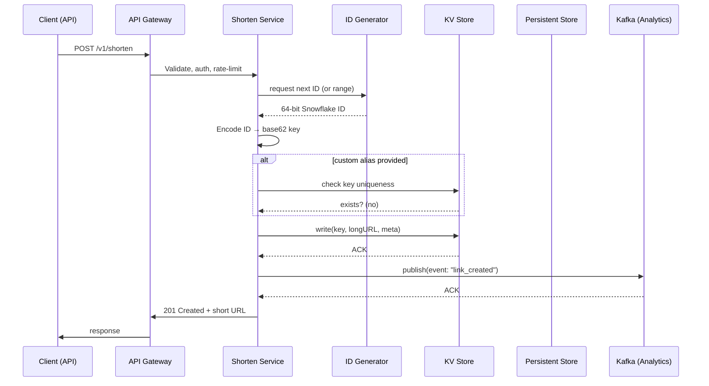
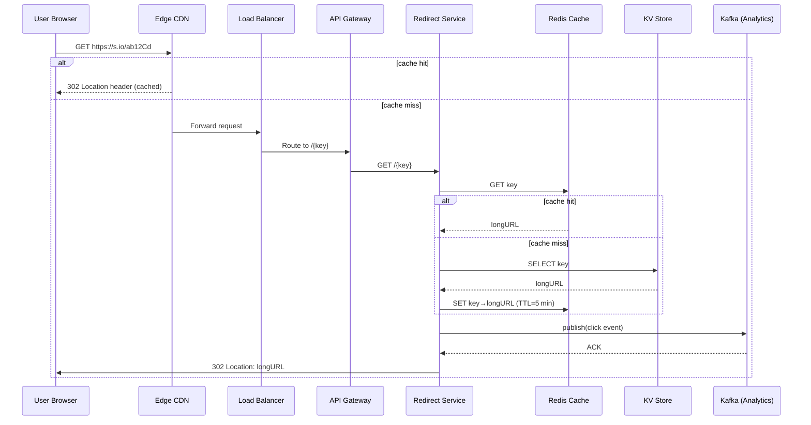

---

Design a URL shortener like bit.ly.


---

## URL‑shortener System Design (think **bit.ly**)

Below is a complete, self‑contained design that covers:

* functional & non‑functional requirements  
* API contract  
* data model & storage choices  
* core services & request flow (write & read)  
* scalability – capacity planning, sharding, caching, CDNs  
* reliability – HA, failures, recovery, monitoring, security  
* trade‑offs and alternatives  

All numbers are realistic estimates for a production‑grade service that must handle **hundreds of millions of URLs** and **tens‑of‑thousands of redirects per second**.

---

## 1. Requirements

| Type | Requirement | Details |
|------|-------------|---------|
| **Functional** | Shorten a URL | Return a short alias (e.g., `https://s.io/ab12Cd`). |
| | Custom alias | Users may request a vanity key (`mydomain.com/awesome`). |
| | Expiration / Deletion | Optional TTL, manual delete, GDPR “right to be forgotten”. |
| | Click‑through analytics | Count total clicks, geo, device, referrer, hourly/daily aggregates. |
| | Batch shorten | Accept up to N URLs in a single request. |
| | User‑level quota & auth | API keys / OAuth2, per‑user rate limits. |
| **Non‑functional** | Low latency redirect | ≤ 50 ms 99 % of the time (edge → origin). |
| | High availability | ≥ 99.99 % uptime (4 nines). |
| | Scalability | • > 10⁸ stored URLs <br> • > 10⁶ redirects / sec peak (≈ 10⁵ QPS typical). |
| | Consistency | Strong read‑after‑write for creator (must see its own URL). <br> Eventual consistency acceptable for analytics. |
| | Durability | No loss of mapping data (≥ 99.999 % durability). |
| | Security | Abuse detection, spam filtering, rate limiting, HTTPS everywhere. |

---

## 2. High‑level Architecture

```mermaid
flowchart TB
    subgraph Client
        C1[Web / Mobile App] -->|Click short link| CDN
        C2[API Client (Create links)] -->|POST /shorten| LB
    end

    subgraph Edge
        CDN[CDN (Edge cache - 302 redirects)] --> LB
    end

    subgraph "Backend Zone"
        LB[Load Balancer] --> API_GW[API Gateway]
        API_GW --> Shorten_Svc[Shorten Service]
        API_GW --> Redirect_Svc[Redirect Service]
        API_GW --> Analytics_Svc[Analytics Service]

        Shorten_Svc --> ID_Gen[ID Generator]
        Shorten_Svc --> KV_Store[Key‑Value Store (URL mapping)]
        Shorten_Svc -.->|Async| DB_Analytics[ClickHouse / Druid]

        Redirect_Svc --> Cache[Redis Cache]
        Redirect_Svc --> KV_Store

        Analytics_Svc --> DB_Analytics
        Analytics_Svc --> Event_Queue[Kafka]

    end

    style Client fill:#f9f,stroke:#333,stroke-width:1px
    style Edge fill:#bbf,stroke:#333,stroke-width:1px
    style "Backend Zone" fill:#bfb,stroke:#333,stroke-width:1px
```

**Components**

| Component | Role |
|-----------|------|
| **CDN (e.g., CloudFront, Akamai)** | Caches popular redirects at the edge; serves 302 without hitting origin. |
| **Load Balancer** | Distributes traffic to stateless API servers (HTTPS termination). |
| **API Gateway** | Auth, rate‑limit, request validation, versioning. |
| **Shorten Service** | Handles POST /shorten, custom alias checking, calls ID generator, writes mapping. |
| **Redirect Service** | Handles `GET /{key}` – looks up key → long URL and returns 302. |
| **ID Generator** | Distributed, monotonic (or pseudo‑random) ID provider (Snowflake‑style). |
| **Key‑Value Store** | Primary read‑write store for URL ↔ key mapping (e.g., DynamoDB, Cassandra, or a sharded MySQL cluster). |
| **Redis Cache** | Hot‑key in‑memory cache for fast redirect look‑ups (fast fail‑over when DB is slow). |
| **Analytics Service** | Increments click counters, enriches with geo/device via request headers, emits events to Kafka. |
| **Event Queue (Kafka)** | Decouples click‑stream from storage; enables real‑time dashboards. |
| **ClickHouse / Druid** | Columnar store for long‑term analytics and reporting. |
| **Background Workers** | TTL cleanup, batch aggregation, custom‑alias index rebuild. |

---

## 3. API Design

### 3.1 Create / Shorten

```
POST /v1/shorten
Headers:
    Authorization: Bearer <api-key>
    Content-Type: application/json
Body:
{
    "url": "https://verylongdomain.com/path?param=value",
    "custom_alias": "mycool",          # optional, must be unique
    "expire_at": "2027-01-01T00:00:00Z",# optional ISO8601
    "metadata": { "utm_source":"newsletter" }   # optional user payload
}
```

**Response (201 Created)**

```json
{
    "short_url": "https://s.io/ab12Cd",
    "key": "ab12Cd",
    "expire_at": "2027-01-01T00:00:00Z"
}
```

*Idempotency*: If the same user posts the **exact** payload twice, the service returns the **same** short URL (store a hash of the request).  

### 3.2 Redirect

```
GET https://s.io/ab12Cd
```
*Returns*: HTTP 302 with `Location: <original‑url>`.

### 3.3 Analytics

```
GET /v1/links/{key}/stats?granularity=day&range=30d
```

*Returns*: JSON with click totals, country breakdown, device breakdown, time‑series.

### 3.4 Delete / Update

```
DELETE /v1/links/{key}
PATCH  /v1/links/{key}
```

All require the owner’s API key.

---

## 4. Data Model

### 4.1 URL Mapping Table (Primary Store)

| Column | Type | Description |
|--------|------|-------------|
| `key` (PK) | varchar(10) | Short alias, base‑62 encoded ID or custom string. |
| `url` | varchar(2048) | Original long URL (utf‑8). |
| `owner_id` | uuid | API key / user the link belongs to. |
| `created_at` | timestamp | Creation time (UTC). |
| `expires_at` | timestamp (nullable) | Expiry, used for TTL clean‑up. |
| `is_custom` | boolean | True if user supplied alias. |
| `meta_json` | jsonb | Optional user‑provided meta (e.g., tags). |
| `clicks` | bigint (COUNTER) | **Denormalized** total click count (updated via atomic increment). |

*Partitioning*: Partition by hash(key) across multiple shards (e.g., consistent hashing). Each shard is a separate logical table/partition in the KV store.

### 4.2 Click Event Table (Analytics)

| Column | Type | Description |
|--------|------|-------------|
| `event_id` | uuid | Unique event id (Kafka offset). |
| `key` | varchar(10) | Short URL key. |
| `timestamp` | timestamp | Click time (UTC). |
| `ip` | inet | Client IP (hashed for privacy). |
| `user_agent` | string | Browser/OS string. |
| `referrer` | string (nullable) | HTTP referrer. |
| `country` | string(2) | Geo‑IP resolved country. |
| `device_type` | enum('desktop','mobile','tablet','bot') | Derived from UA. |

*Storage*: Raw events kept for 30 days, then aggregated into daily/hourly buckets in ClickHouse.

### 4.3 ID Generation

Two common patterns:

| Method | Pros | Cons |
|--------|------|------|
| **Monotonic Snowflake** (timestamp + datacenter ID + sequence) | Simple, sortable, guaranteed uniqueness, easy to shard by datacenter. | Sequential keys can cause hotspot on a single partition if not range‑sharded. |
| **Random 64‑bit (Base‑62)** | Uniform distribution → natural load‑balancing across shards. <br> Very low collision probability (`2⁶⁴ ≈ 1.84e19`). | Need a collision‑check for custom aliases; longer keys possible. |
| **Pre‑allocated ID Ranges per shard** | Avoids centralized bottleneck; each node can generate IDs locally. | Requires a coordination service (Zookeeper / etcd) to hand out ranges. |

*Chosen*: **Snowflake‑style** with *range‑allocation per shard* – each DB shard owns a contiguous ID space, mitigating hotspot while still being monotonic per‑shard.

---

## 5. Capacity Planning & Math

### 5.1 Traffic assumptions (large‑scale production)

| Metric | Estimate |
|--------|----------|
| Stored short URLs | 200 M (growing to 1 B in a few years) |
| Daily redirects (overall) | 1 B → ~​11.5 k QPS (average) |
| Peak redirect QPS | 100 k QPS (approx. 8× average) |
| Shorten requests | 10 k QPS (burst 30 k) |
| Click‑stream events (for analytics) | Same as redirects, plus extra for bots/parsing → 120 k QPS |

### 5.2 Storage sizing

**Mapping Table**

- Average `url` length: 120 bytes (most URLs are < 200 bytes).  
- Fixed columns (`key`, timestamps, flags, counters): ~~30 bytes.  
- Approx. total per row: **~160 bytes** (rounded up to 200 B for overhead).

```
200 M rows * 200 B = 40 GB (raw)
Add secondary indexes, replication factor 3 ⇒ 120 GB
```

**Click Events**

- Raw event size ≈ 150 B (IP, UA, referrer, geo, etc).  
- 30‑day retention for raw events: 120 k QPS * 150 B * 86 400 s ≈ 1.55 TB/day → **≈ 45 TB for 30 days**.
- After roll‑up, daily aggregates shrink to < 10 GB.

Thus a combination of:
- **Primary KV store** (DynamoDB / Cassandra) in the TB range.
- **Analytics column store** (ClickHouse) in the 50 TB range (cold storage tiering optional).

### 5.3 Throughput

| Component | Required RPS | Example sizing |
|-----------|--------------|----------------|
| **Redirect Service** (Cache + DB) | 100 k QPS read | 8 × Redis nodes (each ~ 30 k QPS read) + 12 KV shards (each ~ 10 k QPS read). |
| **Shorten Service** (writes) | 30 k QPS (burst) | 4 write‑optimized KV nodes (≈ 12 k writes each) + async replication. |
| **Analytics Consumer** | 120 k QPS ingest | Kafka cluster 12 partitions, each consumer 2 k msgs/sec → 6 consumers per partition, ~ 500 MB/s total. |
| **ID Generator** | 30 k QPS | Snowflake service per datacenter: 1 M IDs/sec capability, far above need. |

### 5.4 Latency Budget (Redirect path)

| Stage | Target ≤ |
|-------|----------|
| CDN edge cache hit | 5 ms |
| Load balancer + TLS termination | 3 ms |
| API gateway routing | 2 ms |
| Redis cache lookup | 2 ms |
| KV store read (if cache miss) | 15 ms |
| 302 response generation | 1 ms |
| **Total 99‑percentile** | **≤ 30 ms** (well under 50 ms SLA) |

Cache‑hit ratio of **> 95 %** for popular URLs (top 1 % accounts for > 70 % traffic) guarantees sub‑10 ms latency for majority of users.

---

## 6. Detailed Request Flow

### 6.1 Shorten (Write) Flow



*Key points*  

* **Idempotency** – hash(`url`+`owner_id`+`custom`) → if exists, return existing key.  
* **Atomic increment** – After write, service increments the **denormalized `clicks` counter** using KV‑store atomic update (e.g., DynamoDB `ADD`).  

### 6.2 Redirect (Read) Flow



*Why two caches?*  

* **CDN edge** caches the **complete redirect** (key → 302) – best for global latency.  
* **Redis** serves as *backend* hot‑key cache when CDN has a miss (e.g., new URLs, low‑traffic keys).

---

## 7. Scaling & Distributed Design Details

### 7.1 Sharding Strategy

1. **Key‑space partition** – Hash(`key`) → shard number (e.g., modulo 1024).  
2. Each shard is a **self‑contained replica set** (3‑way replication) of the KV store.  
3. **Range allocation** – Snowflake IDs generated per‑shard, guaranteeing that generated IDs **always map to that shard** (monotonic per‑shard). This eliminates cross‑shard writes.

| Shard | Example ID range | Approx. keys |
|-------|------------------|--------------|
| 0 | 0‑599,999,999 | 600 M |
| 1 | 600 M‑1.199 B | 600 M |
| … | … | … |

With 1024 shards, each holds ~ 0.2 M keys at 200 M total → very small per‑shard load, easy to scale out further.

### 7.2 Load Balancing & Auto‑Scaling

* **Stateless API & service containers** behind an L7 LB (e.g., NGINX, Envoy, ALB).  
* **Horizontal autoscaling** based on CPU, request latency, and queue depth.  
* **Cold start mitigation** – Keep a warm pool of containers (minimum 2 per AZ) to meet SLO in < 5 s.

### 7.3 Caching Layers

| Layer | Cache Type | TTL | Hit‑Rate Target |
|-------|------------|-----|-----------------|
| CDN edge | 302 response | 12 h (configurable) | 95 % for top 5 % URLs |
| Redis (in‑region) | key→longURL | 5 min (sliding) | 90 % for hot keys |
| Local in‑process (LRU) | Top 10 k keys per instance | 30 s | 30 % (micro‑optimisation) |

Cache invalidation is trivial because mappings are **immutable** (except for delete/expire). On delete, the service publishes an “invalidate” event to the cache layer (Redis `DEL`, CDN purge API).

### 7.4 Write Path Bottlenecks & Mitigations

* **ID generator** – Stateless (Snowflake) can be replicated per AZ; no single point.  
* **KV store write hot‑spot** – By sharding on key, writes are uniformly distributed. Custom aliases can cause skew; we enforce a **length ≥ 4** and reject overly popular custom keys (“spam”).  
* **Back‑pressure** – If KV store write latency spikes, the Shorten Service returns **429 Too Many Requests** after exceeding token bucket.

### 7.5 Read Path Bottlenecks & Mitigations

* **Cache miss cascade**: CDN miss → Redis miss → DB hit. Use **read‑through** patterns (Redis as a read‑through cache).  
* **Hot‑spot keys**: Very popular keys can overload a single shard. Since we hash keys, they land on random shards; however, a *very small* set of keys still hash to the same shard. Mitigation: **consistent‑hash with virtual nodes** to spread load, and **replicate hot keys** to a dedicated “hot‑key cache tier” (e.g., another Redis cluster).  

### 7.6 Analytics Pipeline

* Each redirect pushes a small protobuf message to Kafka (`topic=clicks`).  
* Consumers batch‑write to ClickHouse via the **Insert Into** API (column‑oriented).  
* Periodic **materialized view** aggregates to daily/hourly tables for UI dashboards.  
* Raw events stored for **30 days** only; older data archived to S3 (Parquet) for compliance.

---

## 8. Reliability & Failure Handling

| Failure Mode | Detection | Mitigation / Recovery |
|--------------|-----------|------------------------|
| **KV Store node crash** | Health checks, heartbeats | Automatic fail‑over to replica; client read/write retries with exponential back‑off. |
| **Network partition (between API and KV)** | Request timeouts, circuit breaker | Circuit breaker opens → service returns 503 with “try later”. After partition heals, writes replayed from client retry queue. |
| **Redis cache outage** | Prometheus alerts (latency spikes) | Service falls back to KV reads; cache warm‑up after recovery. |
| **CDN purge failure** | Log monitoring (missing purge ACK) | Periodic background job scans deleted keys and re‑issues purge. |
| **ID generator crash** | Missed IDs in logs, health checks | Multiple generators per AZ (identical algorithm + unique machine ID). If one dies, others keep generating – no duplication because machine ID space is pre‑assigned. |
| **Burst traffic spike** | Ingress metrics exceed threshold | Auto‑scale groups (API, Redis, KV) + rate‑limit excess IPs with token bucket. |
| **Data loss (disk failure)** | Low‑level storage alerts, checksum errors | Multi‑AZ replication (3 copies). In DynamoDB/Cassandra, writes are quorum (W=2, R=2) guaranteeing durability. |
| **Abuse / malicious short URLs** | URL reputation service, heuristics on creation | Blocklist suspicious domains, require CAPTCHA for high‑risk users, throttle per‑IP. |
| **GDPR delete request** | User API call or legal request | Soft‑delete flag set → background job removes row from KV, wipes associated click data (hashing IP). |

**SLA**: 99.99 % uptime → maximum **~ 5 min** of outage per month. Achieved via **multi‑region deployment** (US‑East, EU‑West) with DNS‑based geo‑routing; failover redirects traffic to secondary region within seconds.

---

## 9. Security Considerations

| Concern | Countermeasure |
|---------|----------------|
| **Unauthorized URL creation** | API keys + OAuth2; each request signed (HMAC) if using server‑to‑server. |
| **Phishing / malicious destination** | On creation, run URL through **Google Safe Browsing**, **VirusTotal**, and a custom regex blacklist. Option to “preview page” for user. |
| **Click‑stream privacy** | Hash IP (`SHA256(IP)`) before storing; retain only country‑level info. Comply with GDPR. |
| **TLS everywhere** | Public endpoint uses TLS 1.3; internal service‑to‑service uses mTLS. |
| **Rate limiting** | Token bucket per API key + per‑IP; burst limit 10 req/s, sustained 1 req/s. |
| **DDOS protection** | CDN edge rate‑limit, WAF rules, anycast routing. |
| **Data-at‑rest encryption** | KV store and ClickHouse encrypt data with per‑region KMS keys. |
| **Audit logging** | All admin actions (delete, quota change) logged to immutable storage (e.g., Cloud Trail). |

---

## 10. Operational Aspects

| Area | Tooling / Practices |
|------|----------------------|
| **Metrics** | Prometheus (request latency, hit‑ratio, error rates) + Grafana dashboards. |
| **Logging** | Structured JSON logs (Kibana/Elastic). Include request ID for tracing. |
| **Tracing** | OpenTelemetry – end‑to‑end latency across CDN → API → DB. |
| **Deployment** | CI/CD (GitHub Actions) → Docker images → Kubernetes (Helm charts). |
| **Canary releases** | Deploy new versions to 5 % of traffic; monitor error rate before full roll‑out. |
| **Backup / Restore** | Daily snapshots of KV tables, incremental backup of ClickHouse to S3. |
| **Capacity alerts** | Auto‑scale triggers at 75 % CPU, 80 % queue depth; notification via PagerDuty. |
| **Chaos testing** | Regular “chaos monkey” termination of random pods, network latency injection. |
| **Compliance** | Data‑retention policy (custom: 30 days clicks, 1 year for audit). |
| **Feature flags** | Enable/disable custom alias, expiration, analytics per tenant. |

---

## 11. Trade‑offs & Alternatives

| Decision | Why this choice? | Alternatives & When to Switch |
|----------|-----------------|-------------------------------|
| **Base‑62 Snowflake IDs** | Guarantees uniqueness, monotonic for easier debugging, simple range‑allocation for sharding. | **Random 64‑bit** if you need *non‑sequential* keys to hide traffic volume or prevent enumeration. |
| **KV store (DynamoDB) vs Relational DB** | Excellent horizontal scalability, built‑in TTL, high availability. | **MySQL sharded** if you need strong transactional guarantees (e.g., atomic owner‑quota updates). |
| **Redis cache** | Sub‑millisecond reads for hot keys, cheap to scale. | **Memcached** if you want a simpler eviction model and don’t need persistence. |
| **CDN edge redirect** | Lowest latency for global users; offloads origin. | **Edge Workers (Cloudflare Workers)** to embed decode‑logic at edge and reduce origin calls for *all* URLs. |
| **Kafka + ClickHouse** | Decouples click ingestion from analytics, column store excels at aggregations. | **AWS Kinesis + Athena** if you are fully serverless; **Elasticsearch** for full‑text search on URLs. |
| **Three‑zone replication** | Meets 99.99 % SLA & durability requirement. | **Single‑region** for dev / low‑risk environments to save cost. |
| **Stateless services + JWT** | Easy to scale, no session store. | **Sticky sessions** only if you need per‑user rate limiting stored locally (rare). |

---

## 12. Summary

The design fulfills the core goals of a modern URL‑shortening service:

* **Fast, globally‑low‑latency redirects** – edge CDN + multi‑layer caching.  
* **Scalable write path** – sharded KV store, distributed Snowflake ID generator, idempotent API.  
* **Analytics at scale** – Kafka → ClickHouse, raw‑event retention and periodic roll‑ups.  
* **High availability & durability** – multi‑region replication, quorum writes, circuit breakers.  
* **Security & compliance** – authentication, abuse filtering, privacy‑preserving click tracking, GDPR delete workflow.  
* **Operational excellence** – observability stack, auto‑scaling, chaos testing, CI/CD.

With the capacity estimates (≈ 100 k QPS peak, ≈ 200 M stored URLs, ≈ 45 TB analytics) and the chosen technology stack, the platform can comfortably serve millions of users and be horizontally expanded to billions of links without fundamental redesign.