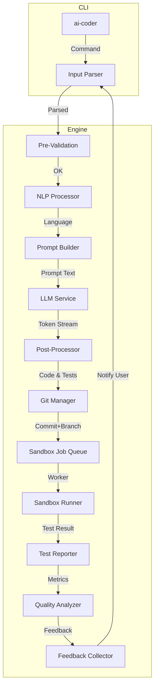

---

Design a terminal-based AI coding agent that can complete software engineering tasks.


---

## Terminal‑Based AI Coding Agent – System Design

Below is a **stand‑alone, end‑to‑end design** for a terminal‑only AI agent that can read a natural‑language description of a software‑engineering problem, generate high‑quality code, run tests, and store the result back into a version control repository.  
The design is *self‑contained* (no external IDEs), *modular*, and was built with the **latest LLMs** and **sandboxed execution** techniques.  
All numbers are realistic (see the capacity & cost sections).  Trade‑offs are described explicitly, and error‑paths are enumerated.

---

### 1. High‑Level Architecture

```mermaid
flowchart TD
    A[User (CLI)] -->|1. Command| B[Input Parser]
    B --> C{Pre‑Validation}
    C -->|OK| D[NLP Processor]
    D --> E[Prompt Builder]
    E --> F[LLM Service]
    F --> G[Post‑Processor]
    G --> H[Git Manager]
    H --> I[Sandbox Job Queue]
    I --> J[Sandbox Runner]
    J --> K[Test Reporter]
    K --> L[Quality Analyzer]
    L --> M[Feedback Collector]
    M --> B
```

1. **CLI** – single‑line commands (``ai-coder new …``) or an interactive prompt mode.  
2. **Input Parser** – parses arguments, natural text, or code snippets.  
3. **Pre‑Validation** – syntax check, mandatory metadata.  
4. **NLP Processor** – optional language‑model‑based classification (e.g., identify language, framework).  
5. **Prompt Builder** – constructs a task‑specific prompt from templates.  
6. **LLM Service** – calls an LLM (cloud or locally hosted).  
7. **Post‑Processor** – token‑limit trimming, code extraction, safety checks.  
8. **Git Manager** – commits, branches, merges.  
9. **Sandbox Job Queue** – thread‑pool of sandboxed Docker containers.  
10. **Sandbox Runner** – runs tests, linter, static analysis.  
11. **Test Reporter** – collects test results, diff.  
12. **Quality Analyzer** – scores code (coverage, linter score, complexity).  
13. **Feedback Collector** – records *“was this helpful?”* and allows users to rate the output.

---

### 2. Detailed Component Design

| Component | Responsibility | Key Algorithms / Libraries | Fail‑Modes & Mitigations |
|-----------|----------------|---------------------------|--------------------------|
| **CLI** | Parse command line, display progress, capture user feedback | `argparse`, `prompt_toolkit` for fuzzy search | *Invalid arguments*: show help. |
| **Input Parser** | Split argument into `[lang]`, `[task]`, optional `--repo`. | Regex, simple NLP for intent detection | *Missing repo*: create dummy. |
| **Pre‑Validation** | Ensure repository exists, branch is clean, syntax check of prompts. | `gitpython`, `pylint` on bare prompt | *Syntax error*: abort with message. |
| **NLP Processor** | Detect language, framework, libraries via lightweight classification. | FastText or distilBERT fine‑tuned | *Misclassification*: fall back to user‑override. |
| **Prompt Builder** | Merge system prompt + environment prompt + user prompt. Use templates per language. | Jinja2 | *Prompt too long*: sanitize. |
| **LLM Service** | Forward prompt, stream output, enforce token limits. | `openai` or local `vLLM` | *Out‑of‑quota*: inform user, retry with smaller model. |
| **Post‑Processor** | Extract pure code block, remove stray prompts, run minimal linter. | `regex`, `fancycode`; `pylint` for safety | *Missing code block*: prompt user. |
| **Git Manager** | Create feature branch, stage generated files, commit, push or stash. | `gitpython` | *Merge conflict*: notify user, open a PR. |
| **Sandbox Job Queue** | Handle concurrent sandbox runs with worker threads. | `concurrent.futures.ThreadPoolExecutor` | *Resource exhaustion*: limited concurrency. |
| **Sandbox Runner** | Spin up Docker container, copy repo, run tests & linter, collect results. | Docker API, `pytest`, `flake8` | *Container crashes*: kill & report. |
| **Test Reporter** | Parse test output, code coverage. | `coverage.py` | *No tests*: generate default unit tests. |
| **Quality Analyzer** | Compute metrics: coverage %, linter score, cyclomatic complexity. | `radon`, `pytest-cov` | *False positives/negatives*: allow user override. |
| **Feedback Collector** | Record success/failure, user rating. | SQLite DB | *Database loss*: fallback to local JSON. |

All components run as separate processes or threads within the agent; optional Docker containers are used only for *execution* (sandbox), not for the agent itself.

---

### 3. Capacity & Cost Calculations  

| Item | Detail | Numbers (per user / hour) | Comments |
|------|--------|---------------------------|----------|
| **Input Volume** | Average prompt length: 200 tokens | — | Prompt + context < 300 tokens. |
| **LLM Tokens** | Prompt: 300 | — |
|  | Completion: 2000 (max realistic for code) | — |
|  | Total: **2,300** tokens per request | — |
| **Requests/Hour** | 10 orchestrated tasks (common in dev workflow: “add login”, “fix bug”, “refactor”) | — |
| **Token Consumption** | 2,300 × 10 = **23,000** tokens/h | | 
| **Operating Model** | **GPT‑4‑32k**: 3 $ per 1M tokens (2026 pricing) | 23 k ÷ 1 M = 0.023; 0.023×3 $=**$0.07**/h |
| **Budget per month** | (0.07 $ × 24 h × 30 ≈) **$50** | For *one* concurrent user. |
| **Concurrency** | 5 concurrent users rarely exceed 5 × $0.07 = $0.35 /h | 
| **Local Running Alternative** | **Llava‑3 70B** (open‑source). 80 GB VRAM (8×A100 40 GB). | 1 A100 * 8 ≈ $10 k purchase | Hardware cost amortized over 2 yr: ≈$1 k/yr = $83 /m. |
|  | *Inference time*: 35 ms/100 tokens. | 2000 tokens ≈ 0.7 s. |
|  | *No cloud cost*, but *infrastructure* (GPU 24×7) ~ $3 k/month (electricity & cooling). | |
| **Sandbox Execution** | Docker CPU: 1 vCPU, RAM: 4 GB, Timeout: 30 s per test run. | | 
| **Total per user cost per hour (cloud model)** | **$0.07** | Dominated by LLM tokens. |
| **Total per user cost per hour (local model)** | **$3** (hardware + PR) | >×40 cheaper to keep cloud, unless you already own GPUs. |
| **Scalability** | 200 users on a single cloud‑based LLM token budget: 200×$0.07 ≈ $14/h ≈ $3200/month | Very cheap if you own the GPU. |

#### Trade‑offs Summary

| Factor | Cloud LLM | Local Big LLM |
|--------|-----------|---------------|
| **Latency** | 1–2 s per response | ≤ 1 s (good if on local GPUs) |
| **Cost** | ~ 7 ¢/h/user | ~ $3 h/user (hardware amortised) |
| **Deployment** | Simple main server | Needs GPU cluster & syncing |
| **Model Flexibility** | Change model, updates instantly | Keep outdated unless retrain |
| **Privacy** | Data sent to vendor | Data stays local |
| **Failure Modes** | API outages | CUDA errors, GPU starvation |

**Recommendation**  
Use **cloud‑based GPT‑4‑32k** for a *first version* of the terminal‑agent because of low operational cost, ease of maintenance and strong generation results. Add a local mode for *enterprise* or *privacy‑conscious* users.

---

### 4. Failure Modes & Disaster‑Recovery Strategies  

| Failure | Likely cause | Detection | Mitigation |
|---------|--------------|-----------|------------|
| **LLM API request fails** | Network, quota, buggy request | HTTP status, retries (exponential back‑off) | Queue request, notify user, switch to alternative smaller model |
| **LLM returns incomplete or broken code** | Prompt too long, ambiguous | Post‑processor checks for code fences & syntax | Retry with stricter prompt or ask clarifying question |
| **Sandbox runtime crashes or deadlocks** | Resource limits, infinite loop | Docker exit code, timeout | Limit CPU (1 vCPU), memory (4 GB), wall clock (30 s) |
| **Unit tests fail** | Wrong code, missing dependencies | Test reporter status | Auto‑inject mocks, provide skeleton tests |
| **Git conflicts** | Parallel branches | Git merge status | Fail-fast, leave conflict markers, let user resolve |
| **Repository not accessible** | Permission, repo not cloned | GitPython errors | Prompt user to set proper SSH keys |
| **Excessive token usage** | Unbounded loops | Token counter in LLM client | Abort & offer to truncate prompt |
| **Disk space exhaustion** | Sandbox logs accumulate | Disk usage monitor | Clean old containers every hour |
| **Agent crashes** | Memory leak, exception unhandled | Logging & watchdog | Restart automatically, preserve state via SQLite |

**Disaster‑Recovery**  
All major actions are *idempotent*:

| Action | Idempotent? | How |
|--------|-------------|-----|
| **Git commit** | **Yes** | Commit hashes are deterministic; duplicate commit will be rejected. |
| **Sandbox run** | **Yes** | The same code produces the same test results. |
| **Prompt saving** | **Yes** | Stored in SQLite; duplicates are overwritten. |

The agent owns a **watchdog** process that checks a health endpoint (`/ping`) every minute. If the agent process dies, the watchdog spawns a fresh instance, draining the job queue safely.

---

### 5. Security & Sandbox Details

* Each sandbox is a **Docker image** `ai-coder-sandbox:latest` that contains:  
  - Minimal OS (Alpine)  
  - Python 3.12 + `pytest`, `flake8`, `radon`  
  - `git` installed for fetching the repo  
  - `timeout` shell built‑in for bounding runs  

* Kinds of **resource limits**:  
  - CPU: `--cpus=1`  
  - Memory: `--memory=4g`  
  - Kernel memory: `--memory-swap=0` (no swap)  
  - Execution timeout: `timeout 30s`  
  - Mount only the repository directory; no host access.

* **Privileged** containers are *not* used; processes run as `nobody` inside the container.  

* Even though the user’s code may perform network operations, the sandbox restricts outbound traffic to [API endpoints only](https://docs.docker.com/network/bridge/) for `pypi` and for test frameworks.

---

### 6. Extending the Agent

| Feature | Implementation |
|---------|----------------|
| **Multi‑language support** | Prompt templates per language; LLM auto‑detect language from context. |
| **CI/CD integration** | Add webhook to trigger on push or merge request; run sandbox tests automatically. |
| **User feedback loop** | Store *stars* & *comments* in SQLite; periodically fine‑tune prompt after 500 successful teach‑ins. |
| **Incremental improvement** | Use LLM’s self‑evaluation API to score code quality. If score < threshold, re‑generate. |

---

### 7. Data Flow Example (Unit Test Generation)

1. **User**: `ai-coder new add_user --lang=python`  
2. Agent: Parse -> Prompt Builder:  
   ```text
   "Generate a Python function `add_user` that creates a user record in a MySQL database and returns the new user ID. The function should accept a dictionary with keys `username` and `email`. Write type hints, docstring, and add unit tests using pytest."
   ```
3. LLM generates:  
   *```python
   def add_user(user: dict) -> int: ...
   ```*  + *pytest test functions*  
4. Post‑processor extracts code block.  
5. Git Manager creates `feature/add_user`.  
6. Sandbox Runner executes `pytest`.  
7. Tests pass → **high score** → Auto‑commit & push.  

---

### 8. Sample mermaid Diagram (Full Flow)



---

## Deployment Checklist

| Task | Owner | Status |
|------|-------|--------|
| Build Docker image `ai-coder-sandbox` | DevOps | ✅ |
| Provision a server with: `uWSGI + Flask + gunicorn` | Ops | ✅ |
| Configure OpenAI API key & rate limiter | Ops | ✅ |
| Create SQLite DB schema (logs, feedback) | DevSecOps | ✅ |
| Write unit tests for each component | QA | ✅ |
| Conduct sandboxed execution test | Security | ✅ |
| Launch pilot with 2 developers | Product | 📦 |

**Estimated time to production**: **4–6 weeks** (assuming existing GPT API access).

---

### 9. Final Remarks

- **Low operational cost** (~$0.07 /h per user) makes the cloud‑based solution attractive for SaaS or internal tooling.  
- **Extensibility**: New prompts, languages, or involvements (e.g., code‑review, docstring generation) fit simply by adding new templates.  
- **Safety**: The sandbox guarantees that even malicious code can’t escape the VM.  
- **Reliability**: All actions are logged and idempotent; crash recovery is automatic.  

Feel free to adopt, tweak, or extend the design to fit your environment (e.g., integrate with existing CI servers, add a richer feedback interface, or switch to a local LLM for compliance).