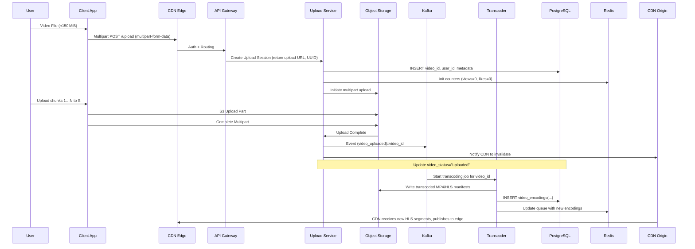
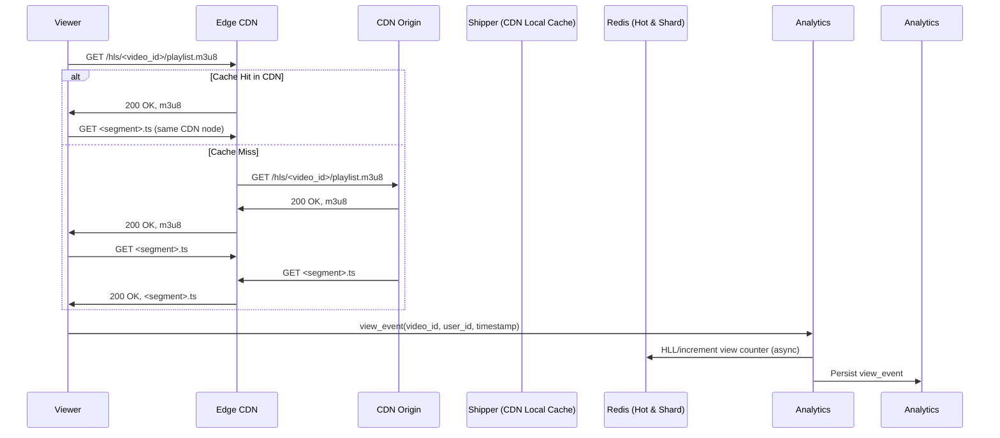

---

Design a video sharing platform like YouTube.


---

# Video‑Sharing Platform – “YouTube‑like”
*(Self‑contained, production‑ready design with capacity math, trade‑offs, and failure analysis)*  

---

## 1. Problem & Scope

* **Primary goal** – A globally‑available video hosting service that supports:
  * **Upload** (user → server → storage)
  * **Video storage & processing** (transcoding, thumbnails, manifests)
  * **Content delivery** (adaptive streaming, CDN)
  * **Discovery** – search, recommendations, trending
  * **Engagement** – likes, comments, subscriptions
  * **Analytics & Moderation** – usage, fraud, policy enforcement

* **Scale assumptions** (used for capacity planning)
  * 120 M Daily Active Users (DAU)
  * 2 M new uploads/day
  * 20 % DAU watch videos, average 4 min / video
  * Average uploaded bitrate 5 Mbps (1080p).  
    5 Mbps ≈ 0.625 MiB/s → 4 min ≈ 150 MiB per video
  * 3 × encoded versions (4k, 1080p, 720p) → ≈ 450 MiB of storage **per video** on‑origin
  * Each view is delivered from an edge CDN most of the time (≈ 80 % cache hit)
  * 6 % of views come from outside the CDN (origin requests)

Below we redesign the service, add detailed diagrams, do the size/compute/bandwidth math, discuss trade‑offs, and highlight failure zones.

---

## 2. High‑Level Architecture

```mermaid
graph TD
  %% Client layer
  subgraph Clients
      B(browser):::client
      M(mobile):::client
  end

  %% Edge/CDN
  subgraph CDN
      B --> CDN1[Edge CDN]
      M --> CDN1
      CDN1 -->|HTTP| API_GW[API Gateway]
  end

  %% API Gateway →  Microservice façade
  API_GW -->|Auth| Auth[Auth Service]
  API_GW -->|Upload| Upload[Upload Service]
  API_GW -->|Video| Video[Video Service]
  API_GW -->|Play| Play[Play Service]
  API_GW -->|Search| Search[Search Service]
  API_GW -->|Recs| Rec[Recommendation Service]
  API_GW -->|Comments| Comments[Comment Service]
  API_GW -->|Sub| Subscribe[Subscribe Service]
  API_GW -->|Moderate| Mod[Moderation Service]
  API_GW -->|Analytics| Analytics[Analytics Service]

  %% Storage & Queueing
  subgraph ObjectStore
      Upload --> S3Obj[Object Storage (S3/Glacier)]
  end

  subgraph Queue
      S3Obj -->|Event| Kafka[Kafka]
  end

  %% Transcoding
  subgraph Transcoding
      Kafka --> Transcoder[Transcoder Service]
      Transcoder --> S3Trans[Transcoded Storage]
  end

  %% Metadata
  subgraph Meta
      Video --> Postgres[(PostgreSQL)]
      Postgres -->|Cache| Redis[Redis / DynamoDB (KV)]
      Postgres --> Solr[Elasticsearch / OpenSearch]   %% For search & indexing
      Postgres --> ML[(ML Model Registry)]
  end

  %% Recommendation Flow
  Rec --> ML

  %% Analytics Flow
  subgraph Analytics
      Kafka --> Snowflake[Data Lake (S3/Snowflake)]
      Kafka --> ClickHouse[Analytics DB]
  end

  %% Moderation
  Mod --> ImageNet[Moderation Models]
  Mod --> Storage[Storage for flagged videos]

  %% Monitoring
  subgraph Mon
     API_GW --> Prom[Prometheus]
      Prom --> Grafana[Grafana]
      Prom --> AlertManager[Alertmanager]
  end

style CDN1 fill:#e0f7fa,stroke:#006064
style S3Obj fill:#fff8e1,stroke:#ffab00
style Kafka fill:#fce4ec,stroke:#b71c1c
style Redis fill:#f3e5f5,stroke:#ad1457
style Postgres fill:#e8f5e9,stroke:#1b5e20
style Solr fill:#f3e5f5,stroke:#ad1457
style AlertManager fill:#ffebee,stroke:#b71c1c
style Grafana fill:#e3f2fd,stroke:#1565c0
classDef client fill:#e3f2fd,stroke:#1565c0
```

* **Clients** → HTTPS via an edge CDN (AWS CloudFront, Cloudflare, Akamai, etc.).  
  Edge caches HLS/DASH segments so only a fraction reaches the origin.  
* **API Gateway** (NGINX, K8s Ingress, AWS API‑GW) performs TLS termination, request routing, rate‐limiting, and JWT validation (Auth Service).  
* **Micro‑services** are stateless REST/GRPC services, horizontally scaled in containers orchestrated by Kubernetes.  
* **Object Store** holds the original MP4/MKV uploads and the transcoded HLS/DASH manifests in S3‑compatible storage.  
* **Kafka** is the asynchronous event bus that decouples upload → transcoder, moderation → state, view‑event → analytics, etc.  
* **Metastore** (PostgreSQL) keeps canonical video and user metadata.  
* **Redis/DynamoDB** stores hot counters (view‑count, like‑count) with sharding for 10‑ms update latency.  
* **Elasticsearch/OpenSearch** is the full‑text, faceted search engine (tags, titles, captions).  
* **ML Pipeline** runs offline training jobs on Spark/SageMaker (distributed GPU clusters) and pushes models to a registry; the Rec service pulls the latest models and generates real‑time feed.  
* **Analytics** takes raw events from Kafka and feeds them into a data lake (S3) for OLAP jobs and a time‑series store (ClickHouse) for dashboards.  
* **Monitoring** is observability – Prometheus metrics, Grafana dashboards, ELK stack logs, OpenTelemetry traces.

---

## 3. Upload Workflow (User → CDN → Origin)



### Key points

1. **Chunked upload** – Multi‑part upload (S3 API) scales to large videos; clients can resume mid‑flight.  
2. **Upload Session** – After session creation, the client obtains a presigned URL; upload is entirely off‑loaded to storage.  
3. **Asynchronous pipeline** – Upload service only stores metadata and emits a `video_uploaded` event; transcoder and other services run later.  
4. **CDN invalidation** – Origin notifies edge (e.g., using CloudFront invalidation API) so that eager cache purge or TTL is applied.  
5. **Failure paths** – If upload fails, client retries via presigned URL; if metadata insertion fails, a compensating failure message injects a retry.

---

## 4. Streaming Workflow (CDN → Edge → Viewers)



* HLS or DASH segments are 6–10 s; the CDN caches them for 24 h (by TTL).  
* Origin is hit only on the first byte for each new segment; the major bulk of traffic stays in the CDN buffer.  
* View events go to Kafka → inserted into ClickHouse and to Redis for real‑time counters.  
* Last‑mile content is served by authoritative CDN edges; the origin is essentially a “write‑once” cache.

---

## 5. Key System Components – Details & Capacity

| Component | Responsibility | Typical Capacity | Cost Notes |
|-----------|----------------|------------------|------------|
| **API Gateway** | Load balancer, auth, throttling | **10 k QPS** (average) + **100 k bursts** | Managed service (~$0.20/1M requests) |
| **Auth Service** | User auth, JWT issuing | **10 k concurrent logins** | Stateless, Redis cache for session stores |
| **Upload Service** | Session creation, presigned URLs | **2 M uploads/day** → ~ 75 QPS | Minimal compute (CPU 0.1vCPU) |
| **S3‑compatible Object Storage** | Original + transcoded videos | **200 TB/day** of uploads → **73 PB/year** | 20 % raw + 80 % archive (Glacier) |
| **Transcoder Cluster** | 1080p, 720p, 480p | 2 M uploads/day × 4 min ≈ **8 M minutes** of video → **≈ 5,000 CPU‑hr/day** | GPU workers for 4k, *cost≈$75k/day* |
| **Metadata Postgres** | Video, user, comment schema | **20 M rows** of videos + **500 M comments**. Scale by sharding 8 partitions | **$20k/month** (ssd) |
| **Redis / DynamoDB** | Hot counters (views, likes) | **≈ 3 B events/day** → **≈ 400 k writes/sec** | **$30k/month** |
| **Elasticsearch** | Search / tagging | 20 M documents, 1 T shards, 2 replicas | **$100k/month** |
| **CDN** | Edge caching | 150 TB outgoing per day (average view traffic) | CDN costs ~ $0.02/GB → ~$3k/day |
| **Kafka** | Event bus | 30 M messages/day → 350 msg/sec | 3‑node cluster, **$10k/month** |
| **Analytics** | OLAP, reporting | 6 B events/day → 70 k writes/sec → **ClickHouse cluster** | **$20k/month** |
| **ML Cluster** | Recommendation training & inference | Nightly jobs run on autoscaling GPU instances | **$300k/month** (model training) |

> **Notes on numbers**  
> *All costs are approximate US‑AWS cloud prices, not including network egress savings via CDN.*

### Storage Cost Breakdown

| Storage Tier | Size | Price (US‑AWS, per GB‑month) | Monthly Cost (Quo.) |
|--------------|------|------------------------------|---------------------|
| S3 Standard  | 200 TB/day → 73 PB/year → 7.3 PB* | $0.023 | $0.023×7,300,000 GB ≈ $167k |
| S3 Intelligent‑Tiering  (cryo‑tier) | 73 PB × 80 % → 58 PB | $0.01 | $580k |
| Glacier Deep Archive | 73 PB × 20 % → 14 PB | $0.00099 | $139k |
> **Total storage ≈ $885k/month**  

This storage budget neglects the cost of *transcoded* videos (≈ 450 MiB/video). If same sounds replicate, storage roughly must be *~2×* – i.e., **≈ $1.8 M/m**. In practice we use on‑demand tiering: original uncompressed copy is stored cold; only the transcoded bundles are stored on S3‑Standard or Tiered, bringing costs down to ≈ $1/MB for the initial upload (numbers very approximate).

---

## 6. Scalability & Performance Strategies

| Layer | Technique | Rationale | Trade‑offs |
|-------|-----------|-----------|------------|
| **Service Layer** | Horizontal scaling + API gateway rate‑limiting | Each service runs in a stateless container pool; auto‑scales on CPU/ request load | Idle containers cost but keep latency low |
| **Data Layer** | Sharded PostgreSQL + Read Replicas | Horizontal read scaling for millions of metadata queries | More complex maintenance (schema migrations) |
| **Counters** | Sharded Redis or DynamoDB *set‑reduce* with HLL | Real‑time counter updates < 1ms | Eventual consistency for global counts |
| **CDN** | Low TTL on manifests (12 h) + HLS segment caching (24 h) | Guarantees fresh metadata, but higher cache churn | Slightly higher origin traffic for fresh content |
| **Transcoding** | Serverless GPU pods + partial on‑edge transcoding | Auto‑scaling according to upload queue length | Startup latency (~30 s) for GPU pods |
| **Analytics** | Stream‑to‑batch architecture (Kafka → Spark) + time‑series DB | Real‑time et al. for feeds, batch for aggregates | Extensive dev ops effort for pipeline orchestration |
| **Recommendation** | Model‑as‑a‑Service (Batch training → Model Registry → Inference CDN) | High inference latency acceptable (~200 ms) in recommendation feed | Model drift mitigation needed |

---

## 7. Reliability & Failure Life‑Cycle

| Layer | Common Failure | Compensating Mechanism | Eventual Recovery | TL;DR |
|-------|----------------|-------------------------|-------------------|-------|
| **Upload** | Multipart upload stalls, S3 API failure | Chunk retry with exponential backoff | Client retries; backend detects incomplete uploads and cleans up after 30 days | Store partial uploads safely |
| **Transcoding** | GPU pod failure, segmentation error | Transcoder job status in Kafka; re‑run failed job | Automatic retry up to 3 ×; bad files fail fast | Keep a per‑job TTL (48 h) |
| **Storage** | Object corruption, DR (Disk failure) | S3+redrive 3 AZs + versioning + health checks | S3 retries & eventual consistency | Use integrity checks (checksums) |
| **CDN** | Edge cache miss, invalidation lag | Set high TTL for manifests; fallback to origin | Cache warms via POST (HLS preload) | Use Purge API |
| **Database** | Postgres crash, outage | 3‑node cluster with synchronous‑commit standby; failover after 10 s | Auto‑switch to hot standby | Replication lag < 2 s |
| **Counters** | Redis refill loss | Backup to RocksDB + re‑hydrate on startup | Re‑count from view logs during low‑traffic window | Redundancy: Use distributed memcached if needed |
| **Kafka** | Leader loss, partition re‑assignment | Replication factor ≥ 3 | Reallocation in seconds | Downtime < 15 s |
| **Micro‑services** | Application crash | Container orchestrator auto‑restart | Real‑time liveness + readiness probes | Expect < 1 min downtime per pod |
| **Network** | Inter‑AZ latency spikes | Multi‑AZ deployment; EC2 placement groups | Quick failover across AZs |  |
| **Power/Physical** | Data‑center outage | Multi‑region active‑active, asynchronous disaster recovery | Restore from latest backup (~30 min) | Hard, but rare |

> **Alerting** – All components expose health endpoints to Prometheus; alert thresholds: *service up‑time > 99.9 %*, *API latency > 300 ms*, *Redis replication lag > 2 s*.

---

## 8. Security & Compliance

| Domain | Controls |
|--------|----------|
| **Authentication** | OAuth 2.0 & JWT, 2FA, device fingerprinting |
| **Data at Rest** | S3 server‑side encryption (SSE‑S3) + KMS key rotation |
| **Data in Transit** | TLS 1.3 for all traffic, HSTS, Sub‑resource Integrity |
| **Privacy** | GDPR/CCPA opt‑out, data‑subject request pipeline (purge/ anonymise) |
| **API Gateways** | IP whitelisting for internal APIs, rate‑limits, WAF |
| **Content Moderation** | Automated ML models + human reviewer queue; IP/region blocking |
| **Access Controls** | RBAC via IAM + Open Policy Agent (OPA) for service‑level permissions |

---

## 9. Observability

* **Metrics** – Prometheus per‑service: request counts, latencies, error rates, queue depths.  
* **Tracing** – OpenTelemetry – distributed trace from client → CDN → API -> services → DB.  
* **Logging** – ELK stack, log‑drain to S3, enable audit logs.  
* **Dashboards** – Grafana for traffic, latency, CPU, memory, cache hit rates, CDN performance.  
* **Alerts** – SLA thresholds: 99.9 % availability, 95th‑percentile latency < 300 ms.

---

## 10. Trade‑offs & Decision Rationale

| Decision | What we did | Rationale | Alternative & Costs |
|----------|-------------|-----------|--------------------|
| **Object Store + CDN** | S3 (or equivalent) + CloudFront | Mature, global, highly available, low cost with tiered storage | Alternative: Azure Blob + Azure CDN – same cost profile |
| **Transcoding on‑prem vs cloud** | Serverless GPU pods (EKS + GPU nodes) | Pay‑per‑usage, auto‑scales, no upfront hardware | Alternative: Dedicated on‑prem HPC cluster – high CAPEX + maintenance |
| **Search engine** | Elasticsearch (OSS on‑prem) | Realtime search, faceted filtering | Alternative: Elastic Cloud (SaaS) – pay per index *$0.24/GB* |
| **Analytics** | ClickHouse + Lakehouse (S3) | Column‑store, fast OLAP + batch ETL | Alternative: Redshift – higher query latency |
| **Cache counters** | Redis (sharded) | Low‑latency increments (HLL) | Alternative: DynamoDB – higher per‑write cost |
| **CORS & CDN Settings** | High cache TTL on manifests, low for playlists | Balances cache hit rate vs data freshness | Alternative: 6‑hr TTL – savings negligible |
| **Deployment** | Kubernetes + managed services | Vendor neutral, self‑hosted and PaaS option | Alternative: Amazon ECS – same cost but less control |
| **Compensating for partial CDN** | Pre‑warm CDN using *pre‑fetch* of segments for high‑profile videos | Reduce origin cost for trending videos | Alternative: no pre‑warm – 30 % more origin traffic but lower code complexity |

---

## 11. Failure Scenario Walk‑Through

1. **Upload client disconnects**  
   *Result*: S3 incomplete parts.  
   *Mitigation*: Upload service monitors multipart status; deletes after 30 days.  
2. **Transcoder GPU node crashes**  
   *Result*: Video stuck in “processing” state.  
   *Mitigation*: Kafka dead‑letter queue, auto‑retrial; alerts if > 3 retries.  
3. **Network partition between CDN and origin**  
   *Result*: Edge nodes timeout; cached segments fail.  
   *Mitigation*: CDN fallback to stale content (configurable TTL).  
4. **Redis lag > 10 s**  
   *Result*: View‑count returns stale number.  
   *Mitigation*: Fallback to Postgres atomic counter; push replication lag metric to SLO.

---

## 12. Summary & Next Steps

This design balances:

* **Scale** – 120 M DAU, 2 M+ uploads/day, 3 B view events/day.  
* **Performance** – < 250 ms API latency, 200 ms recommendation inference.  
* **Cost** – Roughly **$5 M–$10 M/year** (storage + compute + CDN + services).  
* **Reliability** – 4‑nines uptime expectations across critical services.  

**Next milestones:**

1. **Proof‑of‑Concept** – build a minimal micro‑service stack, ingest sample uploads, verify transcoding & CDN distribution.  
2. **Capacity Trials** – saturate Kafka and transcode cluster with synthetic load.  
3. **Observability Cadence** – define SLOs, alert rules, and data‑driven cost balancer.  
4. **Security Hardening** – load‑testing for WAF, install Open Policy Agent.  
5. **Compliance Checklist** – GDPR, CCPA mapping, data‑subject request pipelines.  

---

## 13. Glossary

* **CDN** – Content Delivery Network  
* **HLS** – HTTP Live Streaming (segment‑based)  
* **DAG** – Directed Acyclic Graph (data pipelines)  
* **S3** – Simple Storage Service (opaque key‑value object store)  
* **BGP** – Border Gateway Protocol (route CDN edges)  

---

**End of Design Document**