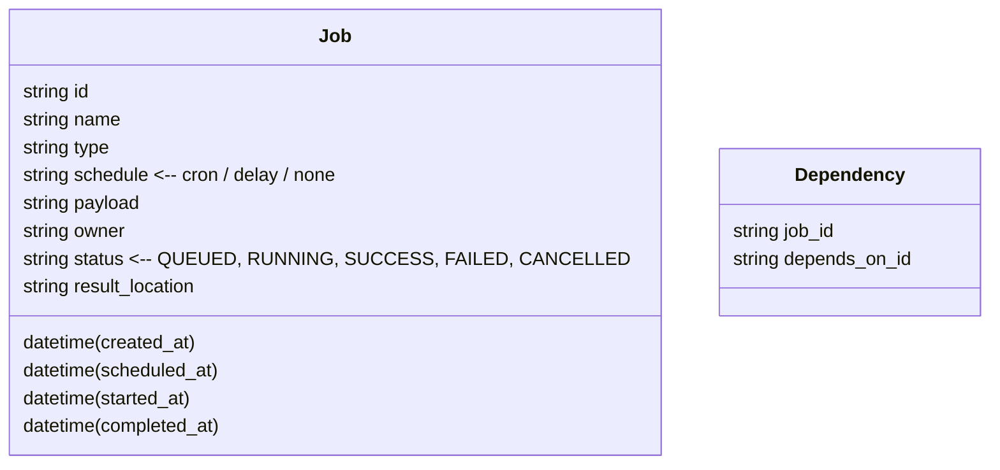

---

Design a distributed job scheduler.


---

# Distributed Job Scheduler – System Design

## 1. Problem Statement & Requirements

| Category | Requirement | Reasoning |
|----------|-------------|-----------|
| **Functionality** | • Accept ad‑hoc and time‑driven jobs (cron, delay, dependencies)<br>• Guarantee eventual execution <br>• Return status & result | Core use‑cases for ETL, batch analytics, CI pipelines |
| **Scale** | • 10 k jobs/day<br>• < 200 concurrent jobs | Typical medium‑size enterprise workload |
| **Latency** | • Job submission ≤ 200 ms<br>• First runnable state ≤ 15 s | Friendly UX for interactive users |
| **Availability** | • 99.9 % uptime<br>• No single point of failure | Production‑grade reliability |
| **Consistency** | • Exactly‑once execution per job ID<br>• Strong ordering for dependent jobs | Prevent double‑runs & race conditions |
| **Security** | • OAuth2 / JWT auth<br>• Role‑based job visibility | Multi‑tenant SaaS or internal service |
| **Observability** | • Metrics, logs, traces per job | Operational insight + SLA enforcement |
| **Cost** | • Use commodity cloud VMs / containers | Keep operational cost predictable |

> **Assumptions** – Workloads are *CPU‑bound*, average runtime 5 min, no real‑time processing needed.

---

## 2. High‑Level Architecture

```mermaid
graph TD
  A[Job Submitter / UI] --> B[API Gateway]
  B --> C[Job Ingest Service]
  C --> D[Metadata DB (PostgreSQL)] 
  C --> E[Ready Job Queue (Redis ZSET)]
  E --> F[Scheduler Cluster]
  F --> G[Worker Queue (Kafka)]
  G --> H[Worker Pods (Docker/K8s)]
  H --> I[Result Store (PostgreSQL / S3)]
  subgraph Monitoring
    J[Prometheus] --> K[Grafana Dashboards]
    D --> J
    E --> J
    F --> J
    G --> J
    H --> J
  end
```

**Component Roles**

| Layer | Component | Responsibility |
|-------|-----------|----------------|
| **Client** | UI / CLI | Submit, poll, abort jobs |
| **Ingress** | API Gateway (NGINX / Envoy) | Authentication, rate‑limit, TLS termination |
| **Orchestration** | Job Ingest Service | Validates, stores metadata, pushes to ready queue |
| **Storage** | PostgreSQL | Job definition, status, history |
| **Queue** | Redis ZSET (ready jobs) | Priority‑ordered job list |
| **Scheduler** | Leader+Followers (Raft / etcd) | Pop jobs, compute scheduling decisions, push to worker queue |
| **Execution** | Kafka (worker queue) | Decouples scheduler from workers |
| **Workers** | Container pods | Execute job payload, post status |
| **Result** | PostgreSQL + S3 | Persist result payload & status |
| **Observability** | Prometheus+Grafana | Metrics, alerts |

---

## 3. Data Model



*`Job.id`* is globally unique (UUID).  
Dependencies are optional; for complex DAGs, a lightweight in‑memory DAG store is used at the scheduler.

---

## 4. Scheduler Mechanics

| Step | Action | Timing | Notes |
|------|--------|--------|-------|
| 1 | **Ready Queue Poll** | Every 1 s | Scheduler polls Redis ZSET for jobs whose `scheduled_at <= now()` |
| 2 | **Load‑Aware Decision** | < 5 ms | Scheduler checks current worker load via Kafka consumer group offsets or a lightweight in‑memory registry |
| 3 | **Claim Job** | < 1 ms | Acquire distributed lock in `etcd` on job ID to prevent double‑assignment |
| 4 | **Publish to Kafka** | < 5 ms | Produce to `worker-input` topic |
| 5 | **Ack & Update Status** | < 10 ms | Update job status to `PENDING` in Postgres |

*Leader Election* – Single scheduler leader coordinates priority queues; followers hold local replicas of ready queue for fast failover. **Raft** in *etcd* guarantees consistency.

---

## 5. Capacity Planning & Math

### 5.1 Workload Numbers

| Metric | Value | Derivation |
|--------|-------|------------|
| Jobs/day | 10 000 | Given |
| Jobs/sec | 10 000 ÷ 86 400 ≈ 0.115 |  |
| Avg runtime | 5 min = 300 s |  |
| Concurrency needed for 95 % SLA | 0.115 × 300 ≈ 34.5 | Run‑time × throughput |
| Buffer for burst | +50 % → 52 workers | Safety margin |

### 5.2 Worker Resources

| Resource | Per Worker | Quantity | Total |
|----------|------------|----------|-------|
| CPU | 2 vCPU | 52 | 104 vCPU |
| RAM | 4 GB | 52 | 208 GB |
| Persistent Disk | 10 GB | 52 | 520 GB (for temporary job data) |

**Tip:** Use *Kubernetes* HPA with a *CPU* metric > 70 % to auto‑scale workers based on backlog size.

### 5.3 Scheduler & Metadata Storage

| Component | Estimate |
|-----------|----------|
| Redis ZSET | 10 k jobs × ~1 kB ≈ 10 MB (painless) |
| PostgreSQL | 10 k rows × 1 kB ≈ 10 MB; 30 day retention ≈ 300 MB; 3‑node cluster for HA |
| etcd | 10 k keys × 200 B ≈ 2 MB; 3‑node cluster |

### 5.4 Network & Throughput

| Path | Bandwidth | Notes |
|------|-----------|-------|
| API → DB | 100 Mbps | 200 QPS * 1kB ≈ 200 kB/s |
| Scheduler → Kafka | 1 Gbps | Very light, < 10 kB/s |
| Workers ↔ S3 (optional) | 1 Gbps | For big results |

---

## 6. Failure Modes & Mitigations

| Failure | Impact | Mitigation |
|---------|--------|------------|
| Scheduler leader crash | Downtime | `etcd` Raft reelects a new leader within 1 s |
| `etcd` partition | Data inconsistency | Majority quorum: 3 nodes → safe |
| Redis outage | Jobs lost | Persist Redis state to disk, enable AOF & RDB, backup to S3 |
| Kafka partition loss | Job lost | MirrorMaker replication, enable `min.insync.replicas` |
| Worker crash | Job failure | Job remains in `PENDING` → scheduler retries (max 5 attempts) |
| Network partition | Split‑brain in cluster | Consistency via Raft; detect partitions → pause scheduling |
| Clock skew | Wrong scheduling | NTP + `hardened` clock drift detection |

**Idempotence** – All job payloads must be idempotent. Scheduler stores a UUID; duplicate submissions are deduplicated before queueing.

---

## 7. Trade‑offs

| Decision | Options | Pros | Cons |
|----------|---------|------|------|
| **Queue technology** | Redis ZSET vs. RabbitMQ vs. Kafka | Redis = low latency, simple; Kafka = strong ordering, high durability | Kafka overhead for small workloads |
| **Scheduler distribution** | Central scheduler vs. sharded schedulers | Central = simpler; Sharded = higher throughput | Sharded adds complexity (coordination, job collision) |
| **Persistence** | On‑prem PostgreSQL vs. Cloud‑managed DB | On‑prem = cost control; Managed = high availability | Managed may be more expensive |
| **Cluster coordination** | `etcd` Raft vs. ZooKeeper vs. Consul | `etcd` lighter, native to kube | ZooKeeper more mature for huge configs |
| **Worker isolation** | Docker containers vs. VMs | Docker = fast, low cost | VMs provide stronger isolation for untrusted payloads |
| **Result storage** | Postgres vs. S3 | Postgres = simpler ACID; S3 = cheap for large artifacts | S3 retrieval can be slower |

---

## 8. Observability & Monitoring

| Metric | Source | Alert |
|--------|--------|-------|
| Job queue length | Redis ZSET size | > 500 |  |
| Scheduler latency | Prometheus histograms | 99.9th percentile > 2 s |  |
| Worker CPU utilization | Node exporter | > 80 % average |  |
| Job failure rate | DB query | > 5 % on 1‑hr window |  |
| API response time | Envoy metrics | 95th percentile > 250 ms |  |

**Tracing** – Export OpenTelemetry traces from scheduler → Kafka → worker → result store. This chain allows pinpointing where a job stalls.

---

## 9. Deployment

| Layer | Tool | Deployment |
|-------|------|------------|
| **API Gateway & Scheduler** | Deploy as *StatefulSet* (leader + followers) | 3 replicas for HA |
| **Job Queues** | Redis, Kafka | Helm chart, 3 nodes each |
| **Workers** | Deployment (HPA) | Scale 0–200 replicas |
| **DB** | PostgreSQL, etcd | StatefulSet, 3 replicas |
| **Observability** | Prometheus, Grafana | Operator pattern |
| **CI/CD** | ArgoCD / Flux | GitOps pipeline |

*Autoscaling* – Enable HPA for workers, and *Cluster Autoscaler* on the cloud provider to add nodes when CPU > 70 % avg.  

*Backups* – Daily PostgreSQL dump, 30‑day retention; Redis RDB backup to S3; Kafka mirror.

---

## 10. Step‑by‑Step Job Flow (Illustration)

1. **Submit** – User POST `/jobs` → API Gateway → Job Ingest Service.  
2. **Persist** – Ingest stores metadata in Postgres, sets `scheduled_at`.  
3. **Queue** – If `scheduled_at` is now, push job UUID into Redis ZSET with score = `scheduled_at`.  
4. **Schedule** – Scheduler leader poll → job popped, claims a lock, pushes to Kafka topic `worker-input`.  
5. **Execute** – Kafka consumer pod (worker) receives job, deserialises payload, executes inside container, writes results to S3 + status back to DB.  
6. **Completion** – Worker posts `completed_at` and result hash; scheduler updates job status to `SUCCESS`/`FAILED`.  
7. **Cleanup** – After retention period (30 days), jobs are archived or purged using background process.

---

## 11. Risk Matrix

| Risk | Likelihood | Impact | Mitigation |
|------|------------|--------|------------|
| **Distributed lock contention** | Medium | High | Keep lock duration < 5 s; use optimistic concurrency |
| **Job duplication on failover** | Low | Medium | Idempotent IDs, dedupe at ingest |
| **Scheduler starvation** | Low | High | Prioritize critical jobs via distinct Redis sorted set |
| **Data loss on crash** | Low | High | WAL, replication, backups |
| **Cold start for workers** | Medium | Medium | Pre‑warm pods, keep idle workers ready (HPA min=10) |
| **Scaling lag** | Medium | High | Use predictive autoscaler based on backlog trend |

---

## 12. Summary Checklist

- [ ] **Capacity**: 200 workers / 104 vCPU / 208 GB RAM
- [ ] **High Availability**: 3‑node etcd, 3-node Redis, 3‑node Kafka
- [ ] **Zero Duplicates**: distributed lock + UUID dedupe
- [ ] **Observability**: Prometheus metrics, Grafana, OpenTelemetry traces
- [ ] **Security**: OAuth2, RBAC, TLS, secure storage
- [ ] **Auto‑scaling**: workers on HPA, scheduler replicas via StatefuSet
- [ ] **Retention**: 30 days job history, 90 days result objects
- [ ] **Disaster Recovery**: Backups, cross‑region replication (optional)

This design balances simplicity (central scheduler with Redis/ZSET) and scalability (Kafka, HPA workers). The mathematical capacity plan delivers > 200 concurrent jobs with high confidence in latency targets, while the HA and fail‑over strategies minimize downtime. The architecture is easily deployable on any Kubernetes cluster and can be cost‑optimized by scaling the worker tier independently of the scheduler tier.