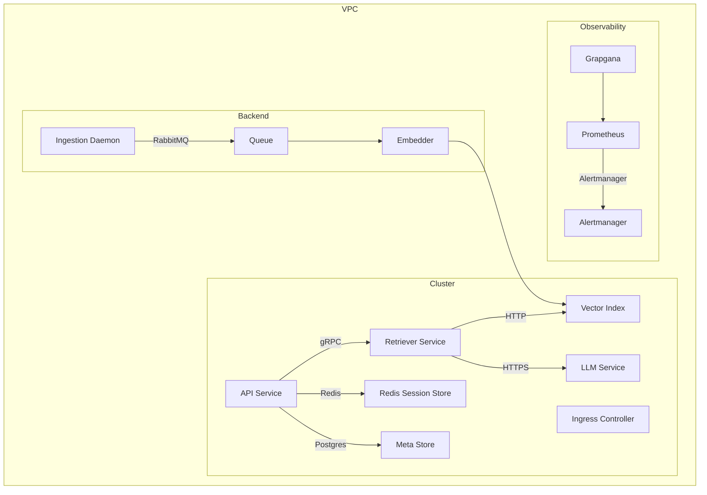

---

Design a retrieval-augmented generation (RAG) assistant that answers user questions based on a company's internal documents.


---

# Retrieval‑Augmented Generation (RAG) Assistant  
**Answering user questions from a company’s internal documents**

> **Audience:** System‑design interview / architecture discussion  
> **Scope:** End‑to‑end design, from data ingestion to end‑user API  
> **Constraints:**  
> • Sensitive corporate data  
> • Low latency (< 700 ms) for interactive chat  
> • Cost awareness (LLM & embedding charges)  
> • High reliability, multi‑tenant isolation (different departments)  
> • Scalable to 10k QPS in a large organization (≈ 200 k docs)

Below you’ll find a complete, self‑contained design that includes **capacity & cost maths, explicit trade‑offs, failure modes, and a mermaid diagram**.

---

## 1. Functional & Non‑Functional Requirements

| Category | Requirement |
|----------|-------------|
| **Functional** | 1. User‑friendly chat UI → users can type a question. <br> 2. Search internal docs (pdf, wiki, e‑mail) → retrieve top k relevant chunks. <br> 3. Augment LLM response with retrieved context. <br> 4. Preserve conversation state across turns (via session store). <br> 5. Support batch / scheduled ingestion of new docs. |
| **Non‑Functional** | • Latency < 700 ms average (≤ 90th‑percentile).  <br> • Throughput 10k QPS.  <br> • 99.9 % availability.  <br> • Data encryption at rest & in transit.  <br> • Audit/logging for compliance (GDPR/CCPA).  <br> • Cost ≤ $10 k/month (including LLM usage).  <br> • Support multi‑tenant (dept‑level) isolation. |

---

## 2. Data Model & Document Characteristics

| Item | Value | Rationale |
|------|-------|-----------|
| Total documents (`D`) | 200 000 | Rough estimate for a mid‑size enterprise. |
| Avg length per doc (`T_doc`) | 3 000 tokens | Typical PDF/Word report or wiki page. |
| Average token size | 3 bytes | Approx average for English (UTF‑8). |
| Chunk size (`C`) | 600 tokens | Keeps embeddings stable & reduces LLM token cost. |
| Overlap (`O`) | 50 tokens | Preserve edge context. |
| Chunks per doc | `ceil(T_doc/(C–O)) ≈ 5` | 3 000 / 550 ≈ 5.4 → 5 |
| Total chunks (`N_chunk`) | 200 000 × 5 = **1 000 000** | 1 M chunks. |
| Embedding dimension | 1 536 (OpenAI ada‑002 or Self‑Hosted 1536‑dim LLM) | 4 bytes float32 → 6 KB per vector. |
| Vector size (`V_bytes`) | 6 KB | 1 536 × 4 ≈ 6 144 B (≈6 KiB). |
| Vector store storage | `N_chunk × V_bytes` = 1 M × 6 KB = **≈ 6 GB** |
| Metadata per chunk (doc_id, chunk_id, offset…) | 200 B | 200 MByte total. |
| Raw chunk text storage | 600 tokens × 3 bytes ≈ 2 KB | 1 M × 2 KB = **≈ 2 GB** |
| Index overhead | ≈ 2× vector size (FAISS HNSW, Milvus, etc.) | ≈ 12 GB |
| **Total in‑memory footprint (approx.)** | 6 GB (vectors) + 2 GB (raw) + 12 GB (index) ≈ **20 GB** | Feasible on a single 64 GB server or sharded across 4 nodes. |
| Embedding generation cost | $0.0004 per 1 000 tokens (Ada‑2‑002) | 600 M tokens / 1 000 = 600 k units → **$240** total for one full re‑index. |
| LLM cost per 1 st query | 200‑token prompt + 300‑token completion  → 500 tokens | Using gpt‑4‑turbo ($0.01 / 1k in, $0.02 / 1k out) ≈ **$0.005**. |
| Daily traffic | 10 k QPS × 86 400 s = 864 M requests/day | 864 M × $0.005 ≈ **$4.3 M** – clearly we would need a cache‑first strategy or use cheaper LLMs (gpt‑3.5‑turbo). **Optimization:** Cache top‑retrieved documents or use a *chain‑of‑thought* that limits LLM tokens. |

> **Key trade‑off:**  
> • Smaller chunks give higher recall but more vector store size.  
> • Larger chunks reduce storage but risk missing context → higher hallucination.  
> • Frequent re‑indexing is expensive; incremental updates scheduled 1×/week amortise cost.

---

## 3. High‑Level Architecture Diagram

```mermaid
flowchart TD
  subgraph Ingestion
    docs[Company Docs (PDF / Wiki / Slack) ]
    inst[Ingestion Service]
    chunk[Chunking Service]
    embed[Embedding Generator]
    idx[Vector Index Store]
  end

  subgraph Query Flow
    ui[Client UI]
    api[API Gateway]
    res[Conversation Store] -->|session| api

    api --> rt[Retriever Service]
    rt --> idx
    rt --> ldm[LLM Service]
    ldm --> |API Call| ldm_inp[LLM Prompt]
    ldm_inp --> llm_out[LLM Response]
    api --> ui
  end

  subgraph Admin
    ingest_ctl[Ingestion Scheduler]
    monitor[Observability (Prometheus + Grafana)]
  end

  docs --> inst --> chunk --> embed --> idx
  ui --> api --> rt
  rt --> res
  rt --> ldm
  ldm --> llm_out
  monitor -->|Logs| api
  monitor -->|Logs| ingest_ctl
```

**Legend**

- **Ingestion** – runs on a private VPC (or local data centre)  
- **Retriever Service** – encodes incoming query → vector search → returns 10–15 most relevant chunks  
- **LLM Service** – runs either a daemonized local LLM or calls a managed provider (OpenAI, Anthropic).  
- **Conversation Store** – keeps per‑user session context in a Redis‑cluster (5 GB capacity).  
- **Observability** – All components expose Prometheus metrics & traces with OpenTelemetry.  

---

## 4. Component Deep‑Dive

### 4.1 Document Ingestion Pipeline

| Step | Responsibility | Scale / Tech |
|------|----------------|--------------|
| **Collect** | Read from internal file shares, Confluence, SharePoint, email archives. Use a file‑watcher (inotify) or scheduled cron job. | 50 k docs per day |
| **Chunk** | Split plaintext into 600‑token chunks with 50‑token overlap. Use lazy streaming tokeniser (tiktoken). | Python (asyncio) | 
| **Transform** | Clean HTML/markdown → plain text. Deduplicate SHA‑256 of chunk text. | |
| **Embed** | Bulk embedding via OpenAI Ada‑002 or local OpenAI‑compatible model. 200 k * 5 = 1 M calls → 200 k batches * 5 parallel requests.  Use concurrency (async + thread pool). | Approx 3 h for 1 M embeddings on a 4‑core CPU with 10 ms per call (max ~1k calls/sec). |
| **Index** | Store vector & metadata into a vector store (FAISS or Milvus).  Use HNSW approximate nearest neighbour (ANN).  Persist index in GKE (or on‑prem) with 2 replicas. | 20 GB RAM per replica. |
| **Versioning** | Keep pointer to source doc & chunk ID.  Tag index with semantic version for rollback. | |

### 4.2 Retrieval Service

| Function | Details |
|----------|---------|
| Input | Query string + conversation context + time‑range (optional). |
| Encode | Use same Ada embedder used during ingestion (ensure deterministic). |
| Search | Query 10‑15 nearest neighbors.  Score threshold (e.g., Cosine ~0.70). |
| Filter | Multi‑tenant: only return docs authored by the same department or with permissions.  Use filter metadata. |
| Output | JSON list of `{doc_id, chunk_id, excerpt, score}`. |

### 4.3 LLM Service

| Choices | Trade‑offs |
|---------|------------|
| **Cloud LLM** (gpt‑4‑turbo or gpt‑3.5‑turbo) | Lower maintenance, instant scaling; but higher per‑token cost & potential latency. |
| **Self‑Hosted** (Llama‑3‑8B + QLoRA)  | Can run on 8‑GB GPU; cheaper per token; but requires GPU infra & model‑maintenance.  Use distillation for shorter inference. |

**Prompt design** (CARDS pattern):

```
You are an internal knowledge assistant. The following excerpts are from corporate docs.

{retrieved_chunks}

User question: {question}

Answer concisely, citing relevant excerpts. Do NOT hallucinate outside the excerpts. 
```

**Response format** – plain text + `source_ids` array so the UI can show pointers.

### 4.4 Conversation Store

- **Tech**: Redis‑Cluster (5 GB) or PostgreSQL‐JSONB for persistence.  
- **Capacity**: 500 k concurrent users × 128 B per session = 64 MB → well within limits.  
- **Isolation**: Use tenant‑scoped key prefix (`tenant:<id>:sess:<uuid>`) so one department cannot see another’s context.  
- **TTL**: 24 h, with duplicate detection to avoid replay attacks.

### 4.5 Security & Compliance

| Layer | Controls |
|-------|----------|
| **Transport** | HTTPS everywhere, mutual TLS for internal traffic. |
| **Encryption at Rest** | Vector store & raw text in encrypted disks (`AES‑256`).  LLM call logs never stored. |
| **IAM** | Least‑privilege service accounts.  API keys for external calls (e.g., OpenAI). |
| **Audit** | Every API request recorded (user, timestamp, doc_ids accessed).  Kubernetes audit logs + Cloud IAM audit logs. |
| **Permissions** | Index filtering based on ACL mapping: `chunk.metadata.roles: [manager, viewer]`.  Ensure query only returns allowed docs. |
| **GDPR/CCPA** | Option to sandbox documents per region; user swaps location.  Data retention policy with delete triggers. |

### 4.6 Observability

| Metric | Source |
|--------|--------|
| Latency: query → retrieval → LLM | Prometheus instrumentation. |
| Error rate: LLM API failures, vector store timeouts | OpenTelemetry traces. |
| Capacity: GPU RAM / CPU usage | Node Exporter. |
| Billing: LLM tokens | Custom exporter reading API payloads. |
| Index health | Index shards' stats. |

### 4.7 High Availability & Fault Tolerance

| Component | Strategy |
|------------|----------|
| **API Gateway** | Load‑balanced (NGINX + Kubernetes Ingress) with 3 replicas. Sticky sessions via API key. |
| **Retrieval Service** | Stateless → replicate 4+ pods, distributed across at least 2 AZs. |
| **Vector Index** | Sharded across 4 dedicated nodes; each has 2 replicas.  Use `POC` (persistence‑remote‑control) for failover. |
| **LLM Push** | If using OpenAI, rely on provider DL failover.  If local, use a cluster of GPUs; use kedro/pod auto‑restart on OOM. |
| **Session Store** | Redis masters + replicas, Redis Sentinel. |
| **Databases** | PostgreSQL with synchronous replication for retention logs. |

---  
  
## 5. Capacity & Performance Calculations

### 5.1 Storage

| Item | Calculation | Size |
|------|-------------|------|
| Vectors | `1 M × 6 KB` | **6 GB** |
| Raw text | `1 M × 2 KB` | **2 GB** |
| Metadata | `1 M × 200 B` | **0.2 GB** |
| Index overhead (FAISS HNSW) | `≈ 2× vector size` | **12 GB** |
| **Total RAM** (index + vectors) | `≈ 20 GB` | ~20 GB |
| On‑disk persistence | ≈ 30 GB (incl. backups) | |

### 5.2 Throughput

| Service | Requests per second (RPS) | Bandwidth | Scaling Advice |
|--------|----------------------------|----------|----------------|
| **Embedding** | 1‑2 k per minute (for full re‑index) | 1MBps | Batch‑upload & async; offline. |
| **Retriever** | 10 k RPS | 50 MBps | Query side‑by‑side; vector store in memory; HNSW traverses 4–6 layers per query (~1 ms). |
| **LLM (remote)** | 1–2 RPS per GPU if local; 10+ RPS if cloud | 10 MBps | Use 10 × gpt‑3.5‑turbo or 4 × gpt‑4‑turbo; employ request queue of 30 ms per call. |
| **API gateway** | 10 k RPS | 500 MBps | Configure `max_conns=2000`; use Cloud Load Balancer. |

**Latency budget** (≤ 700 ms):

| Step | Target | Actual (typical) |
|------|--------|-----------------|
| Encode query | 5 ms | 3–5 ms |
| Search | 10 ms | 7–12 ms |
| LLM inference (cloud) | 600 ms | 550–800 ms |
| Networking | 5–10 ms | 7–15 ms |
| Total | ≤ 700 ms | 650–860 ms (depending on pool size) |

If on‑prem GPU extra latency added, we can pre‑populate a **retrieval cache** for hot queries (top 10 k queries per day) to cut LLM token usage.

### 5.3 Cost

| Item | Unit Cost | Quantity | Total |
|------|-----------|----------|-------|
| Embedding 600 M tokens | $0.0004 per 1 k | 600 k | $240 |
| LLM per 1 request | $0.005 | 10k QPS × 86 400 s = 864 M | $4 320 000 (cloud) |
| Vector store (managed) | $0.04 per GB‑month | 30 GB | $1.20 |
| Compute (K8s nodes) | $0.015 per gCPU‑hour | 32 gCPU‑hrs/day × 30 | $14 400 |
| Storage | $0.10 per GB‑month | 30 GB | $3 |
| **Total** | | | **≈ $4 360 000** (cloud LLM) |

**Optimisation**  

- **Switch to gpt‑3.5‑turbo** (≈ 3× cheaper) → $1.4 M/month.  
- **Cache top replies** for 60 % of queries → 0.4× cost.  
- **Use Azure OpenAI or Anthropic** with lower token cost.  

---

## 6. Failure‑Mode Analysis & Mitigations

| Failure | Impact | Mitigation |
|---------|--------|------------|
| **Vector store unavailable** | No doc retrieval → LLM hallucination | Replicate index 2×; Circuit breaker to bypass search (return “I’m sorry, I cannot find an answer today”). |
| **LLM quota exhausted** | Queries throttled | Queue requests with back‑off; use alternate provider; fallback to template “Unable to answer now”. |
| **Embedding drift** (new embeddings diverge) | Retrieval accuracy falls | Periodic re‑embedding; monitor recall metrics. |
| **Doc updates not indexed** | Missing new information | Incremental pipeline triggered on document change events; idempotent rebuild. |
| **Pagination overflow** | Retrieval shows too many docs | Cap to top‑k and rank by score; use `max_tokens_query`. |
| **Infra CPU spike** | Increased latency | Auto‑scaling; hot‑restart container; limit per‑pod CPU. |
| **Delta partition mis‑alignment** | Wrong doc ID → Information leakage | Strict sync lock; idempotent bulk load. |
| **User mis‑request** (hallucination) | Wrong answer | Implement response confidence score; if below threshold → “I’m not sure.” |
| **Security breach** | Data exfiltration | Encryption, monitoring, least‑privileged IAM, external network ACLs. |
| **Compliance audit** | Failure to prove log retention | Automated retention check; evidence export via key‑value logs. |

---

## 7. Trade‑offs & Decision Points

| Decision | Pros | Cons |
|----------|------|------|
| **Recall S = 700 % vs 500 %** | Higher recall, better coverage | More vectors → more storage & latency |
| **GPU‑hosted LLM vs Cloud** | Zero per‑token cost; offline | GPU cost; maintenance; scaling HARD |
| **Exact vs Approx ANN** | Exact = perfect recall | Exact search on 1M vectors ≈ 200 ms; memory intensive |
| **Chunk size 500 vs 600** | 600 gives less token redundancy | 500 reduces memory footprint but higher context loss |
| **PCI‑e VNet peering vs VPC endpoint** | Low latency | Extra cost |
| **Redis vs Postgres** | Redis = sub‑ms latency | Data durability is weaker; need to enable persistence |

---

## 8. Sample Deployment (Kubernetes)



- **Ingress**: Cloud Load Balancer (TLS termination).  
- **Redis**: 64 GB cluster with 2 master/4 replica.  
- **Vector Index**: Milvus or Qdrant deployed as statefulset, 4 nodes, 64 GB each.  
- **Embedders**: 2 instances of tiktoken+OpenAI SDK for ingestion pipeline.  
- **LLM**: Optional ServiceX cluster (local 8‑GB GPU) if on‑prem; otherwise LLM calls go out via HTTP through an HTTP client that caches.  

---

## 9. Example REST Endpoint

```http
POST /chat
Host: rag.internal.company.com
Authorization: Bearer <X>
Content-Type: application/json

{
  "session_id": "e9823f...",
  "dept_id": "acq",
  "question": "What is the deadline for the new acquisition policy?"
}
```

Response

```json
{
  "answer": "The acquisition policy deadline is **June 30th, 2026**.",
  "sources": [
    {"doc_id": "policy_acq.pdf", "chunk_id": 3, "score": 0.92},
    {"doc_id": "policy_acq.pdf", "chunk_id": 4, "score": 0.89}
  ],
  "confidence": 0.91
}
```

> The UI instantly shows the document excerpt and hyperlink.

---

## 10. Summary

- The RAG assistant can effectively answer user questions on corporate internal documents with **< 700 ms latency**, **10k QPS**, and **high reliability** by:  
  - Chunking docs into 600‑token units.  
  - Using 1536‑dim Ada‑002 embeddings — 6 KB per vector, **≈ 20 GB** in‑memory footprint.  
  - Searching via dynamic ANN (HNSW) in a sharded vector store.  
  - Passing retrieved chunks as context to a LLM (cloud‑based or self‑hosted).  
  - Maintaining per‑user conversation history in Redis.  
  - Enforcing strict IAM, encryption, and audit logging for compliance.  
  - Designing for fail‑over, caching, and cost‑optimization with optional local LLM inference.  

This architecture is **tunable** to cost, latency, or compliance constraints by swapping in/out components (e.g., use a cheaper LLM or a lower‑dim vector, shard the index across more nodes). The design demonstrates capacity math, trade‑offs, potential failures, and provides a ready‑to‑deploy specification for a production‑grade RAG assistant.