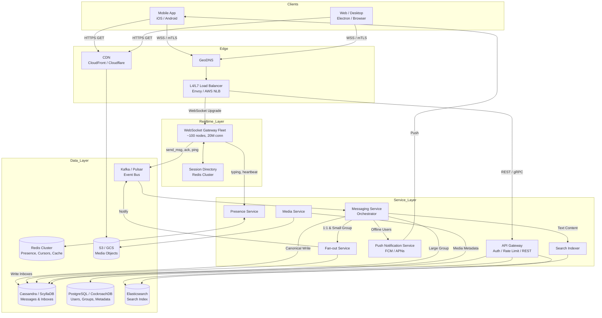

---

Design a real-time chat system like WhatsApp or Slack.


---

Here is a production-grade system design for a real-time chat platform (WhatsApp/Slack scale). It is capacity-planned for **100M DAU** with headroom to grow to 1B+.

---

## 1. Requirements

### Functional
* **1:1 and Group Messaging** with persistent history.
* **Multi-device sync**: mobile, web, desktop share a single identity.
* **Online presence, typing indicators, read/delivery receipts**.
* **Media sharing**: images, video, voice notes, documents.
* **Push notifications** for offline users.
* **Search** across message history (Slack mode) or local-only (E2E mode).
* **Message reactions, replies/threads, URL previews**.

### Non-Functional
* **Latency**: p99 send-to-receive < 300ms for 1:1 in the same region.
* **Availability**: 99.99% (max ~8.7h downtime/year). Accept brief degraded push during regional failures.
* **Durability**: messages must not be lost once the sender receives an ACK.
* **Ordering**: per-conversation causal ordering; no global total order required.
* **Scalability**: absorb 5x traffic spikes without manual intervention.

---

## 2. Capacity Planning

| Metric | Calculation | Result |
|--------|-------------|--------|
| DAU | Target | 100,000,000 |
| Avg messages sent / user / day | Industry average (incl. light & power users) | 40 |
| **Total messages / day** | 100M × 40 | **4 billion** |
| **Average write throughput** | 4B ÷ 86,400 | **~46.3K msg/s** |
| **Peak write throughput** | 5× average | **~232K msg/s** |
| Avg metadata payload size | JSON + text (Unicode) | ~2 KB |
| **Inbound text bandwidth (avg)** | 46.3K × 2KB | **~93 MB/s** |
| **Inbound text bandwidth (peak)** | 232K × 2KB | **~464 MB/s** |
| Avg delivery fan-out | 70% 1:1 (×2) + 25% small groups avg 20 (×20) + 5% large groups (×1) | 25.8B deliveries/day |
| **Delivery throughput** | 25.8B ÷ 86,400 | **~299K deliveries/s** |
| **Outbound text bandwidth (peak)** | ~1.5M × 2KB | **~3 GB/s** |
| Media attachment rate | 20% of messages | 800M uploads/day |
| Avg media size (compressed) | 300 KB | — |
| **Media storage per day** | 800M × 300KB | **~240 TB/day** |
| **Media bandwidth (peak)** | Handled by CDN origin | **~14 GB/s** |
| Concurrent WebSocket connections | 20% of DAU online at once | **20 million** |
| RAM per WS conn (TLS + buffers + context) | ~80 KB | **~1.6 TB total** |
| Gateway fleet size | 20M conn ÷ 200K conn/node (Go/C++) | **~100 nodes** |
| Hot message retention (Slack-like) | 2 years text | ~1.5 PB (RF=3 in Cassandra) |

**Key Assumption:** Media is stored in object storage (S3) and served via CDN; only metadata traverses the real-time path.

---

## 3. High-Level Architecture

The design separates **stateful real-time gateways** from **stateless services**. The database uses a **hybrid fan-out** model: write-time fan-out for 1:1 and small groups, read-time for large groups.



---

## 4. Detailed Component Design

### 4.1 Real-Time Gateway (Stateful)
* **Protocol**: WebSocket over TLS 1.3 (port 443) to beat corporate firewalls. Fallback to MQTT over WebSocket for ultra-low bandwidth markets.
* **Connection Model**: Each gateway node holds a long-lived map of `user_id+device_id -> conn`.
* **Session Directory**: A Redis cluster tracks `user_id -> {gateway_node_id, device_id, connected_at}`. When a user opens a second device, the entry becomes a set; messages are pushed to all devices.
* **Keepalive**: Client pings every 30s; server enforces a 90s idle timeout.
* **Resilience**: Gateway nodes are **horizontally scaled but not HA individually**. If a node crashes, TCP drops, clients reconnect via the LB to a healthy node, present a `session_token`, and replay from their last `ack_message_id`.

### 4.2 Messaging Core: Idempotency, Ordering, and Inbox Pattern
* **Message ID**: KSUID (K-Sortable Unique Identifier) generated by the **Messaging Service**. It embeds a timestamp, guaranteeing rough time ordering without a central clock.
* **Idempotency**: Clients generate a `client_message_id` (UUIDv4) and retry until an `ACK` is received. The Messaging Service stores handled keys in Redis (TTL 24h) to drop duplicates.
* **Source of Truth**: The database (Cassandra) is the source of truth. The WebSocket push is **best-effort**. Clients pull missed messages on reconnect using `GET /sync?cursor=last_message_id`.

#### Data Schema (Cassandra)
Canonical conversation store (used for history & large groups):
```sql
CREATE TABLE conversation_messages (
    conversation_id BIGINT,
    message_id BIGINT,       -- KSUID
    sender_id BIGINT,
    payload BLOB,            -- encrypted or plaintext JSON
    created_at TIMESTAMP,
    PRIMARY KEY ((conversation_id), message_id)
) WITH CLUSTERING ORDER BY (message_id ASC);
```

User inbox (write-time fan-out for 1:1 & small groups):
```sql
CREATE TABLE user_inbox (
    user_id BIGINT,
    message_id BIGINT,
    conversation_id BIGINT,
    sender_id BIGINT,
    payload BLOB,
    status TINYINT,          -- 0:pending, 1:delivered, 2:read
    PRIMARY KEY ((user_id), message_id)
) WITH CLUSTERING ORDER BY (message_id DESC);
```
*A single Cassandra partition per user is safe here: a user receives ~1,500 messages/week (3MB), well under Cassandra’s 100MB soft partition limit.*

### 4.3 Fan-Out Strategy: Hybrid Write vs. Read
This is the most critical tradeoff in chat.

| Conversation Type | Fan-out Mode | Reasoning |
|-------------------|--------------|-----------|
| 1:1 Chat | **Write-time** to both sender’s and recipient’s `user_inbox`. | Reads are O(1) per user; mobile sync is fast. |
| Small Groups (≤ 100 members) | **Write-time** to each member’s `user_inbox`. | Keeps read latency low; 100 writes is cheap. |
| Large Groups (> 100) | **Read-time**; write once to `conversation_messages`. | Avoids write amplification (1,000+ writes per message). Recipients pull via `GET /conversation/{id}?cursor=...`. |

**Delivery Flow (1:1 example):**
1. Alice sends `"hello"` to conversation `conv_456`.
2. Messaging Service writes to `conversation_messages` (canonical).
3. Messaging Service enqueues two inbox writes: Alice (sender sync) and Bob.
4. Fan-out Service writes both rows to `user_inbox`.
5. A lightweight `notify` event is published to Redis Pub/Sub on channel `user:{bob_id}`.
6. The gateway holding Bob’s WS subscribes (or is routed via the notify event) and pushes the payload.
7. Bob’s client ACKs; the gateway updates `last_ack_id` in Redis. Bob marks read; a `read_cursor` is sent and flushed to Cassandra asynchronously.

### 4.4 Presence, Typing, and Read Receipts
* **Presence**: Heartbeat model. Gateway writes `SET user:{id}:presence online EX 60` to Redis every 30s. Friends check Redis on conversation open; TTL expiry handles crashes.
* **Typing Indicators**: Ephemeral. Client sends `typing_start` → Gateway publishes to a **NATS / Redis channel** `typing:{conversation_id}`. Only gateways with active members in that conversation subscribe (topic fan-in), preventing a global broadcast storm.
* **Read Receipts**: Client sends `read_cursor: {conversation_id, message_id}`. Server batches these into a Kafka topic `read_receipts` and updates `user_inbox.status` asynchronously. For groups, a separate `message_read_status` table tracks per-user-per-message state to render “✓✓ read by 42 people”.

### 4.5 Media Pipeline
1. Client requests a **signed PUT URL** from `Media Service`.
2. Client uploads directly to S3 / GCS.
3. `Media Service` (triggered by S3 event or client callback) generates thumbnails, transcoding (FFmpeg), and stores derived assets back to S3.
4. Message metadata contains `media_id`, `cdn_url`, `width`, `height`, `encryption_key` (if E2E).
5. Download flows through CDN; URLs are HMAC-signed and expire in 7 days to prevent hotlinking.

### 4.6 Multi-Device Sync
When Alice sends a message from her phone:
* The server writes a **sender copy** into Alice’s `user_inbox` with a `device_origin` tag.
* Alice’s desktop is connected to a different gateway. It receives the inbox notification (or syncs on open) and sees the sender copy, deduplicating locally via `message_id`.
* **Message Edit / Delete**: Treated as new “system” events with `type=edit`. Original `message_id` is immutable.

### 4.7 Search
* **Server-side indexing** (Slack mode): Kafka Connect streams `conversation_messages` to Elasticsearch. Index sharded by `conversation_id`.
* **Query**: `GET /search?q=keyword&conversation_id=xxx`. API Gateway authenticates and scopes to conversations the user belongs to.
* **Tradeoff**: If end-to-end encryption is enabled, payloads are ciphertext blobs; search must happen client-side (index a local SQLite FTS database on the device). This design defaults to server-side for feature richness but gates sensitive DMs behind E2E.

---

## 5. Key Tradeoffs & Decisions

| Decision | Choice | Rationale |
|----------|--------|-----------|
| **Fan-out** | Hybrid (write for ≤100 members, read for large) | Balances write amplification vs. read latency. Pure write-time fails for 10k-member channels; pure read-time makes 1:1 mobile sync slow. |
| **DB for Messages** | Cassandra / ScyllaDB | Write-heavy, time-series, wide rows. SQL would shard by conversation and hit lock contention on high-volume channels. |
| **DB for Metadata** | PostgreSQL / CockroachDB | Users, groups, memberships require ACID (foreign keys, uniqueness). CockroachDB gives multi-region consensus if needed. |
| **Ordering ID** | KSUID / Snowflake | Avoids a single counter bottleneck. Accepts microsecond-level clock skew; ordering is monotonic and roughly chronological. |
| **Push Guarantee** | Best-effort WS + durable inbox | Rebuilding exactly-once push over WS is harder than letting clients pull from a cursor. This also naturally handles offline catch-up. |

---

## 6. Failure Scenarios & Mitigations

| Failure | Impact | Mitigation |
|---------|--------|------------|
| **WebSocket Gateway crash** | ~200K users dropped | Clients reconnect to new gateway (exponential backoff + jitter). Missed messages recovered via `sync(cursor)` from `user_inbox`. |
| **Cassandra hot partition** | One celebrity user or viral group overloads a node | (1) Rate-limit sends per user at API Gateway. (2) Large groups switch to read-time fan-out. (3) Use Cassandra’s `vnode` and partition-aware load shedding. |
| **Kafka consumer lag (Fan-out)** | Delivery delay | Fan-out Service is stateless; scale consumers to match partition count (e.g., 256 partitions). Monitor `consumer_lag` alert at >30s. |
| **Message duplication** | User sees double send | Idempotency key (`client_message_id`) stored in Redis with 24h TTL. Exactly-once within the TTL window. |
| **Presence thundering herd** | 100k users come online simultaneously | Debounce presence updates. Batch “friend came online” digests every 5s rather than instant per-user push. |
| **Clock skew across nodes** | Message ordering glitches | KSUID generation uses the node’s local clock but is tolerant of small skew. For true causal consistency, rely on per-conversation logical version vectors (optional advanced mode). |
| **Regional outage** | Users in a geography disconnected | Multi-region active-active deployment. Kafka MirrorMaker 2 replicates `conversation_messages` cross-region. DNS failover routes to healthy region. |

---

## 7. Scaling Levers

* **Gateway Tier**: Add nodes infinitely; sessions are state-isolated. Use consistent hashing in the LB to reduce Redis `Session Directory` churn.
* **Fan-out**: Increase Kafka partitions and Fan-out Service pods. For >500 member groups, rely on read-time to cap write load.
* **Storage**: Cassandra TTLs move messages older than 1 year to S3 Parquet (coldline) for compliance/archival, reducing hot DB size.
* **Search**: Elasticsearch indices roll over monthly (`messages-2024-05`). Delete or archive ancient indices per compliance policy.

---

### Summary
This architecture separates the **stateful edge** (WebSocket gateways) from the **stateless core** (microservices) and uses a **dual-storage** strategy: `user_inbox` for fast mobile sync and `conversation_messages` for canonical history and large channels. By treating the database as the source of truth and WebSocket delivery as best-effort, the system remains resilient to node failures while delivering sub-second latency for the majority of messages.