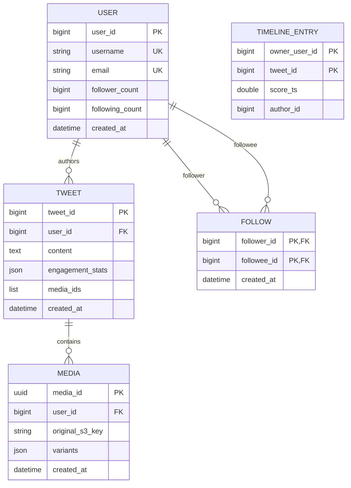

---

Design a microblogging platform like Twitter.


---

Here is a thorough system design for a global-scale microblogging platform.

---

## 1. Requirements & Constraints

### Functional
* **Post Tweet:** Text (up to 2,800 chars with metadata), optional media (image/video), geo-tag.
* **Timeline:** Home timeline (merge of followees), User timeline (self/profile), Public timeline (trending).
* **Social Graph:** Follow, unfollow, mute, block.
* **Engagement:** Like, reply, retweet, view counts.
* **Search:** Full-text search, hashtag indexing, user search.
* **Notifications:** Push, email, in-app.
* **Media:** Upload, transcoding, adaptive bitrate streaming for video.

### Non-Functional
* **Availability:** 99.99% (max ~52 min downtime/year). Timelines can be eventually consistent; user auth & tweet posting must be strongly consistent.
* **Latency:** p99 timeline load `< 200 ms`; tweet post `< 500 ms` (async fanout).
* **Durability:** Zero loss for committed tweets; media backed by 11 9’s object storage.
* **Scale:** Target Twitter-class scale.

---

## 2. Capacity Planning (Real Numbers)

| Metric | Assumption | Daily Volume | Per-Second (avg) | Per-Second (peak 3×) |
|---|---|---|---|---|
| **DAU** | 200 million | — | — | — |
| **New Tweets** | 500M / day | 500M | 5,800 | 17,400 |
| **Media Uploads** | 20% of tweets, avg 2 MB stored | 100M objects / 200 TB | 2,300 | 7,000 |
| **Home Timeline Reads** | 100 reads / DAU | 20B API calls | 231,000 | 700,000 |
| **Timeline Scrolls** | 500 scrolls / DAU | 100B | 1.16M | 3.5M |
| **Social Writes** | 5 follows / DAU | 1B | 11,600 | 35,000 |

### Storage Math
* **Tweet Metadata** (avg 2 KB): `500M × 2 KB = 1 TB / day`. Over 5 years with compaction ≈ **1.5 PB** live.
* **Timeline Inboxes** (denormalized): 200M DAU × top 1,000 entries × 100 bytes = **20 TB** in hot Redis.
* **Media Object Store**: `100M objects × 2 MB = 200 TB / day`. 90-day hot tier, then Glacier/cold. Live hot CDN origin ≈ **60 PB** after dedupe & compression.
* **Search Index**: Inverted index at ~30% of original text size. ≈ **300 TB**.

### Bandwidth
* **Ingress** (API + media): ~`600 MB/s` average, peak ~`2 GB/s`.
* **Egress** (API JSON): 20B timeline loads × 20 KB payload = 400 TB/day = **~5 GB/s** origin. Media served from CDN (not origin).
* **Fanout Writes**: Hybrid model (see §4). Assume 90% of tweets are “normal” with avg 100 followers.  
  `450M tweets × 100 = 45B inbox writes / day` = **~520,000 Redis ZADD/sec** across the cluster.

---

## 3. High-Level Architecture

```mermaid
graph TB
    A[Clients<br/>iOS / Android / Web] -->|HTTPS / HTTP2| B(Global Anycast LB / DNS)
    B --> C[CDN / Edge<br/>Media Cache]
    C --> D[Layer 7 Load Balancers]
    D --> E[API Gateway<br/>AuthN / AuthZ / Rate Limit / WAF]

    E --> F[Tweet Service]
    E --> G[Timeline Service]
    E --> H[User Service]
    E --> I[Social Graph Service]
    E --> J[Search Service]
    E --> K[Media Service]
    E --> L[Notification Service]

    F --> M[(Tweet Store<br/>Cassandra<br/>user_id partitioned)]
    F --> N[Kafka Event Bus<br/>3 Topics: fanout, index, media]]
    
    N --> O[Fanout Workers<br/>Auto-scaling Pool]
    N --> P[Search Indexers]
    N --> Q[Media Processor<br/>Transcoding Workers]
    
    O --> R[(Timeline Cache<br/>Redis Cluster<br/>Sorted Sets per User)]
    G --> R
    G --> M
    G --> I
    
    H --> S[(User DB<br/>PostgreSQL Cluster<br/>Sharded by user_id)]
    I --> T[(Social Graph DB<br/>PostgreSQL Cluster<br/>Following + Followers tables)]
    I --> U[(Graph Cache<br/>Redis)]
    
    J --> V[(Search Index<br/>Elasticsearch / Custom Inverted Index)]
    K --> W[(Object Store<br/>S3 / GCS)]
    Q --> W
    K --> C
    L --> X[APNs / FCM / Email Gateway]
```

---

## 4. Core Design Deep-Dives

### 4.1 The Fanout Problem: Hybrid Push/Pull
The hardest problem is distributing a tweet to all followers.

* **Pure Push (Fanout-on-Write):** Write the tweet ID into every follower’s inbox at post time. Read is O(1) (read inbox). *Bad for celebrities:* a user with 50M followers would trigger 50M Redis writes.
* **Pure Pull (Fanout-on-Read):** At read time, query the last N tweets from every person you follow and merge. *Bad for normal users:* if you follow 1,000 people, each timeline read requires 1,000 DB queries.
* **Hybrid (Chosen):**
  * **Normal Users** (followers < 1M threshold): **Push**. On tweet, fanout workers write `tweet_id` into each follower’s Redis sorted set (`timeline:{user_id}`).
  * **Celebrities** (followers ≥ 1M): **Pull**. Do *not* fanout. Their tweets are fetched on-read by querying their personal tweet partition directly.

**Read Path (Home Timeline):**
1. Fetch followee list from `Graph Cache` (cached in Redis as a JSON list, TTL 1 hour).
2. Separate followees into “normal” and “celebrity” buckets.
3. **Normal:** Query `timeline:{user_id}` Redis ZSET with `ZREVRANGE` (newest 200). This is the precomputed inbox.
4. **Celebrity:** For each celebrity followed (typically < 20 even for heavy users), query `Tweet Store` for their last K tweets (`SELECT * FROM tweets WHERE user_id = ? LIMIT ?`). Because Cassandra partitions by `user_id`, this is a fast single-partition query.
5. **Merge:** Combine normal inbox IDs + celebrity tweet IDs, sort by Snowflake timestamp (or stored score), deduplicate, truncate to page size (e.g., 20).
6. **Hydration:** Batch fetch full tweet objects & author profiles from Redis/Cassandra. Return assembled JSON.

**Why 1M threshold?**
* A celebrity with 10M followers doing push costs 10M Redis writes per tweet. At 50 tweets/day, that’s 500M writes/day for *one* account. The threshold caps worst-case write amplification while keeping the read-path merge small (users follow few celebrities).

### 4.2 Data Model & Sharding Strategy



* **User DB (PostgreSQL / CockroachDB):** Sharded by `user_id % 1024`. ACID needed for user creation, username uniqueness, and follow/unfollow (prevent double-follows).
* **Social Graph:** Two tables to avoid cross-shard queries:
  * `following` sharded by `follower_id` (answers “who does Alice follow?”).
  * `followers` sharded by `followee_id` (answers “who follows Bob?” and enables celebrity follower counts).
* **Tweet Store (Cassandra):**
  * Table `tweets` with PK `(user_id, tweet_id)` and clustering `DESC`. Optimized for “get user’s own tweets” (profile page & celebrity pull).
  * Table `tweets_by_id` if global lookup needed (optional).
  * Replication Factor = 3, write consistency `LOCAL_QUORUM`, read `LOCAL_QUORUM`.
* **Timeline Cache (Redis Cluster):**
  * Key: `tl:{user_id}` (hashed to a slot).
  * Type: Sorted Set. Score = Snowflake timestamp. Member = `{author_id}:{tweet_id}`.
  * Trim policy: `ZREMRANGEBYRANK tl:{user_id} 0 -5001` after insertion to cap at 5,000 entries (~RAM safety).

### 4.3 Media Pipeline
1. Client uploads binary directly to **Object Store** via presigned PUT URL (returns `media_id`).
2. Client calls `POST /tweets` with `media_ids`.
3. Kafka event `media.uploaded` triggers **Media Processor** workers (FFmpeg, ImageMagick).
4. Workers generate variants (thumb, 480p, 720p, 1080p) and write back to Object Store.
5. Metadata & variants JSON stored in `MEDIA` table.
6. Delivery via CDN with URL signing. Video streamed HLS/DASH from CDN edge.

### 4.4 Search & Indexing
* **Ingest:** `TweetCreated` event -> Kafka topic `search_index`.
* **Indexer:** Tokenize text, extract hashtags, mentions, URLs. Build inverted index.
* **Store:** Elasticsearch or a sharded inverted-index service.
  * Sharded by `term_hash` (with routing for popular terms to multiple replicas).
* **Query Flow:**
  1. Parse query, identify terms/hashtags.
  2. Fetch posting lists from index shards.
  3. Intersect/union lists in the Search Service.
  4. Retrieve top N tweet IDs.
  5. Hydrate from Tweet Store / cache.

---

## 5. Explicit Tradeoffs

| Decision | Alternative | Why We Chose This |
|---|---|---|
| **Hybrid Fanout** | Pure push or pure pull | Pure push fails at celebrity scale; pure pull is too slow for normal users. Hybrid sacrifices code complexity for read latency. |
| **Denormalized Timelines** | Always compute on read | Burning 20 TB of RAM for timeline inboxes lets us serve home feeds in < 20 ms. We trade storage for speed. |
| **SQL for Social Graph** | Graph DB or NoSQL | Follow/unfollow requires atomic “already following?” checks. SQL transactions (or LWT) are simpler and battle-tested here. |
| **Cassandra for Tweets** | SQL or DynamoDB | Time-series write pattern (user_id partition, time clustering) maps perfectly to wide-column. Linear scale-out. |
| **Eventual Consistency for Timelines** | Strict serializability | It is acceptable if a follower sees a tweet 1–3 seconds late. Strict ordering across 200M users would require global locks and kill availability. |
| **Object Store for Media** | Self-hosted NAS / SAN | Cloud object storage is infinite, cheaper for cold tiers, and integrates with CDN natively. |

---

## 6. What Could Fail? (Failure Modes & Mitigation)

### 6.1 Fanout Backpressure / Kafka Lag
* **Failure:** Viral event causes 10× tweet spike. Fanout workers cannot keep up; timelines become stale by minutes.
* **Mitigation:**
  * Auto-scale fanout workers on Kafka consumer-lag metrics.
  * Priority queue: separate high-lag topic; if lag > 30s, drop non-follower engagements (likes/retweets) to preserve core fanout.
  * **Backpressure:** If Redis cluster hits memory limits, pause Kafka consumption rather than evicting inbox data.

### 6.2 Celebrity Read Stampede
* **Failure:** A celebrity posts; millions of followers’ timeline reads simultaneously pull that celeb’s partition from Cassandra.
* **Mitigation:**
  * **Celebrity Cache:** A dedicated Redis layer caches a celeb’s last 10 tweets with 60s TTL, replicated to multiple nodes (intentional hot-key duplication).
  * **Request Coalescing:** In Timeline Service, if 1,000 requests all need “Elon’s last 5 tweets,” only one query goes to DB; others await the result (singleflight pattern).

### 6.3 Hot Redis Shard / Node Failure
* **Failure:** A Redis master dies; timelines for that shard are unreachable.
* **Mitigation:**
  * Redis Cluster with 1 master + 2 replicas per shard. Promote replica automatically.
  * If entire cluster unstable, degrade to **Cassandra fallback**: read the user’s `following` list and query each followee’s tweet partition directly. Latency rises to ~500 ms but service stays up.

### 6.4 Cross-Shard Write Anomaly (Social Graph)
* **Failure:** User clicks “Follow” twice rapidly; `following` and `followers` tables become inconsistent (present in one, missing in the other) due to partial failure.
* **Mitigation:**
  * Make the operation **idempotent**: PK `(follower_id, followee_id)` prevents duplicates.
  * Use **Saga / Outbox pattern**: Write to an `outbox` table in the same shard/transaction as `following`, then a relay process applies to `followers` table asynchronously. Eventually consistent, but never duplicated.

### 6.5 Thundering Herd on Cache Miss
* **Failure:** Cache expires for a popular timeline; thousands of concurrent requests hit DB.
* **Mitigation:**
  * **Probabilistic Early Expiration:** Recompute cache TTL at 90% with small probability before expiry.
  * **Circuit Breaker:** If DB latency spikes, API Gateway returns HTTP 503 with `Retry-After`, allowing CDN/edge to serve stale data briefly.

### 6.6 Media Upload Surge
* **Failure:** Breaking news causes video upload spike; transcoding queue backs up for hours.
* **Mitigation:**
  * Async pipeline with **auto-scaling Kubernetes workers** based on Kafka `media_index` lag.
  * **Acceptance tiering:** Free-tier uploads transcoded with lower priority than verified/paying users.

---

## 7. Operational Concerns

* **Observability:** Distributed tracing (OpenTelemetry) across Tweet Service → Kafka → Fanout Workers → Redis. p99 fanout latency SLO = 2s.
* **Rate Limiting:** Token-bucket in API Gateway (Redis-backed). Limits: 300 tweets/hour, 1,000 follows/day, 200 timeline loads/minute per user.
* **Data Residency / Compliance:** Shard users by region (EU, US, APAC) for GDPR/CCPA. Tweets inherit the author’s region affinity; replication across regions for read latency, but metadata stays sovereign.
* **Deletion / Right to be Forgotten:** On account delete, enqueue `user_purge` job. Removes tweets from Cassandra, removes entries from all follower inboxes (batched scan of `followers` table), and soft-deletes media from Object Store (lifecycle to purge after retention period).

---

## 8. Summary
The platform is built around a **Hybrid Fanout** strategy: push tweets into follower inboxes for normal users to guarantee sub-200 ms timeline reads, while using on-demand pull for celebrities to prevent write amplification. A **Cassandra** back-end handles the firehose of writes, **PostgreSQL** shards manage the social graph with strong consistency, and **Redis** clusters serve as the hot timeline inbox layer. All heavy lifting (fanout, search indexing, media transcoding) is moved off the critical API path into **Kafka-backed async workers**, ensuring the frontend remains available even during viral traffic spikes.