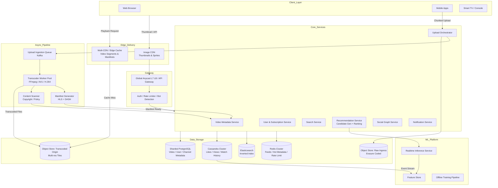

---

Design a video sharing platform like YouTube.

---

Here is a thorough, self-contained system design for a planet-scale video sharing platform.

---

## 1. Goals & Requirements

### Functional
*   **Upload**: Resumable chunked upload of high-resolution video; async processing and publication.
*   **Playback**: Low-latency adaptive bitrate streaming (ABR) on web, mobile, and TV.
*   **Discovery**: Full-text search, personalized home feed, subscriptions, trending, and related videos.
*   **Social**: Subscriptions, likes/dislikes, comments, playlists, notifications.
*   **Creator Tools**: Analytics dashboard, monetization eligibility, copyright/content scanning.

### Non-Functional
*   **Scale**: 1B+ DAU, 5B+ daily views, 5M+ daily uploads.
*   **Latency**: Time-to-first-frame (TTFF) < 1.5s globally; metadata APIs < 100ms p99.
*   **Availability**: 99.99% playback availability; graceful degradation if upload region fails.
*   **Durability**: 11 nines for stored video objects; zero unplanned data loss for monetized creators.
*   **Cost**: Storage grows by petabytes daily; bandwidth dominates opex. Design must optimize CDN cache efficiency.

---

## 2. Capacity Planning & Math

All downstream architecture decisions are driven by these numbers.

| Metric | Assumption | Result |
|---|---|---|
| **DAU** | 1 billion | — |
| **Views / day** | 5 per DAU | **5 billion** |
| **Avg watch time** | 5 minutes (300 s) | — |
| **Avg stream bitrate** | 3 Mbps (blended mobile/WiFi) | **112.5 MB per view** |
| **Daily egress** | 5B × 112.5 MB | **~562 PB / day** |
| **Average streaming throughput** | 562 PB / 86,400 s | **~6.5 TB/s (52 Tbps)** |
| **Peak streaming throughput** | 3× average | **~150–200 Tbps** |
| **Uploads / day** | 5 million | **~58 uploads / second** |
| **Avg raw upload size** | 1 GB (10 min 1080p–4K) | — |
| **Stored size / video** | 1 GB (multi-res HLS/DASH + thumbnails) | **~5 PB / day** |
| **5-year storage growth** | ~5 PB/day × 365 × 5 | **~9.1 EB** (before replica/erasure coding) |
| **Metadata read QPS** | Page loads, search, thumbnails | **~500,000 RPS** |
| **Social write QPS** | Likes, comments, views | **~300,000 WPS** |

**Key insight**: This is a pathologically read-heavy, bandwidth-heavy system. Every design choice prioritizes **moving bytes cheaply at the edge** and **preventing origin load**.

---

## 3. High-Level Architecture

---

## 4. Deep Dive: Core Subsystems

### 4.1 Upload & Ingestion Pipeline

**Problem**: A 1 GB file uploaded from a mobile device on a flaky 4G connection must not vanish at 99%.

**Design**:
1.  **Resumable Chunking**: Client slices the file into 256 KB–1 MB chunks. Each chunk is sent via HTTPS with a unique `upload_id` and `seq` number. Server (or object store) acks received ranges.
2.  **Direct-to-Store**: The **Upload Orchestrator** returns a signed, resumable URL to an Object Store (e.g., S3/GCS-compatible) **Ingress bucket**. Traffic bypasses application servers for data plane efficiency; only control plane metadata flows through `D2`.
3.  **Checksum & Virus Scan**: Once the final chunk lands, the object store emits an event to **Kafka**. A lightweight validator checks magic bytes, container format, and runs a basic malware scan before admitting the file to the transcoding queue.
4.  **Quota & Rate Limit**: Per-user daily upload caps and CDN egress budgets are enforced at the gateway using Redis counters.

**Tradeoff**: We do **not** store raw uploads on local disk. Direct-to-object-store adds ~50–100ms of latency to the control plane but removes the bandwidth bottleneck from API servers.

### 4.2 Transcoding & Packaging

**Problem**: One uploaded resolution must become 6+ resolutions (144p–4K), multiple codecs (H.264 for compatibility, VP9/AV1 for efficiency), plus thumbnails and storyboard sprites.

**Design**:
*   **Job Queue**: Kafka topic `video.transcode.jobs` with priority partitions (e.g., creators with 10M+ subscribers get a high-priority lane).
*   **Worker Pool**: Stateless Kubernetes pods pulling jobs. Each pod runs FFmpeg in a sandboxed container.
*   **Outputs**:
    *   **Ladder**: 144p, 240p, 360p, 480p, 720p, 1080p, 1440p, 2160p.
    *   **Codecs**: H.264 baseline (all clients), VP9 (mid/high tier), AV1 (premium/4K where client supports).
    *   **Manifests**: HLS `.m3u8` and DASH `.mpd` pointing to CDN-friendly segment filenames.
    *   **Thumbnails**: JPEG/WEBP poster image + 100-frame storyboard sprite sheet for hover scrubbing.
*   **Placement**: Transcoded assets written to the **Transcoded Origin** bucket in a directory layout: `/video_id/itag/segment_0001.m4s`.

**Failure Modes**:
*   **Poison Pill**: A malformed file crashes FFmpeg. Mitigation: 3 retries with exponential backoff, then route to a **Dead Letter Queue (DLQ)** for manual inspection.
*   **Hotspot Worker**: A celebrity upload triggers 1M concurrent transcodes? No—upload rate is only ~58/sec globally. The real hotspot is a *batch backfill* job. Mitigation: separate fleet for backfill vs. realtime.

**Tradeoff**: **Codec choice**. AV1 saves ~30% bandwidth vs. H.264 but takes 10×–20× longer to encode. We encode H.264 immediately for fast publication, then VP9/AV1 asynchronously, swapping the manifest pointers when ready.

### 4.3 Streaming & CDN

**Problem**: Deliver 150+ Tbps at peak without bankrupting the platform on egress fees.

**Design**:
*   **Multi-CDN**: Primary commercial CDN + secondary backup. DNS-based latency/load balancing routes users to the cheapest, closest healthy PoP.
*   **Origin Shield**: A mid-tier cache layer (or single designated CDN PoP) sits between edge nodes and the object store. This prevents a cache miss in Tokyo from hammering the origin in Oregon.
*   **Adaptive Bitrate (ABR)**: Player begins with a 2–3 second buffer of 360p (fast start), then steps up to 1080p/4K based on throughput estimation. DASH/HLS manifests are refreshed every N seconds for live; static for VOD.
*   **Segment Size**: 4–6 second segments balance cache granularity with switching responsiveness.

**Failure Modes**:
*   **Thundering Herd (Viral Video)**: 10M users request the same new video simultaneously.
    *   *Mitigation*: Pre-warm CDN by pushing the manifest to PoPs upon publication. Enable **request coalescing** at the edge—if 1,000 clients request the same uncached segment, the shield makes one origin fetch.
*   **Regional CDN Outage**: DNS failover to secondary CDN within 30 seconds. Clients retry next host automatically.

**Cost Math**: Serving 562 PB/day from origin would be catastrophic. With a 95% CDN hit rate, origin fetch is only ~28 PB/day. Each 1% improvement in hit rate saves tens of millions of dollars annually.

### 4.4 Metadata, Search & Discovery

**Problem**: Billions of videos must be queryable by full-text search and served in feeds with <100ms latency.

**Datastores**:
*   **Sharded PostgreSQL** (or CockroachDB/YugabyteDB): Stores canonical metadata (video ID, title, description, status, monetization flags, channel ID). Sharded by `video_id` (consistent hash) to avoid single-table hotspots.
*   **Cassandra**: High-write social data (likes, comments, view events, subscriptions). Writes are append-only with TTLs for temporary data.
*   **Redis**: Hot entity cache (top 1% trending videos, home feed for active users) and rate-limiting counters.
*   **Elasticsearch**: Inverted index on title, description, tags. Updated asynchronously via Kafka consumers (eventual consistency ~1s).

**Search Flow**:
1.  Query → API Gateway → Search Service.
2.  Search Service queries Elasticsearch for candidate video IDs.
3.  Enriches results from Redis/PostgreSQL (title, thumbnail URL, channel name, duration).
4.  ML re-ranker applies personalization (language, region, watch history embeddings) before returning top 20.

**Tradeoff**: Elasticsearch index updates are eventual. If a creator edits a title, search may lag by 1–5 seconds. This is acceptable; we favor ingestion throughput over immediate consistency.

### 4.5 Recommendations & Feed Generation

**Problem**: The home feed cannot be computed on the fly for 1B users.

**Architecture (Two-Phase)**:
1.  **Candidate Generation (Offline/Batch)**:
    *   Run nightly pipelines over the user–video bipartite graph.
    *   Generate ~1,000 candidate video IDs per user using collaborative filtering + content embeddings.
    *   Store in Redis per user key: `feed:candidates:<user_id>`.
2.  **Ranking & Re-ranking (Online)**:
    *   When a user opens the app, the **Recommendation Service** fetches the 1,000 candidates.
    *   A lightweight neural net (3–10ms inference per item) scores candidates using real-time features (time-of-day, last watch topic, device).
    *   Re-ranking applies diversity and policy filters (e.g., not too many videos from the same channel, down-rank borderline content).
    *   Returns top 20. Next page pulls from pre-stored candidates.

**Tradeoff**: **Fan-out-on-write vs. Fan-out-on-read** (for subscriptions).
*   *Push model* (Twitter-style): When a creator uploads, write to every subscriber’s inbox. With 50M subscribers, this is 50M writes.
*   *Pull model*: We use **pull** for subscriptions. The user’s request queries the subscription list and merges it with the candidate pool. This eliminates write amplification at the cost of slightly higher read latency (mitigated by caching subscriber lists in Redis).

### 4.6 Analytics & Approximate Counters

**Problem**: A viral video would trigger an ACID transaction storm if every view updated a Postgres row.

**Design**:
*   **View Events**: Client sends heartbeat beacons every 10 seconds. These land in Kafka topic `analytics.events`.
*   **Flink/Spark Streaming** aggregates beacons into 1-minute windows, filtering fraud (bots, double-clicks) via heuristics.
*   **Counter Storage**: Cassandra counters (or Redis HyperLogLog for unique viewers) store per-video aggregates. The video page displays rounded counts (“2.1M views”) refreshed every minute.
*   **Creator Analytics**: Hourly batch jobs into a data warehouse (Snowflake/BigQuery equivalent) for detailed retention graphs and revenue share.

**Tradeoff**: We accept **approximate consistency** for public view counts. Strong consistency is reserved for revenue-generating metrics (ad impressions, billing) which flow through a separate, lower-volume pipeline.

---

## 5. Reliability & Failure Modes

| Failure | Impact | Mitigation |
|---|---|---|
| **Transcoder Pod Crash** | Single video stalls in processing | 3 retries with backoff; DLQ after 1 hour; alerts to on-call. |
| **Ingress Region Failure** | Uploads blocked for geo-region | Multi-region upload buckets. DNS directs to nearest healthy region. Client resumes from checkpoint. |
| **Origin Object Store Degradation** | CDN cache misses fail | Cross-region replication of transcoded bucket. CDN serves stale segments if origin is down (relax TTL during incident). |
| **Database Hotspot** | Celebrity channel upload causes lock contention on subscription shard | Shard by `video_id`, not `channel_id`, to distribute writes. Use cache for subscriber list reads. |
| **Search Index Lag** | New videos invisible for minutes | Acceptable. For breaking news, a separate `trending` Redis list bypasses index. |
| **Replay / Bot Inflation** | Fraudulent views skew ads & recommendations | Real-time bot detection via device fingerprinting + IP reputation + behavioral clustering. Deduped by `user_id` + `video_id` HyperLogLog. |
| **Data Corruption (Silent)** | Rare bit-rot in object store | Object store provides internal checksums (CRC32C). Application-level periodic audits compare manifests to segment checksums. |

---

## 6. Key Tradeoffs & Rationale

1.  **Consistency vs. Scale**: We use strong ACID (PostgreSQL) for money-related metadata and eventual consistency (Cassandra/Kafka) for social signals. This split lets us scale writes linearly without sacrificing financial accuracy.
2.  **Compute vs. Bandwidth**: We spend extra CPU on AV1/VP9 transcoding to reduce egress bandwidth by 30–50%. At YouTube scale, bandwidth costs dwarf compute costs; this is a clear win.
3.  **Pre-compute vs. Real-time**: Home feeds are pre-computed offline because personalization latency is acceptable in exchange for serving millions of RPS from cache instead of ML inference clusters.
4.  **Direct Upload vs. Proxy**: Clients upload directly to object storage via signed URLs. This complicates client logic slightly but removes a massive bandwidth chokepoint from the API tier.
5.  **HLS/DASH vs. WebRTC**: We use segment-based ABR instead of low-latency streaming for standard VOD. WebRTC is reserved for live streaming (not covered here) because VOD benefits more from cacheability than sub-second latency.

---

This design supports a multi-billion user platform with a clear separation between the high-throughput, immutable data plane (video bytes flowing through CDNs) and the latency-sensitive, mutable control plane (metadata, recommendations, and social features).