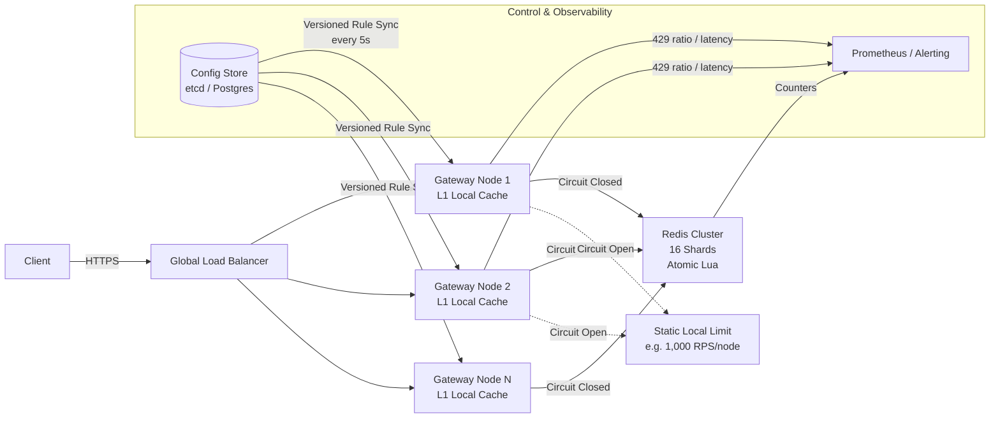
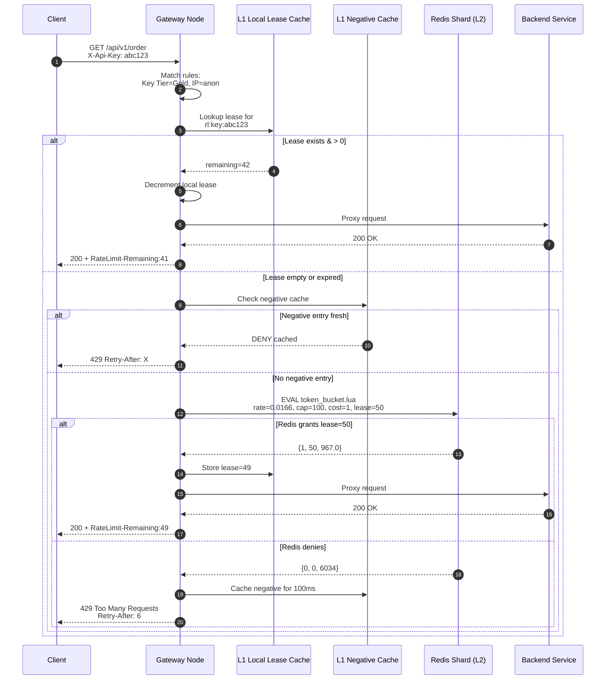

---

Design a distributed rate limiter to protect an API gateway.


---

## Distributed Rate Limiter for API Gateway

### 1. Overview & Requirements

We need to protect a polyglot backend behind an API gateway cluster from overload, abuse, and noisy-neighbor issues. The limiter must enforce per-identity quotas (API key, user ID, IP) and global endpoint budgets without becoming a bottleneck itself.

**Target SLIs**
*   Gateway peak throughput: **500,000 RPS** (sustained 100,000 RPS)
*   Active concurrently tracked entities: **10,000,000** (API keys, users, IPs)
*   End-to-end latency added by rate limiting: **< 1 ms p99**
*   Availability: Rate limiter failure must not gateway availability (degrade to permissive or conservative, never crash).

---

### 2. Architecture

We use a **three-tier, adaptive-token-lease** design:

1.  **L1 — In-Process Local Cache**: Each gateway node maintains an LRU of "leases" (pre-fetched token budgets) in memory. This is the hot path.
2.  **L2 — Redis Cluster**: The source of truth for token bucket state. Sharded by limit key. Accessed only on L1 miss or lease exhaustion.
3.  **L3 — Emergency Fallback**: Hard local static limits used only when Redis is partitioned.



---

### 3. Core Algorithm: Token Bucket with Adaptive Leasing

A pure Redis token bucket requires one `GET+SET` (or `EVAL`) per request — too slow and expensive for 500K RPS. Instead, gateway nodes acquire **leases** in batches from Redis and spend them locally.

#### 3.1 Redis State (per key)
*   `tokens` (float): Current tokens in the bucket.
*   `last_update` (ms): Last time the bucket was replenished.

#### 3.2 Lua Script (Atomic, O(1))
Executed on the Redis shard that owns the key. We use Redis `TIME` to eliminate inter-node clock skew.

```lua
-- KEYS[1]: rate limit key
-- ARGV[1]: rate (tokens per millisecond, e.g. 0.0166 for 1/sec)
-- ARGV[2]: capacity (max tokens, e.g., 100)
-- ARGV[3]: cost per request (usually 1.0)
-- ARGV[4]: max_lease (adaptive batch size, e.g., 50)
local key = KEYS[1]
local rate = tonumber(ARGV[1])
local capacity = tonumber(ARGV[2])
local cost = tonumber(ARGV[3])
local max_lease = tonumber(ARGV[4])

-- Use Redis TIME to avoid gateway clock skew
local t = redis.call('TIME')
local now = tonumber(t[1]) * 1000 + math.floor(tonumber(t[2]) / 1000)

local state = redis.call('HMGET', key, 'tokens', 'last_update')
local tokens = tonumber(state[1])
local last_update = tonumber(state[2])

if not tokens then
    tokens = capacity
    last_update = now
end

local elapsed = now - last_update
tokens = math.min(capacity, tokens + (elapsed * rate))
last_update = now

if tokens >= cost then
    -- Grant a lease up to max_lease, but never more than current tokens
    local grant = math.min(max_lease, math.floor(tokens))
    tokens = tokens - grant
    redis.call('HMSET', key, 'tokens', tokens, 'last_update', last_update)
    redis.call('EXPIRE', key, 3600)  -- Evict idle keys
    return {1, grant, tokens}       -- {allowed, granted_tokens, remaining}
else
    local deficit = cost - tokens
    local retry_after = math.ceil(deficit / rate)
    -- Still write back replenished state so next caller sees updated tokens
    redis.call('HMSET', key, 'tokens', tokens, 'last_update', last_update)
    redis.call('EXPIRE', key, 3600)
    return {0, 0, retry_after}      -- {denied, granted=0, retry_after_ms}
end
```

#### 3.3 Gateway Local Logic
```text
function Allow(entityKey, rule):
    1. Check in-memory LRU for active lease.
       If lease.remaining > 0:
           lease.remaining -= cost
           return ALLOW (add RateLimit-Remaining header)

    2. Check in-memory negative cache.
       If entityKey recently denied (cached within last 10ms):
           return DENY (429 with Retry-After from cache)

    3. (L1 Miss) Call Redis EVAL with adaptive max_lease.
       If Redis returns allowed with grant=M:
           Store M-cost in local LRU (TTL = 5s)
           return ALLOW
       Else:
           Store negative entry (TTL = retry_after / 10, clamped 10ms..1s)
           return DENY

    4. If Redis circuit breaker is OPEN:
           Apply fallback static limit (hard-coded per node).
```

---

### 4. Capacity Math with Real Numbers

| Parameter | Value | Rationale |
|-----------|-------|-----------|
| **Peak Gateway RPS** | 500,000 | Black Friday / launch burst |
| **Gateway Nodes** | 20 | `c6i.2xlarge`-class, 8 vCPU each |
| **Active Entities** | 10,000,000 | API keys, user sessions, IPs |
| **Rules Evaluated / Request** | 2.5 | IP reputation, API key tier, endpoint budget |
| **Total L1 Evaluations / s** | 1,250,000 | 500K × 2.5 |
| **L1 Hit Rate** | 96 % | Most users stay well under limits; leases absorb bursts |
| **L2 Redis Evals / s (raw)** | 50,000 | 4% miss rate × 1.25M evals |
| **Adaptive Avg Lease Size** | 20 tokens | High-traffic keys get 100; idle keys get 1 |
| **Actual Redis Ops / s** | **2,500** | 50,000 / 20 |
| **Redis Shards** | 16 | Distribute hot keys; each shard sees ~160 peak ops/s |
| **Redis p99 Latency** | 0.6 ms | Same-AZ RTT ~0.4ms + Lua 0.1ms + system noise |
| **End-to-end Added Latency** | **24 µs avg** | (0.96 × 100ns) + (0.04 × 600µs) |
| **Redis Memory** | ~1.6 GB | 10M keys × ~80 bytes (key + hash overhead + 2 fields); doubled for 1 replica per master |

**Headroom Analysis**
*   Redis shards at 160 ops/s vs. 100K ops/s theoretical limit → **0.16% CPU** per shard.
*   If all leases collapse to size 1 (worst-case cold start / hyper-burst), Redis load becomes 50K ops/s, or **3,125 ops/s per shard** — still only ~3% utilization.
*   L1 memory per node: ~50K hot leases × 48 bytes ≈ **2.4 MB** — fits easily in L1/L2 CPU cache.

---

### 5. Sharding & Hot Key Strategy

Keys are sharded via `CRC16(key) % 16384` (standard Redis Cluster).

*   **Normal keys**: Uniform distribution handles load.
*   **Inevitable hot keys** (e.g., `global:/v1/payments`): A single counter can’t be sharded without losing atomicity. We mitigate via:
    1.  **Larger local lease** (up to 1,000 tokens) for global limits, amortizing Redis writes.
    2.  **Negative caching**: Once a hot key is denied, all nodes cache the denial briefly (10–100 ms), collapsing 100K RPS of rejections into ~1K Redis ops.
    3.  **Dedicated oversized shard**: Provision one Redis master with higher I/O cap specifically assigned to `global:*` tag slots.

---

### 6. Request Flow Diagram



---

### 7. Failure Modes & Mitigations

| Failure | Impact | Mitigation |
|---------|--------|------------|
| **Redis shard crash** | Loss of global enforcement for keys on that shard. | Redis Cluster promotes replica within seconds. Client-side circuit breaker: if > 1% Redis timeout errors, open circuit and fall back to **L3 static local limits** (e.g., 500 RPS/node hard cap) to protect backend. |
| **Clock skew across gateways** | Nodes with fast clocks steal tokens from slow nodes. | Lua script uses `redis.call('TIME')`. Gateways pass no timestamps. |
| **Thundering herd on gateway cold start** | All nodes lose L1 cache simultaneously; Redis hit with 50K raw ops/s. | Jittered warm-up: new nodes request `max_lease=1` for the first 200 ms, then ramp to adaptive. Pre-warm top-10K keys from a replica snapshot on boot. |
| **Hot abusive entity** | One attacker key emits 100K RPS. L1 empties lease quickly, then hammers Redis. | After first Redis deny, negative cache suppresses subsequent checks for 10 ms. If the entity stays abusive, Redis sees it only 100 times/sec instead of 100K. |
| **Config propagation delay** | Node A thinks limit is 1,000/sec; Node B thinks 10,000/sec. | Every config snapshot is versioned with a monotonic integer. Redis Lua receives the expected version in ARGV. If Redis detects a newer version has already been applied to a key, it returns `RELOAD` so the gateway refreshes its rule cache immediately. |
| **Idle key memory bloat** | Millions of stale keys (e.g., one-time IPs) accumulate. | Redis `EXPIRE 3600` on every write. Idle keys evict automatically. |

---

### 8. Explicit Tradeoffs

1.  **Accuracy vs. Latency / Cost**
    *   *Choice*: We accept **bounded over-admission**. In the worst case, if a user round-robins across all 20 gateway nodes and each node just acquired a fresh lease of 50 tokens, the user can burst 1,000 requests before Redis enforces the true global cap (e.g., a 100 token bucket).
    *   *Mitigation*: For strict billing or fraud rules, operators can mark a rule as `strict=true`, forcing L1 to `max_lease=1` (every request checks Redis). This is a 50× increase in Redis load but guarantees hard caps.

2.  **Burst Tolerance vs. Smoothing**
    *   *Choice*: Token bucket (allows bursts). Good for user experience (catch-up after idle).
    *   *Sacrifice*: If the backend requires perfectly smooth traffic (e.g., legacy database), token bucket is the wrong algorithm; a leaky bucket or GCRA would be needed. We support both via pluggable Lua scripts selected by rule type.

3.  **Memory Efficiency vs. Window Precision**
    *   *Choice*: Token bucket is O(1) memory per key.
    *   *Sacrifice*: A true sliding window log is O(requests in window) memory and network heavy. We approximate the sliding window by setting `capacity = rate × window_seconds` and a high burst cap. Error is bounded to the refill interval and acceptable for API protection.

4.  **Global Enforcement vs. Availability**
    *   *Choice*: If Redis is unreachable, we **fail open to local static limits** rather than failing closed (rejecting everything). This keeps the API available but may allow slightly more traffic.
    *   *Alternative*: Fail closed is safer for the backend but creates a global outage during a Redis partition. We prioritize gateway availability because the backend has its own load shedding (circuit breakers, queue limits).

---

### 9. Operational Checklist

*   **Deployment**: L1 runs as an in-process sidecar (Envoy WASM filter or Go library) so no extra network hop. Redis runs as a dedicated cluster colocated in the same region, cross-AZ.
*   **Observability**:
    *   `rate_limiter_l1_hit_ratio` (target > 95%)
    *   `rate_limiter_redis_latency_p99` (alert if > 2 ms)
    *   `rate_limiter_429_rate_per_rule` (detect config errors)
    *   `rate_limiter_circuit_breaker_state` (0=closed, 1=open)
*   **Tuning Leases**: Start `max_lease=1`. If `l1_hit_ratio < 90%` for a rule, raise `max_lease` by 10 until ratio recovers or Redis latency grows.
*   **Disaster Recovery**: Daily RDB snapshots of Redis. If entire cluster lost, restart with empty state — the worst case is permissive for one hour until abusive clients re-discover limits organically.