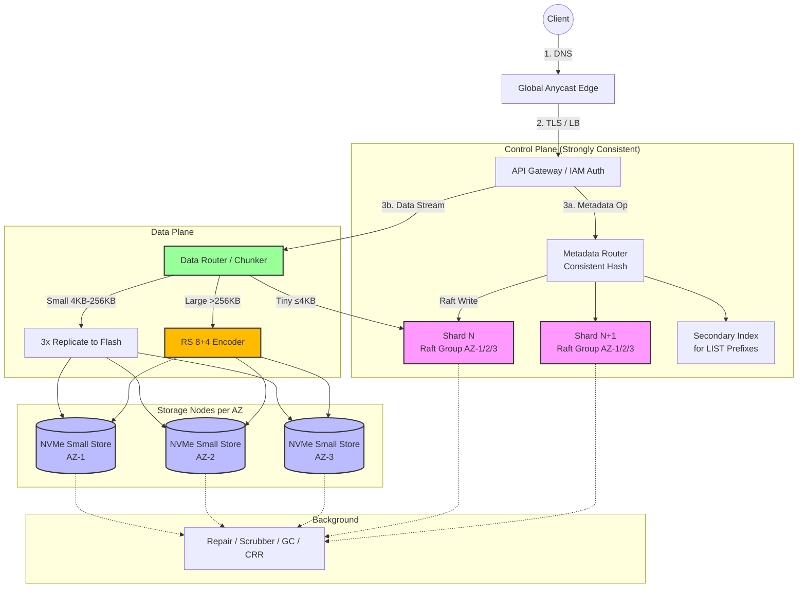

---

Design a global object storage system like S3.

---

## Global Object Storage System Design

### 1. Requirements & Scale Targets
| Target | Value |
|--------|-------|
| **Objects Stored** | 1 trillion |
| **Total Logical Capacity** | 32 EB (skewed distribution) |
| **Peak Request Rate** | 40 million ops/sec (global) |
| **Durability** | 99.999999999% (11 nines) per object per year |
| **Availability** | 99.99% (4 nines) for data plane |
| **Latency (p99)** | PUT: < 100 ms; GET first byte: < 50 ms |
| **Object Size Range** | 0 B to 5 TB |

### 2. Architecture Overview
The system is split into four layers:

1. **Edge / Front Door**: DNS, load balancing, API translation, IAM signature verification.
2. **Metadata Plane (Control Plane)**: Strongly consistent object index. This is the hardest part—mapping `(bucket, key, version)` to physical storage locations.
3. **Data Plane (Storage Nodes)**: Durable chunk storage using tiered strategies based on object size.
4. **Background Services**: Repair, scrubbing, garbage collection, cross-region replication, lifecycle transitions.

---

### 3. Detailed Component Design

#### 3.1 API Gateway & Edge
- **Anycast DNS** routes the client to the nearest healthy region.
- **API Gateway** speaks a REST/S3-compatible API. It offloads TLS, throttling, and IAM signature validation.
- **Hot Metadata Cache**: The gateway caches read-only metadata (object size, checksum, storage handles) for **5 seconds** for hot objects to protect the metadata tier from thundering herds.

#### 3.2 Metadata Subsystem
This is the primary scalability bottleneck. We use **horizontal sharding with per-shard consensus**.

- **Partitioning**: Object keys are hashed into **50,000 partitions** (consistent hashing on `(bucket, key)`). This prevents sequential-key hotspots (a classic S3 antipattern).
- **Shard Implementation**: Each partition is backed by a **5-node Raft cluster** (replicated state machine) spread across 3 AZs (e.g., 2-2-1 distribution).
  - Write latency: 2 RTTs within a region (~10–20 ms).
  - Strong consistency for all metadata operations (list, put, delete, multipart commit).
- **Storage**: Each node stores its shard data on NVMe SSDs in an LSM tree (e.g., RocksDB). A RAM cache holds the hot 5% of keys.
- **Secondary Index**: A separate partitioned B-tree (also Raft-backed) stores lexicographical ordering within a bucket to support `LIST` operations. On object write, the primary shard commits, then asynchronously (but durably) updates the secondary index via a local WAL replay. This trades a slight LIST latency penalty for write throughput.

**Object Record Layout (~1.5 KB):**
- Object key (up to 1024 bytes)
- Version ID, timestamp, ACLs, retention policy
- Content checksums (SHA-256)
- Storage handles: array of `(chunk_id, node_id, offset)` for data location
- Delete marker / tombstone bit

#### 3.3 Data Plane: Tiered Storage Strategy
We split objects by size because tiny objects ruin erasure coding efficiency, and huge objects crush metadata if stored inline.

| Tier | Size | Strategy | Durability Mechanism |
|------|------|----------|---------------------|
| **Tiny** | ≤ 4 KB | Inline in Metadata Store | 3× replication via Raft |
| **Small** | 4 KB – 256 KB | Separate Flash Store | 3× replication across AZs on NVMe nodes |
| **Large** | > 256 KB | Chunked Erasure Coding | Reed-Solomon **8+4** (12 chunks) across 3 AZs |

**Why 8+4 Reed-Solomon?**
- Overhead: 1.5× (better than 3× replication).
- Placement: 4 chunks per AZ.
- Tolerance: Survives loss of any **one full AZ** (4 chunks) because 8 remain and we need 8 to reconstruct. Survives up to 4 arbitrary chunk failures.
- Chunk size: **64 MB**. A 1 GB object splits into 16 chunks → 24 EC fragments spread across nodes.

**Write Path (Large Object):**
1. Client streams data to the **Data Router**.
2. Router buffers 64 MB, computes checksum, sends to **EC Encoder**.
3. EC Encoder produces 12 fragments and routes them to 12 different storage nodes in 3 AZs (4 per AZ).
4. Each storage node writes the fragment to its local HDD (with an NVMe write-ahead journal for durability).
5. Once all 12 fragments acknowledge, the Data Router returns success. The API Gateway then commits the metadata record to the Raft shard.

**Read Path:**
1. Client → Gateway → Metadata Router fetches object handles (chunk IDs + node locations).
2. Gateway issues parallel fetch requests for the required chunks. Since this is 8+4, we need any 8 chunks. The reader requests 9 chunks from the closest/fastest nodes (1 redundant to mask stragglers).
3. First 8 responses are pipelined into the decoder (if needed) or directly streamed if reading sequential ranges that map cleanly to intact chunks.
4. Checksums are verified per 4 KB block (CRC32C) before returning bytes to the client.

**Storage Nodes:**
- Each node runs a local storage engine (chunk store) managing HDDs (cold/warm) and NVMe (journals/small object store).
- Nodes self-report health, capacity, and IOPS to a placement scheduler.

---

### 4. Capacity Math

#### 4.1 Storage Tier
Assume **1 trillion objects** with a heavily skewed size distribution:

| Class | Object Count | Avg Size | Logical Data | Raw Overhead | Raw Capacity |
|-------|-------------|----------|--------------|--------------|--------------|
| Tiny (inline) | 100 B | 1 KB | ~100 PB | 3× (Raft) | 300 PB |
| Small (3× rep) | 300 B | 32 KB | ~9.6 PB | 3× | 28.8 PB |
| Large (8+4 EC) | 600 B | 53 MB | ~31.9 EB | 1.5× + 12% rebuild margin | **~53.6 EB** |

- **Total Raw:** ~54 EB.
- **Per Node:** 400 TB usable per node (e.g., 24 × 22 TB HDDs + 2 × 3.2 TB NVMe for journal/cache).
- **Storage Nodes Required:** `54 EB / 400 TB ≈ **138,000 nodes**` globally.
- Assuming 20 regions: ~6,900 nodes per region, ~2,300 per AZ (3 AZs).

#### 4.2 Metadata Tier
- **Record Size:** 1.5 KB/object (average).
- **Total Metadata:** `1 trillion × 1.5 KB = **1.5 PB**` logical.
- **Partitions:** 50,000 partitions → 20 million objects/partition.
- **Replication:** 3× (Raft) → 4.5 PB physical.
- **Node Footprint:** Each metadata node stores ~25 partitions on NVMe.
  - Per node data: `25 × 20M × 1.5 KB = 750 GB`.
  - Easily fits on a 4 TB NVMe drive with RAM cache.
- **Metadata Nodes:** `50,000 partitions / 25 per node = **2,000 nodes**`.
- **QPS Check:** 20 million ops/sec peak ÷ 2,000 nodes = **10,000 QPS/node**.
  - With a RAM-bloom filter + NVMe LSM tree, a single metadata node can sustain ~50k IOPS. 10k QPS leaves comfortable headroom. For 40M peak, we scale to 4,000 nodes (5k QPS/node).

#### 4.3 Network Estimates (Per Region)
A region handling 5% of global peak:
- **Ingress:** 2M PUT/s × 16 MB avg = 32 TB/s = **256 Tbps**. (In practice, most PUTs are smaller; this is an upper bound. A real region would provision ~10–20 Tbps and absorb via buffering/aggregation.)
- **Egress:** 2M GET/s × 8 MB avg = 16 TB/s = **128 Tbps**.
- *Mitigation:* 80%+ of egress is served from edge caches and CDN integration. The origin data plane sees only cache misses.

---

### 5. Consistency Model
- **Strong Read-After-Write:** All `PUT`s of new objects and `DELETE`s are strongly consistent. Once a client receives HTTP 200, any subsequent `GET` or `LIST` sees the result.
- **Immutability:** Object data is never modified in-place. Overwrites create new version IDs. This eliminates read-modify-write races in the data plane.
- **Multipart Upload:** Parts are durably staged. The final `CompleteMultipartUpload` executes a metadata transaction (all-or-nothing commit of parts into one object).

---

### 6. Background Services

| Service | Function |
|---------|----------|
| **Reaper / GC** | Dereferences orphaned chunks from failed uploads or overwritten versions. Uses a two-phase mark-and-sweep to avoid deleting live data. |
| **Repair / Scrubber** | Detects bitrot via CRCs and reconstructs missing EC chunks when disks/nodes fail. Target rebuild time: < 6 hours. |
| **Cross-Region Replicator** | Asynchronously tails metadata WAL and replicates objects to a secondary region for DR/compliance. |
| **Balancer** | Moves hot partitions to faster nodes and splits oversized metadata partitions (when a bucket exceeds 20M keys under one hash prefix, split range). |

---

### 7. Explicit Tradeoffs

| Tradeoff | Decision | Rationale |
|----------|----------|-----------|
| **EC vs Replication** | Small objects use 3× replication; large use 8+4 EC. | EC saves 50%+ space but adds 10–30 ms encoding latency and reconstruction CPU. Tiny objects make EC fragments impractical, so replication is simpler and faster. |
| **Metadata: RAM vs NVMe SSD** | Metadata on NVMe with RAM cache, not all-DRAM. | 1.5 PB of RAM would require ~50,000 memory-heavy servers (cost-prohibitive). We accept ~1–3 ms metadata lookups instead of 100 µs to cut hardware cost by ~10×. |
| **Strong vs Eventual Consistency** | Strong consistency via Raft. | Eventual consistency is easier to scale but pushes complexity to millions of client applications. We pay the latency cost of consensus for correct behavior. |
| **Regional vs Global Bucket Namespace** | Buckets are region-scoped. | A global namespace requires cross-region consensus (slow, CAP-tradeoff hell). Regional buckets + optional CRR give better latency and isolation. |
| **Hash vs Range Sharding** | Hash sharding for primary index; separate secondary index for LIST. | Pure hash sharding destroys LIST performance. We pay a double-write penalty (primary + secondary) to support both fast writes and lexicographical listings. |

---

### 8. Failure Modes & Mitigations

| Failure | Impact | Mitigation |
|---------|--------|------------|
| **Single Disk Failure** | 1/12 EC chunks lost for ~10,000 objects. | Normal operation continues. Repair node reads remaining 8 chunks, rebuilds the lost 4, and writes to a new disk within 6 hours. |
| **Storage Node Failure** | All local fragments unavailable. | Reads fall back to other EC chunks (need any 8). Writes reroute to replacement nodes. |
| **AZ Failure** | Up to 4/12 chunks lost per large object. | 8+4 scheme survives one full AZ loss. Small-object reads still succeed with 2/3 replicas. Metadata Raft groups with 2-2-1 placement retain majority (3/5) across surviving AZs. |
| **Metadata Shard Split-Brain** | Potential index corruption. | Raft majority prevents divergent writes. If network partition isolates the leader from the majority, the leader steps down. Minority shards reject writes. |
| **Silent Data Corruption (Bitrot)** | Data returned to client is corrupt. | CRC32C per 4 KB block + SHA-256 per chunk. Monthly scrubber verifies all chunks. |
| **Hot Spot / Thundering Herd** | 1M+ req/s for a single viral object. | Gateway metadata cache + CDN integration. Data nodes for that object are read-only; no lock contention because data is immutable. |
| **Cross-Region Link Cut** | CRR lag increases; region remains writable. | Asynchronous replication tolerates transient partitions. No impact on primary region availability. |
| **Multipart Upload Orphan** | Incomplete uploads waste space forever. | Reaper deletes uncommitted parts after 7 days via bucket lifecycle policy. |

---

### 9. System Diagram

---

### 10. Operational Notes
- **Rolling Upgrades**: Metadata Raft groups allow node replacement one member at a time without unavailability. Storage nodes are drained before software updates.
- **Monitoring**: Track `metadata_lookup_p99`, `chunk_rebuild_queue_depth`, `ec_reconstruct_cpu_seconds`, and `metadata_hotspot_partition_id`.
- **Cost Controls**: Lifecycle policies automatically transition objects to colder EC schemes (e.g., 12+4) or archival tape tiers after 90 days. Deep archival does not need instant retrieval, so it uses 20%+ erasure coding and separates metadata from cold media.

This design balances the irreconcilable demands of exabyte scale, 11-nines durability, and strong consistency by aggressively separating the metadata and data planes, tiering by object size, and accepting the cost of consensus only where it matters: the index.