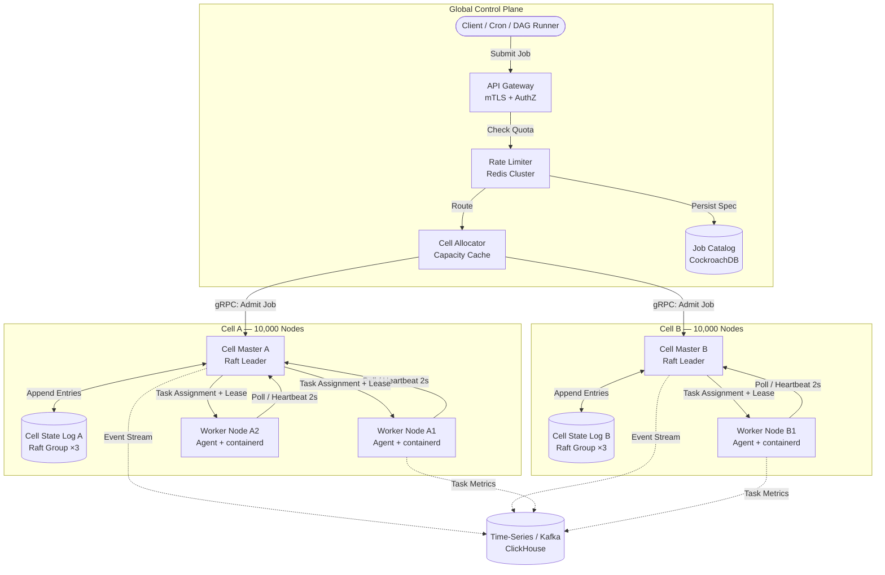

---

Design a distributed job scheduler.


---

# Distributed Job Scheduler Design

## 1. Requirements & Scale Targets

| Attribute | Target |
|---|---|
| Fleet size | 100,000 worker nodes |
| Throughput | 1,000,000 task submissions / min (16,667 tasks/sec) |
| Concurrent tasks | 500,000 globally (avg 30 s duration) |
| Scheduling latency | P99 < 2 s for best-effort batch; P99 < 100 ms for critical services |
| Availability | 99.99 % control plane; nodes can survive 5 min control-plane outage |
| Isolation | Hard multi-tenancy; no noisy-neighbor on CPU/RAM/GPU |

**Architecture paradigm:** *Cell-based scheduling* (inspired by Borg).  
The fleet is partitioned into **10 cells** of 10,000 nodes each. Each cell is an independent failure domain with its own leader-elected scheduler, replicated state log, and worker pool. A thin global layer handles admission, cross-cell routing, and long-lived job metadata.

---

## 2. Architecture Overview

```
┌─────────────────────────────────────────────────────────────┐
│                    GLOBAL CONTROL PLANE                      │
│  API Gateway → Rate Limiter → Cell Allocator → Job Catalog  │
└──────────────────┬──────────────────────────────────────────┘
                   │ (route to cell)
       ┌───────────┼───────────┐
       ▼           ▼           ▼
   [Cell 0]   [Cell 1]    [Cell 9]
   10k nodes  10k nodes   10k nodes
```

*Why cells?*  
A single scheduler process can comfortably manage 10k nodes and 50k concurrent tasks in memory with sub-millisecond scheduling decisions. Cells bound the blast radius of a scheduler bug or Raft group failure to 10 % of the fleet.

---

## 3. Component Design

### 3.1 Global Control Plane (stateless, horizontally scaled)

| Component | Technology | Responsibility |
|---|---|---|
| **API Gateway** | Envoy / gRPC | AuthN/Z, TLS termination, request validation |
| **Rate Limiter** | Redis Cluster (sliding-window) + local cache | Enforce per-tenant QPS (default 1,000 submits/sec) and burst capacity |
| **Cell Allocator** | Go service, replicated ×3 | Maintains a cached capacity snapshot of each cell (updated every 10 s via pull from cell masters). Assigns new jobs to the cell with the least dominant-resource utilization that matches any node affinity constraints. |
| **Job Catalog** | CockroachDB (6-node, 3-way geo) | Stores durable job specifications, DAG edges, cron schedules, IAM policies, and terminal job status. *Not* used for hot scheduling decisions. |

**Capacity math:**  
- 16,667 creates/sec global → ~1,700 inserts/sec on CockroachDB. With 32 vCPU nodes and batched writes, this is <5 % cluster load.  
- Job spec payload median 8 KB; with 30-day retention and compression, storage growth ≈ 350 GB/month.

### 3.2 Cell Control Plane (one per cell)

| Component | Technology | Responsibility |
|---|---|---|
| **Cell Master** | Single leader per cell (active-standby via Raft) | In-memory scheduling index, task placement, preemption, lease management |
| **Cell State Log** | Embedded Raft group (3 nodes: leader + 2 followers) | Replicated WAL of all task lifecycle events (create, assign, finish, kill). Does *not* store large job specs—only pointers (`job_id`, resource vector, node affinity). |
| **Metrics Exporter** | Sidecar on Raft nodes | Emits event stream to Kafka for downstream OLAP (ClickHouse) |

**Cell Master internals:**
- **Pending Queue:** Min-heap keyed by `(priority DESC, submit_time ASC, task_id)`.  
- **Node Index:** Map of `node_id → available_resources` and inverted index `resource_class → set<node_id>` for O(1) candidate lookup.  
- **Lease Table:** Map of `task_id → (node_id, lease_token, expiry_timestamp)`. Every assignment grants a 60 s lease; node agent must renew via poll.

### 3.3 Worker Node (per host)

| Component | Responsibility |
|---|---|
| **Agent** | gRPC client; long-polls master every 2 s (`PollForTasks`); heartbeats resource usage every 10 s; renews task leases implicitly via poll. |
| **Executor** | `containerd` shim. Enforces cgroups v2 limits (CPU quota, memory max, GPU device cgroups). Isolates task stdout/stderr to rotated log files shipped by Fluent Bit. |
| **Lease Enforcer** | If agent cannot reach master for 30 s (15 consecutive polls), it SIGTERMs all local tasks to prevent zombie work during a partition. |

---

## 4. Data Model

```protobuf
message Job {
  string job_id = 1;          // UUIDv7
  string tenant_id = 2;
  string cell_id = 3;
  JobState state = 4;         // PENDING | RUNNING | COMPLETED | FAILED
  bytes dag_spec_ref = 5;     // pointer to object store (S3) for large DAG
  int64  create_time_ms = 6;
}

message Task {
  string task_id = 1;
  string job_id = 2;
  string node_id = 3;         // empty if unassigned
  TaskState state = 4;        // PENDING | ASSIGNED | RUNNING | COMPLETED | LOST
  ResourceVector res = 5;
  string lease_token = 6;
  int64  lease_expiry_ms = 7;
  int32  attempt = 8;         // 1-based retry counter
}

message Node {
  string node_id = 1;
  ResourceVector total = 2;
  ResourceVector available = 3;
  repeated string labels = 4;
  int64 last_heartbeat_ms = 5;
  NodeHealth health = 6;      // HEALTHY | DRAINING | DOWN
}
```

**Hot state footprint per cell:**  
- 50,000 concurrent tasks × 200 bytes (`Task` sans spec) = 10 MB  
- 10,000 nodes × 100 bytes = 1 MB  
- Heap overhead + index ≈ 100 MB total. Easily fits in L3 cache of a single scheduler instance.

---

## 5. Scheduling Algorithm

**Loop (runs every 100 ms, or event-driven on task arrival):**

1. **Quota Check:** Skip tenant if dominant share > guaranteed quota (unless queue starvation timeout > 30 s).
2. **Pick Task:** Pop head of pending heap.
3. **Select Node:**  
   a. Lookup `resource_class` index for nodes with `available ≥ requested`.  
   b. Apply *best-fit* (smallest residual resources) to maximize cluster packing.  
   c. If no fit, apply *worst-fit* for tasks with label/affinity constraints.  
   d. Still no fit → push to deferred sub-heap; retry in 5 s.
4. **Lease & Assign:** Generate `lease_token`, decrement `available` in node index, append `(ASSIGN, task_id, node_id, token)` to Raft log.
5. **Deliver:** Task appears in response to the node's next `PollForTasks`.

**Preemption (for priority inversions):**  
If a high-priority task is deferred >10 s, the scheduler scans lowest-priority running tasks. Victim task receives SIGTERM; 30 s grace period before SIGKILL. Preempted task is re-inserted into pending queue with a 5 s backoff to avoid thrashing.

---

## 6. Capacity Engineering

### 6.1 Throughput & Latency

| Flow | Global Rate | Per-Cell Rate | Feasibility |
|---|---|---|---|
| Task submission | 16,667 /s | 1,667 /s | CockroachDB batch insert: 1,700 /s is trivial on SSD |
| Scheduling decisions | 16,667 /s | 1,667 /s | In-memory heap pop + map lookup: <1 µs → single thread can do >1M/s |
| Node poll (2 s interval) | — | 5,000 /s | gRPC unary, ~200 B payload; <2 MB/s NIC traffic |
| Heartbeat resource update | — | 1,000 /s (10 % nodes dirty) | Batched in Raft every 10 ms → 100 fsyncs/s; SSD fsync ~0.5 ms |

### 6.2 Storage & I/O

- **Raft Log:** 5,000 events/s × 200 B = 1 MB/s write. With log compaction (snapshot every 10,000 events), disk growth is bounded to ~2 GB per cell, truncated automatically.
- **Task stdout/stderr:** 500K concurrent tasks × 1 KB/s log rate = 500 MB/s globally. Shipped directly from node to S3 via Fluent Bit; never touches scheduler.

### 6.3 Memory

- Cell Master: ~200 MB hot state + 1 GB program overhead = **1.2 GB** per leader.
- Raft followers: identical data, read-only, same memory footprint.
- Gateway / Allocator: stateless, 512 MB per pod, 20 pods globally.

---

## 7. Failure Modes & Reliability

| Failure | Detection | Mitigation | Recovery Time |
|---|---|---|---|
| **Cell Master crash** | Raft heartbeat timeout (1.5 s) | Automatic election of follower. Agents reconnect via DNS to new leader. In-flight assignments are re-sent on next poll because agent never acked. | <3 s |
| **Network partition (agent ↔ master)** | Missed poll after 30 s grace | Agent self-kills tasks (partition tolerance). Master expires leases after 60 s and reschedules. | <60 s |
| **Node crash** | 2 missed heartbeats (10 s) | Master marks node DOWN; all leases on that node invalidated; tasks rescheduled elsewhere. | <15 s |
| **Split-brain scheduler** | Raft majority prevents dual leaders. Agent rejects commands with stale `leader_epoch`. | Epoch-based fencing. | Instant (prevented) |
| **Metastable overload (thundering herd)** | Queue depth > 100k pending | Circuit breaker: reschedule rate capped at 2× normal. Low-priority tasks delayed; API Gateway sheds non-critical submits with 429. | Gradual |
| **Cascading preemption** | Metric alert: preemptions/sec > starts/sec | Preemption backoff + mandatory 5 s cooling period for victims. | Seconds |
| **Job state corruption** | Checksum on Raft log entries | Periodic snapshot to object store + point-in-time restore capability. Immutable event stream in ClickHouse for audit. | Hours (restore) |

**Exactly-once execution semantics:**  
Tasks themselves must be idempotent, but the *scheduler* guarantees **at-most-one active lease** per `task_id`. Output commit to external storage uses the `task_id` and `attempt` number as an idempotency key (e.g., in S3 `job_id/task_id.attempt.avro`).

---

## 8. Explicit Tradeoffs

| Decision | Alternative | Why We Chose This |
|---|---|---|
| **Cell-based sharding** | Single global scheduler | Scales linearly; fault isolation. Sacrifice: jobs cannot trivially span cells; multi-cell DAGs need a global coordinator proxy. |
| **Embedded Raft log (hot path)** | External Spanner/Cassandra for task state | Eliminates 5–10 ms network RTT per scheduling decision. Tradeoff: harder ad-hoc querying; requires Kafka export for analytics. |
| **Poll (2 s) instead of push** | Persistent gRPC bidi stream from master | Simplifies failover (agent just retries DNS). Adds ~1 s avg latency to task start; acceptable for batch workloads. |
| **Best-fit placement** | Spread (worst-fit) | Maximizes utilization for batch jobs. Risk: large tasks can queue if cluster is fragmented. Mitigated by resource-class index + 5 s fallback to worst-fit. |
| **Preemption with SIGTERM grace** | No preemption / strict reservation | Needed for priority escalation (e.g., revenue-critical pipeline vs. backfill). Grace period prevents data loss in well-behaved tasks. |

---

## 9. Operational Considerations

- **Draining:** Node sets `health = DRAINING` via CLI. Master stops new placements; waits for running tasks to finish (or migrates after 5 min timeout). Used for kernel upgrades.
- **Bin-packing defragmentation:** Nightly low-priority "defrag" job that migrates short tasks to consolidate nodes, allowing large-GPU training jobs to land without queuing.
- **Observability:**  
  - *Liveness:* `scheduler_tasks_pending` alert if >50k for 5 min.  
  - *Saturation:* `scheduler_raft_log_lag` >100 entries triggers page.  
  - *Errors:* `agent_kill_zombie_total` spike indicates partition storms.

---

## 10. System Diagram



This design scales to millions of tasks per minute, limits failure blast radius to 10 % of the fleet, and maintains a simple, debuggable scheduling core per cell while delegating durability and cross-cutting concerns to the global layer.