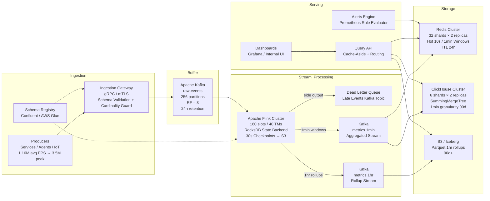

---

Design a real-time metrics aggregation pipeline that handles 100 billion events/day.

---

## Real-Time Metrics Aggregation Pipeline — 100 Billion Events/Day

### 1. Executive Summary
This design ingests **100 billion metric events per day** (≈1.16 M events/sec average, **3.5 M events/sec peak**), performs time-windowed aggregation in real time, and serves sub-second queries for dashboards and alerts. The pipeline uses **Apache Kafka** as the durable buffer, **Apache Flink** for stateful stream processing, **Redis Cluster** for hot queries, **ClickHouse** for analytical warm storage, and **S3** for cold long-term rollups.

**Key SLIs**
- End-to-end latency (hot): p99 < 15 s (10-second windows in Redis)
- End-to-end latency (analytical): p99 < 75 s (1-minute windows in ClickHouse)
- Query latency (hot): p99 < 10 ms
- Query latency (analytical last 24h): p99 < 250 ms
- Availability: 99.99% (regional failover)

---

### 2. Traffic & Capacity Model

| Parameter | Value | Notes |
|---|---|---|
| Daily events | 100 × 10⁹ | — |
| Average EPS | 1.16 M | 100B / 86,400 |
| Peak EPS (3× avg) | 3.47 M | Diurnal burst assumption |
| Avg event wire size | 150 B | Avro + Snappy after schema registry |
| Peak ingress bandwidth | 521 MB/s | 3.47M × 150 B ≈ 4.2 Gbps |
| Active time series (cardinality) | 10 M | Midpoint assumption; pipeline defends against 100 M |
| 1-min aggregate rows | 10 M/min | One row per active time series per window |
| Aggregate row size | ~40 B | `ts, metric_id_hash, tags_hash, cnt, sum, min, max, p99_tdigest` |
| Aggregate insert rate | 166.7 k rows/s | 10M / 60s to ClickHouse |
| Hot query working set | ~2 GB | Last 1 h of 1-min rollups in Redis |
| Raw retention (Kafka) | 24 h | Buffer for Flink replays/backfills |
| Raw archive (S3) | 7 days | Parquet; used by nightly reconciliation jobs |

---

### 3. High-Level Architecture

---

### 4. Component Deep Dives

#### 4.1 Ingestion Gateway
- **Purpose**: Authentication, schema validation (Avro), timestamp sanitization, and **cardinality defense**.
- **Spec**: 20 instances of `c6g.2xlarge` (8 vCPU, 16 GB) behind an L4 load balancer.
- **Throughput per node**: ~175k events/sec (small Avro payloads with batching) — comfortable for a Go/C++ service using async Kafka producer underneath.
- **Cardinality Guard**: A sliding HyperLogLog sketch per dimension (e.g., `user_id`, `host`) in the gateway. If a dimension exceeds a configurable threshold (e.g., 1 M unique values in 1 min), the gateway replaces high-cardinality tags with a literal `__overflow__` token and emits a meta-metric. This prevents the backend storage from exploding due to unbounded cardinality.
- **Backpressure**: Gateway uses TCP backpressure and HTTP 429 when Kafka producer buffers exceed 100 ms p99. Clients (internal SDKs) implement exponential jittered backoff.

#### 4.2 Kafka Buffer (`raw-events`)
- **Why Kafka**: Decouples ingestion from processing, provides the **24-hour replay log** needed for Flink backfills and job upgrades.
- **Brokers**: 12 × `i3en.2xlarge` (8 vCPU, 64 GB, 2 × 2.5 TB NVMe, 25 Gbps).
- **Partitioning**: 256 partitions.
  - Peak per partition: 3.47M / 256 ≈ **13.5k msgs/sec** — well under the 50–80k msg/sec practical limit per partition for small messages.
- **Replication**: RF=3. Total raw storage per day: 521 MB/s × 86,400 × 3 replicas ≈ **135 TB logical**. With 8 TB NVMe per broker, 12 brokers provide 96 TB physical. We rely on **Tiered Storage** (S3-backed Kafka) or reduce local retention to 12h and offload to S3 for the remaining 12h to stay within disk bounds.
- **Network headroom**: 25 Gbps NICs can sustain the 12.6 Gbps peak replication + consumer fan-out comfortably.

#### 4.3 Stream Processing (Apache Flink)
- **Job Topology**:
  1. **Source**: Kafka consumer (256 partitions, group id `flink-agg-v2`), starting from `latest` by default, `earliest` for backfills.
  2. **Assign Watermarks**: `BoundedOutOfOrdernessWatermarks` with **30 s max out-of-orderness**.
  3. **KeyBy**: `(metric_name, service, region, host)` — deterministic hash partitioning.
  4. **Window**: `TumblingEventTimeWindows.of(Time.minutes(1))` for ClickHouse; `TumblingEventTimeWindows.of(Time.seconds(10))` for Redis hot path. Flink runs two separate sink operators from the same keyed stream to avoid duplicating window state.
  5. **Aggregate State**: `AggregateFunction` computing `count`, `sum`, `min`, `max`, plus a **T-Digest** sketch for p99. T-Digest adds ~1 KB per window state; with 5-minute allowed lateness, total Flink state is bounded.
  6. **Allowed Lateness**: 5 minutes. Events arriving after watermark + 5 min are routed to the **Dead Letter Queue**.
  7. **Sinks**:
     - `KafkaSink` (exactly-once, transactional) → `metrics.1min` topic.
     - `RedisClusterSink` (async pipeline, at-least-once, idempotent `SETEX` with window-start timestamp in key) → Redis.
- **Resources**:
  - 40 TaskManagers × 4 slots = **160 parallelism**.
  - Per-slot throughput at peak: 3.47M / 160 ≈ **21.7k events/sec**. This leaves >70% CPU headroom for quantile sketches and GC pauses.
  - State backend: **RocksDB** on local NVMe (200 GB per TM) with incremental checkpoints to S3 every 30 s.
- **Exactly-Once vs At-Least-Once**:
  - Kafka-to-Kafka path uses Flink exactly-once (two-phase commit).
  - Redis path uses at-least-once with last-write-wins semantics; Redis is **best-effort hot cache**, not the financial ledger.

#### 4.4 Storage Tier

| Tier | Technology | Data Granularity | Retention | Capacity Math |
|---|---|---|---|---|
| **Hot** | Redis Cluster | 10 s / 1 min | 24 h TTL | 10M series × 60 min × 100 B ≈ **60 GB**; sharded across 32 shards (2× replication) |
| **Warm** | ClickHouse | 1 min | 90 days | 166.7k rows/s × 40 B = 6.7 MB/s; 90d ≈ **58 TB** raw → **~6 TB** compressed with ZSTD |
| **Cold** | S3 (Parquet + Iceberg) | 1 hr | 2 years | ~2.8k rows/s; negligible cost |

**ClickHouse Schema Details**
- Engine: `ReplicatedSummingMergeTree` on each shard.
- `PARTITION BY toStartOfHour(timestamp)` — 24 parts/day; optimal for TTL merges.
- `ORDER BY (org_id, metric_name, tags_hash, toStartOfMinute(timestamp))` — co-locates the same time series, speeds up `lastpoint` queries.
- **Async Inserts**: Kafka Connect + `Kafka` table engine batches into 100k-row inserts to avoid `Too many parts` errors.

**Redis Sharding**
- 32 shards, each with primary + replica = 64 nodes (`cache.r6g.xlarge`, 13 GB).
- Key pattern: `m:{metric_hash}:{window_start}` — hash tag `{}` pins a metric+window to a slot, ensuring related fields land on one node for `MGET` pipelines.
- Write pattern: Flink pipelines 1k commands per round-trip per shard, keeping RTT overhead low.

#### 4.5 Query & Serving Layer
- **Query API**: 20 instances of a stateless Go/Java service.
  - **Router logic**:
    - `time_range < 2 h` → Redis (1-min + 10-s rollups).
    - `2 h ≤ time_range ≤ 90 d` → ClickHouse.
    - `> 90 d` → S3 via Trino/Spark SQL or ClickHouse S3 table function.
  - **Caching**: API layer caches JSON results for 30 s to prevent dashboard thundering herds. Redis is the cache store.
- **Alerts Engine**: Pulls from Redis (last 5 min) and evaluates Prometheus-style recording rules every 10 s. Alert state is stored in etcd.

---

### 5. Data Flow & Aggregation Semantics

**Event Time Processing**
All aggregation uses **event time** (the timestamp embedded in the metric payload), not processing time. Flink watermarks propagate at `max_event_time - 30 s`.

**Window Closure**
- A 1-minute window is considered closed when the watermark passes `window_end + 30 s`.
- Flink emits an aggregate row immediately upon closure.

**Late Data Handling**
- **0–5 min late**: Merged into the open window state using `allowedLateness`.
- **> 5 min late**: Written to DLQ topic `metrics.late`.
- **Nightly reconciliation**: A Spark job reads the DLQ + S3 raw archive and emits corrected rows to ClickHouse with a `reconciled=1` flag. Users see “final” data after 24 h.

**Quantile Accuracy**
- p99 is computed via **T-Digest** in Flink with **100 centroids**. This yields < 1 % relative error on typical latency distributions at a fraction of the cost of keeping a full histogram.

---

### 6. Failure Modes & Resilience

| Failure | Impact | Mitigation |
|---|---|---|
| **Kafka broker loss** | ISR shrinks; transient produce latency spike | RF=3; automatic re-election; producers retry with `acks=all` |
| **Flink TaskManager crash** | Subtask restart; 5–10 s stall | K8s reschedules pod; restores from last checkpoint (30 s max replay) |
| **Flink JobManager loss** | Job stalls | HA mode with 3 JMs + ZooKeeper; automatic leader election |
| **ClickHouse shard overload** | Queries slow; sink backpressure | Flink sink buffers fill; Kafka lag grows; alert fires; manual shard split or scale-out |
| **Redis hot-key / hot-shard** | Single shard CPU saturation | Hash tags distribute by `(metric_hash % 32)`; if one metric is huge, gateway cardinality guard flattens it |
| **Network partition (AZ failure)** | Loss of 1/3 capacity | Multi-AZ deployment; Kafka brokers spread across 3 AZs; ClickHouse replicas in different AZs |
| **Region-wide disaster** | Total outage | Active-passive in second region; MirrorMaker 2 replicates Kafka; ClickHouse distributed replicas cross-region |

---

### 7. Scaling Path

**If traffic grows 2× (200B/day):**
- **Kafka**: Double partitions to 512; add 6 brokers.
- **Flink**: Scale TaskManagers from 40 → 80 (160 → 320 slots). Stateless except for checkpoints.
- **ClickHouse**: Add 6 more shards (12 total); rehash `tags_hash` modulo 12. Historical data remains on old shards; new data flows to new shards (no full resharding needed if `org_id` is used for shard routing).
- **Redis**: Scale to 64 shards. Redis Cluster allows online resharding.

**If cardinality grows 10× (100M time series):**
- 1-min rows/sec becomes 1.67M. ClickHouse can ingest this if batch sizes increase to 1M rows.
- If quantile sketches become too heavy in Flink, **sample** raw events at the gateway for T-Digest and keep only `count/sum/min/max` for the full stream.

---

### 8. Explicit Tradeoffs

| Decision | Chosen Approach | Tradeoff |
|---|---|---|
| **Raw vs. Pre-aggregated** | Pre-aggregate in Flink; keep raw 24h only | **Pros**: 100× storage reduction, fast queries. **Cons**: Cannot retroactively add new dimensions without replaying raw (which is limited to 24h). |
| **Exactly-once** | Exactly-once for Kafka; at-least-once for Redis | **Pros**: Correct billing/analytics ledger in ClickHouse; Redis stays simple and fast. **Cons**: Redis may overcount by <0.1% during Flink restart. |
| **Event time vs. Processing time** | Event time | **Pros**: Accurate dashboards during backpressure or replays. **Cons**: 30–60 s latency penalty vs. processing time. |
| **Alignment** | Aligned windows (all keys close at :00) | **Pros**: Deterministic, query-friendly. **Cons**: Micro-burst write load to Redis/ClickHouse at window boundaries. Mitigated by Flink async pipelining. |
| **OLAP Store** | ClickHouse instead of Druid/Pinot | **Pros**: Self-hostable, extreme ingestion throughput, SQL native. **Cons**: harder real-time deduplication than Druid’s segment architecture; requires careful merge tree tuning. |

---

### 9. Operational Checklist
1. **Canary deployments**: Route 1% of Kafka partitions to a second Flink job version; compare output row counts via a `validation` ClickHouse table.
2. **Lag alerts**: Alert if `kafka.consumer.lag` > 60 s or `flink.checkpoint.duration` > 2 min.
3. **Capacity headroom**: Maintain 50 % CPU headroom on Flink and ClickHouse; scale out at 70 %.
4. **Cost optimization**: Enable Kafka Tiered Storage to S3 after 6 hours to avoid over-provisioning NVMe for 24h retention.