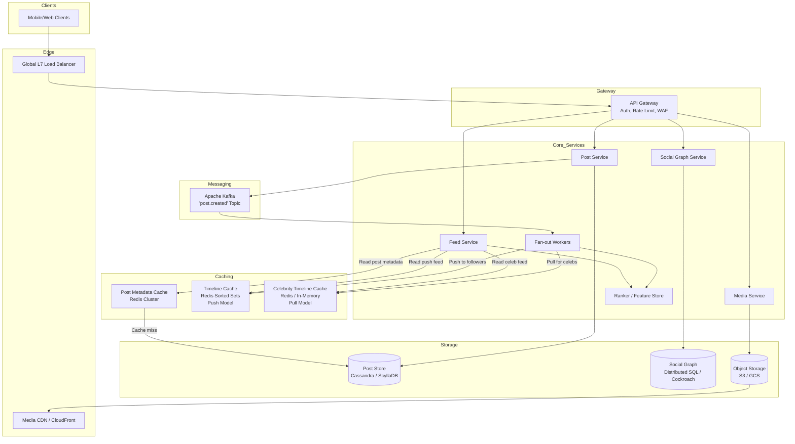

---

Design a news feed system like Twitter or Facebook.


---

Here is a self-contained system design for a planetary-scale news feed (e.g., X/Twitter, Instagram, Facebook). It is scoped to the core **create post**, **follow graph**, and **read feed** paths, including algorithmic ranking.

---

## 1. Requirements & Scope

### Functional
* **Post:** Create a text/media post; delete.
* **Social Graph:** Follow / unfollow a user.
* **Feed:** Retrieve a reverse-chronological or ranked feed of posts from followed users.
* **Media:** Attach images/videos; serve them with low latency.

### Non-Functional
* **Availability:** 99.99% (feed reads). Post creation can tolerate brief async delays.
* **Latency:** P99 feed load `< 200 ms` (excluding last-mile network).
* **Durability:** Posts must not be lost once acknowledged.
* **Consistency:** Eventual consistency for feed propagation (≤ 5 s delay acceptable). Read-after-write must work for an author’s own posts.
* **Scale:** 500M DAU, 100M posts/day, tens of billions of feed reads/day.

---

## 2. Capacity Plan & Math

| Metric | Assumption | Daily / Throughput |
|---|---|---|
| **DAU** | 500M | — |
| **Posts created** | 10% of DAU create 1 post | **100M posts/day** |
| **Feed fetches** | 20 fetches per DAU | **10B feed fetches/day** |
| **Followers (average)** | 500 per user (power-law) | — |
| **Active followers** | 60% of followers log in within 7d | **300 active followers per post** |
| **Fan-outs (push)** | 100M posts × 300 active followers | **30B timeline writes/day** |
| **Post metadata size** | text + URLs + counters ≈ 1 KB | **~100 GB/day** |
| **Timeline entry size** | `post_id` + `author_id` + score ≈ 32 B | **30B × 32 B ≈ 1 TB/day written** |
| **Peak multiplier** | 3–5× average | **~15,000 posts/sec**, **~350,000 fan-outs/sec**, **~600,000 feed reads/sec** |

**Storage Steady State (Timeline Cache)**
If we retain the last 10,000 entries per user and TTL older items aggressively:
* Active users: 300M.
* Cache per active user: ~1 MB (metadata pointers).
* Total hot cache: **~300 TB**. Sharded across a 200-node Redis/Valkey cluster = ~1.5 TB / node (feasible with memory + SSD tiering).

---

## 3. High-Level Design

We use a **hybrid fan-out** model:
* **Normal users** ( ≤ 1M followers ): **Fan-out on write (push)** into followers’ timeline caches.
* **Celebrities** ( > 1M followers ): **Fan-out on read (pull)**. Their posts are written to a dedicated celebrity cache; readers merge these in at request time.

This avoids a 50M-follower user causing 50M Redis writes per post, while keeping feed reads O(1) for ordinary users.



---

## 4. Core Components

### 4.1 Post Ingestion (Post Service)
1. Client uploads text/media.
2. **Media** is streamed to Object Storage (S3); an async transcoding queue generates thumbnails.
3. **Metadata** is written to the `Post Store` (Cassandra) with `user_id` as partition key and a time-based `post_id` (Snowflake) as clustering key for sequential, monotonic writes.
4. A `post.created` event is published to Kafka.

**Why Cassandra?**
Feed ingestion is write-heavy with predictable access patterns (latest posts by user). Cassandra’s LSM-tree and tunable consistency (QUORUM for writes, ONE for reads) fit better than sharded SQL at this fan-out scale.

### 4.2 Fan-Out & The Hybrid Model (Fan-out Workers)
Kafka consumers (Fan-out Workers) read `post.created` events and branch:

| Follower Count | Action |
|---|---|
| **≤ 1M** (Normal) | Fetch the follower list from the Social Graph cache. Batch-write `post_id` into each follower’s **Timeline Cache** (Redis Sorted Set, score = `timestamp`). Batched pipelines of 1,000 followers per Redis round-trip. |
| **> 1M** (Celebrity) | Write the `post_id` to a small, hot **Celebrity Cache** per celebrity (e.g., last 100 posts). Do **not** write to individual timelines. |

**Capacity check:** 30B timeline writes/day ≈ 350K writes/sec average. With 100-byte batches and 200 Redis nodes, each node handles ~1.8K ops/sec—trivial. Peak autoscaling of workers handles bursts.

### 4.3 Timeline Storage
* **Timeline Cache (Push):** Redis Sorted Set `timeline:{user_id}`. Score = `created_at`. We store only pointers (`post_id`, `author_id`). The feed is reconstructed by hydrating these IDs.
* **Celebrity Cache (Pull):** Redis Sorted Set `celeb:{user_id}`. Same format, but only for celebrity accounts.
* **Cold users:** If a user hasn’t opened the app in >30 days, the worker skips writing to their timeline entirely (saves 20–30% of fan-out volume). On their next login, the Feed Service can optionally backfill from a slower pull query.

### 4.4 Feed Retrieval & Ranking (Feed Service)
When `GET /feed?cursor=xxx` arrives:

1. **Fetch Push IDs:** `ZREVRANGE timeline:{user_id} 0 500` → top 500 recent post IDs from normal followees.
2. **Fetch Pull IDs:** For each followed celebrity (cached list in the user session), `ZREVRANGE celeb:{celebrity_id} 0 20`.
3. **Merge & Deduplicate:** Combine streams by timestamp.
4. **Hydrate:** Multi-get post metadata from `Post Metadata Cache`. Misses fall back to Cassandra and backfill cache.
5. **Rank (if algorithmic):** Pass candidate posts through the **Ranker**. A lightweight online model (e.g., logistic regression or a small GBDT) scores based on:
   * Post features: recency, engagement rate, media type.
   * User features: past click history, affinity to author.
   * Diversity / freshness guardrails.
6. **Truncate & Return:** Return a page of 20 posts; next page cursor is the lowest score/timestamp from the previous batch.

**Latency budget (P99):**
* Redis reads: 2 ms
* Merge + dedup: 1 ms
* Post hydration (multi-get): 5 ms
* Ranking: 10 ms
* Serialization: 2 ms
* **Total: ~20 ms**, well under the 200 ms SLO even with cross-AZ latency.

### 4.5 Social Graph (Social Graph Service)
Stores **who follows whom**.
* **Adjacency list by follower:** `follower_id` → list of `followee_id`s (needed when user views “following”).
* **Adjacency list by followee:** `followee_id` → list of `follower_id`s (needed by Fan-out Workers).
* Storage: Distributed SQL (CockroachDB/YugabyteDB) or a wide-column store. The `followee_id` index is heavily read by Fan-out Workers, so it is aggressively cached in Redis with a ~5 min TTL.

### 4.6 Media Pipeline
Images/video are kept out of the critical feed path.
* Upload → Object Storage (S3).
* Async workers transcode to multiple bitrates/resolutions.
* CDN is the only delivery path for clients. Feed metadata contains only CDN URLs.

---

## 5. Data Model

### Posts (Cassandra)
```sql
CREATE TABLE posts (
    user_id BIGINT,
    post_id TIMEUUID,          -- time-based, sequential
    content TEXT,
    media_urls LIST<TEXT>,
    like_count INT,
    reply_count INT,
    created_at TIMESTAMP,
    PRIMARY KEY (user_id, post_id)
) WITH CLUSTERING ORDER BY (post_id DESC);
```

### Social Graph (CockroachDB or Cassandra)
```sql
-- Who I follow
CREATE TABLE following (
    follower_id BIGINT,
    followee_id BIGINT,
    created_at TIMESTAMP,
    PRIMARY KEY (follower_id, followee_id)
);

-- Who follows me (used by fan-out)
CREATE TABLE followers (
    followee_id BIGINT,
    follower_id BIGINT,
    created_at TIMESTAMP,
    PRIMARY KEY (followee_id, follower_id)
);
```

### Timeline Cache (Redis)
```redis
# Push timeline for user 123
ZADD timeline:123 1699123456000 "post:987|author:42"
ZADD timeline:123 1699123400000 "post:988|author:55"
# Score = epoch ms. Value = compact string or binary blob.

# Celebrity cache for user 1M
ZADD celeb:1000000 1699123456000 "post:5000|author:1000000"
```

---

## 6. Explicit Tradeoffs

| Decision | Alternative | Rationale |
|---|---|---|
| **Hybrid Fan-out** | Pure push | Pure push fails for celebrities (50M writes/post). Pure pull makes feed reads O(N * M) and too slow. Hybrid is operationally complex but the only known model at scale. |
| **Redis for Timelines** | Cassandra only | Redis gives sub-millisecond range queries. We accept data loss risk (cache) by treating Redis as **cache**, not source of truth; the Kafka log + Post Store can rebuild timelines. |
| **Eventual Consistency** | Strong consistency | Strongly consistent feeds would require distributed transactions across millions of user timelines. We trade immediacy for availability and partition tolerance. |
| **Online lightweight ranker** | Heavy DL inference on read | A heavy neural net per request would break latency. We use pre-materialized features + a small model; heavy re-ranking happens offline or in a background candidate generator. |
| **No timeline purge on unfollow** | Immediate removal | Removing posts from a Redis sorted set on unfollow is expensive. We lazily filter the author on read; stale entries age out quickly (high churn feed). |

---

## 7. Failure Modes & Mitigation

| Failure | Impact | Mitigation |
|---|---|---|
| **Kafka consumer lag** | Feed becomes stale (posts don’t appear) | Autoscale Fan-out Workers based on consumer lag. Alert if lag > 10s. |
| **Redis Timeline Cache down** | Cannot serve push feeds | Circuit breaker opens; Feed Service falls back to pulling directly from `Post Store` + `Social Graph`. This is slow (>1s), so we return a **degraded, smaller feed** (e.g., 5 posts) and shed load. |
| **Celebrity cache hot key** | Single Redis node saturated | (1) Replicate celebrity keys to multiple read replicas. (2) Local in-process cache inside Feed Service nodes (1–3 second TTL) to absorb thundering herds. (3) Rate-limit celebrity posting if needed. |
| **Cassandra hot partition (Post Store)** | Celebrity post writes bottleneck | Time-ordered `post_id` ensures writes to a single partition are sequential and fast in LSM-trees. If still hot, prefix the partition key (e.g., `user_id + bucket`). |
| **Thundering herd on post metadata** | Cache stampede when a viral post expires | Stagger TTLs by ±10%. Use “lease tokens” or singleflight so only one backend request fills the cache per node. |
| **Fan-out worker crash mid-batch** | Some followers miss the post | Make fan-out writes **idempotent** (Redis ZADD is naturally so). If a worker crashes, Kafka redelivers to another consumer; duplicates are ignored. |

---

## 8. Scaling Path

* **0 – 1M users:** Single-region, monolithic API + PostgreSQL + Redis. Pure push is fine.
* **1M – 100M users:** Shard PostgreSQL by `user_id` (e.g., Citus). Introduce Kafka for fan-out. Split out Social Graph Service.
* **100M – 1B+ users:** Move Post Store to Cassandra/ScyllaDB for write throughput. Introduce the hybrid push/pull split. Add dedicated ML Feature Stores and rankers. Multi-region active-active with CockroachDB or DynamoDB Global Tables for the Social Graph.

---

This design prioritizes **read latency** via aggressive caching and pre-computation, accepts **write complexity** in the fan-out pipeline, and isolates the **celebrity problem** through selective pull semantics.