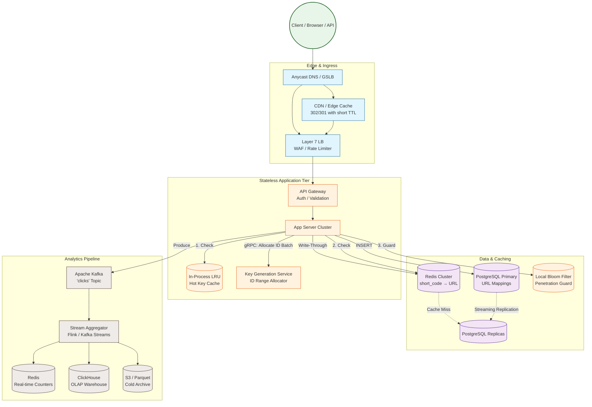

---

Design a URL shortener like bit.ly.


---

Here is a thorough, production-grade design for a URL shortening service (bit.ly-class).

---

## 1. Requirements & Constraints

| Category | Requirement |
|---|---|
| **Functional** | 1. Shorten a long URL to a 7-character path.<br>2. Redirect `GET /:short_code` → original URL.<br>3. Optional custom aliases (`/my-brand`).<br>4. Read-heavy analytics (clicks, geo, device). |
| **Non-Functional** | 1. Redirect p99 latency < 20 ms (cached), < 100 ms (uncached).<br>2. Shortening availability: 99.99 %. Redirect availability: 99.999 %.<br>3. Durability: never reuse a short code once issued.<br>4. Analytics may be eventually consistent (≤ 1 min). |

---

## 2. Capacity Math (Real Numbers)

### Traffic
*   **Writes:** 1,000,000 new short URLs/day = **11.6/s average**, **100/s peak**.
*   **Reads (redirects):** 100,000,000/day = **1,157/s average**, **10,000/s peak**.

### Short-Code Keyspace
*   Alphabet: `[a-zA-Z0-9]` = 62 symbols.
*   Length: 7 characters.
*   Total space: $62^7 = 3,521,614,606,208$ (≈ **3.5 trillion unique codes**).
*   At 1M codes/day, we exhaust the space in **~9,600 years**. 7 characters is sufficient; moving to 8 is not operationally necessary.

### Storage
*   URL mapping record (short_code, long_url, timestamps, user_id, flags) ≈ **1 KB** with index overhead.
*   Growth: 1M records/day × 1 KB = **1 GB/day** = **365 GB/year**.
*   5-year horizon: ~2 TB. Fits comfortably in a single modern PostgreSQL instance with read replicas; sharding is a future lever, not a day-1 requirement.

### Analytics
*   Raw click event (short_code, timestamp, IP hash, user-agent fragment, geo) ≈ **200 bytes**.
*   100M clicks/day × 200 B = **20 GB/day** raw ingress.
*   5-year raw archive: ~36 TB. We do **not** store all raw events in the hot path; we stream them to Kafka, aggregate into OLAP (ClickHouse), and archive cold logs to S3.

### Bandwidth
*   A redirect response (302 + `Location` header) is tiny: ~400 bytes.
*   100M redirects/day × 400 B = **40 GB/day outbound** = ~4 MB/s peak. The system is latency-bound, not bandwidth-bound.

---

## 3. API Contract

```http
POST /api/v1/urls
Body:   { "long_url": "https://example.com/...", "custom_alias": null, "ttl_sec": null }
Response: 201 Created
{ "short_url": "https://short.ly/aBc3xY9",
  "short_code": "aBc3xY9",
  "created_at": "2024-05-20T12:00:00Z" }

GET /:short_code
Response: 302 Found
Location: https://example.com/...
Cache-Control: private, max-age=300   # configurable per link

GET /api/v1/urls/:short_code/stats
Response: 200 OK
{ "clicks": { "total": 12345, "last_hour": 892, "top_countries": ["US", "IN"] } }
```

---

## 4. Architecture Overview



---

## 5. Component Deep Dive

### 5.1 Short-Code Generation (The KGS)

**The Problem:** Random generation with uniqueness checks is O(n) retry overhead at scale and thrashes the database. Auto-increment IDs are sequential and predictable.

**The Solution:** A **Key Generation Service (KGS)** that pre-allocates non-overlapping integer ranges to app servers.

*   KGS maintains a 64-bit counter in a highly consistent store (etcd/ZooKeeper) or simply uses a PostgreSQL advisory lock on a `sequence` table.
*   An app server requests a **batch of 1,000 IDs** via gRPC at startup and refills when low.
*   The app server converts each integer to **Base62** locally. Example: `1,000,000` → `"4c92"`.
*   **Uniqueness is guaranteed by construction**; no collision checking is needed at write time.

**Tradeoff:** If an app server crashes, its unused batch is **orphaned**. In a keyspace of 3.5 trillion, losing 1,000 IDs is irrelevant. We accept this for zero-contention ID issuance.

*Custom aliases* bypass the KGS and perform a direct PK existence check + INSERT against PostgreSQL, relying on the unique constraint. Conflicts return HTTP 409.

### 5.2 Redirect Path (Read-Heavy, Low Latency)

```
Client → CDN → LB → App → Local LRU → Redis → Replica (on miss)
```

1.  **CDN:** Caches 302/301 responses for 5 minutes. This absorbs the bulk of viral traffic.  
    *Tradeoff:* A cached 301/302 is hard to invalidate globally if the destination URL is updated. We mitigate by using short TTLs and defaulting to `Cache-Control: private, max-age=300`. Power users may opt for `max-age=0` (uncached) for mutable destinations.
2.  **Local In-Process Cache (Caffeine/LRU):** Each app node keeps the top 10,000 hottest codes in memory. This protects Redis from stampede on a viral link. Hit latency: ~1 µs.
3.  **Redis Cluster:** Sharded by `hash(short_code) % 32`. TTL: 24 hours, refreshed on access. Stores only the canonical URL string.
4.  **Bloom Filter:** Before hitting the replica on a cache miss, a local Bloom filter checks code existence. If the code definitely does not exist, we return 404 immediately without querying the DB, preventing cache penetration attacks.

**Thundering Herd Mitigation:** On a Redis miss for a hot key, app servers use a **singleflight** pattern (request coalescing) so only one thread queries the replica and repopulates Redis.

### 5.3 Analytics Pipeline (Write-Heavy, Tolerant)

Redirects must be fast; we do **not** write analytics synchronously to a database.

1.  App server produces a lightweight Avro event to a local **Kafka client** (fire-and-forget, batching 100 ms).
2.  **Kafka** (`clicks` topic, 64 partitions, keyed by `hash(short_code)`) buffers events.
3.  **Stream Processor (Flink):**
    *   1-minute tumbling windows aggregate: `count`, `unique IP HLL`, `top geo`.
    *   Writes rolled-up counters to **Redis** for the real-time stats API.
    *   Writes detailed aggregates to **ClickHouse** for ad-hoc analytics.
    *   Appends raw events to **S3 (Parquet)** for long-term compliance/data science.

**Tradeoff:** Analytics are **eventual** (≤ 60 seconds). This is acceptable; the stats API is not contractually real-time.

---

## 6. Data Model

### PostgreSQL (Source of Truth)
```sql
CREATE TABLE url_mappings (
    short_code    VARCHAR(7) PRIMARY KEY,
    canonical_url TEXT NOT NULL,
    created_at    TIMESTAMPTZ DEFAULT now(),
    expires_at    TIMESTAMPTZ NULL,
    is_active     BOOLEAN DEFAULT true,
    owner_id      BIGINT NULL,
    version       BIGINT DEFAULT 1   -- optimistic locking for updates
);

CREATE INDEX idx_expiry ON url_mappings(expires_at) 
    WHERE expires_at IS NOT NULL;

-- Soft-delete only. Codes are never physically reused.
```

### Redis
*   Key: `url:{short_code}`
*   Value: canonical_url (string)
*   TTL: 86400 seconds

### ClickHouse (Analytics)
```sql
CREATE TABLE url_stats_minute (
    short_code    LowCardinality(String),
    minute_bucket DateTime,
    country       LowCardinality(String),
    device_type   LowCardinality(String),
    click_count   UInt64,
    uniq_hll      AggregateFunction(uniq, FixedString(16)) -- IP hash
) ENGINE = SummingMergeTree()
ORDER BY (short_code, minute_bucket, country, device_type);
```

---

## 7. Explicit Tradeoffs

| Decision | Option A | Option B | Chosen & Why |
|---|---|---|---|
| **Redirect type** | 301 (Permanent, cached by browser forever) | 302 (Temporary, re-validated) | **302 default.** We sacrifice some edge-cache and browser-cache efficiency to retain control over destination changes and accurate click tracking. Power users may configure 301. |
| **Code generation** | Random 7-char + DB uniqueness check | Sequential Base62 of distributed ID | **Sequential via KGS.** Eliminates write-time collisions and retry storms. Predictability is acceptable because codes are opaque to users. |
| **Primary store** | PostgreSQL | Cassandra/DynamoDB | **PostgreSQL.** 2 TB/5 yr is trivial for a single-node primary. We gain ACID, complex queries for admin, and mature operational tooling. We scale reads via replicas and cache. |
| **Analytics writes** | Synchronous in redirect path | Async via Kafka | **Async.** Adds ≤ 1 ms to redirect latency vs potentially 50-100 ms to a DB write. |
| **Custom aliases** | Shared table with generated codes | Separate table | **Shared table.** Both use `short_code` as the natural PK. The KGS path is bypassed only for custom strings. |
| **URL deduplication** | Re-use existing code for identical long URLs | Always mint new code | **Always mint new.** Deduplication breaks per-user analytics and campaign tracking. Storage is cheap (1 GB/day). |

---

## 8. Failure Modes & Mitigations

| Failure | Impact | Mitigation |
|---|---|---|
| **KGS unavailable** | App servers cannot mint new sequential codes. | Each node buffers 1,000 IDs locally. If exhausted, fallback to **UUIDv7 + Base62** with a DB unique-constraint retry loop. Service degrades but stays available. |
| **PostgreSQL primary dies** | Cannot create new URLs. | Async replication to hot standby. Automatic failover (Patroni/RepMgr). **RPO < 5s** of new URLs lost; redirects still work because replicas serve reads. |
| **Redis total outage** | All redirects hit DB replicas. | A single PostgreSQL replica can sustain > 50k simple PK lookups/sec, so 10k peak is safe. We add **circuit breakers** to shed load if latency spikes. |
| **Kafka outage** | Analytics events lost. | App servers spool events to **local disk buffer** (e.g., 1 GB tmpfs). When Kafka returns, the agent replays. If the buffer fills, we **sample-drop** analytics rather than fail redirects. |
| **Cache stampede on viral URL** | 10,000 concurrent requests miss cache and query the same DB row. | **Singleflight** coalesces identical in-flight requests. One thread populates Redis; the rest wait and share the result. |
| **Cache penetration (fake codes)** | Attackers request non-existent codes, hitting the DB. | **Bloom Filter** on each app node blocks ~99 % of fake key lookups before they reach storage. |
| **Phishing / malware** | Bad actors use short links for scams. | Async integration with **Google Safe Browsing API** at creation time. If the check fails or the API is down, the link is created with `is_verified=false` and redirects through an interstitial warning page instead of directly. |
| **Cyclic redirect** | User shortens `short.ly/abc` pointing to `short.ly/abc`. | Validation layer rejects any `long_url` whose hostname matches our service domain. |
| **Code exhaustion (far future)** | 3.5 trillion codes consumed. | Not a realistic concern (millennia at current rate). If growth explodes 1000×, we migrate to 8-character codes with a prefix routing rule (e.g., `short.ly/8/xxxxxxx`). |

---

## 9. Scaling Levers (Beyond Day 1)

1.  **Read Scaling:** Add Redis read replicas and CDN PoPs. Stateless app servers scale horizontally behind the LB.
2.  **Write Scaling:** When PostgreSQL primary saturates (≥ 20k writes/sec), shard by `short_code` prefix into 16-32 Spanner/CockroachDB or Citus PostgreSQL shards.
3.  **Geographic Latency:** Deploy multi-region read replicas (Cloud SQL cross-region, Redis Global Datastore) for redirect serving. Writes remain single-region (strong consistency) until CockroachDB/Spanner is adopted.
4.  **Cost Optimization:** Move analytics cold storage from ClickHouse to S3 + Athena after 90 days.

---

This design provides a **durable, low-latency, read-heavy URL shortener** with a clear separation between the strongly consistent redirect metadata path and the eventually consistent analytics path, while keeping operational complexity proportional to the actual data volume (~2 TB hot, not petabytes).