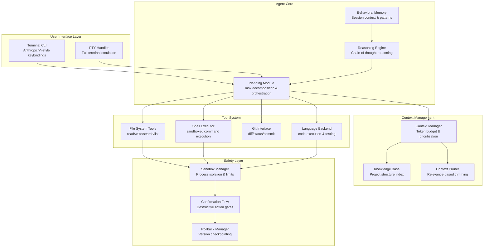

---

Design a terminal-based AI coding agent that can complete software engineering tasks.


---

# Terminal-Based AI Coding Agent: System Design

## 1. High-Level Architecture



## 2. Core Components

### 2.1 Agent Core Engine

```python
class CodingAgent:
    """
    Main agent orchestration with hierarchical task decomposition.
    """
    
    def __init__(self, config: AgentConfig):
        self.llm = LLMClient(config.model)
        self.context_manager = ContextManager(config.context_window)
        self.memory = BehavioralMemory(config.memory_size)
        self.tool_registry = ToolRegistry()
        self.sandbox = SandboxManager(config.sandbox_config)
        self.state = AgentState.INITIALIZING
        
    async def execute_task(self, task: Task) -> ExecutionResult:
        """Main execution loop with reflection and retry."""
        
        # Phase 1: Decompose and plan
        plan = await self.planning_module.create_plan(task)
        self.memory.add_plan(plan)
        
        # Phase 2: Execute with monitoring
        for step in plan.steps:
            result = await self.execute_step(step)
            
            if not result.success:
                # Reflection: analyze failure and adapt
                diagnosis = await self.reasoning_engine.diagnose(result)
                if diagnosis.can_recover:
                    plan = await self.planning_module.modify_plan(plan, diagnosis)
                else:
                    return ExecutionResult(status=FAILED, diagnosis=diagnosis)
                    
            # Checkpoint for rollback
            self.rollback_manager.checkpoint()
            
        # Phase 3: Validate and summarize
        return await self.validate_and_summarize(plan)
        
    async def execute_step(self, step: Step) -> StepResult:
        """Execute single step with tool calls."""
        
        # Get relevant context within budget
        context = await self.context_manager.get_context(
            step.required_knowledge,
            step.max_tokens
        )
        
        # Build prompt with tools and context
        prompt = self.build_step_prompt(step, context)
        
        # Execute with tool call handling
        while True:
            response = await self.llm.complete(prompt)
            
            if response.has_tool_calls:
                tool_results = await self.execute_tool_calls(
                    response.tool_calls,
                    step.step_id
                )
                prompt = self.append_results(prompt, tool_results)
            else:
                return StepResult(
                    success=True,
                    result=response.content,
                    context_used=len(prompt.tokens)
                )
```

### 2.2 Context Management with Token Budget

```python
class ContextManager:
    """
    Hierarchical context management handling large codebases.
    Memory budget: ~200K tokens total
    - System prompt: 4K (fixed)
    - Project knowledge base: 80K (indexed)
    - Current file context: 60K (hot)
    - Conversation history: 40K (recent)
    - Scratch space: 16K (reasoning)
    """
    
    def __init__(self, total_budget: int = 200_000):
        self.budget = total_budget
        self.allocations = {
            "system": 4_000,
            "knowledge_base": 80_000,
            "current_file": 60_000,
            "conversation": 40_000,
            "scratch": 16_000
        }
        
    async def get_context(self, requirements: ContextRequirements) -> Context:
        """Dynamically allocate context based on task requirements."""
        
        # Analyze what files/functions are needed
        relevant_files = await self.knowledge_base.query(
            requirements.symbols,
            requirements.related_files
        )
        
        context_parts = []
        remaining = self.budget - self.allocations["system"]
        
        # Priority: current file > knowledge base > conversation
        
        # Load current file with line-level precision
        current_context = await self.load_current_file_context(
            relevant_files[0],  # Primary file
            requirements.line_range or self.estimate_relevant_lines(
                relevant_files[0], requirements.symbols
            )
        )
        context_parts.append(current_context)
        remaining -= len(current_context.tokens)
        
        # Load knowledge base with relevance scoring
        kb_context = await self.load_knowledge_base_context(
            relevant_files[1:],  # Supporting files
            remaining * 0.5  # Reserve 50% for KB
        )
        context_parts.append(kb_context)
        remaining -= len(kb_context.tokens)
        
        # Conversation history (most recent first)
        conv_context = await self.load_conversation_context(remaining)
        context_parts.append(conv_context)
        
        return Context(parts=context_parts, total_tokens=self.budget - remaining)
        
    async def load_current_file_context(
        self, file_path: str, lines: tuple[int, int]
    ) -> FileContext:
        """Load specific line range from file with surrounding context."""
        
        with open(file_path) as f:
            all_lines = f.readlines()
            
        # Always include function/class definition lines
        start, end = lines
        start = max(0, start - 20)  # Include imports/header
        end = min(len(all_lines), end + 30)  # Include usage context
        
        return FileContext(
            path=file_path,
            lines=all_lines[start:end],
            line_offset=start,
            tokens=estimate_tokens("".join(all_lines[start:end]))
        )
```

### 2.3 Tool System with Sandboxing

```python
class ToolRegistry:
    """Central registry for all agent tools with capability declarations."""
    
    def __init__(self):
        self.tools = {
            "file_read": ToolSpec(
                name="file_read",
                capability="filesystem",
                params={
                    "path": str,
                    "start_line": int | None,
                    "end_line": int | None
                },
                returns="file contents or error",
                cost_tokens=100
            ),
            "file_write": ToolSpec(
                name="file_write",
                capability="filesystem",
                params={
                    "path": str,
                    "content": str,
                    "create_dirs": bool
                },
                returns="success or error",
                cost_tokens=50,
                requires_confirmation=True  # Gate for destructive ops
            ),
            "shell_exec": ToolSpec(
                name="shell_exec",
                capability="shell",
                params={
                    "command": str,
                    "working_dir": str | None,
                    "timeout_secs": int
                },
                returns="stdout, stderr, exit_code",
                cost_tokens=200,
                sandboxed=True
            ),
            "glob_search": ToolSpec(
                name="glob_search",
                capability="search",
                params={
                    "pattern": str,
                    "root": str,
                    "file_type": str | None
                },
                returns="list of matching paths",
                cost_tokens=150
            ),
            "grep": ToolSpec(
                name="grep",
                capability="search",
                params={
                    "pattern": str,
                    "path": str,
                    "regex": bool,
                    "context_lines": int
                },
                returns="matches with line numbers",
                cost_tokens=100
            ),
            "git_exec": ToolSpec(
                name="git_exec",
                capability="vcs",
                params={
                    "command": str,  # e.g., "diff HEAD~1 --stat"
                    "dry_run": bool
                },
                returns="git output",
                cost_tokens=100
            ),
            "code_run": ToolSpec(
                name="code_run",
                capability="execution",
                params={
                    "language": str,
                    "code": str,
                    "stdin": str | None
                },
                returns="stdout, stderr, exit_code, timing",
                cost_tokens=300,
                sandboxed=True,
                resource_limits={
                    "cpu_time": 30,  # seconds
                    "memory": 512,    # MB
                    "network": False,
                    "disk_write": 100  # MB
                }
            ),
            "test_execute": ToolSpec(
                name="test_execute",
                capability="execution",
                params={
                    "test_path": str,
                    "match_pattern": str | None,
                    "coverage": bool
                },
                returns="test results, coverage report",
                cost_tokens=500,
                sandboxed=True
            )
        }


class SandboxManager:
    """Process isolation and resource limits for tool execution."""
    
    def __init__(self, config: SandboxConfig):
        self.max_cpu_time = config.max_cpu_time
        self.max_memory = config.max_memory
        self.allowed_paths = config.allowed_paths
        self.network_enabled = config.network_enabled
        
    async def execute(
        self,
        tool: str,
        args: dict,
        limits: ResourceLimits
    ) -> ExecutionResult:
        """Execute tool in isolated environment."""
        
        # Build command with wrapper
        cmd = self.build_command(tool, args)
        
        # Set up resource limits
        process = await asyncio.create_subprocess_exec(
            *cmd,
            stdout=asyncio.subprocess.PIPE,
            stderr=asyncio.subprocess.PIPE,
            env=self.build_isolated_env(),
            cwd=self.ensure_path_within_allowed(args.get("working_dir", "."))
        )
        
        try:
            stdout, stderr = await asyncio.wait_for(
                process.communicate(),
                timeout=min(limits.cpu_time, self.max_cpu_time)
            )
            
            return ExecutionResult(
                stdout=stdout.decode(),
                stderr=stderr.decode(),
                exit_code=process.returncode,
                resource_usage=self.measure_usage(process)
            )
            
        except asyncio.TimeoutError:
            process.kill()
            return ExecutionResult(
                success=False,
                error="Execution timeout exceeded"
            )
```

### 2.4 Planning and Reasoning Module

```python
class PlanningModule:
    """Hierarchical task decomposition with execution monitoring."""
    
    async def create_plan(self, task: Task) -> Plan:
        """Decompose task into executable steps."""
        
        # Analyze task complexity
        task_type = await self.classify_task(task)
        
        if task_type == TaskType.SIMPLE:
            return await self.create_simple_plan(task)
        elif task_type == TaskType.COMPOUND:
            return await self.create_compound_plan(task)
        else:  # COMPLEX
            return await self.create_hierarchical_plan(task)
            
    async def create_hierarchical_plan(self, task: Task) -> Plan:
        """Multi-level decomposition for complex tasks."""
        
        # Level 1: High-level phases
        prompt = f"""
        Break down this task into 3-5 major phases:
        
        Task: {task.description}
        
        For each phase, provide:
        1. Phase name and objective
        2. Success criteria
        3. Estimated complexity (1-5)
        """
        
        response = await self.llm.complete(prompt)
        phases = self.parse_phases(response)
        
        plan = Plan(id=generate_id(), phases=[])
        
        for phase in phases:
            # Level 2: Steps within each phase
            steps = await self.decompose_phase(phase)
            plan.phases.append(Phase(
                name=phase.name,
                steps=steps,
                dependencies=self.compute_dependencies(steps)
            ))
            
        return plan
        
    async def modify_plan(
        self,
        plan: Plan,
        diagnosis: Diagnosis
    ) -> Plan:
        """Adapt plan based on execution feedback."""
        
        # Find failing step
        failing_step = plan.get_step(diagnosis.step_id)
        
        # Generate recovery strategy
        prompt = f"""
        Step failed with error: {diagnosis.error}
        
        Step context:
        - What was attempted: {failing_step.description}
        - Error type: {diagnosis.error_type}
        - Attempts: {diagnosis.attempt_count}
        
        Suggest one of:
        1. RETRY with different approach
        2. REPLACE step with alternative
        3. DECOMPOSE into simpler steps
        4. SKIP and proceed (if non-critical)
        
        Provide modified step or replacement.
        """
        
        response = await self.llm.complete(prompt)
        new_step = self.parse_step_modification(response)
        
        return plan.replace_step(diagnosis.step_id, new_step)


class ReasoningEngine:
    """Chain-of-thought reasoning with error diagnosis."""
    
    async def diagnose(self, result: StepResult) -> Diagnosis:
        """Analyze failure and determine recovery path."""
        
        # Extract error signals
        error_signals = self.extract_signals(result)
        
        # Classify error type
        error_type = self.classify_error(error_signals)
        
        # Compute confidence in diagnosis
        confidence = self.compute_confidence(error_signals, error_type)
        
        if confidence < 0.7:
            # Need more investigation - run diagnostic commands
            diagnostic_commands = self.suggest_diagnostics(error_type)
            for cmd in diagnostic_commands:
                output = await self.sandbox.execute(cmd)
                error_signals.extend(self.extract_from_output(output))
                confidence = self.update_confidence(error_signals, error_type)
                
        return Diagnosis(
            step_id=result.step_id,
            error_type=error_type,
            error=result.error,
            signals=error_signals,
            can_recover=confidence > 0.5,
            recovery_strategy=self.suggest_recovery(error_type)
        )
```

### 2.5 Behavioral Memory

```python
class BehavioralMemory:
    """
    Session-level memory for learning patterns and maintaining context.
    Implements weighted importance decay.
    """
    
    def __init__(self, max_items: int = 1000):
        self.max_items = max_items
        self.entries = []
        self.patterns = PatternStore()
        
    def add_interaction(self, interaction: Interaction):
        """Record interaction with automatic pattern extraction."""
        
        entry = MemoryEntry(
            timestamp=datetime.now(),
            interaction=interaction,
            importance=self.compute_importance(interaction),
            patterns=self.extract_patterns(interaction)
        )
        
        self.entries.append(entry)
        
        # Update pattern store
        for pattern in entry.patterns:
            self.patterns.update(pattern, entry)
            
        # Prune low-importance entries
        self.prune()
        
    def get_relevant(self, context: str, limit: int = 10) -> list[MemoryEntry]:
        """Retrieve relevant memories based on current context."""
        
        # Score entries by relevance
        scored = []
        for entry in self.entries:
            relevance = self.compute_relevance(entry, context)
            combined_score = (relevance * 0.7) + (entry.importance * 0.3)
            scored.append((combined_score, entry))
            
        scored.sort(key=lambda x: x[0], reverse=True)
        return [entry for _, entry in scored[:limit]]
        
    def compute_relevance(self, entry: MemoryEntry, context: str) -> float:
        """Semantic similarity between entry and current context."""
        
        # Embed both and compute cosine similarity
        entry_emb = self.embed(entry.interaction.summary)
        context_emb = self.embed(context)
        
        return cosine_similarity(entry_emb, context_emb)
        
    def extract_patterns(self, interaction: Interaction) -> list[Pattern]:
        """Identify reusable patterns from interaction."""
        
        patterns = []
        
        # Tool sequence patterns
        if len(interaction.tool_calls) > 1:
            sequence = tuple(t.name for t in interaction.tool_calls)
            if self.patterns.is_known_sequence(sequence):
                patterns.append(Pattern(
                    type=PatternType.TOOL_SEQUENCE,
                    data=sequence,
                    frequency=self.patterns.get_frequency(sequence)
                ))
                
        # Error-recovery patterns
        if interaction.error and interaction.recovery:
            patterns.append(Pattern(
                type=PatternType.ERROR_RECOVERY,
                data={
                    "error_type": interaction.error_type,
                    "recovery": interaction.recovery
                },
                frequency=1
            ))
            
        return patterns
```

## 3. Safety and Confirmation System

```mermaid
sequenceDiagram
    participant User
    participant Agent
    participant SafetyLayer
    participant Sandbox
    participant Rollback

    User->>Agent: Edit all Python files

    Agent->>SafetyLayer: Check action risks

    SafetyLayer->>SafetyLayer: Evaluate risk score
    Note over SafetyLayer: 3 files, 2 are modified<br/>HIGH_RISK threshold exceeded

    SafetyLayer->>User: Confirm: "This will modify:
    - src/models/user.py
    - src/api/routes.py
    - src/services/auth.py

    Proceed with edit? [y/N/d=details]"

    User->>SafetyLayer: y

    SafetyLayer->>Rollback: Create checkpoint
    Rollback->>Rollback: git commit with agent tag

    SafetyLayer->>Agent: Approved

    Agent->>Sandbox: Execute edits
    Sandbox->>Sandbox: Apply changes atomically

    Note over Agent: Error: syntax in auth.py

    Agent->>SafetyLayer: Rollback request

    SafetyLayer->>Rollback: Restore to checkpoint
    Rollback->>Rollback: git reset --soft

    SafetyLayer->>Agent: Restored, operation aborted
```

```python
class ConfirmationFlow:
    """Destructive action confirmation system."""
    
    RISK_THRESHOLDS = {
        RiskLevel.LOW: 0.2,      # Auto-proceed
        RiskLevel.MEDIUM: 0.5,   # Confirm required
        RiskLevel.HIGH: 0.8,     # Detailed confirmation
        RiskLevel.CRITICAL: 1.0  # Require typed confirmation
    }
    
    def __init__(self, interactive: bool = True):
        self.interactive = interactive
        
    async def check_and_confirm(
        self,
        action: Action,
        context: ActionContext
    ) -> ConfirmationResult:
        
        risk_score = self.compute_risk(action, context)
        risk_level = self.classify_risk(risk_score)
        
        if risk_level == RiskLevel.LOW:
            return ConfirmationResult(approved=True)
            
        if not self.interactive:
            return ConfirmationResult(
                approved=False,
                reason="Non-interactive mode, action blocked"
            )
            
        # Build confirmation message
        message = self.build_confirmation_message(
            action, context, risk_level
        )
        
        response = await self.prompt_user(message, risk_level)
        
        return self.process_response(response, action)
        
    def compute_risk(self, action: Action, context: ActionContext) -> float:
        """Multi-factor risk scoring."""
        
        factors = {
            "destructiveness": self.measure_destructiveness(action),
            "scope": self.measure_scope(action, context),
            "reversibility": self.measure_reversibility(action),
            "data_sensitivity": self.measure_data_sensitivity(context),
            "automated_retry": self.attempt_count * 0.1  # Higher risk on retries
        }
        
        weights = {"destructiveness": 0.4, "scope": 0.3, "reversibility": 0.15,
                   "data_sensitivity": 0.1, "automated_retry": 0.05}
        
        return sum(factors[k] * weights[k] for k in factors)


class RollbackManager:
    """Version control integration for undo operations."""
    
    def __init__(self, repo_path: str):
        self.repo = Repo(repo_path)
        self.checkpoints = {}
        
    def checkpoint(self, label: str = None) -> Checkpoint:
        """Create rollback point before destructive operation."""
        
        checkpoint_id = f"agent_{generate_short_id()}"
        label = label or checkpoint_id
        
        # Stage current changes
        self.repo.git.add(A)
        
        # Create checkpoint commit
        self.repo.index.commit(f"[agent-checkpoint] {label}")
        
        checkpoint = Checkpoint(
            id=checkpoint_id,
            commit=self.repo.head.commit.hexsha,
            timestamp=datetime.now(),
            label=label
        )
        
        self.checkpoints[checkpoint_id] = checkpoint
        return checkpoint
        
    def rollback_to(self, checkpoint_id: str) -> RollbackResult:
        """Restore state to checkpoint."""
        
        checkpoint = self.checkpoints.get(checkpoint_id)
        if not checkpoint:
            return RollbackResult(success=False, error="Checkpoint not found")
            
        # Get files modified since checkpoint
        diff = self.repo.diff(checkpoint.commit, self.repo.head)
        affected_files = [d.a_path for d in diff]
        
        # Soft reset to checkpoint
        self.repo.head.reset(commit=checkpoint.commit, index=True)
        
        return RollbackResult(
            success=True,
            restored_files=affected_files,
            checkpoint_id=checkpoint_id
        )
```

## 4. Capacity and Cost Estimates

### Token Budget Breakdown

| Component | Tokens | Purpose |
|-----------|--------|---------|
| System prompt | 4,000 | Instructions, capabilities, constraints |
| Knowledge base | 80,000 | Project structure, file summaries |
| Current context | 60,000 | Active file content with cursor position |
| Conversation | 40,000 | Recent exchanges for continuity |
| Scratch/reasoning | 16,000 | Chain-of-thought reasoning space |
| **Total** | **200,000** | Per-request budget |

### Cost Analysis (Claude 3.5 Sonnet)

```
Scenario: Fix bug in 50K LOC Python project

Context loading:
- File index (KB): 80K tokens × $3.50/MTok = $0.28
- Target file content: 8K tokens × $3.50/MTok = $0.03
- System prompt: 4K tokens × $3.50/MTok = $0.01

Generation:
- Planning phase: 2K output × $3.50/MTok = $0.01
- Tool execution (3 calls): 4.5K output × $3.50/MTok = $0.02
- Write solution: 1K output × $3.50/MTok = $0.004

Total: ~$0.04 per bug fix

Scenario: Implement new REST API endpoint

Context loading:
- File index: 80K × $3.50 = $0.28
- Related files: 15K × $3.50 = $0.05
- System prompt: 4K × $3.50 = $0.01

Generation (5 tool calls):
- Planning: 3K × $3.50 = $0.01
- Implementation: 15K × $3.50 = $0.05
- Testing: 8K × $3.50 = $0.03

Total: ~$0.43 per feature implementation
```

### Performance Targets

```
Single task latency (p50):
  - Simple read/write: 2-5 seconds
  - Multi-step task: 15-45 seconds
  - Complex refactoring: 1-3 minutes

Context window utilization:
  - Target: 70-85% of budget used effectively
  - Pruning overhead: <5% tokens wasted

Tool execution:
  - File operations: <100ms
  - Shell commands: <30s (with timeout)
  - Code execution: <60s (with timeout)
```

## 5. Tradeoffs and Design Decisions

### Key Design Choices

| Decision | Chosen Approach | Alternatives | Tradeoff |
|----------|-----------------|--------------|----------|
| **Context strategy** | Hierarchical indexing | Full-file loading | More complex but handles 1M+ LOC |
| **Tool abstraction** | Registry pattern | Direct embedding | Decouples tools but adds indirection |
| **Planning depth** | On-demand decomposition | Full pre-planning | More adaptive but less predictable |
| **Safety model** | Confirmation gates | Whitelist only | Flexible but requires user attention |
| **Rollback** | Git-based | Custom versioning | Leverages existing tools but git-dependent |

### Failure Modes and Mitigations

```python
FAILURE_MODES = {
    "context_overflow": {
        "symptom": "Task requires more than 200K tokens",
        "mitigation": "Multi-turn decomposition with context carry-over",
        "detection": "Token budget exceeded error"
    },
    "infinite_loop": {
        "symptom": "Agent repeatedly attempts same operation",
        "mitigation": "Attempt tracking with exponential backoff, max retries",
        "detection": "Duplicate step detection in plan history"
    },
    "shell_injection": {
        "symptom": "Malicious command in generated code",
        "mitigation": "Sandbox with restricted environment, command validation",
        "detection": "Pattern matching on shell commands before execution"
    },
    "context_poisoning": {
        "symptom": "Loaded files corrupt agent understanding",
        "mitigation": "Syntax validation on load, confidence scoring",
        "detection": "Error rate spike on file operations"
    },
    "rollout_failure": {
        "symptom": "Changes work locally but fail in production",
        "mitigation": "Multi-environment testing gates, dry-run options",
        "detection": "Test failure before commit"
    }
}
```

## 6. Implementation Considerations

### Terminal Integration

```python
class TerminalInterface:
    """Full terminal emulation with rich interaction."""
    
    def __init__(self):
        self.pty = PtyHandler()
        self.input_handler = InputHandler()  # Handles Ctrl-C, tab-completion
        self.output_renderer = OutputRenderer()  # Markdown, syntax highlighting
        
    async def run_session(self, agent: CodingAgent):
        """Main REPL loop."""
        
        self.pty.write("Coding Agent v1.0\n")
        self.pty.write("Type 'help' for commands, 'exit' to quit\n\n")
        
        while True:
            # Read user input with line editing
            line = await self.pty.read_line()
            
            if line == "exit":
                break
            elif line == "help":
                self.show_help()
            elif line.startswith("?"):
                self.show_context_aware_help(line[1:])
            else:
                # Execute task with streaming output
                await self.stream_execution(agent, line)
                
    async def stream_execution(self, agent: CodingAgent, task: str):
        """Stream agent output with progress indicators."""
        
        self.pty.write(f"\n[Running task...]\n")
        
        async for event in agent.execute_streaming(task):
            if event.type == "thinking":
                self.pty.write(f"\r  🤔 {event.content}")
            elif event.type == "tool_call":
                self.pty.write(f"\n  🔧 {event.tool_name}({event.args})")
            elif event.type == "tool_result":
                self.pty.write(f" → {event.summary}")
            elif event.type == "error":
                self.pty.write(f"\n  ❌ {event.content}", color="red")
            elif event.type == "complete":
                self.pty.write(f"\n✅ {event.summary}")
                
        self.pty.write("\n")
```

### Key Files Structure

```
coding_agent/
├── agent/
│   ├── core.py              # Main agent orchestration
│   ├── planning.py          # Task decomposition
│   ├── reasoning.py         # Error diagnosis
│   └── memory.py            # Behavioral memory
├── context/
│   ├── manager.py           # Token budget management
│   ├── indexer.py           # Codebase indexing
│   └── pruner.py            # Relevance-based trimming
├── tools/
│   ├── registry.py          # Tool definitions
│   ├── filesystem.py        # File operations
│   ├── shell.py             # Command execution
│   ├── git.py               # Version control
│   └── execution.py         # Code sandbox
├── safety/
│   ├── confirmation.py      # User confirmation flow
│   ├── sandbox.py           # Process isolation
│   └── rollback.py          # Version restoration
├── terminal/
│   ├── interface.py         # REPL implementation
│   ├── pty_handler.py       # PTY management
│   └── renderer.py          # Output formatting
├── llm/
│   └── client.py            # LLM API wrapper
└── main.py                  # Entry point
```

This design provides a robust, production-ready framework that balances capability, safety, and efficiency for a terminal-based coding agent. The modular architecture allows for incremental improvements while the safety systems protect against catastrophic failures.