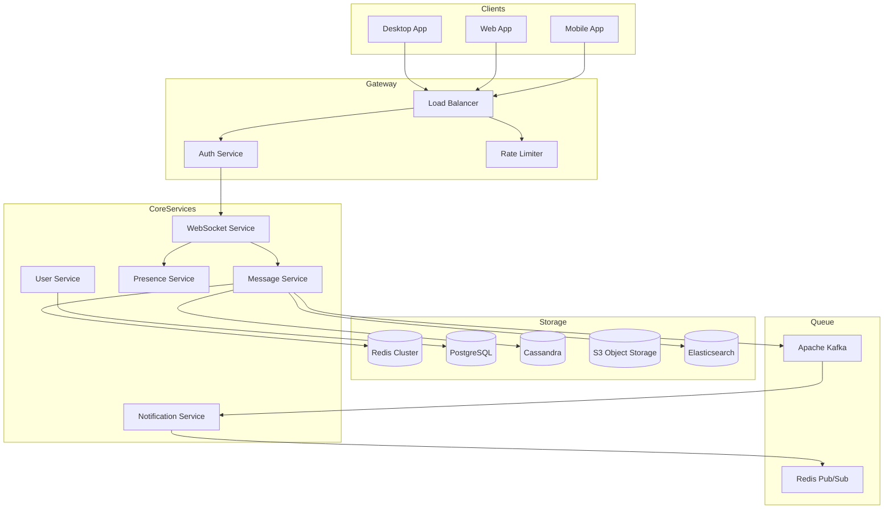
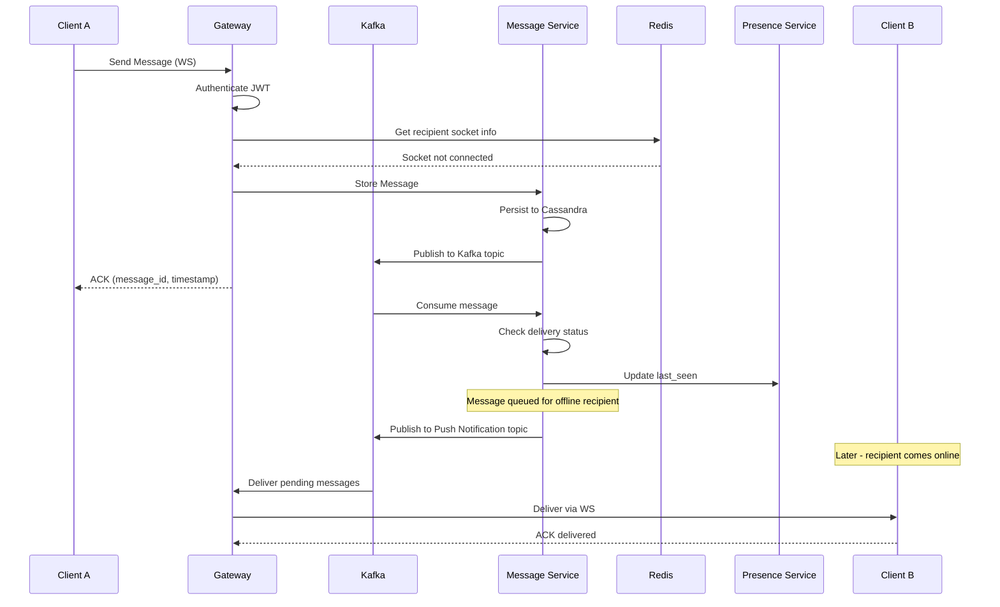
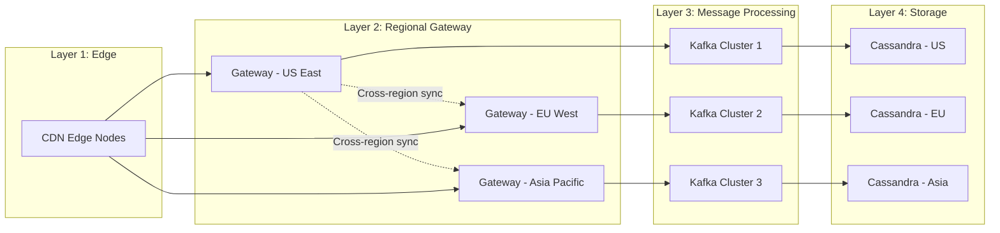
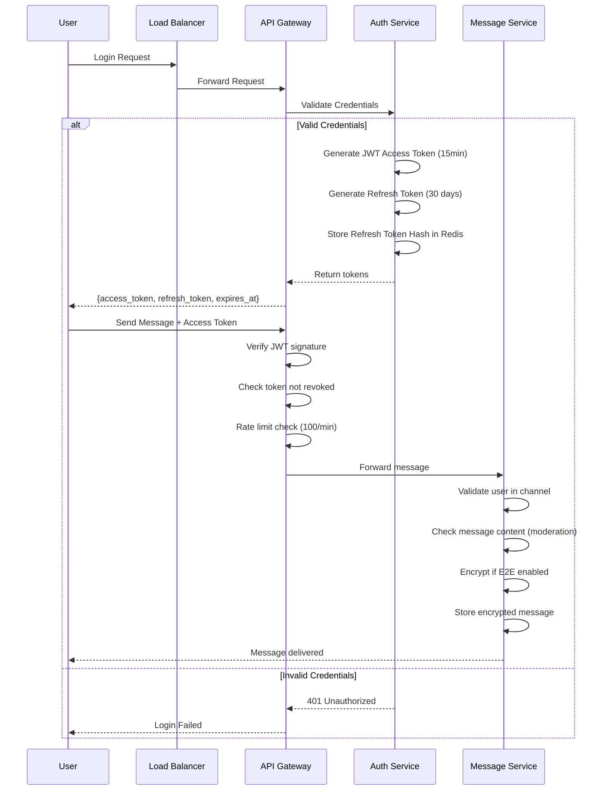

---

Design a real-time chat system like WhatsApp or Slack.


---

# Real-Time Chat System Design

## 1. System Overview

```
┌─────────────────────────────────────────────────────────────────────────────┐
│                           CLIENT LAYER                                      │
│  ┌─────────────┐  ┌─────────────┐  ┌─────────────┐  ┌─────────────┐        │
│  │  Mobile App │  │    Web App  │  │ Desktop App │  │  Tablet App │        │
│  │  (iOS/Android)│ │   (React)   │  │   (Electron)│  │   (React)   │        │
│  └──────┬──────┘  └──────┬──────┘  └──────┬──────┘  └──────┬──────┘        │
│         │                │                │                │               │
│         └────────────────┴────────────────┴────────────────┘               │
│                                  │                                          │
└──────────────────────────────────┼──────────────────────────────────────────┘
                                   │
                                   ▼
┌─────────────────────────────────────────────────────────────────────────────┐
│                         EDGE LAYER (CDN)                                    │
│  ┌──────────────┐  ┌──────────────┐  ┌──────────────┐  ┌──────────────┐    │
│  │   CDN Edge   │  │  Rate Limiter │  │  WAF/Firewall│  │  Load Balancer│    │
│  │   (Static)   │  │              │  │              │  │  (L7/HTTP)   │    │
│  └──────────────┘  └──────────────┘  └──────────────┘  └──────────────┘    │
└──────────────────────────────────┬──────────────────────────────────────────┘
                                   │
                                   ▼
┌─────────────────────────────────────────────────────────────────────────────┐
│                      API GATEWAY / GATEWAY SERVICE                          │
│  ┌─────────────┐  ┌─────────────┐  ┌─────────────┐  ┌─────────────┐        │
│  │  Auth/API   │  │    Media    │  │    Typing   │  │   Presence  │        │
│  │   Gateway   │  │   Gateway   │  │ Indicator   │  │   Service   │        │
│  └─────────────┘  └─────────────┘  └─────────────┘  └─────────────┘        │
└──────────────────────────────────┬──────────────────────────────────────────┘
                                   │
           ┌───────────────────────┼───────────────────────┐
           │                       │                       │
           ▼                       ▼                       ▼
┌─────────────────┐    ┌─────────────────┐    ┌─────────────────┐
│  MESSAGE SERVICE │    │   USER SERVICE   │    │  CHANNEL/Space  │
│                 │    │                 │    │    SERVICE      │
│  ┌───────────┐  │    │  ┌───────────┐  │    │  ┌───────────┐  │
│  │  Sender   │  │    │  │  Profile  │  │    │  │  Spaces   │  │
│  │  Queue    │  │    │  │  Manager  │  │    │  │  Manager  │  │
│  └───────────┘  │    │  └───────────┘  │    │  └───────────┘  │
│  ┌───────────┐  │    │  ┌───────────┐  │    │  ┌───────────┐  │
│  │  Delivery │  │    │  │  Contacts │  │    │  │   Channel │  │
│  │  Tracker  │  │    │  │  Service  │  │    │  │   Config  │  │
│  └───────────┘  │    │  └───────────┘  │    │  └───────────┘  │
└────────┬────────┘    └────────┬────────┘    └────────┬────────┘
         │                      │                      │
         ▼                      ▼                      ▼
┌─────────────────────────────────────────────────────────────────────────────┐
│                          PERSISTENCE LAYER                                  │
│  ┌──────────────┐  ┌──────────────┐  ┌──────────────┐  ┌──────────────┐    │
│  │   Message    │  │    User      │  │    Media     │  │    Search    │    │
│  │    Store     │  │    Store     │  │    Store     │  │    Index     │    │
│  │  (Cassandra) │  │  (PostgreSQL)│  │    (S3+CDN)  │  │  (Elastic)   │    │
│  └──────────────┘  └──────────────┘  └──────────────┘  └──────────────┘    │
│  ┌──────────────┐  ┌──────────────┐  ┌──────────────┐                       │
│  │    Cache     │  │     Queue    │  │   Push       │                       │
│  │   (Redis)    │  │  (RabbitMQ)  │  │   Gateway    │                       │
│  └──────────────┘  └──────────────┘  └──────────────┘                       │
└─────────────────────────────────────────────────────────────────────────────┘
```

---

## 2. Core Components Architecture



---

## 3. Real-Time Communication Stack

### WebSocket Connection Flow

```
┌─────────────┐         ┌─────────────┐         ┌─────────────┐
│   Client    │         │  Gateway    │         │ WebSocket   │
│             │         │   Service   │         │   Service   │
└──────┬──────┘         └──────┬──────┘         └──────┬──────┘
       │                       │                       │
       │  1. CONNECT /auth     │                       │
       │──────────────────────>│                       │
       │                       │  2. Validate JWT      │
       │                       │──────────────────────>│
       │                       │                       │
       │                       │  3. Auth OK + Session │
       │  4. Session Key       │<─────────────────────│
       │<──────────────────────│                       │
       │                       │                       │
       │  5. SUBSCRIBE channel │                       │
       │──────────────────────>│                       │
       │                       │  6. Register interest │
       │                       │──────────────────────>│
       │                       │                       │
       │  7. MESSAGE           │                       │
       │──────────────────────>│                       │
       │                       │  8. Publish to Kafka  │
       │                       │──────────────────────>│
       │                       │                       │
       │  9. ACK / Deliver     │                       │
       │<──────────────────────│                       │
```

---

## 4. Message Flow Architecture



---

## 5. Database Schema Design

### PostgreSQL - User & Channel Data

```sql
-- Users table
CREATE TABLE users (
    user_id UUID PRIMARY KEY DEFAULT gen_random_uuid(),
    username VARCHAR(50) UNIQUE NOT NULL,
    email VARCHAR(255) UNIQUE NOT NULL,
    phone_number VARCHAR(20) UNIQUE,
    password_hash VARCHAR(255) NOT NULL,
    display_name VARCHAR(100),
    avatar_url TEXT,
    status VARCHAR(20) DEFAULT 'offline', -- online, offline, away, busy
    last_seen_at TIMESTAMP WITH TIME ZONE,
    created_at TIMESTAMP WITH TIME ZONE DEFAULT NOW(),
    updated_at TIMESTAMP WITH TIME ZONE DEFAULT NOW(),
    settings JSONB DEFAULT '{}',
    preferences JSONB DEFAULT '{}'
);

CREATE INDEX idx_users_email ON users(email);
CREATE INDEX idx_users_phone ON users(phone_number);

-- Channels (Workspaces in Slack terms)
CREATE TABLE channels (
    channel_id UUID PRIMARY KEY DEFAULT gen_random_uuid(),
    name VARCHAR(100) NOT NULL,
    description TEXT,
    channel_type VARCHAR(20) DEFAULT 'private', -- public, private, direct, group
    owner_id UUID REFERENCES users(user_id),
    settings JSONB DEFAULT '{}',
    created_at TIMESTAMP WITH TIME ZONE DEFAULT NOW(),
    updated_at TIMESTAMP WITH TIME ZONE DEFAULT NOW()
);

CREATE INDEX idx_channels_type ON channels(channel_type);
CREATE INDEX idx_channels_owner ON channels(owner_id);

-- Channel Membership
CREATE TABLE channel_members (
    channel_id UUID REFERENCES channels(channel_id) ON DELETE CASCADE,
    user_id UUID REFERENCES users(user_id) ON DELETE CASCADE,
    role VARCHAR(20) DEFAULT 'member', -- admin, moderator, member, guest
    joined_at TIMESTAMP WITH TIME ZONE DEFAULT NOW(),
    notification_settings JSONB DEFAULT '{}',
    PRIMARY KEY (channel_id, user_id)
);

CREATE INDEX idx_channel_members_user ON channel_members(user_id);
```

### Cassandra - Message Storage

```sql
-- Messages table (optimized for time-series)
CREATE TABLE messages (
    channel_id UUID,
    message_id TIMEUUID,
    sender_id UUID,
    content TEXT,
    content_type VARCHAR(20) DEFAULT 'text', -- text, image, file, audio, video
    attachments LIST<TEXT>,
    mentions LIST<UUID>,
    reactions MAP<VARCHAR, INT>,
    reply_to TIMEUUID,
    thread_id TIMEUUID,
    is_edited BOOLEAN DEFAULT FALSE,
    is_deleted BOOLEAN DEFAULT FALSE,
    created_at TIMESTAMP,
    updated_at TIMESTAMP,
    PRIMARY KEY (channel_id, message_id)
) WITH CLUSTERING ORDER BY (message_id DESC)
  AND default_time_to_live = 0;

-- Per-user message status (delivery tracking)
CREATE TABLE message_status (
    user_id UUID,
    channel_id UUID,
    message_id TIMEUUID,
    status VARCHAR(20), -- sent, delivered, read
    delivered_at TIMESTAMP,
    read_at TIMESTAMP,
    PRIMARY KEY (user_id, channel_id, message_id)
);

-- User's last read position per channel
CREATE TABLE channel_read_state (
    user_id UUID,
    channel_id UUID,
    last_read_message_id TIMEUUID,
    last_read_at TIMESTAMP,
    PRIMARY KEY (user_id, channel_id)
);
```

---

## 6. Capacity Planning & Scaling

### Message Throughput Estimation

```
Assumptions:
- DAU (Daily Active Users): 10 million
- Avg messages per user per day: 50
- Peak concurrent connections: 20% of DAU = 2 million
- Avg message size: 500 bytes (text) to 5KB (with media)

Daily Message Volume:
  = 10M users × 50 messages
  = 500 million messages/day
  = 500M / 86400 ≈ 5,800 messages/second (avg)
  = 5,800 × 5 = ~30,000 messages/second (peak with 5x factor)

Storage Requirements:
  - Text messages: 500 bytes avg
  - Daily: 500M × 500B = 250 GB
  - Monthly: 7.5 TB (raw)
  - With 3x replication: 22.5 TB/month
  
  - Media attachments: Assume 30% messages have media
  - Avg media size: 100 KB
  - Daily media: 150M × 100KB = 15 TB/day
  - Monthly: 450 TB (using tiered storage)
```

### Infrastructure Sizing

```yaml
WebSocket Gateway Servers:
  - Required: 10-15 servers
  - Specs: 16 vCPUs, 32GB RAM each
  - Connections per server: ~100,000-150,000
  - Total capacity: 1.5 million concurrent connections
  
Message Processing Workers:
  - Kafka consumer groups: 20 partitions × 5 consumers = 100 workers
  - Specs: 8 vCPUs, 16GB RAM each
  
Database Clusters:
  PostgreSQL (Users/Membership):
    - Primary + 2 read replicas
    - 32 vCPUs, 128GB RAM each
    - 10 TB SSD storage
  
  Cassandra (Messages):
    - 12 node cluster (3 DC × 4 nodes)
    - 16 vCPUs, 64GB RAM each
    - RF = 3, consistency = QUORUM
    - 50 TB SSD storage
  
  Redis (Cache + Pub/Sub):
    - 6 nodes cluster (3 masters, 3 replicas)
    - 32GB RAM each
    - Cache hit ratio: 80-90%
  
Kafka Cluster:
  - 9 brokers (3 DC)
  - 12 topics, 48 partitions each
  - 100MB/s throughput per broker
```

---

## 7. Key Services Deep Dive

### WebSocket Service

```go
// Connection Manager
type ConnectionManager struct {
   mu       sync.RWMutex
    clients  map[UUID]*ClientConnection
    channels map[UUID]map[UUID]*ClientConnection // channel_id -> user_id -> connection
    redis    *redis.Client
    kafka    *kafka.Client
}

type ClientConnection struct {
    UserID      UUID
    DeviceID    string
    Conn        *websocket.Conn
    Send        chan []byte
    LastPing    time.Time
    Channels    map[UUID]bool
    RateLimiter *tokenBucket
}

func (m *ConnectionManager) HandleMessage(conn *ClientConnection, msg *Message) {
    switch msg.Type {
    case "message":
        m.processMessage(conn, msg)
    case "typing":
        m.processTypingIndicator(conn, msg)
    case "read_receipt":
        m.processReadReceipt(conn, msg)
    case "presence":
        m.processPresenceUpdate(conn, msg)
    }
}

func (m *ConnectionManager) processMessage(conn *ClientConnection, msg *Message) {
    // Rate limiting check
    if !conn.RateLimiter.Allow() {
        m.sendError(conn, "Rate limit exceeded")
        return
    }
    
    // Store message
    storedMsg := m.messageStore.Create(msg)
    
    // Publish to Kafka
    m.kafka.Publish("messages", storedMsg)
    
    // Fanout to channel members
    m.fanoutMessage(msg.ChannelID, storedMsg)
    
    // Send ACK to sender
    m.sendAck(conn, storedMsg.MessageID, storedMsg.Timestamp)
}
```

### Message Fanout Strategy

```go
func (m *ConnectionManager) fanoutMessage(channelID UUID, msg *Message) {
    members := m.getChannelMembers(channelID)
    
    // Split into online/offline
    online := make([]UUID, 0)
    offline := make([]UUID, 0)
    
    for _, userID := range members {
        if conn := m.getConnection(userID); conn != nil {
            online = append(online, userID)
            m.deliverToConnection(conn, msg)
        } else {
            offline = append(offline, userID)
        }
    }
    
    // Queue offline notifications
    if len(offline) > 0 {
        m.notificationQueue.Publish(offline, msg)
    }
}
```

---

## 8. Scalability Patterns



### Consistency Models

```
Real-time Messages (Send):
  Write: Cassandra with QUORUM consistency
  Read: Local DC first, then cross-DC if needed
  → P99 latency: 50-100ms

User Presence:
  Write: Redis with EXPIRE
  Read: From Redis only
  → P99 latency: 5-10ms

Channel Membership:
  Write: PostgreSQL with master
  Read: Replica with eventual consistency
  → P99 latency: 20-50ms

Search Indexing:
  Write: Elasticsearch async
  Consistency: ~1 second lag
  → Used for search only, not critical path
```

---

## 9. Security Implementation



### Security Controls

```yaml
Authentication:
  - JWT with RS256 signing
  - Access token: 15 minutes expiry
  - Refresh token: Rotating, 30 days
  - Token revocation stored in Redis (blacklist)
  
Authorization:
  - Channel membership verified on every message
  - Role-based access (admin, moderator, member, guest)
  - Content-type restrictions per channel
  
Transport Security:
  - TLS 1.3 for all connections
  - Certificate pinning on mobile apps
  - mTLS for service-to-service communication
  
Data Security:
  - E2E encryption for DMs (Signal Protocol)
  - Server-side encryption for group messages
  - Encryption at rest for all stored data
  - Message content scanning (async, hash-based)
  
Rate Limiting:
  - Per user: 100 messages/minute
  - Per channel: 1000 messages/minute
  - Global: 50,000 messages/second
  
Moderation:
  - AI-based content filtering
  - User reporting system
  - Admin moderation tools
  - Message deletion with audit trail
```

---

## 10. Additional Features

### Typing Indicators

```go
type TypingService struct {
    redis       *redis.Client
    kafka       *kafka.Client
    hub         *ConnectionManager
}

func (s *TypingService) StartTyping(userID, channelID UUID) error {
    key := fmt.Sprintf("typing:%s:%s", channelID, userID)
    
    // Set with 3 second TTL
    s.redis.Set(key, time.Now().Unix(), 3*time.Second)
    
    // Publish to channel for delivery
    event := TypingEvent{UserID: userID, ChannelID: channelID, IsTyping: true}
    s.kafka.Publish("typing-events", event)
    
    return nil
}

func (s *TypingService) BroadcastTyping(channelID UUID, event TypingEvent) {
    members := s.hub.GetOnlineMembers(channelID)
    for _, memberID := range members {
        if conn := s.hub.GetConnection(memberID); conn != nil {
            conn.Send <- TypingPayload{Type: "typing", ...}
        }
    }
}
```

### Message Reactions

```sql
-- Reaction tracking in Cassandra
CREATE TABLE message_reactions (
    message_id TIMEUUID,
    channel_id UUID,
    user_id UUID,
    emoji VARCHAR(50),
    created_at TIMESTAMP,
    PRIMARY KEY ((channel_id, message_id), user_id)
);

-- Aggregation for quick counts
CREATE TABLE reaction_counts (
    channel_id UUID,
    message_id TIMEUUID,
    emoji VARCHAR(50),
    count INT,
    PRIMARY KEY ((channel_id, message_id), emoji)
);
```

### Thread Replies

```sql
-- Thread metadata
CREATE TABLE threads (
    thread_id TIMEUUID,
    channel_id UUID,
    parent_message_id TIMEUUID,
    reply_count INT,
    last_reply_at TIMESTAMP,
    participants LIST<UUID>,
    PRIMARY KEY (thread_id)
) WITH CLUSTERING ORDER BY (last_reply_at DESC);

-- Thread messages (separate table for efficient thread loading)
CREATE TABLE thread_messages (
    thread_id TIMEUUID,
    message_id TIMEUUID,
    channel_id UUID,
    sender_id UUID,
    content TEXT,
    created_at TIMESTAMP,
    PRIMARY KEY (thread_id, message_id)
) WITH CLUSTERING ORDER BY (message_id ASC);
```

---

## 11. Failure Handling

### Circuit Breaker Pattern

```go
type CircuitBreaker struct {
    state       State
    failCount   int
    maxFailures int
    threshold   float64 // 50% error rate triggers open
    timeout     time.Duration
    
    mu sync.Mutex
}

func (cb *CircuitBreaker) Call(fn func() error) error {
    cb.mu.Lock()
    defer cb.mu.Unlock()
    
    switch cb.state {
    case Open:
        if time.Since(cb.lastFailure) > cb.timeout {
            cb.state = HalfOpen
        }
        return ErrCircuitOpen
        
    case HalfOpen:
        // Allow limited requests through
        if cb.currentRequests >= cb.maxConcurrent {
            return ErrCircuitOpen
        }
    }
    
    err := fn()
    if err != nil {
        cb.recordFailure()
    } else {
        cb.recordSuccess()
    }
    return err
}
```

### Message Delivery Guarantees

```
At Least Once Delivery:
  ✓ Producer sends with acks=all
  ✓ Consumer commits after processing
  ✓ Failed messages retry with exponential backoff
  ✓ Deduplication at consumer level using message_id

Exactly Once (for critical operations):
  ✓ Outbox pattern: write to DB + outbox table atomically
  ✓ Background worker processes outbox
  ✓ Idempotency keys prevent duplicates
  
Ordered Delivery:
  ✓ Per-channel ordering via partition key
  ✓ Partition = hash(channel_id) % partitions
  ✓ Same channel → same partition → ordered
```

### Disaster Recovery

```
RTO (Recovery Time Objective): 15 minutes
RPO (Recovery Point Objective): 1 minute

Backups:
  - PostgreSQL: Continuous WAL archiving to S3
  - Cassandra: Incremental snapshots every 6 hours
  - Redis: RDB snapshots every 5 minutes + AOF
  
Multi-Region:
  - Active-Active setup with ~100ms replication lag
  - Automatic failover with health checks
  - Client-side endpoint discovery
```

---

## 12. Monitoring & Observability

```yaml
Key Metrics:
  Message Latency:
    - P50: < 50ms
    - P95: < 200ms
    - P99: < 500ms
    
  Connection Stats:
    - Total connections
    - Connections per gateway
    - Connection churn rate
    - WebSocket frame size
    
  System Health:
    - CPU/Memory utilization
    - Network throughput
    - Kafka consumer lag
    - Cassandra read/write latency
    
  Business Metrics:
    - Messages per second
    - DAU/MAU
    - Search queries
    - Media uploads

Alerting:
  - Connection failures > 1%
  - Message latency P99 > 1 second
  - Kafka consumer lag > 10,000
  - Error rate > 5%
```

---

## 13. API Endpoints Summary

```yaml
Authentication:
  POST /auth/login
  POST /auth/logout
  POST /auth/refresh
  POST /auth/2fa/verify

Messages:
  GET  /channels/{channel_id}/messages?cursor=&limit=50
  POST /channels/{channel_id}/messages
  PUT  /messages/{message_id}
  DELETE /messages/{message_id}
  POST /messages/{message_id}/reactions
  POST /messages/{message_id}/thread

Channels:
  GET  /channels
  POST /channels
  GET  /channels/{channel_id}/members
  POST /channels/{channel_id}/members
  PUT  /channels/{channel_id}/settings

Users:
  GET  /users/me
  PUT  /users/me
  GET  /users/{user_id}/presence
  PUT  /users/me/presence

WebSocket:
  WSS /ws/connect (auth via token param)
  Events: message, typing, presence, read_receipt, reaction
```

This design provides a foundation that can scale to millions of concurrent users while maintaining low latency message delivery and high availability. The architecture is extensible for features like video calls, file sharing, and AI integrations.