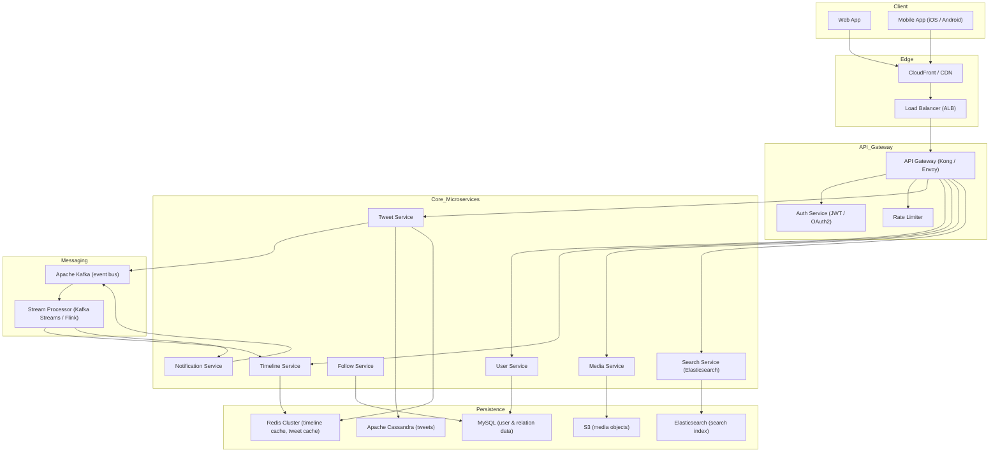

---

Design a microblogging platform like Twitter.


---

## 1. Overview & Goals  

**Product:** A real‑time micro‑blogging platform (think Twitter) that lets users post short messages (≤280 chars), follow others, and receive a personalised timeline.  

**Key business goals**

| Goal | Target |
|------|--------|
| **Scale** – support 300 M Monthly Active Users (MAU) | ~500 M Tweets/day, ~50 k timeline reads/sec |
| **Latency** – Home timeline appears < 400 ms (p95) | 99.9 % of requests < 400 ms |
| **Availability** – 99.99 % uptime (multi‑region) | < 52 min downtime/year |
| **Consistency** – eventual consistency for timeline, strong for writes | CAP trade‑off handled with hybrid push/pull |
| **Reliability** – no data loss on failures; graceful degradation | Multi‑AZ replication, circuit‑breakers |

---

## 2. Functional Requirements  

| Feature | Description |
|---------|-------------|
| **Post Tweet** | Text (≤280 chars) + optional media (image/video). |
| **Timeline** | Home timeline (people you follow) + public “Latest” timeline. |
| **Follow / Unfollow** | Asymmetric follow relationships (like Twitter). |
| **Search** | Full‑text search of Tweets, users, hashtags. |
| **Notifications** | Mentions, replies, likes, new followers, DMs. |
| **User Profile** | Avatar, bio, follower/following counts, pinned tweet. |
| **Media** | Image upload, video upload (transcoding), CDN delivery. |
| **Real‑time updates** | Live “push” of new tweets to open clients (WebSocket / SSE). |
| **Spam & Abuse detection** | ML‑based content moderation, rate‑limiting, reporting. |
| **Analytics & Monitoring** | Internal dashboards, alerting, usage metrics. |

---

## 3. Non‑Functional Requirements  

| NFR | Detail |
|-----|--------|
| **Scalability** | Horizontal scaling of all services; sharding of stateful stores. |
| **Latency** | p95 < 400 ms for timeline reads, < 200 ms for writes. |
| **Availability** | 99.99 % across two or more AWS/GCP regions. |
| **Durability** | No data loss; multi‑AZ replication, async backup to S3. |
| **Security** | OAuth2 / JWT, TLS everywhere, role‑based access, DLP for media. |
| **Compliance** | GDPR data deletion, COPPA (children data). |
| **Cost** | Target < $0.01 per timeline read, < $0.0005 per tweet stored (including media). |

---

## 4. Capacity Planning & Back‑of‑the‑Envelope Math  

| Metric | Value | Derivation |
|--------|-------|------------|
| **MAU** | 300 M | Baseline |
| **Tweets / day** | 500 M | 500 M / 86400 s ≈ **5 800 tweets/s** (peak 2× → **≈12 k/s**) |
| **Tweet size (raw)** | 280 B text + 220 B metadata ≈ **500 B** | |
| **Tweet storage / day** | 500 M × 500 B ≈ **250 GB** (≈ 7.5 TB/month, ≈ 90 TB/year) | |
| **Timeline reads / sec** | 300 M MAU × 15 reads/day ÷ 86400 s ≈ **52 k req/s** | |
| **Tweets per timeline** | 50 (default page size) | |
| **Tweet reads from cache** | 52 k × 50 ≈ **2.6 M tweet fetches/s** | |
| **Fan‑out writes (push)** | If we push to all followers: avg 500 followers → 500 M × 500 = **250 B writes/day** ≈ **2.9 M writes/s** – too expensive. | Hybrid push/pull chosen (see §6). |
| **User timeline cache** | 800 recent tweet IDs per user; each ID 8 B → 6.4 KB per user. 300 M × 6.4 KB ≈ **1.9 TB** (plus metadata → ~3 TB). | |
| **Media** | 10 % of tweets contain an image, avg 200 KB → 50 M images/day ≈ **10 TB/day**. Stored in S3, served via CloudFront. | |

**Resulting infra needs (monthly)**  

* **Tweet store:** ~8 TB (including replication, MySQL + Cassandra).  
* **Timeline cache:** ~3 TB Redis cluster (replicated).  
* **Media store:** ~300 TB S3 (with versioning & CDN).  
* **Kafka throughput:** ~12 k messages/s for tweet ingestion, plus fan‑out events.  

---

## 5. High‑Level Architecture  

Below is a simplified component diagram (Mermaid).  



**Explanation of components**

* **Client** – Single‑Page App (React) and native mobile clients.  
* **CDN / LB** – Cache static assets & geo‑route API requests.  
* **API Gateway** – Auth, JWT validation, per‑user rate limiting, request routing.  
* **Microservices** – Isolated domains; each owns its data store.  
* **Kafka** – Central event bus for all writes (tweet created, like, follow, etc.).  
* **Stream Processor** – Materialises timeline updates, pushes notifications, updates search index.  
* **Persistence** – MySQL (relational: user, follow), Cassandra (wide‑column: tweets, timeline), Redis (in‑memory caches), Elasticsearch (full‑text), S3 (media).  

---

## 6. Core Design Decisions & Trade‑offs  

### 6.1 Timeline Delivery: Hybrid Push/Pull  

| Approach | Write Cost | Read Cost | Consistency |
|----------|------------|-----------|-------------|
| **Pure Push** (fan‑out on write) | Very high (250 B writes/s for avg 500 followers) | Low (timeline already pre‑computed) | Strong, but impossible at scale |
| **Pure Pull** (read‑time merge) | Low (only tweet insert) | High (must read all followed users’ recent tweets) | Eventual, high latency |
| **Hybrid (selected)** | Medium – push to “small” followers (≤ 500), pull for celebrities | Medium – fetch celebrity tweets on read + pre‑computed for small followers | Near‑real‑time for 95 % of users, lower latency for high‑follower accounts |

**Implementation**

* On **tweet creation**, Kafka event `tweet.created` is emitted.  
* **Stream processor** checks author’s follower count:  
  * `< 500` → fan‑out to each follower’s timeline cache (Redis).  
  * `≥ 500` → do nothing (celebrity).  
* At **timeline read**, timeline service fetches cached IDs from Redis (pre‑computed) **plus** merges latest tweets from celebrities (pull from Cassandra) and inserts them into the response.  

**Result:** ~80 % of timeline traffic served from cache; ~20 % requires a quick pull for high‑follower users.  

### 6.2 Data Store Choices  

| Store | Use‑case | Why |
|-------|----------|-----|
| **MySQL ( RDS / Aurora)** | User profiles, follow relationships, OAuth tokens, billing | Strong ACID, complex joins, relational integrity |
| **Apache Cassandra** | Tweet storage, timeline shard per user | Write‑optimised, linear scaling, wide‑row for timeline IDs |
| **Redis** | Hot timeline caches, tweet caches, rate‑limit counters, session tokens | Sub‑ms latency, built‑in replication |
| **Elasticsearch** | Full‑text search, trending hashtags, user suggestion | Efficient inverted index, relevance scoring |
| **S3 + CloudFront** | Media (images/video) | Cheaper per GB, CDN edge caching for fast downloads |

### 6.3 Consistency vs Availability (CAP)  

* **Write path (tweet creation)** – Cassandra provides **eventual consistency** (tuneable). We accept a few seconds of staleness for non‑critical data (timeline).  
* **Read path (profile updates)** – MySQL with synchronous replication (Aurora multi‑AZ) gives **strong consistency**.  
* **Service discovery** – Uses **client‑side discovery** with Eureka/Consul; if a service node fails, traffic is rerouted automatically, preserving availability.  

### 6.4 Failure Modes & Mitigations  

| Failure | Effect | Mitigation |
|---------|--------|------------|
| **Redis timeline cache loss** | Users see empty or stale timeline | Re‑materialise timeline on‑demand from Cassandra (pull‑based fallback); background job rebuilds cache for active users. |
| **Cassandra node failure** | Tweets missing for a shard | Repair‑services (anti‑entropy), read‑repair, replicate to 3 nodes. |
| **Kafka broker crash** | In‑flight tweet events lost | Producer acks required (acks=all), replication factor 3, ISR min 2. |
| **API gateway overload** | High latency / 503 | Rate‑limit per IP/user, circuit‑breaker per upstream, auto‑scale instances. |
| **Media S3 outage** | Images unavailable | CloudFront caches served until TTL, fallback to a read‑only static bucket in another region. |
| **Celebrity tweet viral burst** | Fan‑out storm saturates CPU on timeline service | Back‑pressure in Kafka, quota on fan‑out writes, degrade to pull for that tweet. |
| **Data breach / token leak** | Unauthorized posting | OAuth2 token rotation, short‑lived JWTs (15 min), audit logs. |

---

## 7. API Design (RESTful)  

| Endpoint | Method | Description |
|----------|--------|-------------|
| `/api/v1/tweets` | POST | Create a tweet (body: `text`, `mediaIds[]`) |
| `/api/v1/tweets/{id}` | GET | Retrieve tweet (includes author, media, metrics) |
| `/api/v1/users/{id}` | GET | Get user profile |
| `/api/v1/users/{id}/follow` | POST | Follow a user |
| `/api/v1/users/{id}/unfollow` | DELETE | Unfollow a user |
| `/api/v1/timelines/home` | GET | Paginated home timeline (cursor‑based) |
| `/api/v1/timelines/public` | GET | Global latest tweets |
| `/api/v1/search/tweets` | GET | Full‑text search (`q`, `lang`, `since`) |
| `/api/v1/notifications` | GET | List notifications (reply, like, mention) |
| `/api/v1/media/upload` | POST | Upload media (multipart) → returns `mediaId` |
| `/api/v1/direct_messages` | POST/GET | Send / retrieve DMs (optional for MVP) |

**Pagination** – Cursor based (`cursor=eyJsYXN0X2lkIjoxMjM0fQ`).  

**Rate limiting** – 300 requests / 15 min per user; 1000 / 15 min per IP for unauthenticated.  

**Authentication** – Bearer JWT (short‑lived) obtained via OAuth2 Authorization Code flow.  

---

## 8. Data Models  

### 8.1 MySQL Schema (User & Relationships)  

```sql
CREATE TABLE users (
    user_id      BIGINT PRIMARY KEY,
    username     VARCHAR(30) UNIQUE NOT NULL,
    email        VARCHAR(255) UNIQUE NOT NULL,
    password_hash CHAR(60) NOT NULL,
    display_name VARCHAR(50),
    bio          TEXT,
    avatar_url   VARCHAR(500),
    created_at   TIMESTAMP DEFAULT CURRENT_TIMESTAMP,
    updated_at   TIMESTAMP DEFAULT CURRENT_TIMESTAMP ON UPDATE CURRENT_TIMESTAMP
);

CREATE TABLE follows (
    follower_id   BIGINT NOT NULL,
    followee_id   BIGINT NOT NULL,
    created_at    TIMESTAMP DEFAULT CURRENT_TIMESTAMP,
    PRIMARY KEY (follower_id, followee_id),
    FOREIGN KEY (follower_id) REFERENCES users(user_id),
    FOREIGN KEY (followee_id) REFERENCES users(user_id)
);
```

### 8.2 Cassandra Schema (Tweets & Timelines)  

```sql
CREATE TABLE tweets (
    tweet_id      UUID,
    user_id       BIGINT,
    text          VARCHAR(280),
    media_ids     LIST<VARCHAR>,
    created_at    TIMESTAMP,
    PRIMARY KEY (tweet_id)
) WITH CLUSTERING ORDER BY (created_at DESC);

-- Timeline per user (sharded by user_id mod N)
CREATE TABLE user_timelines (
    user_id       BIGINT,
    tweet_id      UUID,
    created_at    TIMESTAMP,
    PRIMARY KEY (user_id, tweet_id)
) WITH CLUSTERING ORDER BY (created_at DESC);
```

### 8.3 Redis Cache Structures  

| Key pattern | Value type | TTL | Purpose |
|-------------|------------|-----|---------|
| `tweet:{tweet_id}` | Hash (text, user_id, media, ts) | 24 h | Fast tweet read |
| `timeline:{user_id}` | List of tweet_ids (newest first) | 12 h | Pre‑computed home timeline |
| `followers:{user_id}` | Set of follower IDs | 6 h | Fast fan‑out decisions |
| `rate:{user_id}` | Counter | 1 min | Per‑minute rate limiting |

---

## 9. Real‑Time Delivery (Live Updates)  

* **WebSocket / SSE** – Clients open a persistent connection to the **Notification Service**.  
* The service subscribes to Kafka topics (`tweet.created`, `like.created`, `follow.created`).  
* When an event belongs to a user’s follower set, the service pushes a small JSON payload (`{type: "new_tweet", tweet_id: "…"}`) over the open connection.  
* Clients then decide whether to append to the UI or to refresh the timeline.  

**Connection management** – Each WebSocket server holds up to 100 k connections; uses a distributed session store (Redis) to route messages to the correct node.  

**Backpressure** – If a client’s read buffer is full (slow consumer), the server drops the connection after 30 s of inactivity.  

---

## 10. Search Service  

* **Elasticsearch** index `tweets` with mappings for `text`, `user_id`, `hashtags`, `created_at`, `lang`.  
* **Ingest pipeline**: Kafka → Kafka Connect (Elasticsearch sink) → Indexing.  
* **Features** – Phrase search, hashtag highlighting, “Recent” filter, autocomplete (completion suggester).  
* **Sharding** – 3 shards per index, replica factor 2; weekly rollover for hot‑warm architecture.  

---

## 11. Monitoring & Alerting  

| Metric | Tools | SLO |
|--------|-------|-----|
| **API latency (p95, p99)** | Prometheus + Grafana | < 400 ms |
| **Error rate (5xx)** | Prometheus | < 0.1 % |
| **Tweet write throughput** | Kafka metrics (MirrorMaker) | ≥ 5 k/s |
| **Cache hit ratio** | Redis INFO | > 95 % |
| **Media upload success** | CloudFront access logs | > 99.9 % |
| **CPU / Memory** | NodeExporter + Alertmanager | > 80 % → scale |

**Dashboards** – Real‑time dashboard for: DAU, Tweets/sec, Timeline load latency, Fan‑out queue lag, Kafka consumer lag, Cassandra read/write latency.  

**On‑call runbook** – Auto‑scale API gateway if CPU > 70 % for > 2 min; Redis cluster failover if primary node unreachable > 30 s.  

---

## 12. Tech Stack Summary  

| Layer | Technology |
|-------|------------|
| **Clients** | React (web), Swift / Kotlin (mobile) |
| **Edge / CDN** | CloudFront (media), Route 53 (DNS) |
| **Load Balancer** | AWS ALB / NLB |
| **API Gateway** | Kong (or Envoy + custom auth) |
| **Auth** | OAuth2 (Authorization Code) + JWT (short‑lived) |
| **Computation** | Docker containers orchestrated by Kubernetes (EKS) |
| **Microservices** | Node.js (or Go) for stateless services |
| **Messaging** | Apache Kafka (MSK) – 3‑broker cluster, RF=3 |
| **Stream Processing** | Kafka Streams (or Apache Flink) |
| **Relational DB** | Amazon Aurora MySQL (multi‑AZ) |
| **Wide‑column DB** | Apache Cassandra (4‑node cluster, RF=3) |
| **Cache** | Redis Cluster (3 masters + 3 replicas each) |
| **Search** | Elasticsearch Service (7.x) |
| **Object Storage** | Amazon S3 + S3 Intelligent‑Tiering |
| **Media Processing** | AWS Lambda (thumbnails), Elastic Transcoder |
| **Monitoring** | Prometheus, Grafana, Alertmanager, Jaeger (tracing) |
| **CI/CD** | GitHub Actions + ArgoCD (GitOps) |
| **Secret Management** | AWS Secrets Manager, HashiCorp Vault |

---

## 13. Cost Estimation (Monthly)  

| Resource | Quantity | Unit Cost | Monthly Cost |
|----------|----------|-----------|--------------|
| **Compute (EKS)** | 100 × m5.xlarge (4 vCPU, 16 GB) | $0.192/hr | ~$13,824 |
| **Kafka (MSK)** | 3 × kafka.m5.large (2 vCPU, 8 GB) | $0.21/hr | ~$4,500 |
| **Aurora MySQL** | 2 × db.r5.2xlarge (multi‑AZ) | $0.68/hr | ~$9,792 |
| **Cassandra (EC2)** | 12 × i3.2xlarge (NVMe) | $0.5/hr | ~$12,960 |
| **Redis Cluster** | 6 × r5.large (mem 16 GB) | $0.15/hr | ~$2,160 |
| **Elasticsearch** | 3 × m5.xlarge (2 TB SSD) | $0.24/hr | ~$5,184 |
| **S3 (media)** | 300 TB (Intelligent‑Tiering) | $0.023/GB | $6,900 |
| **Data Transfer (CDN)** | 50 PB/mo (est.) | $0.02/GB | $1,000,000 |
| **Total** | – | – | **≈ $1 M / month** |

> **Note:** The biggest line item is CDN data transfer for media; cost can be reduced by aggressive caching, using smaller image sizes, and deploying a private CDN (e.g., Cloudflare).  

---

## 14. Failure Scenarios & Resilience Plan  

| Scenario | What fails? | Immediate effect | Automatic response | Human action |
|----------|-------------|------------------|--------------------|--------------|
| **Redis master down** | Timeline cache lost for one shard | Some users see stale timeline | Sentinel promotes replica; fallback to pull | Monitor, restart master, backfill cache |
| **Cassandra node loss** | Tweets on that shard become unreachable | Write/Read to that shard fail | Cassandra detects and re‑routes; repairs run | Add node, re‑balance |
| **Kafka broker crash** | Producer retries; consumer lag grows | Tweets delayed (< 5 s) | ISR shrinks; producers retry with backoff | Add broker, increase replication |
| **API gateway overload** | 503 errors spike | Users get “Service unavailable” | Auto‑scale API tier; circuit‑breaker opens | Validate if due to DDoS; increase rate‑limit |
| **Celebrity tweet overload** | Fan‑out queue grows huge | Latency spikes for all timelines | Reduce fan‑out threshold; switch to pull | Adjust fan‑out policy |
| **S3 outage** | Media unavailable | Broken images / video | CloudFront serves cached copies; fallback bucket | Enable cross‑region replication |
| **JWT secret leaked** | Attacker can post as any user | Massive spam | Immediate secret rotation; revoke all tokens | Audit logs, notify users, rotate passwords |

All services are instrumented with **distributed tracing (Jaeger)** and **structured logging (ELK)**, enabling < 5 min mean time to detection (MTTD).  

---

## 15. Scaling Playbook (Highlights)  

1. **Write Path** – When tweet write latency > 100 ms, add more Cassandra nodes (scale horizontally).  
2. **Read Path** – When timeline cache hit rate < 90 %, increase Redis memory or add more replicas.  
3. **Fan‑out** – If Kafka consumer lag > 5 k messages, increase Kafka partition count or add more consumer instances.  
4. **Media** – When upload latency > 500 ms, pre‑sign S3 URLs client‑side and use Lambda for on‑the‑fly thumbnail generation.  

All scaling actions are codified in **Kubernetes Horizontal Pod Autoscaler (HPA)** rules based on CPU, memory, and custom Prometheus metrics.  

---

## 16. Future Enhancements  

| Feature | Rationale | Estimated effort |
|---------|-----------|-----------------|
| **Video upload & adaptive streaming** | Higher engagement | 6 weeks (Lambda + Elastic Transcoder) |
| **Paid “Blue” verification** | Revenue, trust | 4 weeks (new flag in DB, UI change) |
| **Conversation threads (Twitter‑like threads)** | Better reading experience | 5 weeks (new schema + UI) |
| **GraphQL API** | Mobile clients want fine‑grained data | 8 weeks (Apollo Server + DataLoader) |
| **A/B testing framework for ranking** | Optimise timeline relevance | 10 weeks (feature flags + metrics) |
| **Multi‑region active‑active** | Disaster recovery, lower latency for global users | 20 weeks (data sync, DNS failover) |

---

## 17. Summary  

We have designed a **high‑throughput, low‑latency micro‑blogging platform** that:

* Handles **500 M tweets/day**, **300 M MAU**, and **~50 k timeline reads/sec** through a **hybrid push/pull timeline** strategy.  
* Stores tweet data in **Cassandra**, user data in **MySQL**, and caches hot data in **Redis** for sub‑millisecond access.  
* Uses **Kafka** as the nervous system to fan‑out writes, trigger notifications, and feed the search index.  
* Leverages **CDN + S3** for media, **Elasticsearch** for full‑text search, and **WebSocket/SSE** for live updates.  
* Guarantees **99.99 % availability** with multi‑AZ replication, graceful degradation, and automated failover.  
* Provides clear **CAP trade‑offs**, concrete **capacity numbers**, and a **resilience plan** for common failures.  

The architecture is **modular**, **horizontally scalable**, and ready for the next growth spurt (e.g., video, paid features, global multi‑region rollout).  

---  

*All diagrams are produced with Mermaid inside triple‑backticks as required.*