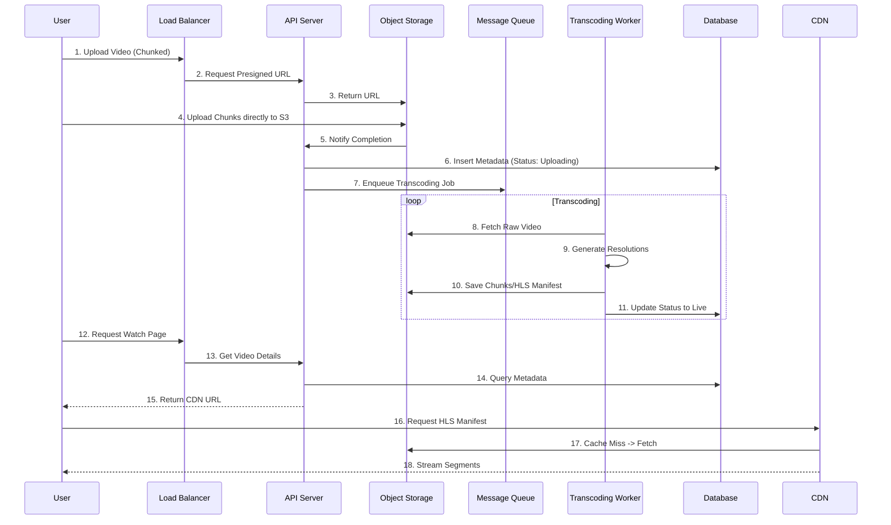

---

Design a video sharing platform like YouTube.


---

This is a comprehensive system design for a large-scale video sharing platform (similar to YouTube). This design assumes a scale capable of supporting hundreds of millions of users, billions of videos, and massive concurrent streaming traffic.

### 1. Scale & Scope Assumptions

To ground the design in reality, we define the expected load:
*   **Daily Active Users (DAU):** 100 Million
*   **Concurrent Viewers (Peak):** 5 Million
*   **Daily Uploads:** 500,000 videos (Average size: 500MB - 1GB)
*   **Total Storage:** 1 Billion videos (Approx. 500 Petabytes of raw data, 1.5 Exabytes with 3x replication).
*   **Bitrate:** 1080p (5 Mbps), 4k (20 Mbps).

---

### 2. High-Level Architecture

We will break the system into three main lifecycle stages: **Ingestion**, **Storage**, and **Delivery**.

```mermaid
graph TD
    subgraph Client
        App[Web/App]
    end

    subgraph Ingestion
        LB[Load Balancer]
        Upload[Upload Service]
        Queue[Video Queue]
        Worker[Transcoding Workers]
    end

    subgraph Storage
        Blob[Object Store<br/>(S3/GCS)]
        Meta[(SQL DB<br/>Metadata)]
        Cache[(Redis<br/>Cache)]
    end

    subgraph Delivery
        CDN[Global CDN]
        Trans[Transcoder<br/>HLS/DASH]
    end

    App -->|Uploads Video| LB
    LB -->|Raw File| Upload
    Upload -->|Push| Blob
    Upload -->|Notify| Queue
    Queue -->|Process Job| Worker
    Worker -->|Output Segments| Blob
    Worker -->|Update| Meta

    App -->|Request Stream| CDN
    CDN -->|Manifest| App
    CDN -->|Fetch| Blob
```

---

### 3. Core Components Design

#### A. Video Ingestion & Processing (The "Upload Pipeline")
**Challenge:** Users upload large video files (Gigabytes) from unstable connections.

1.  **Client-Side:** Use **Resumable Upload** (Google's tus.io protocol or similar).
    *   The client chunks the video into small parts (e.g., 10MB).
    *   It uploads chunks directly to **Object Storage** (S3) via Pre-signed URLs.
    *   If the connection drops, it resumes from the last successful chunk.
2.  **Processing Worker:** Once the upload completes, the API notifies a **Message Queue** (Kafka/RabbitMQ).
3.  **Transcoding:** Worker nodes (using FFmpeg) pick up the job.
    *   **Video:** Generate HLS (Adaptive Bitrate Streaming) manifests and multiple resolutions (360p, 720p, 1080p).
    *   **Audio:** Extract audio tracks.
    *   **Images:** Generate thumbnails and animated previews.
4.  **Quality Control:** Automated checks to ensure video playback is valid.

#### B. Data & Metadata Management
*   **Database:** Relational SQL (PostgreSQL/MySQL) is best for structured metadata.
    *   *Why not NoSQL?* Relational consistency is important for transactions (billing, reporting).
*   **Cache:** Redis.
    *   Store session data, video metadata for hot videos (Trending page), and view counts.
*   **Search:** Elasticsearch.
    *   Index titles, descriptions, and tags to enable fast, full-text searching.

#### C. Streaming & Delivery (The "Watch Pipeline")
**Challenge:** Latency and Bandwidth.
*   **CDN (Content Delivery Network):** This is the most critical component for performance.
    *   We cannot serve video directly from the origin storage (S3). S3 latency is too high, and egress costs are prohibitive at scale.
    *   CDN caches the HLS segments geographically close to the user.
*   **Protocol:** **HLS (HTTP Live Streaming)** or **DASH**.
    *   Instead of one large file, the video is broken into 4-second chunks (segments).
    *   The client downloads segments based on current internet speed. If the speed drops, it requests a lower resolution segment immediately without buffering the whole video.

---

### 4. Database Schema (Simplified)

We need to store User data and Video data.

**Users Table**
```sql
CREATE TABLE users (
  user_id BIGINT PRIMARY KEY,
  username VARCHAR(50),
  email VARCHAR(100),
  created_at TIMESTAMP
);
```

**Videos Table**
```sql
CREATE TABLE videos (
  video_id BIGINT PRIMARY KEY,
  user_id BIGINT, -- FK to users
  title VARCHAR(200),
  description TEXT,
  storage_path VARCHAR(500), -- Path in S3
  thumbnail_path VARCHAR(500),
  hls_manifest_url VARCHAR(500),
  duration_seconds INT,
  view_count BIGINT DEFAULT 0,
  created_at TIMESTAMP
);
```

**Optimization:**
*   **Sharding:** We cannot put all users on one server. We shard by `user_id`. All data for a specific user resides on the same shard.
*   **Read Replicas:** Write to the Primary DB, read from replicas to handle high traffic on the "Watch" page.

---

### 5. Detailed Technical Challenges & Trade-offs

#### The "View Count" Bottleneck
*   **Problem:** If 1 million people watch a video simultaneously, that is 1 million write requests to update the view counter in the database. This would crash the DB.
*   **Solution:**
    1.  **Event Sourcing:** The client calls an API to increment views.
    2.  **Write-Behind Cache:** The API increments a counter in **Redis** (Local memory operation, O(1)).
    3.  **Async Flush:** A background job syncs the Redis counters to the SQL database every 5 minutes. *Note: This means the view count is "eventually consistent" but highly available.*

#### Geo-Distribution
*   **Problem:** A user in Germany shouldn't stream video from a US server.
*   **Solution:** Deploy multiple regional storage clusters (e.g., one in EU, one in US, one in Asia).
*   **Routing:** Use Geo-DNS to direct the user to the closest CDN edge node.

#### Cost Analysis
*   **Storage:** $0.023 per GB (S3 Standard). 500 PB costs ~$11.5M/month.
*   **Egress:** The biggest cost. Transferring 1PB of data is expensive.
    *   *Optimization:* CDNs handle the long-tail effect (popular videos cached, niche videos rarely fetched). Origin storage is rarely hit directly.
*   **Transcoding:** CPU intensive. It is often cheaper to use spot/preemptible instances for the worker farm to process videos than paying for fixed reserved instances.

---

### 6. Reliability & Failure Modes

1.  **CDN Failure:**
    *   *Scenario:* CDN goes down globally.
    *   *Mitigation:* Implement a "Fallback Origin." If the CDN misses, it fetches from the Origin (S3). S3 has 99.99% availability.
2.  **Upload Service Failure:**
    *   *Scenario:* The API server handling uploads crashes.
    *   *Mitigation:* Stateless service design. Load balancer redirects traffic to healthy instances immediately.
3.  **Corrupted Video:**
    *   *Scenario:* Transcoding fails and results in a corrupt video file.
    *   *Mitigation:* Store the raw upload until processing is verified. Implement a checksum validation step before deleting the source.

### 7. System Diagram (Detailed Flow)

