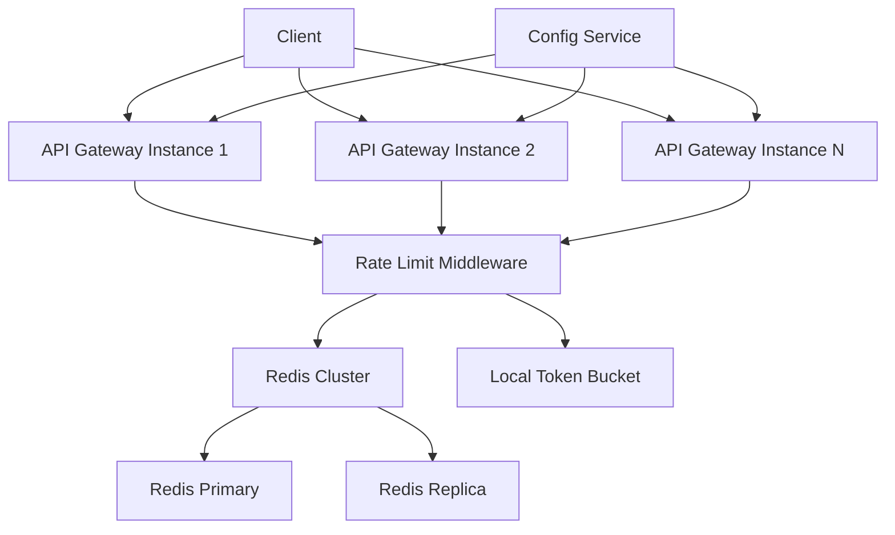
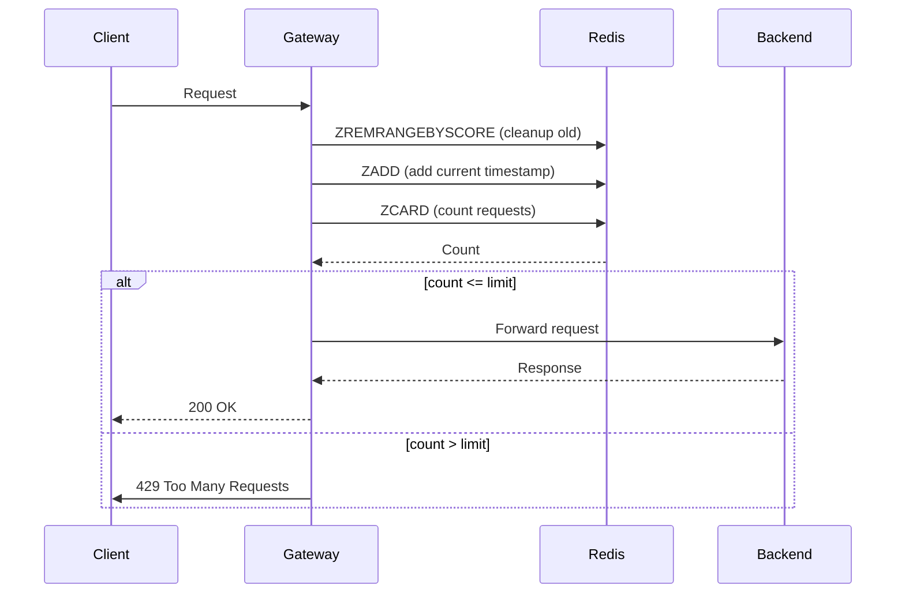
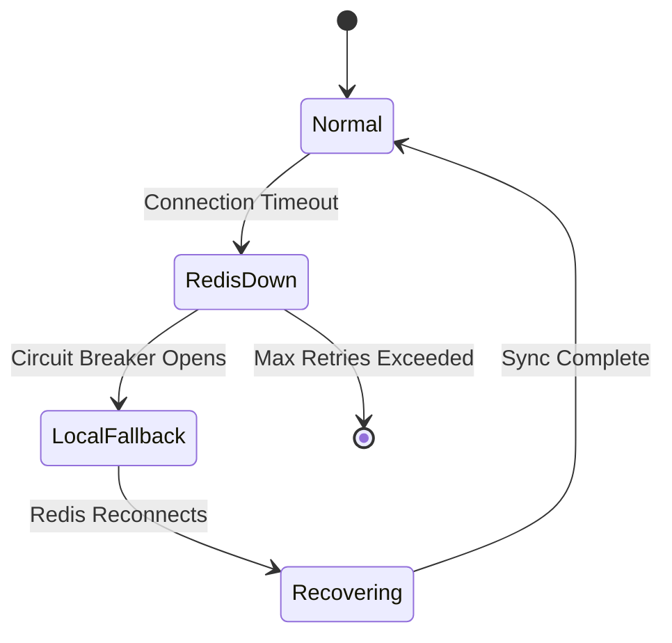

---

Design a distributed rate limiter to protect an API gateway.


---

# Distributed Rate Limiter Design for API Gateway

## System Overview

This design implements a **sliding window counter** algorithm using Redis for distributed rate limiting across multiple API Gateway instances.



## Architecture Components

### 1. Rate Limit Middleware
- Runs on every API Gateway instance
- Extracts client identifiers (user ID, API key, IP)
- Coordinates with Redis cluster and local fallback

### 2. Redis Cluster (Primary Data Store)
- Stores sliding window counters per client
- Supports atomic operations via Lua scripts
- Provides high availability via replication

### 3. Local Token Bucket (Fallback)
- Operates when Redis is unavailable
- Prevents complete service unavailability
- Gradual sync when Redis recovers

## Algorithm: Sliding Window Counter

We use a **sliding window log** with Redis sorted sets:

```
Window: 60 seconds
Resolution: 1 second buckets

Key format: ratelimit:{client_id}
```



## Capacity Math

### Assumptions:
- **Rate limit:** 1000 requests/minute per client
- **Total clients:** 100,000
- **Redis latency:** 1ms per operation
- **Gateway instances:** 10

### Calculations:

**Requests per second (global):**
```
Assuming 20% of clients active simultaneously: 20,000 active clients
Average requests per client: 1000/60 = 16.67 req/s
Total RPS: 20,000 × 16.67 ≈ 333,400 req/s
```

**Redis operations per second:**
```
Each request: 3 Redis ops (ZREMRANGEBYSCORE, ZADD, ZCARD)
Total ops: 333,400 × 3 ≈ 1,000,200 ops/s
```

**Memory per client:**
```
Sorted set entries in 60s window: 1000 (at max capacity)
Each entry: ~50 bytes (timestamp + unique ID)
Per client: ~50KB
```

**Total Redis memory (100K clients at 50% active):**
```
50,000 clients × 50KB = 2.5GB
Add 2x overhead for Redis structures: ~5GB
```

**Gateway throughput:**
```
Per instance: 333,400 / 10 = 33,340 req/s
Latency budget: 10ms (includes Redis call)
```

## Redis Lua Script

```lua
-- Rate Limit Script (Atomic Operations)
-- KEYS[1]: Rate limit key (e.g., "ratelimit:user123")
-- ARGV[1]: Current timestamp (ms)
-- ARGV[2]: Window size (ms)
-- ARGV[3]: Max requests allowed

local key = KEYS[1]
local now = tonumber(ARGV[1])
local window = tonumber(ARGV[2])
local limit = tonumber(ARGV[3])
local clear_before = now - window

-- Remove expired entries
redis.call('ZREMRANGEBYSCORE', key, '-inf', clear_before)

-- Get current count
local count = redis.call('ZCARD', key)

if count >= limit then
    return {0, count, limit} -- Denied
else
    -- Add new request with unique ID
    redis.call('ZADD', key, now, now .. ':' .. math.random())
    -- Set TTL slightly longer than window
    redis.call('PEXPIRE', key, window + 1000)
    return {1, count + 1, limit} -- Allowed
end
```

## Tradeoffs Analysis

| Approach | Pros | Cons |
|----------|------|------|
| **Sliding Window Log** | Precise, handles burst naturally | High memory usage |
| **Fixed Window** | Simple, low memory | Inaccurate at window boundaries |
| **Token Bucket** | Smooth, allows bursts | Complex to implement distributed |
| **Sliding Window Counter** | Lower memory than log | Approximate, harder to debug |

## Implementation Options

### Option 1: Redis Sorted Sets (Chosen)
- Best for moderate limits (<10K req/window)
- Precise counting
- Automatic cleanup

### Option 2: Redis Hash + Sorted Set Hybrid
```lua
-- Bucket-based counting for higher scale
local bucket_key = KEYS[1]
local now = tonumber(ARGV[1])
local bucket_size = 1000  -- 1 second buckets
local num_buckets = 60    -- 60 second window

local current_bucket = now / bucket_size
local start_bucket = current_bucket - num_buckets + 1

-- Increment current bucket
redis.call('HINCRBY', bucket_key, current_bucket, 1)
redis.call('EXPIRE', bucket_key, num_buckets * 2)

-- Sum last N buckets
local total = 0
for i = start_bucket, current_bucket do
    total = total + (tonumber(redis.call('HGET', bucket_key, i)) or 0)
end

return total
```

## Fault Tolerance



### Failure Modes:

1. **Redis Primary Down**
   - Replica takes over (read mode)
   - Writes go to replica
   - Potential data loss: up to 1 second

2. **Network Partition**
   - Circuit breaker opens after 3 failures
   - Local fallback activates
   - 30-second recovery window

3. **Gateway Instance Crash**
   - Local state lost (acceptable)
   - Redis state preserved

## Rate Limit Response Headers

```http
X-RateLimit-Limit: 1000
X-RateLimit-Remaining: 423
X-RateLimit-Reset: 1609459200
Retry-After: 45
```

## Configuration Structure

```yaml
rate_limiting:
  enabled: true
  algorithm: sliding_window
  defaults:
    window_ms: 60000
    max_requests: 1000
  overrides:
    - match: api_key:premium_*
      limit: 10000
    - match: ip:10.0.0.0/8
      limit: 50000
```

## Monitoring Metrics

```prometheus
# Rate limiting metrics
rate_limit_exceeded_total{client_id="xxx"} 5324
rate_limit_redis_latency_ms{quantile="0.99"} 0.8
rate_limit_redis_errors_total{error="timeout"} 12
rate_limit_local_fallback_active 1
```

## Deployment Considerations

1. **Redis Cluster Setup**
   - Minimum 3 nodes for HA
   - Use clustering for horizontal scaling
   - Monitor memory usage (<70% of capacity)

2. **Gateway Configuration**
   - Co-locate rate limiter with API gateway
   - Use connection pooling (min 10, max 100 connections)
   - Set reasonable timeouts (connect: 200ms, read: 500ms)

3. **Capacity Planning**
   - Monitor actual usage patterns
   - Adjust window sizes based on traffic spikes
   - Consider different limits for different client tiers

This design provides:
- **Precise rate limiting** across distributed instances
- **High availability** with local fallback
- **Scalability** through Redis clustering
- **Operational visibility** with comprehensive metrics