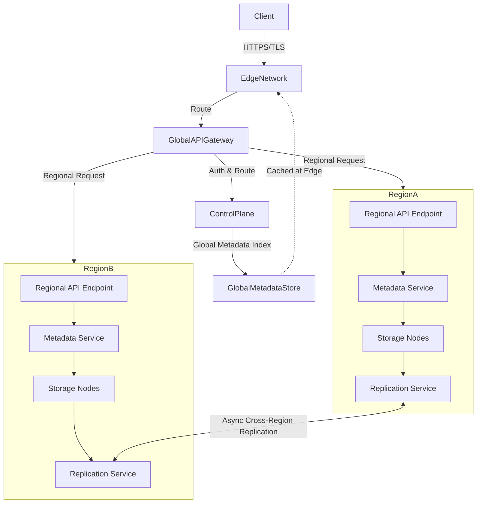

---

Design a global object storage system like S3.

---

## Global Object Storage System Design (S3-like)

This document outlines the architecture, data management, consistency, security, and scaling strategies for a global object storage system. The system is designed for high durability (99.999999999%), availability (99.99%), low latency, and strong consistency for new objects.

---

### 1. System Architecture

The system consists of three main layers:

- **Global Control Plane**: Manages routing, authentication, billing, and global metadata indexing.
- **Regional Clusters**: Each region contains multiple Availability Zones (AZs) with independent storage and compute resources.
- **Edge Network**: CDN integration for caching and low-latency metadata access.

**Core Components:**
- **Global API Gateway**: Routes requests based on bucket location and latency.
- **Regional API Endpoints**: Handle region-specific operations (PUT, GET, DELETE, etc.).
- **Metadata Service**: Stores bucket and object metadata in each region.
- **Storage Nodes**: Store object data with replication across AZs.
- **Replication Service**: Manages intra-region and inter-region data replication.

---

### 2. Data Placement and Replication

#### 2.1 Partitioning Strategy
- **Consistent Hashing**: Object keys are hashed to partition IDs. Each partition is assigned to a set of storage nodes (replica set).
- **Partition Leader**: One node in the replica set acts as the leader for read/write operations.

#### 2.2 Replication Model
- **Intra-Region (Durability)**: Each object is replicated 3 times across different AZs in the same region.
- **Inter-Region (Disaster Recovery)**: Optional asynchronous replication to a secondary region.
- **Quorum-based Writes**: Write succeeds when 2 of 3 replicas acknowledge.

#### 2.3 Data Storage
- **Small Objects (< 128KB)**: Stored directly in the metadata service (inline).
- **Large Objects**: Stored in storage nodes; metadata points to the data location.
- **Erasure Coding (Optional)**: For very large objects, use Reed-Solomon coding (e.g., 10+4) to reduce storage overhead while maintaining durability.

---

### 3. Consistency Model

- **Strong Consistency**: All writes and reads to an object are serialized via the partition leader. Reads after a successful write return the new data.
- **Implementation**: Uses Raft consensus for metadata and leader-based replication for object data.
- **Versioning**: Each object update generates a new version ID. Deletes create a delete marker (not immediate removal).

---

### 4. API and Metadata Management

#### 4.1 S3-Compatible API
- **Bucket Operations**: CreateBucket, DeleteBucket, ListBuckets.
- **Object Operations**: PutObject, GetObject, DeleteObject, HeadObject, ListObjectsV2.
- **Multipart Upload**: For large objects, support chunked uploads with resumability.

#### 4.2 Metadata Structure
- **Bucket Metadata**: Globally unique bucket name, creation date, region, ACL, and policies.
- **Object Metadata**: Object key, version ID, size, content type, checksums (MD5/SHA256), replica locations, and custom user metadata.
- **Global Index**: Maps bucket+key to the region and partition leader for routing.

#### 4.3 Request Routing
1. Client requests hit the Global API Gateway.
2. Gateway authenticates the request (via IAM or token).
3. Global metadata index is queried to find the bucket's region (cached at edge).
4. Request is routed to the regional API endpoint.
5. Regional metadata service validates and processes the request.

---

### 5. Security and Access Control

- **Encryption**:
  - **At Rest**: AES-256 encryption for all stored data.
  - **In Transit**: TLS 1.3 for all API communications.
- **Access Control**:
  - **IAM-like Policies**: Bucket-level and object-level permissions.
  - **Presigned URLs**: Time-limited access for specific operations.
- **Audit Logging**: All operations are logged to a centralized audit store.

---

### 6. Scaling and Failure Handling

#### 6.1 Scaling
- **Horizontal Scaling**: Add storage nodes to a region; consistent hashing reassigns partitions with minimal data movement.
- **Global Expansion**: Add new regions without affecting existing regions.

#### 6.2 Failure Handling
- **Node Failure**:
  - Gossip protocol detects failures.
  - Re-replication is triggered to maintain 3 replicas.
  - Partition leader is re-elected if the leader fails.
- **AZ Failure**:
  - Cross-AZ replication ensures availability.
  - Traffic is rerouted to healthy AZs in the same region.
- **Region Failure**:
  - Inter-region replication takes over; traffic is routed to the secondary region.

---

### 7. System Diagram

---

### 8. Key Tradeoffs and Considerations

| Aspect | Tradeoff |
|--------|----------|
| **Consistency vs. Latency** | Strong consistency may increase latency; use region-local writes for lower latency. |
| **Durability vs. Cost** | 3 replicas per region increases storage cost; use erasure coding for large objects to reduce cost. |
| **Cross-Region Replication** | Asynchronous replication introduces RPO (Recovery Point Objective); choose replication frequency based on business needs. |
| **Partition Granularity** | Smaller partitions improve parallelism but increase metadata overhead; larger partitions reduce overhead but may create hotspots. |
| **Failure Detection** | Gossip-based detection is eventually consistent; use a more deterministic method (e.g., lease-based) for critical components. |

---

### 9. Potential Failure Modes and Mitigations

- **Network Partition**: Raft consensus pauses until partition resolves; reads may be served from cached data if eventual consistency is acceptable.
- **Data Corruption**: Checksums (MD5/SHA256) are verified on read; corrupted replicas are replaced via re-replication.
- **Metadata Loss**: Metadata is replicated across regions; a full region failure still allows recovery from the secondary region.

---

### 10. Implementation Recommendations

- **Use Existing Technologies**: 
  - Metadata storage: etcd or CockroachDB for strong consistency.
  - Object storage: MinIO or Ceph for distributed storage nodes.
  - Networking: Anycast routing for low-latency global access.
- **Adopt Open Standards**: S3-compatible API to leverage existing SDKs and tools.
- **Iterate**: Start with a single region and strong intra-region replication; add cross-region replication as a separate feature.

---

This design provides a scalable, durable, and highly available object storage system, aligning with S3's core capabilities while allowing customization for specific use cases.