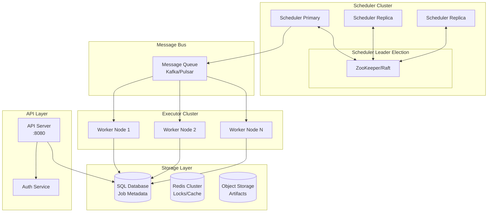
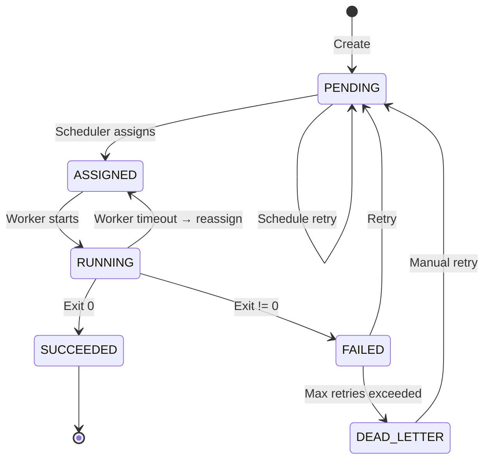
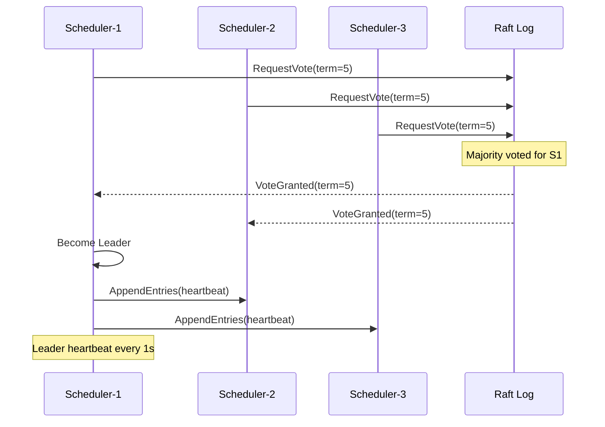
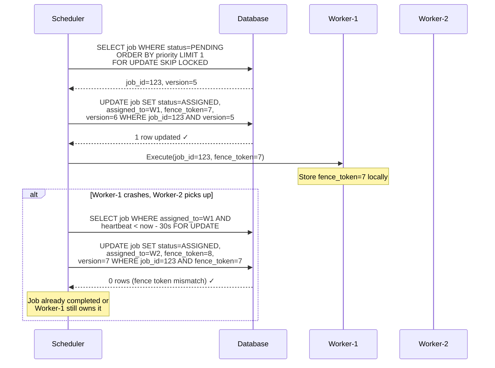
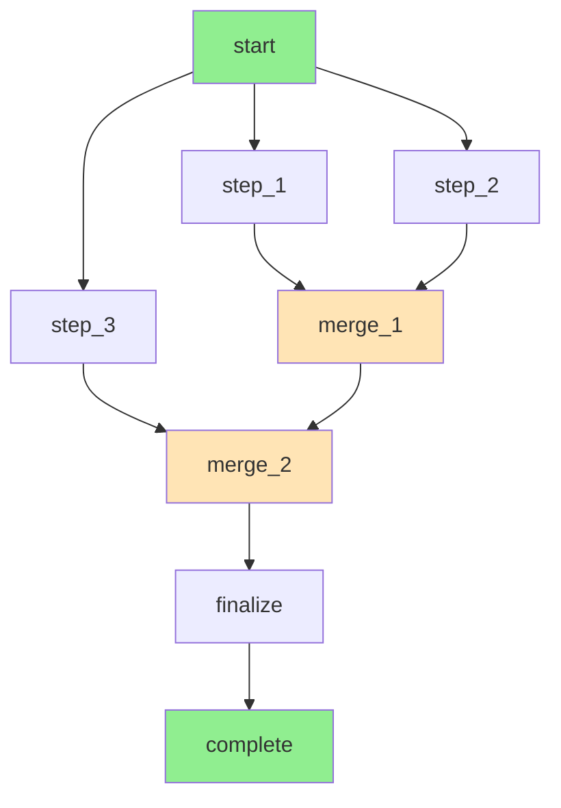
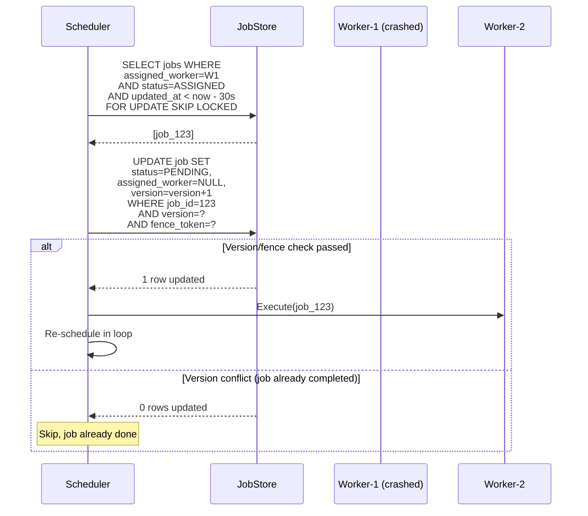
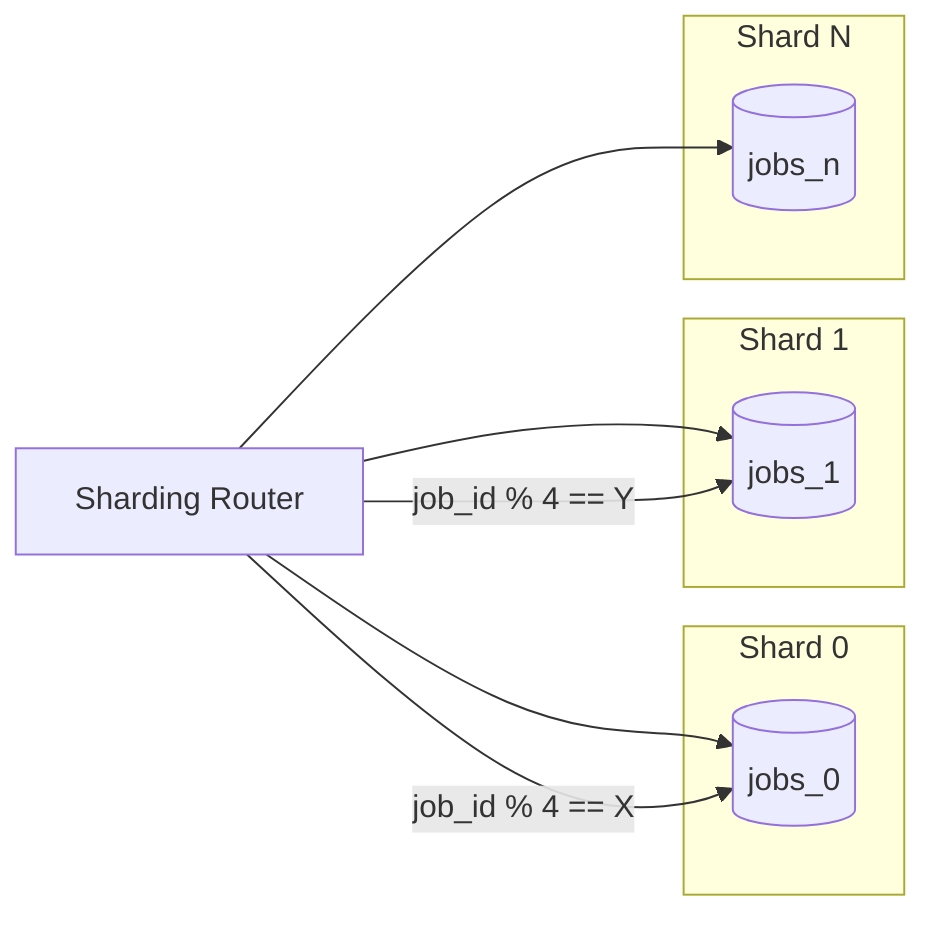

---

Design a distributed job scheduler.


---

# Distributed Job Scheduler System Design

## 1. System Overview



## 2. Core Data Models

### Job Definition
```
Job {
    job_id: UUID (partition key)
    name: string
    namespace: string
    job_type: enum[SIMPLE, DAG, CRON, MAP_REDUCE]
    priority: int8 (0-255, higher = more urgent)
    payload: JSON
    owner: string
    created_at: timestamp
    updated_at: timestamp
    
    // Scheduling constraints
    schedule: CronExpression | null
    max_retries: int
    timeout_seconds: int
    dependencies: []UUID
    
    // Resource requirements
    cpu_units: int
    memory_mb: int
    disk_mb: int
    
    // Execution config
    executor_type: string
    image: string
    command: string
}
```

### Job State Machine


## 3. Scheduler Architecture

### Leader Election (Raft-based)



### Fencing Token for Exactly-Once Execution



## 4. Scheduling Algorithm

### Priority + Fair Sharing Implementation

```
Scheduling Loop (every 100ms):
┌─────────────────────────────────────────────────────────────┐
│ 1. Acquire distributed lock: "scheduler:tick"               │
│    - If failed, another scheduler active, skip              │
│    - Lock TTL: 5 seconds                                    │
├─────────────────────────────────────────────────────────────┤
│ 2. Query pending jobs (batch of 1000):                      │
│    SELECT * FROM jobs                                       │
│    WHERE status = PENDING                                   │
│    AND schedule_time <= NOW()                               │
│    AND namespace IN (user's accessible namespaces)          │
│    ORDER BY priority DESC, created_at ASC                   │
│    LIMIT 1000                                               │
├─────────────────────────────────────────────────────────────┤
│ 3. Check namespace quotas:                                  │
│    For each namespace, calculate:                           │
│      running_count = count(status=RUNNING)                  │
│      quota = namespace_quota[namespace]                     │
│      eligible_jobs = jobs in namespace where                │
│        running_count < quota                                │
├─────────────────────────────────────────────────────────────┤
│ 4. Assign jobs to workers:                                  │
│    For each eligible job:                                   │
│      worker = select_worker_by_load(job.resource_req)       │
│      publish_to_queue(job, worker_id, fence_token++)        │
│      update_job_status(job_id, ASSIGNED, worker_id)         │
└─────────────────────────────────────────────────────────────┘
```

### Worker Selection Strategy

```python
class WorkerSelector:
    def select(self, job: Job, workers: List[Worker]) -> Optional[Worker]:
        # Filter workers with sufficient capacity
        eligible = [
            w for w in workers
            if w.available_cpu >= job.cpu_units
            and w.available_memory >= job.memory_mb
            and w.has_executor(job.executor_type)
        ]
        
        if not eligible:
            return None
        
        # Score based on multiple factors
        scored = [
            (self._score(w, job), w) for w in eligible
        ]
        
        # Pick worker with highest score (lowest load)
        scored.sort(key=lambda x: x[0], reverse=True)
        return scored[0][1]
    
    def _score(self, worker: Worker, job: Job) -> float:
        # Lower score = better choice
        cpu_score = worker.available_cpu / worker.total_cpu
        mem_score = worker.available_memory / worker.total_memory
        affinity = 1.0 if worker.has_recent_success(job.executor_type) else 0.95
        
        return (cpu_score * 0.4 + mem_score * 0.4 + affinity * 0.2)
```

## 5. DAG Scheduling (Job Dependencies)



```sql
-- DAG-aware scheduling query
WITH ready_jobs AS (
    SELECT j.job_id, j.dependencies
    FROM jobs j
    WHERE j.status = PENDING
    AND j.dag_id = ? -- same DAG group
)
SELECT r.job_id
FROM ready_jobs r
WHERE NOT EXISTS (
    SELECT 1 FROM jobs dep
    WHERE dep.job_id = ANY(r.dependencies)
    AND dep.status NOT IN (SUCCEEDED, SKIPPED)
)
ORDER BY r.priority DESC, r.created_at ASC;
```

## 6. Storage Schema

```sql
-- Core jobs table (PostgreSQL with row-level locking)
CREATE TABLE jobs (
    job_id UUID PRIMARY KEY DEFAULT gen_random_uuid(),
    name VARCHAR(255) NOT NULL,
    namespace VARCHAR(128) NOT NULL,
    job_type SMALLINT NOT NULL,
    priority SMALLINT DEFAULT 128,
    
    payload JSONB NOT NULL,
    result_payload JSONB,
    error_message TEXT,
    
    status SMALLINT NOT NULL DEFAULT 0,
    version INTEGER NOT NULL DEFAULT 0,  -- optimistic lock
    fence_token BIGINT,
    
    assigned_worker VARCHAR(255),
    retry_count INTEGER DEFAULT 0,
    max_retries INTEGER DEFAULT 3,
    timeout_seconds INTEGER DEFAULT 3600,
    
    created_at TIMESTAMPTZ DEFAULT NOW(),
    updated_at TIMESTAMPTZ DEFAULT NOW(),
    schedule_time TIMESTAMPTZ,
    started_at TIMESTAMPTZ,
    completed_at TIMESTAMPTZ,
    
    dag_id UUID,
    dependencies UUID[],
    
    -- Execution requirements
    cpu_units INTEGER DEFAULT 1,
    memory_mb INTEGER DEFAULT 512,
    executor_type VARCHAR(64) DEFAULT 'docker',
    
    -- Partition by namespace for query performance
    CONSTRAINT jobs_namespace_idx UNIQUE (namespace, job_id)
);

CREATE INDEX idx_jobs_status_scheduled 
ON jobs (status, schedule_time) 
WHERE status IN (0, 1);  -- PENDING, ASSIGNED only

CREATE INDEX idx_jobs_namespace_status 
ON jobs (namespace, status, priority DESC);

CREATE INDEX idx_jobs_dag 
ON jobs (dag_id) WHERE dag_id IS NOT NULL;
```

## 7. Failure Handling

### Worker Failure Detection

```
┌─────────────────────────────────────────────────────────────┐
│ Worker Heartbeat Protocol                                   │
├─────────────────────────────────────────────────────────────┤
│ Worker → Scheduler: HEARTBEAT every 10s                     │
│   - worker_id, current_jobs[], cpu_usage, memory_usage      │
│                                                             │
│ Scheduler tracks last_heartbeat per worker                  │
│                                                             │
│ If last_heartbeat > 30s ago:                                │
│   1. Mark worker as UNHEALTHY                               │
│   2. Stop assigning new jobs                                │
│   3. Wait 60s for recovery                                  │
│   4. If still unhealthy: re-assign running jobs             │
└─────────────────────────────────────────────────────────────┘
```

### Job Re-assignment Flow



### Dead Letter Queue

```python
class JobFailureHandler:
    def handle_failure(self, job: Job, error: ExecutionError):
        if job.retry_count < job.max_retries:
            # Exponential backoff with jitter
            backoff = min(300, 2 ** job.retry_count) + random(0, 30)
            next_schedule = datetime.now() + timedelta(seconds=backoff)
            
            job.status = PENDING
            job.retry_count += 1
            job.schedule_time = next_schedule
            job.error_message = str(error)
            self.job_store.save(job)
        else:
            job.status = DEAD_LETTER
            job.error_message = f"Max retries ({job.max_retries}) exceeded: {error}"
            self.job_store.save(job)
            self.publish_to_dlq(job)  # Separate Kafka topic for manual review
```

## 8. Scaling Considerations

### Horizontal Scaling of Schedulers

```
Capacity Calculation:

Assume:
- 100,000 jobs/second throughput target
- 10ms average schedule decision time
- 5 scheduler instances

Calculation:
- Each scheduler can do: 100 decisions/second (10ms each)
- With 5 schedulers: 500 decisions/second
- To achieve 100,000 jobs/second → need 1000 schedulers

Solution: Partition jobs by namespace

Each scheduler:
  - Responsible for subset of namespaces
  - Schedules jobs only within assigned namespaces
  - Achieves locality and reduces coordination
  
Redis-based namespace ownership:
  - SET scheduler:ownership:{namespace} = scheduler_id
  - TTL with renewal heartbeat
  - On failure, namespace reassigned
```

### Database Sharding Strategy



```
Shard Key Selection:
- job_id (UUID v1 contains timestamp) provides temporal locality
- Ensures jobs created around same time land on same shard
- Simplifies queries within time windows

Alternative: namespace-based sharding
- All jobs of a namespace on same shard
- Good for namespace-level isolation
- Risk of hot namespaces
```

## 9. Monitoring & Observability

### Key Metrics

```yaml
scheduler:
  jobs_scheduled_total: counter
  jobs_completed_total: counter[by_status, by_namespace]
  schedule_latency_seconds: histogram
  scheduling_queue_depth: gauge
  
  leader_election:
    is_leader: gauge
    election_failures_total: counter
    term_changes_total: counter

worker:
  jobs_running: gauge[by_type, by_namespace]
  jobs_completed_total: counter[by_status, by_executor]
  cpu_utilization: gauge
  memory_utilization: gauge
  heartbeat_lag_seconds: gauge
  
  execution_latency_seconds: histogram[by_job_type]
  
dead_letter:
  jobs_total: gauge[by_namespace, by_error_type]
  retry_queue_depth: gauge
```

### Distributed Tracing

```
Trace structure for job execution:

Span: Submit Job
  Span: Schedule Job (scheduler)
    Span: Acquire Lock (distributed)
    Span: Query Pending Jobs (database)
    Span: Assign to Worker (messaging)
  Span: Execute Job (worker)
    Span: Pull from Queue
    Span: Prepare Environment
    Span: Run Container/Process
    Span: Collect Result
  Span: Update Status (database)
```

## 10. API Specification

### Job Submission

```yaml
POST /api/v1/namespaces/{namespace}/jobs
Content-Type: application/json

Request:
{
  "name": "data-processing-pipeline",
  "job_type": "DAG",
  "priority": 200,
  "payload": {
    "dag_definition": {
      "steps": [...],
      "dependencies": [...]
    }
  },
  "timeout_seconds": 7200,
  "max_retries": 3,
  "resources": {
    "cpu_units": 4,
    "memory_mb": 8192
  }
}

Response (201 Created):
{
  "job_id": "550e8400-e29b-41d4-a716-446655440000",
  "status": "PENDING",
  "created_at": "2024-01-15T10:30:00Z",
  "self": "/api/v1/namespaces/prod/jobs/550e8400-e29b-41d4-a716-446655440000"
}
```

### Job Status Query

```yaml
GET /api/v1/namespaces/{namespace}/jobs/{job_id}

Response:
{
  "job_id": "550e8400-e29b-41d4-a716-446655440000",
  "name": "data-processing-pipeline",
  "status": "RUNNING",
  "progress": 0.65,
  "started_at": "2024-01-15T10:30:05Z",
  "estimated_completion": "2024-01-15T10:45:00Z",
  "attempts": [
    {
      "worker_id": "worker-12",
      "started_at": "2024-01-15T10:30:05Z",
      "logs": "/api/v1/jobs/.../attempts/0/logs"
    }
  ],
  "metadata": {
    "dag_nodes_total": 10,
    "dag_nodes_completed": 6
  }
}
```

## 11. Tradeoffs & Design Decisions

| Decision | Tradeoff | Chosen Approach |
|----------|----------|-----------------|
| **Scheduling granularity** | Fine (per-job) vs Coarse (per-batch) | Per-job with 100-job batch queries |
| **Locking strategy** | Pessimistic (row lock) vs Optimistic (version) | Optimistic with fence tokens |
| **State storage** | Single DB vs Distributed | Single PostgreSQL with read replicas |
| **Job distribution** | Push (scheduler→worker) vs Pull (worker→queue) | Pull with prefetch |
| **Leader election** | External (ZooKeeper) vs Internal (Raft) | External for simplicity; can migrate |
| **DAG handling** | Pre-schedule all vs Lazy scheduling | Lazy with dependency checking |

### Failure Modes Analysis

| Failure | Detection | Recovery | RTO |
|---------|-----------|----------|-----|
| Scheduler leader crash | Raft heartbeat timeout | 3-5s election | ~5s |
| Worker node crash | 30s heartbeat gap | Job reassignment | ~60s |
| Database unavailable | Connection pool exhausted | Queue jobs in memory, retry | ~5min |
| Message queue lag | Consumer lag metric | Scale consumers | ~30s |
| Split-brain | Majority quorum | Fence tokens prevent duplicate work | N/A |

## 12. Recommended Technology Stack

- **Scheduler**: Go or Rust (for performance and low GC)
- **Database**: PostgreSQL 15+ (row-level locking, JSONB, partitioning)
- **Cache/Locks**: Redis Cluster (distributed locks, rate limiting)
- **Message Queue**: Apache Pulsar or Kafka (durable, replay support)
- **Leader Election**: etcd or ZooKeeper
- **Workers**: Docker/Kubernetes for isolation
- **Monitoring**: Prometheus + Grafana + Jaeger