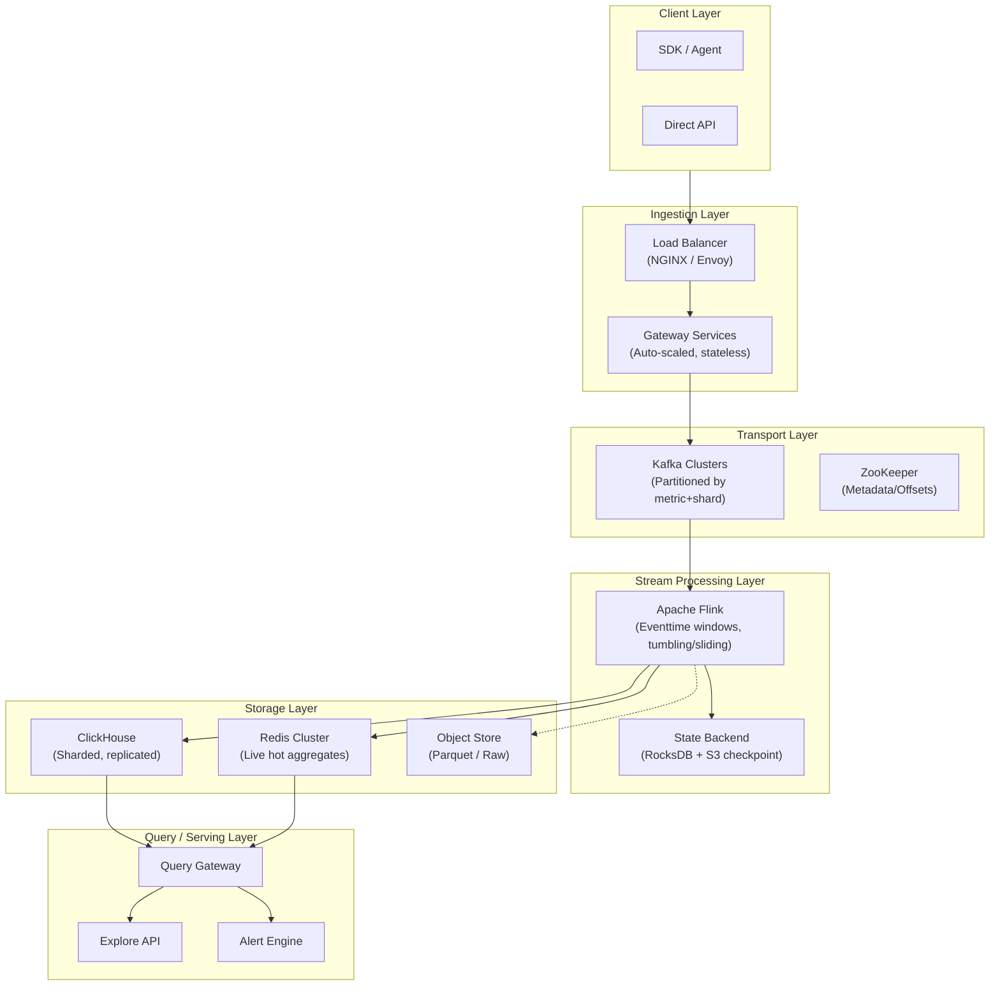

---

Design a real-time metrics aggregation pipeline that handles 100 billion events/day.


---

# Real-Time Metrics Aggregation Pipeline: 100B Events/Day

## 1. Quantified Scale Analysis

```
Daily volume:          100,000,000,000 events
Avg rate:              1,157,407 events/sec
Peak rate (3× avg):    3,472,222 events/sec
Avg event size:        ~500 bytes
Raw throughput:        ~579 MB/sec avg, ~1.7 GB/sec peak
Daily raw storage:     ~50 TB uncompressed
After compression:     ~15 TB/day
```

**Key assumption**: events are structured metric events (timestamp, metric name, labels, value). Adjust math if payload shapes differ.

---

## 2. Architecture Overview



---

## 3. Component Design

### 3.1 Ingestion Layer

**Load Balancer Tier**
```
Target: ~3.5M events/sec peak

Front-end:  8-16 NGINX nodes (or Envoy)
            - TLS termination
            - Rate limiting per API key (token bucket)
            - Request validation (schema check, size limits)

Throughput: ~500K events/sec per gateway node
Needed:     8 gateway nodes (with 2× headroom)
```

**Gateway Service** (Stateless Go/Rust)
- Receives batched events over HTTP POST `/api/v1/ingest`
- Validates schema, enriches with server-side timestamp
- **Batches internally** to reduce Kafka produce calls (500 events or 50ms)
- Writes to Kafka with `async produce`, acks only on majority partition

**Partition Strategy**
```
Kafka topic: metrics-events
Partitions:  256 (allow future expansion to 1024)

Partition key: hash(metric_name + labels_hash) % num_partitions

Benefit: Related metrics (same service) land on same partition
        → Window aggregation sees all relevant events in one partition
        → No cross-partition shuffle needed for most windows
```

**Kafka Sizing**
```
Brokers: 12 nodes, 6-core, 64GB RAM, 4× 2TB NVMe SSD

Replication factor: 3
Min ISR: 2

Retention: 7 days (enough for Flink checkpoint restore)

Throughput math:
  - Producer: 1.7 GB/sec peak → 12 brokers → ~580 Mbps per broker
  - With 3x replication → ~1.7 Gbps per broker network
  → Use 25GbE networking
```

### 3.2 Stream Processing Layer

**Apache Flink** chosen over alternatives:

| Option | Throughput | Complexity | Exactly-once | Latency | Verdict |
|--------|-----------|------------|--------------|---------|---------|
| **Flink** | ★★★★★ | Medium | Native | Low | ✓ Best fit |
| Spark Streaming | ★★★★ | Medium | Micro-batch | Higher | ✗ Latency |
| Kafka Streams | ★★★ | Low | At-least | Low | ✗ Scale |
| Pulsar Functions | ★★★ | Low | Limited | Low | ✗ Ecosystem |

**Flink Job Design** (one unified pipeline):

```java
// Pseudocode: Multi-stage aggregation pipeline

DataStream<MetricEvent> raw = env.addSource(new KafkaSource(...))
    .assignTimestampsAndWatermarks(
        WatermarkStrategy
            .<MetricEvent>forBoundedOutOfOrderness(Duration.ofSeconds(30))
            .withTimestampAssigner(Event::getTimestamp)
    );

// Stage 1: Minute-level pre-aggregation (high cardinality reduction)
KeyedStream<MetricEvent, String> keyed = raw
    .keyBy(e -> e.metricName + "|" + e.labelsHash);

SingleOutputStreamOperator<AggregatedBucket> minuteAgg = keyed
    .window(TumblingEventTimeWindows.of(Time.minutes(1)))
    .reduce((a, b) -> a.merge(b));  // in-flight merging

// Stage 2: 1-hour rollup
minuteAgg.keyBy(b -> b.metricKey)
    .window(TumblingEventTimeWindows.of(Time.hours(1)))
    .reduce((a, b) -> a.merge(b))
    .sinkToClickHouse();

// Stage 3: 1-day rollup (separate job, reads from CK or S3)
```

**State Backend**
```
Local RocksDB: 2TB NVMe per TaskManager
S3 checkpoint: every 30 seconds
State size estimate:
  - 100B events/day unique keys: assume 1M active metric series
  - Per-series state (minute window): ~1KB
  - Total state: ~1GB per TaskManager
  → Manageable on local NVMe
```

**Scaling Flink**
```
TaskManagers: start with 16, scale to 64+ based on lag
Slots per TM: 8
Total parallelism: 128 (matches Kafka partition count)

Scale trigger: Kafka consumer lag > 100K events per partition for > 5 min
Scale action:  Add TaskManagers, Flink reschedules to distribute partitions
```

### 3.3 Storage Layer (ClickHouse)

**Why ClickHouse**: Columnar, vectorized execution, compression → 10-50× storage savings vs row stores. Handles the "append-mostly, query-time-aggregated" workload perfectly.

**Schema Design**
```sql
-- Base minute-granularity table (high cardinality, queried rarely)
CREATE TABLE metrics_minute (
    metric_name   String,
    labels        Map(String, String),
    labels_hash   UInt64,
    time_bucket   DateTime,
    count         UInt64,
    sum           Float64,
    min_val       Float64,
    max_val       Float64
) ENGINE = MergeTree()
PARTITION BY toYYYYMM(time_bucket)
ORDER BY (metric_name, labels_hash, time_bucket);

-- Pre-aggregated hourly table (most common queries)
CREATE TABLE metrics_hour (
    metric_name   String,
    labels_hash   UInt64,
    time_bucket   DateTime,
    count         UInt64,
    sum           Float64,
    min_val       Float64,
    max_val       Float64
) ENGINE = SummingMergeTree()
ORDER BY (metric_name, labels_hash, time_bucket);

-- Pre-aggregated daily table (long-range queries)
CREATE TABLE metrics_day (
    metric_name   String,
    labels_hash   UInt64,
    time_bucket   DateTime,
    count         UInt64,
    sum           Float64,
    min_val       Float64,
    max_val       Float64
) ENGINE = SummingMergeTree()
ORDER BY (metric_name, labels_hash, time_bucket);
```

**ClickHouse Cluster Sizing**
```
Shards: 8 (data gets distributed)
Replicas per shard: 3 (fault tolerance)

Per shard:
  - 16-core CPU, 128GB RAM, 8× 4TB SSD
  - Ingest rate: ~700K events/sec aggregated
  - Query capacity: handles ~1000 concurrent queries

Storage math (1-year retention):
  - 100B events → minute table ~15 TB (pre-aggregates to ~2B rows)
  - Hour table ~2 TB (pre-aggregates to ~50M rows)
  - Day table ~300 GB
  - Total: ~18 TB per replica × 3 = ~54 TB raw
  - With ClickHouse compression (~10×): ~5.4 TB effective
  → 8 shards × 5.4 TB = ~43 TB total, well within budget
```

**Write Path** (Flink → ClickHouse)
```
Use ClickHouse Sink connector (JDBC or native HTTP)
Write strategy:
  - Batch writes: 5000 rows per insert
  - Flush interval: 1 second max
  - Use AsyncBufferedSink pattern in Flink

Failure recovery:
  - Flink exactly-once semantics via checkpointing
  - Deduplicate at ClickHouse using MATERIALIZED VIEW dedup
```

### 3.4 Hot Cache (Redis)

**Purpose**: Serve "last 5 minutes" with < 50ms p99 latency, reduce ClickHouse load for real-time dashboards.

```
Redis Cluster: 6 nodes, 3 shards, 2 replicas each
  - Each node: 64GB RAM, NVMe for RDB persistence
  - All data in memory (LRU eviction)

Data structure:
  Key: "metrics:{metric_name}:{labels_hash}"
  TTL:  300 seconds (auto-expire stale hot data)

  Value: Sorted Set
    Score: timestamp (Unix seconds)
    Member: JSON { ts, value }
    → Allows range queries by time range
```

**Tradeoff Analysis**:
| Approach | Latency | Cost | Complexity | Consistency |
|----------|---------|------|------------|-------------|
| Redis hot cache | ~2ms | High (RAM) | Medium | Async, may miss recent |
| All-query ClickHouse | ~100ms | Low (SSD) | Low | Synchronous |
| **Hybrid (both)** | ~2ms / ~100ms | Medium | High | Best of both |

**Chosen**: Hybrid — Redis for <5min queries, ClickHouse for everything else.

### 3.5 Archival Layer (S3)

**Purpose**: Long-term storage, backfill capability, disaster recovery.

```
S3 bucket: s3://metrics-archive/prod/
Format: Apache Parquet (columnar, compressed)
Partition: dt=YYYY-MM-DD/hr=HH/metric_name=xxx/

Write path: Flink → S3 sink (every 1 hour)
File size: ~256 MB per file (good for Parquet)

Retention:
  - Raw (1 week): for reprocessing
  - Parquet (2 years): cost-effective long-term

Cost estimate:
  - 2-year retention Parquet: ~400 TB
  - S3 cost: ~$9,000/month at $0.023/GB
```

### 3.6 Query Layer

**Query Gateway** (Stateless, Go/Python)
```
Responsibilities:
  - Parse PromQL / SQL-like queries
  - Route to appropriate backend:
      - t < 5min  → Redis
      - t >= 5min → ClickHouse
  - Merge results (different backends)
  - Rate limit per tenant
  - Cache common queries (30s TTL in local cache)
```

**API Surface**
```yaml
# Query current value (uses Redis)
GET /api/v1/query?metric=cpu_usage&labels={service:"api"}&t=now

# Query historical range (uses ClickHouse)
GET /api/v1/query_range?metric=cpu_usage&start=1h&end=now

# Ingestion
POST /api/v1/ingest
{
  "events": [
    {
      "metric": "http_request_duration_ms",
      "labels": {"service": "api", "status": "200"},
      "value": 42.5,
      "timestamp": 1700000000
    }
  ]
}
```

---

## 4. Data Flow: Full Request Lifecycle

```
Event arrives at gateway
        │
        ▼
   [Validate + enrich]
        │
        ▼
   [Batch internally to 500 events]
        │
        ▼
   [Kafka produce (async, acks=2)]
        │
        ▼
   [Kafka Topic: metrics-events]
        │
        ▼
   [Flink reads, assigns watermarks]
        │
        ▼
   [Key by metric+labels_hash]
        │
        ▼
   [1-min tumbling window: aggregate]
        │
        ├──► [Write to ClickHouse minute table]
        │
        ├──► [Update Redis hot cache (async)]  ← <50ms real-time
        │
        └──► [State checkpoint to S3 every 30s]
                │
                ▼
         [1-hour window: rollup from minute table]
                │
                ▼
         [Write to ClickHouse hour table]
                │
                ▼
         [Daily rollup job (scheduled, reads hour table)]
                │
                ▼
         [Write to ClickHouse day table + S3 parquet]
```

---

## 5. Critical Failure Modes & Mitigations

| Failure | Impact | Mitigation |
|---------|--------|------------|
| **Kafka broker failure** | Up to 33% throughput degradation | ISR=2 ensures availability; producer retries with backoff |
| **Flink TaskManager crash** | Processing lag, potential data loss | Checkpoint every 30s; state restored from S3; Kafka retains 7 days |
| **ClickHouse node failure** | Partial query failures | Replicas serve reads; writes go to live replicas only |
| **Redis node failure** | Hot cache miss, increased CK load | Local L1 cache in gateway + CK fallback; Redis auto-recover |
| **Backpressure spiral** | Entire pipeline stalls | Flink Kafka source: disable auto COMMIT; scale out consumers |
| **Data skew (hot partitions)** | Some partitions fall behind | Partition by hash(metric + labels), not just metric; monitor partition lag per-TM |
| **Clock drift (event time)** | Late events dropped | 30s out-of-order tolerance watermark + dead-letter queue |
| **Schema evolution** | Old code can't read new events | Avro schema registry with backward compatibility; rolling deployments |

---

## 6. Capacity Planning & Cost Estimate

**Hardware/Cloud Costs (Monthly)**

| Component | Nodes | Spec | Est. Monthly Cost |
|-----------|-------|------|-------------------|
| Gateway + LB | 16 | 4-core, 8GB, 100GB SSD | ~$2,400 |
| Kafka | 12 | 8-core, 64GB, 8TB NVMe, 25GbE | ~$12,000 |
| ZooKeeper | 3 | 4-core, 16GB | ~$900 |
| Flink (TaskManagers) | 32 | 8-core, 32GB, 1TB NVMe | ~$8,000 |
| ClickHouse | 24 | 16-core, 128GB, 32TB SSD | ~$36,000 |
| Redis | 6 | 64GB RAM, 500GB NVMe | ~$4,800 |
| S3 / Object Store | — | 400TB retained | ~$9,200 |
| **Total** | | | **~$73,300/month** |

At 100B events/day, this is approximately **$0.73 per billion events** — reasonable for enterprise observability.

**Scale Headroom**:
- Current: 1.16M events/sec avg
- Peak designed for: 3.5M events/sec (3×)
- To reach 10×: Add Kafka partitions (up to 1024), add Flink TMs, shard ClickHouse further

---

## 7. Key Design Decisions & Tradeoffs

### Partition Granularity
**Decision**: Partition Kafka by `hash(metric_name + labels_hash)`, not just metric name.
- **Why**: Prevents hot spots (one popular metric won't saturate one partition)
- **Tradeoff**: Can't do cross-partition aggregations efficiently → Flink co-locates all data for a given metric key in one partition

### Exactly-Once vs At-Least-Once
**Decision**: Exactly-once for ClickHouse writes (using Flink checkpointing + deduplication)
- **Why**: Duplicates in metrics aggregation cause incorrect dashboards/alerts
- **Tradeoff**: Higher latency on write path (checkpoint overhead), increased complexity

### Pre-Aggregation Levels
**Decision**: 1-min, 1-hour, 1-day rollup tiers
- **Why**: Exponential storage reduction without losing granularity
- **Tradeoff**: Query must pick the right table; wrong choice causes table scan

### Redis Cache TTL
**Decision**: 300-second (5-minute) TTL
- **Why**: Captures "live dashboard" use case; short enough to auto-recover from bugs
- **Tradeoff**: Cannot query exactly-last-4-minutes reliably (staleness window)

---

## 8. Monitoring the Pipeline Itself

The pipeline needs its own observability:

```yaml
# SLOs to track
ingestion_lag:         p99 < 5 seconds (Kafka produce → consume)
processing_lag:        p99 < 30 seconds (Kafka → ClickHouse write)
query_latency:         p99 < 100ms for hot queries, < 2s for cold
ingestion_throughput:  target > 1.2M events/sec sustained

# Key dashboards
- Kafka consumer lag per partition (alert if > 50K)
- Flink checkpoint duration and size (alert if > 1 min)
- ClickHouse insert queue depth (alert if > 10K)
- Redis memory utilization and hit rate
```

---

## Summary

```
Ingestion  → Kafka (12 brokers, 256 partitions, 3x replication)
Stream Proc → Flink (32 TMs, RocksDB state, S3 checkpoints)
Storage    → ClickHouse (8 shards × 3 replicas, 3 aggregation tables)
Hot Cache  → Redis (6 nodes, 5-min TTL)
Archive    → S3 (Parquet, 2-year retention)
Query      → Stateless gateway, routes by time window

This handles 100B events/day with:
  ✓ Sub-second ingestion latency
  ✓ < 50ms p99 for recent queries (via Redis)
  ✓ Exactly-once aggregation guarantees
  ✓ Horizontal scale-out at every layer
  ✓ < 30-second recovery from any single-node failure
```