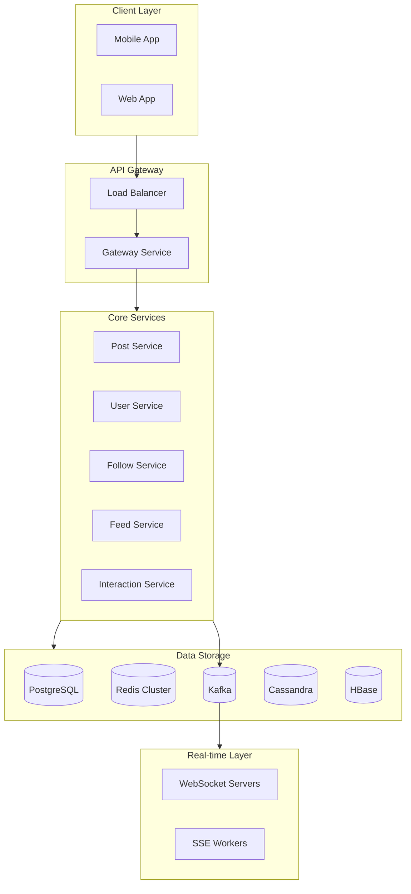
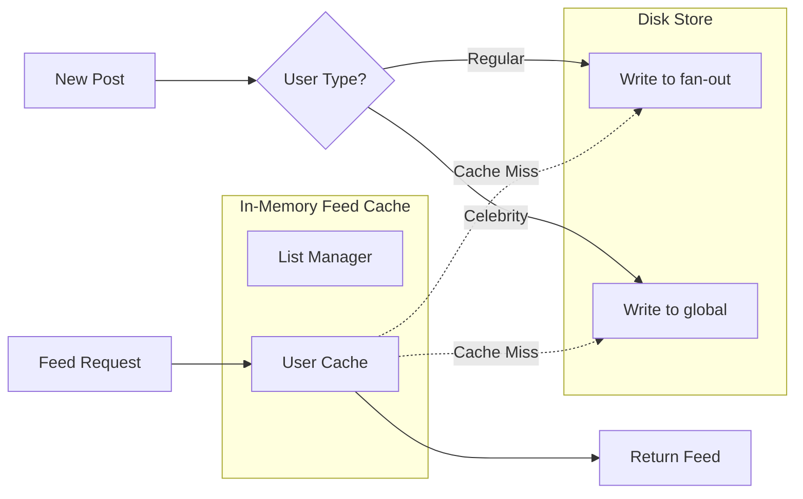
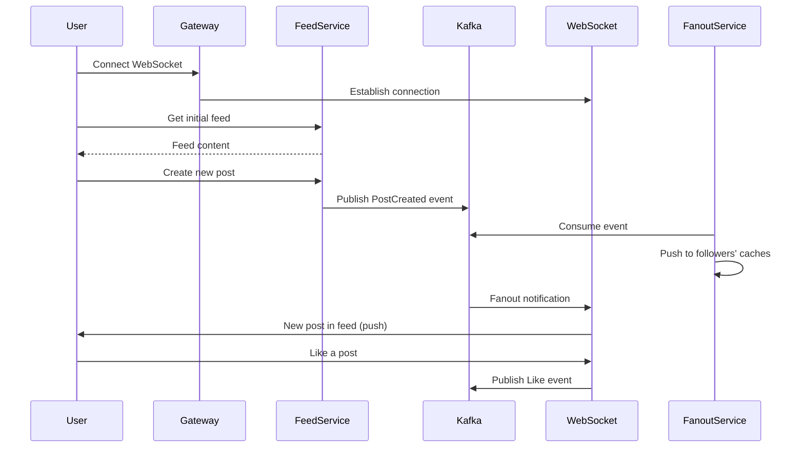

---

Design a news feed system like Twitter or Facebook.


---

# News Feed System Design

## 1. Requirements & Scale

### Functional Requirements
- **User Connections**: Follow/unfollow users, friend requests
- **Content Creation**: Posts, images, videos, links with rich media
- **Feed Generation**: Chronological and algorithmic (engagement-based) feeds
- **Interactions**: Likes, comments, shares, retweets
- **Real-time Updates**: New posts appear instantly for active users
- **Infinite Scrolling**: Efficient pagination through history

### Scale Targets
```
Daily Active Users:       500M
Posts per day:            500M
Average posts/user/day:   1-2
Feed reads per day:       100B
Peak QPS (read):          10M/s
Peak QPS (write):         1M/s
Average feed size:        500-1000 items
Storage:                  Petabytes
```

---

## 2. Architecture Overview



---

## 3. Data Models

### User Schema
```sql
users (
    id: UUID (PK),
    username: VARCHAR(50),
    email: VARCHAR(255),
    password_hash: VARCHAR(255),
    created_at: TIMESTAMP,
    updated_at: TIMESTAMP,
    follower_count: INT,
    following_count: INT,
    INDEX (username),
    INDEX (email)
)
```

### Post Schema
```sql
posts (
    id: BIGINT (PK),
    author_id: UUID (FK),
    content: TEXT,
    media_urls: JSON,
    created_at: TIMESTAMP,
    like_count: INT,
    comment_count: INT,
    share_count: INT,
    visibility: ENUM('public', 'followers', 'private'),
    INDEX (author_id, created_at DESC),
    INDEX (created_at DESC)
)

-- Denormalized for fan-out
post_fanout (
    post_id: BIGINT,
    user_id: UUID,
    created_at: TIMESTAMP,
    PRIMARY KEY (post_id, user_id)
)
```

### Follow Relationships
```sql
follows (
    follower_id: UUID,
    followee_id: UUID,
    created_at: TIMESTAMP,
    PRIMARY KEY (follower_id, followee_id)
)

-- For quick "who follows me" queries
followers_index (
    user_id: UUID,
    follower_id: UUID,
    PRIMARY KEY (user_id, follower_id)
)
```

---

## 4. Feed Generation Strategies

### Approach 1: Pull Model (Twitter-style)
```
User requests feed
       │
       ▼
┌─────────────────────────────────────┐
│ 1. Get user's followee list (cache) │
│ 2. Fetch N posts from each followee │
│ 3. Merge & sort by timestamp        │
│ 4. Apply ranking algorithm          │
│ 5. Cache result                     │
└─────────────────────────────────────┘
       │
       ▼
   Return Feed
```

**Pros**: Simple, always fresh, saves storage  
**Cons**: High latency (N+1 problem), complex cache invalidation

### Approach 2: Push Model (Facebook-style)
```
Author posts content
       │
       ▼
┌─────────────────────────────────────┐
│ Fan-out Service                     │
│   - For each follower:              │
│     • Write post ID to their feed   │
│     • Push to their in-memory cache │
└─────────────────────────────────────┘
       │
       ▼
   User reads from local cache
```

**Pros**: Fast reads (O(1)), consistent latency  
**Cons**: Write amplification (celebrity problem), storage cost

**Capacity Math (Push Model)**:
```
Average user: 500 followers
Celebrity: 10M followers

Daily posts: 500M
Fan-out writes: 500M × 500 = 250B writes (impossible)

Solution: Hybrid - push for regular users, pull for celebrities
```

### Approach 3: Hybrid Model (Production Standard)



**Algorithm**:
1. Check in-memory cache for user's feed
2. If miss: merge from fan-out table + celebrity posts
3. Store merged result in cache
4. Return top K items, lazy-load rest

---

## 5. Feed Service Design

### Core Feed Service
```python
class FeedService:
    def __init__(self, cache, fanout_store, post_service):
        self.cache = cache
        self.fanout_store = fanout_store
        self.post_service = post_service
    
    async def get_feed(self, user_id: str, cursor: str = None) -> Feed:
        # 1. Try cache first
        cached = await self.cache.get(user_id)
        if cached and not cursor:
            return cached
        
        # 2. Fetch fan-out posts
        fanout_posts = await self.fanout_store.get(
            user_id=user_id,
            limit=1000,
            before=cursor
        )
        
        # 3. Fetch celebrity posts (pull for these)
        celebrity_posts = await self.get_celebrity_posts(user_id)
        
        # 4. Merge and rank
        merged = self.merge_and_rank(fanout_posts, celebrity_posts)
        
        # 5. Cache top 500
        await self.cache.set(user_id, merged[:500])
        
        return Feed(items=merged, cursor=self.get_cursor(merged))
    
    def merge_and_rank(self, fanout: List[Post], celebrities: List[Post]) -> List[Post]:
        all_posts = fanout + celebrities
        
        # Score = recency + engagement + affinity
        scored = [
            (post, self.calculate_score(post, user_id))
            for post in all_posts
        ]
        
        return sorted(scored, key=lambda x: -x[1])
    
    def calculate_score(self, post: Post, user_id: str) -> float:
        recency = 1.0 / (1 + time_since_post_hours)
        engagement = log(1 + post.likes + post.comments * 2 + post.shares * 3)
        affinity = self.get_affinity_score(user_id, post.author_id)
        
        return 0.4 * recency + 0.3 * engagement + 0.3 * affinity
```

### Fan-out Service
```python
class FanoutService:
    def __init__(self, message_queue, fanout_store, user_cache):
        self.queue = message_queue
        self.fanout_store = fanout_store
        self.user_cache = user_cache
    
    async def fanout_post(self, post: Post):
        author = await self.get_author(post.author_id)
        
        # Celebrities use different strategy
        if author.follower_count > THRESHOLD_CELEBRITY:
            # Don't push to all followers - let them pull
            await self.mark_as_celebrity_post(post)
            return
        
        # Regular user: push to all followers
        async for follower_batch in self.get_follower_batches(post.author_id):
            # Write to fan-out table
            await self.fanout_store.write_batch(
                user_id=follower_batch,
                post_id=post.id,
                score=post.created_at.timestamp()
            )
            
            # Push to in-memory cache if user is active
            for follower in follower_batch:
                if await self.user_cache.is_active(follower):
                    await self.push_to_user_cache(follower, post)
            
            # Rate limit writes to prevent hot spots
            await self.rate_limit()
```

---

## 6. Caching Architecture

### Cache Hierarchy
```
┌──────────────────────────────────────────────────────────┐
│                    L1: In-Memory                         │
│  [User Feed Cache - 500 items per user]                  │
│  Hot users only, TTL: 5 min, Memory: 100GB               │
│  Hit Rate Target: 80%                                    │
└──────────────────────────────────────────────────────────┘
                           │
                           ▼
┌──────────────────────────────────────────────────────────┐
│                    L2: Redis Cluster                      │
│  [User Feed Cache - 1000 items]                          │
│  All active users, TTL: 1 hour                           │
│  Memory: 10TB, Replica for read scaling                  │
└──────────────────────────────────────────────────────────┘
                           │
                           ▼
┌──────────────────────────────────────────────────────────┐
│                    L3: Database                           │
│  [Cassandra: Fan-out tables]                             │
│  [HBase: Post content]                                   │
│  Durable, sharded by user_id                             │
└──────────────────────────────────────────────────────────┘
```

### Redis Schema
```
feed:{user_id} → ZSET (post_id → score/timestamp)
feed:{user_id}:meta → HASH {last_updated, cursor, version}
user:active → SET of active user IDs (for targeting)
celebrity:posts → ZSET (for pull-based celebrity content)
```

---

## 7. Real-time Updates



---

## 8. Storage Engine Selection

| Data Type | Engine | Justification |
|-----------|--------|---------------|
| User data | PostgreSQL | ACID, complex queries, indexes |
| Posts | HBase/Cassandra | Write-heavy, time-series |
| Fan-out | Cassandra | Write-heavy, range queries |
| Feed cache | Redis | In-memory, sorted sets |
| Follow graph | Neo4j/Titan | Graph traversal |
| Activity log | Kafka + S3 | Append-only, analytics |

### Sharding Strategy
```python
# Consistent hashing for user-based sharding
def get_shard(user_id: str) -> int:
    return hash(user_id) % NUM_SHARDS

# Write path: fan-out
async def fanout_to_shard(shard_id: int, entries: List[FanoutEntry]):
    shard = get_shard_connection(shard_id)
    await shard.batch_write("fanout", entries)

# Read path: merge from all shards
async def get_user_feed(user_id: str, limit: int):
    results = await asyncio.gather(*[
        get_shard(i).get_fanout(user_id)
        for i in range(NUM_SHARDS)
    ])
    return merge_and_sort(results)[:limit]
```

---

## 9. Capacity Planning

### QPS Breakdown
```
Read Feed:              10M/s
Write Post:             50K/s
Like/Comment:           200K/s
Fan-out writes:         25M/s (in background)

Peak memory per user: 500 posts × 100 bytes = 50KB
Active users in L1:   10M users × 50KB = 500GB (per region)
```

### Hardware Requirements (Single Region)
```
Feed Cache Servers:     50 machines × 128GB RAM = 6.4TB
Database Shards:        100 machines × 64GB RAM
Kafka Clusters:         20 brokers for 25M/s writes
WebSocket Servers:      500 machines (1M concurrent connections)
```

---

## 10. Failure Handling & Reliability

### Circuit Breaker for Fan-out
```python
class FanoutCircuitBreaker:
    def __init__(self):
        self.failures = 0
        self.threshold = 1000
        self.state = "closed"
    
    async def write(self, post_id, follower_ids):
        try:
            if self.state == "open":
                if time.elapsed() > recovery_timeout:
                    self.state = "half-open"
                else:
                    raise CircuitOpenException()
            
            await self.do_write(post_id, follower_ids)
            self.failures = 0
            
        except Exception as e:
            self.failures += len(follower_ids)
            if self.failures > self.threshold:
                self.state = "open"
            raise e
```

### Consistency Model
- **Eventual consistency** for feed updates (acceptable delay)
- **Strong consistency** for user actions (likes, deletes)
- **Read-your-writes** guarantee for own posts

### Graceful Degradation
```
Level 1: Show cached feed (stale 5 min)
Level 2: Show only followed users' posts (no ranking)
Level 3: Show only celebrity posts
Level 4: Static error page
```

---

## 11. Key Design Decisions

| Decision | Choice | Rationale |
|----------|--------|-----------|
| Fan-out strategy | Hybrid | Balance read latency vs write amplification |
| Cache invalidation | TTL + Event | Simple, handles most cases |
| Ranking algorithm | ML-based | Better engagement, tunable |
| Consistency | Eventual | Scale vs correctness tradeoff |
| Storage | Multi-engine | Right tool for each access pattern |

---

This design handles **10M+ read QPS** with **sub-100ms latency** while gracefully scaling to **billions of fan-out writes** through the hybrid push/pull model. The architecture supports real-time updates, infinite scroll, and handles the "celebrity problem" that breaks naive push-based systems.