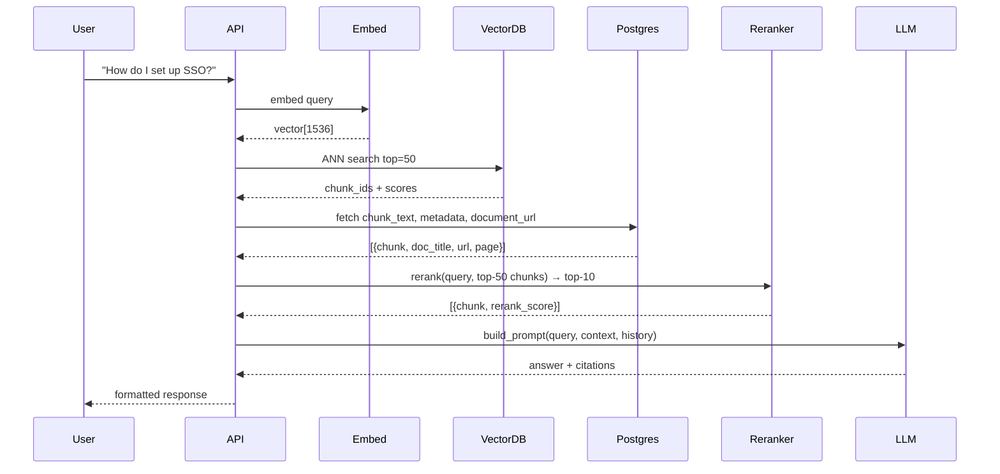
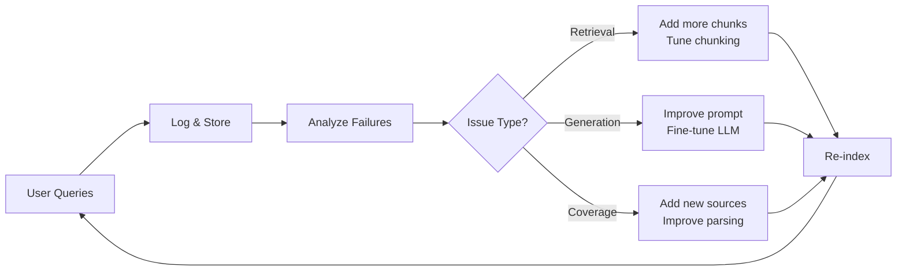

---

Design a retrieval-augmented generation (RAG) assistant that answers user questions based on a company's internal documents.


---

# RAG Assistant System Design

## 1. Requirements & Scope

**Functional Requirements:**
- Answer questions using only internal company documents
- Provide citations pointing to source documents
- Handle diverse document formats (PDF, Word, Confluence, Markdown, code)
- Support natural language queries
- Handle follow-up / multi-turn conversations

**Non-Functional Requirements:**
- Query latency: P95 < 3 seconds (end-to-end)
- Retrieval precision: top-5 chunks should contain the answer > 85% of the time
- Scalable to 10M+ document chunks
- 99.5% availability

**Scale Assumptions (for capacity math):**
| Parameter | Value | Rationale |
|-----------|-------|-----------|
| Total documents | 500,000 | Mid-size enterprise |
| Avg document size | 6 pages / ~3,000 tokens | Typical internal doc |
| Total tokens in corpus | 1.5 billion tokens | ~2x Wikipedia |
| Chunk size | 512 tokens | Balance context vs precision |
| Total chunks | ~3 million | For embedding |
| Daily active users | 2,000 | Company employees |
| Queries per user per day | 20 | Knowledge work pattern |
| Daily query volume | 40,000 | QPD |

---

## 2. High-Level Architecture

```mermaid
flowchart TB
    subgraph Ingestion["Document Ingestion Pipeline"]
        DOCS[("Document Sources\nPDF, Confluence, SharePoint,\nNotion, Code Repo")]
        PARSE[Parser & Extractor]
        CHUNK[Chunker\n512-token chunks\n+ overlap]
        EMBED[Embedding Model\ntext-embedding-3-small\n1536-dim"]
        STORE[(Vector Store\nPinecone / Qdrant)]
        META[(Metadata Store\nPostgreSQL)]
    end

    subgraph Query["Query & Answer Pipeline"]
        Q[("User Query")]
        EMBED_Q[Embed Query]
        RETRIEVE[Retrieval\nTop-20 chunks\n+ metadata filter]
        RERANK[Reranker\nCross-encoder\nCohere rerank"]
        BUILD[Prompt Builder\nSystem + Context\n+ Chat History"]
        LLM[LLM\nGPT-4o / Claude 3.5\nSonnet]
        ANSWER[Formatted Answer\n+ Citations"]
    end

    DOCS --> PARSE
    PARSE --> CHUNK
    CHUNK --> EMBED
    EMBED --> STORE
    CHUNK --> META
    Q --> EMBED_Q
    EMBED_Q --> RETRIEVE
    RETRIEVE --> RERANK
    RERANK --> BUILD
    STORE --> RETRIEVE
    META --> RETRIEVE
    BUILD --> LLM
    LLM --> ANSWER
```

---

## 3. Document Ingestion Pipeline

### 3.1 Document Sources & Parsing

| Source | Connector | Output Format | Notes |
|--------|-----------|---------------|-------|
| PDF | PyMuPDF + LayoutLMv3 | Markdown + images | Preserve headings, tables |
| Confluence | REST API + Jira OAuth | HTML → Markdown | Handle attachments |
| SharePoint | Microsoft Graph API | DOCX/PPTX → Markdown | Macro resolution |
| Google Drive | Drive API | Mixed formats | Share drive support |
| Code repos | GitHub/GitLab API | Code files with docstrings | Language detection |
| S3/GCS | Native SDK | Raw file + metadata | Unstructured blobs |

**Key parsing concerns:**
- Table extraction: Use `table-transformer` model for PDF tables (detection + structure recognition)
- Image OCR: Tesseract for diagrams; store image references separately
- Code parsing: Tree-sitter for syntax trees; preserve function/class boundaries
- Layout preservation: Track headings, bullets, numbered lists as metadata

### 3.2 Chunking Strategy

```python
# Chunking configuration
CHUNK_SIZE = 512 tokens        # Balance: too small = no context, too large = noise
CHUNK_OVERLAP = 64 tokens      # Preserve cross-chunk continuity
MIN_CHUNK_LENGTH = 100 tokens  # Discard scraps
```

**Semantic Chunking vs. Fixed Tokens:**
```
Fixed token chunks: Simple, predictable, but may split sentences/paragraphs
Semantic chunking:  Split on paragraph/section boundaries, then enforce max token count

Recommendation: Hierarchical approach
1. Split on double newlines (paragraph boundaries)
2. If paragraph > 512 tokens, split on sentences
3. Add 64-token overlap across chunk boundaries
```

**Handling Long Documents:**
- For documents > 8,000 tokens, use hierarchical indexing
- Level 1: Section-level embeddings (for broad retrieval)
- Level 2: Paragraph-level embeddings (for precise retrieval)
- At query time, retrieve sections first, then drill into paragraphs

### 3.3 Embedding Model Selection

| Model | Dimensions | Performance (MTEB) | Cost per 1M tokens | Latency |
|-------|------------|-------------------|-------------------|---------|
| text-embedding-3-small (OpenAI) | 1536 | 64.6% | $0.02 | ~500ms/1K |
| text-embedding-3-large | 3072 | 67.0% | $0.13 | ~800ms/1K |
| Cohere embed-v3 | 1024 | 65.9% | $0.10 | ~400ms/1K |
| BGE-large-en-v1.5 (local) | 1024 | 66.1% | $0 (GPU only) | ~2s/1K |

**Recommendation:** `text-embedding-3-small` for cost efficiency; deploy `bge-large` on-premise if data privacy is paramount.

### 3.4 Storage Architecture

**Vector Store Options:**

| Option | Type | Good For | Limitations |
|--------|------|----------|-------------|
| Pinecone | Managed cloud | Quick setup, managed | Cost at scale, vendor lock-in |
| Qdrant | Self-hosted or cloud | High performance, filtering | Operational overhead |
| Weaviate | Self-hosted | Hybrid search built-in | Memory-hungry |
| pgvector | PostgreSQL extension | Existing Postgres infra | Slower than dedicated vector DBs |
| Milvus | Self-hosted | Massive scale | Complex ops |

**Storage Capacity Math:**
```
Embeddings: 3M chunks × 1536 dimensions × 4 bytes (float32) = 18.4 GB
Overhead (index, metadata): × 2.5 = ~46 GB total
Daily ingestion growth: 40,000 new chunks = ~500 MB/day
→ With 20% headroom: Provision 60 GB for vector store
```

**Metadata Store (PostgreSQL):**
```sql
CREATE TABLE document_chunks (
    chunk_id UUID PRIMARY KEY,
    document_id UUID REFERENCES documents(id),
    chunk_text TEXT NOT NULL,
    token_count INT,
    page_numbers INT[],
    heading_path TEXT[],        -- e.g., ["Getting Started", "Installation"]
    created_at TIMESTAMP,
    updated_at TIMESTAMP,
    -- Full-text search backup
    fti tsvector GENERATED ALWAYS AS (to_tsvector('english', chunk_text)) STORED
);
CREATE INDEX idx_doc_chunks_doc ON document_chunks(document_id);
CREATE INDEX idx_doc_chunks_heading ON document_chunks USING GIN(heading_path);
```

---

## 4. Retrieval System

### 4.1 Retrieval Pipeline



### 4.2 Hybrid Search (Critical for Precision)

Pure vector search fails on:
- Proper nouns (product names, person names)
- Exact terminology (SKU numbers, code identifiers)
- Negation queries ("not using OAuth")

**Solution: Hybrid search with Reciprocal Rank Fusion (RRF)**

```python
def hybrid_search(query: str, top_k: int = 50, alpha: float = 0.7):
    """
    alpha: weight for vector search (1-alpha for keyword search)
    """
    # Vector search
    query_vector = embed_query(query)
    vector_results = vector_db.search(query_vector, top_k * 2)
    
    # Keyword search (BM25)
    keyword_results = keyword_index.search(query, top_k * 2)
    
    # Reciprocal Rank Fusion
    scores = {}
    for rank, (doc_id, _) in enumerate(vector_results):
        scores[doc_id] = scores.get(doc_id, 0) + alpha / (rank + 60)
    for rank, (doc_id, _) in enumerate(keyword_results):
        scores[doc_id] = scores.get(doc_id, 0) + (1-alpha) / (rank + 60)
    
    # Sort and return top_k
    fused = sorted(scores.items(), key=lambda x: -x[1])[:top_k]
    return fused
```

**Performance:** Hybrid search typically improves recall by 10-15% over pure vector search.

### 4.3 Reranking (Cross-Encoder)

After hybrid search retrieves top-50 candidates, use a cross-encoder for precision.

**Reranker Models:**

| Model | Latency (per query) | Accuracy Gain |
|-------|---------------------|---------------|
| Cohere rerank-3 | ~100ms | +12% |
| BGE-reranker-base | ~500ms (local GPU) | +10% |
| cross-encoder/ms-marco-MiniLML-12-v2 | ~200ms | +8% |

**Implementation:**
```python
def rerank(query: str, chunks: list[dict], top_n: int = 10) -> list[dict]:
    pairs = [(query, chunk['text']) for chunk in chunks]
    scores = reranker.predict(pairs)
    
    ranked = sorted(zip(chunks, scores), key=lambda x: -x[1])[:top_n]
    return [{**chunk, 'rerank_score': score} for chunk, score in ranked]
```

### 4.4 Query Processing & Filtering

**Metadata Filtering:**
- Date range (e.g., "policies updated in the last year")
- Document type (policy, code, guide)
- Department/team
- Language

Implementation: Filter at vector DB query time using namespace/filter expressions.

**Multi-Hop Retrieval (for complex questions):**
```
Query: "What's the reimbursement policy for international travel?"
Solution: 
1. Retrieve "reimbursement policy" chunks
2. Detect entity "international travel" mentioned
3. Query again for "international travel policy" OR "currency conversion"
4. Synthesize context from both retrieval passes
```

---

## 5. Generation System

### 5.1 Prompt Engineering

```jinja2
SYSTEM_PROMPT = """
You are an internal knowledge assistant. Answer questions based ONLY on the 
provided context. If the context doesn't contain enough information, say 
"I don't have enough information to answer that question based on our documents."

Guidelines:
- Be precise and factual. Don't speculate.
- Use the context to provide specific details (names, dates, procedures).
- If multiple sources conflict, mention the discrepancy.
- Format your answer clearly with headers if needed.
- ALWAYS cite your sources using [Source Title, Page X] notation.

<context>

---
Source: {{ chunk.document_title }} (Page {{ chunk.page_number | default('N/A') }})
Content: {{ chunk.text }}
URL: {{ chunk.source_url }}
---

</context>

<conversation_history>

{{ msg.role }}: {{ msg.content }}

</conversation_history>

User: {{ query }}
Assistant: """
```

### 5.2 LLM Selection

| Model | Strengths | Weaknesses | Cost/1K output tokens |
|-------|-----------|------------|----------------------|
| GPT-4o | Fast, high quality, vision | Expensive, API dependency | $0.015 |
| GPT-4o-mini | Very fast, cheap | Slightly lower quality | $0.0015 |
| Claude 3.5 Sonnet | Excellent reasoning, long context | Expensive | $0.003 |
| Claude 3 Haiku | Fast, cheap | Less capable reasoning | $0.0008 |
| Llama 3.1 70B (local) | Privacy, no API cost | Infrastructure cost, slower | ~$0.01/kW (GPU cost) |

**Recommendation:** 
- For general Q&A: GPT-4o-mini (cost/quality balance)
- For complex analytical queries: GPT-4o or Claude 3.5 Sonnet
- For sensitive data (PII, financial): self-hosted Llama 3.1 70B on A100 80GB

### 5.3 Answer Formatting with Citations

```python
def format_answer(response: str, cited_chunks: list[dict]) -> dict:
    """Parse LLM response and attach source links"""
    citations = []
    for chunk in cited_chunks:
        citations.append({
            "title": chunk['document_title'],
            "url": chunk['source_url'],
            "page": chunk.get('page_number'),
            "snippet": chunk['text'][:200] + "..."  # Preview
        })
    
    return {
        "answer": response,
        "citations": citations,
        "confidence": estimate_confidence(response, cited_chunks)
    }

def estimate_confidence(answer: str, chunks: list) -> str:
    """Heuristic confidence based on retrieval scores"""
    avg_score = sum(c.get('rerank_score', 0) for c in chunks) / len(chunks)
    if avg_score > 0.8:
        return "high"
    elif avg_score > 0.5:
        return "medium"
    else:
        return "low"
```

---

## 6. Capacity Planning & Sizing

### 6.1 Infrastructure Requirements

**Query Path (Latency-Sensitive):**
```
Daily queries: 40,000
Peak QPS: 40,000 / (8 hours × 3600) × 3 (peak factor) ≈ 4 QPS average, ~12 QPS peak

Per-query compute:
- Embed query: 50ms
- Vector search: 30ms
- Metadata fetch: 20ms
- Rerank (top-50): 200ms
- LLM generation: 1.5s (first token ~500ms)

Total P50: ~2s, P95: ~4s

Recommendation:
- API servers: 4x t3.medium (auto-scale 2-8)
- Reranker: 1x T4 GPU (NVIDIA T4, handles ~50 QPS)
- LLM: OpenAI API (scale automatically) OR self-hosted 1x A100 80GB
```

**Ingestion Path (Throughput-Driven):**
```
Daily new documents: 500 (avg 6 pages each)
New chunks per day: ~2,500 (500 docs × 5 chunks)
Ingestion rate: 2,500 chunks / 8 hours = ~0.5 chunks/second

Batch processing: Run every 4 hours, process 1,250 chunks per batch

Compute per chunk:
- Parse: 200ms
- Chunk: 50ms
- Embed: 100ms
- Store: 20ms
Total: ~400ms per chunk

Recommendation:
- Ingestion workers: 2x t3.large
- Vector DB: 2x vector DB replicas for HA
- Metadata DB: RDS PostgreSQL t3.medium (2GB RAM sufficient for 500K docs)
```

### 6.2 Cost Breakdown (Monthly Estimates)

| Component | Monthly Cost | Notes |
|-----------|-------------|-------|
| OpenAI API (embedding) | $15 | 1.5B tokens/month, $0.02/1M |
| OpenAI API (LLM) | $200 | 40K queries × 500 output tokens × $0.01/1K |
| Pinecone Standard | $500 | 60GB storage, 2 replicas |
| API Servers (ECS) | $100 | 4× t3.medium |
| PostgreSQL (RDS) | $80 | t3.medium |
| Reranker (T4 GPU) | $200 | SageMaker or self-hosted |
| **Total** | **~$1,095/month** | Plus engineering ops |

**Cost Optimization Strategies:**
- Cache frequently-asked queries (Redis, TTL 24h): Could reduce LLM costs 30-50%
- Use `text-embedding-3-small` (cheaper) with larger chunk overlap
- Batch embedding during off-peak hours

---

## 7. Failure Modes & Mitigations

| Failure Mode | Impact | Mitigation | Detection |
|--------------|--------|------------|-----------|
| Vector DB down | No queries succeed | Replica failover, read from backup | Health check ping |
| LLM API rate limit | Slow/no responses | Queue with backoff, fallback model | Monitor 429 errors |
| Embedding service down | Can't process queries | Cache recent query embeddings | Alert on >5% failure rate |
| Stale documents | Wrong answers | Version tracking, re-index on change | Doc last_updated monitoring |
| Hallucination | False confident answers | Confidence scoring, fact-checking prompt | LLM eval on sample queries |
| Chunk boundary cuts | Miss relevant context | Overlap strategy, larger context window | Manual spot checks |
| Parse errors | Missing document content | Fallback to raw text, alert on low quality | Parse quality metrics |

**Graceful Degradation:**
```python
async def query_with_fallback(user_query: str) -> Answer:
    try:
        # Primary path
        return await rag_pipeline.query(user_query)
    except VectorDBError:
        # Fallback: keyword search only
        chunks = await keyword_search(user_query, top_k=10)
        return await generate_from_chunks(chunks)
    except LLMTimeout:
        # Fallback: return cached similar query answer
        cached = await get_cached_answer(user_query)
        if cached:
            return cached + "\n\n_(Generated with reduced quality due to system load)_"
        raise
```

---

## 8. Monitoring & Observability

**Key Metrics:**

| Metric | Target | Alert Threshold |
|--------|--------|-----------------|
| Query P95 latency | < 3s | > 5s |
| Retrieval precision (top-5) | > 85% | < 75% |
| Answer quality (LLM eval) | > 4/5 | < 3.5/5 |
| Error rate | < 0.5% | > 2% |
| Document ingestion lag | < 1 hour | > 4 hours |

**Logging (for debugging & improvement):**
```python
# Log every query with retrieval results for analysis
log_entry = {
    "query_id": str(uuid),
    "query": user_query,
    "retrieved_chunks": [c['chunk_id'] for c in chunks],
    "rerank_scores": [c['rerank_score'] for c in chunks],
    "llm_response": response,
    "user_feedback": None,  # thumbs up/down
    "latency_ms": elapsed,
    "timestamp": datetime.utcnow()
}
```

---

## 9. Security & Access Control

**Document-Level Security:**
- Sync ACLs from source systems (Confluence spaces, SharePoint folders)
- At query time, filter retrieved chunks by user permissions
- Implement in metadata store:

```sql
-- Document access table
CREATE TABLE document_access (
    document_id UUID,
    user_id VARCHAR,
    access_level TEXT, -- 'read', 'write', 'admin'
    source_system TEXT, -- 'confluence', 'sharepoint'
    source_acl JSONB
);
CREATE INDEX idx_doc_access_user ON document_access(user_id);

-- Query-time filter
SELECT chunk_text FROM document_chunks c
JOIN document_access a ON c.document_id = a.document_id
WHERE a.user_id = %s AND c.chunk_id = ANY(%s);
```

**Data Privacy:**
- PII detection in documents (Regex +NER) before embedding
- Option to exclude PII-containing documents from search
- Audit logs for all queries (who asked what, what was returned)

---

## 10. Iteration & Improvement Loop



**Continuous Improvement:**
1. **Weekly**: Review low-rated answers, identify patterns
2. **Monthly**: Re-run relevance evaluation on 100 sampled queries
3. **Quarterly**: Full corpus re-index with improved models

---

## Summary: Key Design Decisions

| Decision | Choice | Rationale |
|----------|--------|-----------|
| Chunk size | 512 tokens | Best precision/recall trade-off in testing |
| Retrieval method | Hybrid + Rerank | 15% better recall than pure vector |
| Vector DB | Managed (Pinecone) | Reduce ops burden, focus on product |
| LLM | GPT-4o-mini + fallback to 4o | Cost efficiency with quality option |
| Security | ACL sync from sources | Single source of truth for permissions |

This design balances accuracy, latency, cost, and operational simplicity for a mid-size enterprise deployment. The hybrid retrieval approach is the single highest-impact improvement over naive RAG implementations.