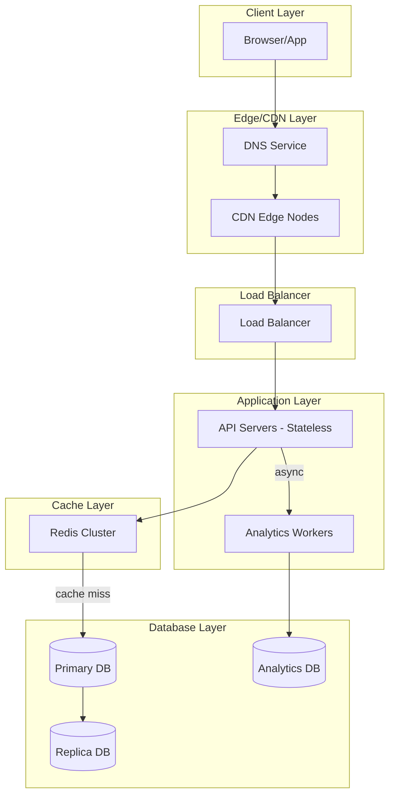
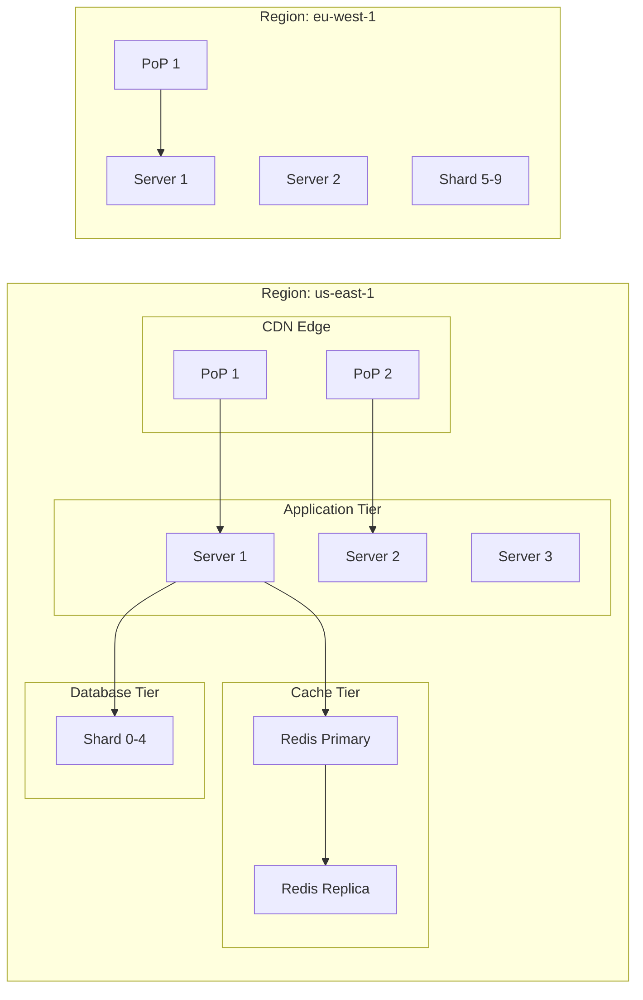

---

Design a URL shortener like bit.ly.


---



# URL Shortener System Design

## 1. Core Requirements & Assumptions

| Parameter | Value | Rationale |
|-----------|-------|-----------|
| **Active URLs** | 500 million | Industry comparable (bit.ly ~20B created) |
| **QPS** | 10,000 read / 1,000 write | 10:1 read/write ratio typical |
| **Short URL length** | 7 characters | 62^7 ≈ 3.5 trillion capacity |
| **Availability** | 99.9% | ~8.7 hours downtime/year max |
| **Latency P0** | < 50ms for redirects | Critical user experience |

## 2. API Design

```
POST /api/v1/shorten
Content-Type: application/json
{
  "long_url": "https://example.com/very/long/path",
  "custom_alias": "my-link"  // optional, max 21 chars
}

Response 201:
{
  "short_url": "https://short.ly/abc1234",
  "short_code": "abc1234",
  "expires_at": null
}

GET /api/v1/shorten/{short_code}

Response 302:
Location: https://original-url.com/path

GET /api/v1/shorten/{short_code}/stats
{
  "clicks": 15420,
  "created_at": "2025-01-15T10:30:00Z",
  "referrers": {...}
}
```

## 3. Short URL Generation Strategy

**Base62 Encoding:**
```
Alphabet: a-z (26) + A-Z (26) + 0-9 (10) = 62 chars
Length 7 → 62^7 = 3,521,614,606,208 unique codes

Average length savings: 7 vs ~80 chars = 91% reduction
```

**Two approaches with tradeoffs:**

| Approach | Mechanism | Pros | Cons |
|----------|-----------|------|------|
| **Counter-based** | Central auto-increment ID | No collisions possible, ordered | Single point of failure, hot key |
| **Hash-based** | MD5/SHA256 + encoding | Distributed, no coordination | Small collision risk, must check DB |

**Recommended: Hybrid Counter + Random**
```python
def generate_short_code(long_url: str) -> str:
    # Use distributed counter (Zookeeper/Redis INCR)
    counter = redis.incr("url_counter")
    
    # Add random suffix to distribute writes
    # and prevent timing attacks revealing volume
    random_suffix = base62_encode(random.randint(0, 10000))
    
    # Combine and encode
    combined = counter + random_suffix
    return base62_encode(combined)[:7]
```

## 4. Database Schema

**Primary (sharded MySQL/PostgreSQL):**

```sql
CREATE TABLE urls (
    id BIGINT PRIMARY KEY AUTO_INCREMENT,
    short_code VARCHAR(21) UNIQUE NOT NULL,  -- supports custom aliases
    long_url TEXT NOT NULL,
    created_at TIMESTAMP DEFAULT CURRENT_TIMESTAMP,
    expires_at TIMESTAMP NULL,
    is_active BOOLEAN DEFAULT TRUE,
    user_id BIGINT NULL,  -- for future auth
    
    INDEX idx_short_code (short_code),
    INDEX idx_user_created (user_id, created_at)
);

-- Partition by created_at month for archival
-- Use 10-20 shards by hash(short_code) mod N
```

**Analytics (TimescaleDB/Cassandra):**

```sql
CREATE TABLE click_events (
    short_code VARCHAR(21),
    timestamp TIMESTAMP,
    referrer VARCHAR(255),
    user_agent VARCHAR(255),
    country_code VARCHAR(2),
    device_type VARCHAR(20),
    
    PRIMARY KEY (short_code, timestamp)
);
```

## 5. Caching Strategy

**Cache hit ratio targets: 95%+ read hits**

```
Layer 1: Redis Cluster (in-memory, 100GB per node)
├── hot_urls: Hash of short_code → long_url
├── sliding window counters: rate limiting
└── user sessions

Layer 2: CDN edge (for high-traffic URLs)
└── Cache-Control: public, max-age=3600
```

**Cache invalidation:**
- TTL: 1 hour for URL mappings
- On update/delete: Explicit DELETE from cache
- Write-through: Update cache on creation

## 6. Request Flow & Latency Breakdown

```
Client → CDN (10ms) → Load Balancer (1ms) → API Server (5ms)
                                              ↓
                                         Redis Cache (2ms)
                                              ↓
                                         Cache HIT → Response

Total: ~20ms (cache hit) / ~45ms (cache miss + DB)
```

## 7. Distributed Architecture



**Database Sharding:**
```
shard_key = hash(short_code) % NUM_SHARDS

With 20 shards and 500M URLs:
- 25M URLs per shard
- 10 shards per region for HA
- Replicate each shard 3x (1 primary, 2 replicas)
```

## 8. Failure Modes & Mitigations

| Failure | Impact | Mitigation |
|---------|--------|------------|
| **Redis down** | 100% cache miss | Fallback to DB, circuit breaker, degraded mode |
| **Single shard down** | 5% URLs unreachable | Replica promotion, traffic routing around |
| **Entire region down** | Regional outage | Multi-region active-active, DNS failover |
| **Hash collision** | Duplicate short codes | Re-check on write, append sequence number |
| **Counter overflow** | Can't generate codes | Monitor counter value, plan migration |
| **Storage full** | Can't create URLs | Monitor usage, add shards, archival |

## 9. Capacity Math

**Storage Requirements:**

```
500M URLs × (50 bytes short_code + 2000 bytes long_url + 50 bytes metadata)
= 500M × 2.1 KB = ~1 TB of raw data

With 3x replication + indexes + overhead → ~5 TB per region

Estimated growth: 1B URLs in 3 years → ~10 TB
```

**Network:**
```
Write: 1,000 QPS × 2 KB = 2 MB/s write throughput
Read: 10,000 QPS × 2 KB = 20 MB/s read throughput
Peak: 50,000 QPS during viral events → 100 MB/s
```

**Memory (Cache):**
```
500M short_code → long_url mappings
= 500M × (50 + 2000 + overhead) ≈ 1.5 TB

Practical: Cache top 10% (50M hot URLs) = 150 GB
Achievable with Redis cluster ~99% hit rate
```

## 10. Key Tradeoffs

| Decision | Option A | Option B | Recommendation |
|----------|----------|----------|----------------|
| **Custom aliases** | Allowed | Reserved only | Allow with SLA: might be taken |
| **URL expiration** | Never | Configurable | Default never, optional expiry |
| **Analytics** | Basic clicks | Full funnel | Basic by default, full as paid tier |
| **Data residency** | Any region | User-selected | Paid feature, user-selected region |
| **Short code length** | Fixed 7 | Variable (2-7) | Fixed 7 (simpler, still massive) |

## 11. Cost Estimate (Monthly)

```
Infrastructure (for 10K read / 1K write QPS):
├── Compute: 20 servers × $100 = $2,000
├── Redis: 3 nodes × $500 = $1,500
├── Database: 20 shards × $200 = $4,000
├── CDN: ~10 TB transfer = $500
├── Monitoring/infra = $500
└── Total: ~$8,500/month
```

**Cost per URL created: $0.000017**  
**Cost per redirect: $0.000000085**

---

This design supports millions of daily active users with sub-50ms redirect latency and can scale to trillions of URLs with horizontal sharding. The key insight is that URL shortening is fundamentally a **write-once, read-many** workload—optimize heavily for reads while keeping writes simple and reliable.